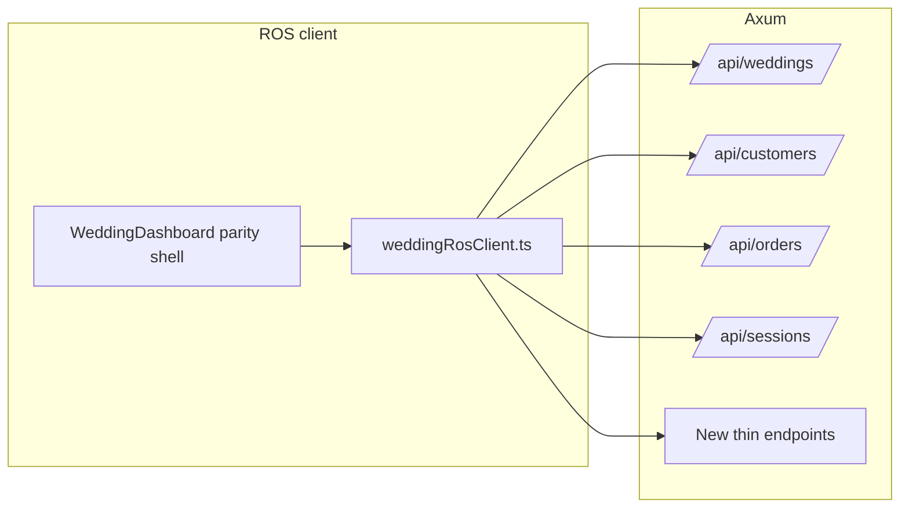

# Wedding manager UX parity inside ROS

## Recommended approach (not a wrap)

**Do not** embed the legacy Vite app in an iframe or run two backends on port 3000. The legacy `[riverside-wedding-manager/src/lib/api.js](riverside-wedding-manager/src/lib/api.js)` assumes API + Socket.IO on `:3000`, which collides with Axum today.

**Do** a **structured UI port**: recreate the same tabs, hierarchy, and Tailwind styling in `[client/](client/)`, wired through a single `**weddingRosClient`** that calls `/api/weddings/`*, `/api/customers/`*, `/api/orders/*`, and (where needed) new small endpoints. Reuse **patterns** from legacy (layout, copy, spacing, components) but implement in **TSX** so one toolchain (ROS Vite + Tailwind v3) stays maintainable.

## Visual parity

- Extend `[client/tailwind.config.js](client/tailwind.config.js)` with the legacy **navy** / **gold** palette and **Inter** (match `[riverside-wedding-manager/tailwind.config.js](riverside-wedding-manager/tailwind.config.js)`).
- Copy assets as needed (e.g. Riverside logo from `[riverside-wedding-manager/src/assets/](riverside-wedding-manager/src/assets/)`) into `client/src/assets/weddings/`.
- Replace legacy `[Icon.jsx](riverside-wedding-manager/src/components/Icon.jsx)` usage with `**lucide-react`** + a tiny name map so JSX stays readable (same icons, not necessarily same component).

## Shell and navigation parity

- Replace the current slim `[WeddingWorkspace.tsx](client/src/components/weddings/WeddingWorkspace.tsx)` with a top-level shell modeled on `[riverside-wedding-manager/src/pages/Dashboard.jsx](riverside-wedding-manager/src/pages/Dashboard.jsx)`: header (logo + “system status”), primary tab strip (**Parties | Actions | Appointments | Order board | Reports**), filters (date range, salesperson, archived, search, pagination).
- **Party drill-in**: when a party is selected, render a `**PartyDetail`**-equivalent full view (ported from `[PartyDetail.jsx](riverside-wedding-manager/src/components/PartyDetail.jsx)` structure), not a minimal ROS detail page—same sections and modals where data exists.
- **Realtime badge**: legacy uses Socket.IO (`parties_updated`). For ROS v1, use **short-interval polling** or **refetch on window focus** plus “last updated” from latest `activity-feed` timestamp (already on `[GET /api/weddings/activity-feed](server/src/api/weddings/)`)—good enough for parity of “feels live” without adding WebSockets immediately.

## API adapter and shape mapping

- Add `[client/src/components/weddings/manager/weddingRosClient.ts](client/src/components/weddings/manager/weddingRosClient.ts)` (or similar) implementing **named functions** that mirror legacy `api.`* signatures where useful, internally calling ROS routes:
  - Parties list/detail: map `[list_parties](server/src/api/weddings/)` + filters to legacy-style pagination object `{ data, pagination }`.
  - Party update: legacy **PUT** → ROS **PATCH** `[update_party](server/src/api/weddings/)`.
  - Member update: legacy **PUT** → ROS **PATCH** `members/:id`; include `actor_name` from `[App.tsx](client/src/App.tsx)` `cashierName` where the legacy UI expected `updatedBy`.
  - Appointments: map legacy `GET/POST/PUT/DELETE /appointments` to existing wedding appointment routes (verify field names; add adapter transforms only).
- **Omit** all `[api.js](riverside-wedding-manager/src/lib/api.js)` paths under **Lightspeed**, **settings/database/**, **settings/logs**, **backup/restore**—no UI entry points (remove or never mount those components).

## Backend gaps (minimal, targeted)

Add only what parity screens need (keep logic in `server/src/logic/` / services per project rules):

| Legacy need                                            | ROS gap                                                    | Proposed fix                                                                                                                                                                                          |
| ------------------------------------------------------ | ---------------------------------------------------------- | ----------------------------------------------------------------------------------------------------------------------------------------------------------------------------------------------------- |
| Salesperson filter + attribution (`selectSalesperson`) | No `GET /salespeople` in `[mod.rs](server/src/api/mod.rs)` | `GET /api/staff` (active staff rows) from `staff` table—read-only                                                                                                                                     |
| Order board (`getDashboardOrders`)                     | No equivalent                                              | New `GET /api/weddings/dashboard/orders` (or under `logic/weddings.rs`): query members needing order / ordered status + joins for display; reuse fields OrderDashboard expects or adapt TS types once |
| Batch “mark ordered” (`batchUpdateMembers`)            | Missing                                                    | `PATCH /api/weddings/members/batch` with `ids` + `{ suit_ordered, ordered_date, actor_name }` in a transaction, each row logging activity                                                             |
| Party import (`importParties` batch)                   | Different                                                  | Phase 2 OR single-party create loop from UI for v1; if CSV parity required, add `POST /api/weddings/parties/import` later                                                                             |
| Reports (`getReportStats`)                             | None                                                       | New `GET /api/weddings/reports/summary`—counts only from Postgres: parties by month, members by status flags, compass stats, recent payments from `wedding_activity_log`—**no** Lightspeed            |

## Feature mapping (per your scope)

- **Keep / port**: Parties list & detail, member modals (measurement, pickup, contacts—merge with existing `[MemberDetailModal](client/src/components/weddings/MemberDetailModal.tsx)` or split into legacy-shaped modals), calendar/scheduler UI, action board, order board (rewired), printable party view if still needed (`PrintPage` → React route or optional `window.open` with print CSS).
- **Drop entirely**: Lightspeed panel/sync, DB backup/clear/vacuum, dangerous settings, legacy-only logs download.
- **Reports**: `ReportsDashboard`-style layout backed **only** by `reports/summary` + existing endpoints; label unsupported legacy metrics as removed.

## POS / customers integration (already in ROS; preserve)

- Pass `**cashierName`** and `**sessionId`** (from `[App.tsx](client/src/App.tsx)`) into the new wedding shell for `actor_name` on writes and future “who opened the till” context.
- Keep **jump to register / open party from Cart** flows (`onOpenWeddingParty`, customer profile weddings) unchanged—only swap the weddings tab content to the new dashboard root.
- Checkout already posts `wedding_member_id` + `actor_name` (`server/src/api/transactions/`); order board should read the same underlying `wedding_members` / `transactions` data model for consistency.

## Execution order (suggested)

1. Tailwind theme + assets; scaffold `WeddingDashboard` shell with tabs (empty panes).
2. Implement `weddingRosClient` + wire **Parties** tab (list + PartyDetail shell using real API).
3. Port **Actions** tab to match legacy `[ActionDashboard.jsx](riverside-wedding-manager/src/components/ActionDashboard.jsx)` but source data from `morning-compass` + `activity-feed` (already in ROS).
4. Add **staff list** + **dashboard orders** + **batch member update** on Axum; port **OrderDashboard** to new types.
5. Port **Appointments** / **Calendar** using existing wedding appointment APIs; adjust adapter only.
6. Build **Reports** tab from `reports/summary` only.
7. Remove or bypass legacy-only components; delete/replace old `WeddingWorkspace` entry in `[App.tsx](client/src/App.tsx)`.

## Risks / notes

- **Volume of JSX**: PartyDetail + modals are large—port in slices (desktop vs mobile member lists) to avoid a single unreviewable PR.
- **Behavioral drift**: Where legacy used PUT + socket invalidation, ROS uses PATCH + explicit refetch—acceptable if UI stays identical.
- **OrderDashboard** depends on rich member fields; confirm `[wedding_members](migrations/)` columns cover `parseJSON` expectations (accessories, etc.) or normalize in the new endpoint.

