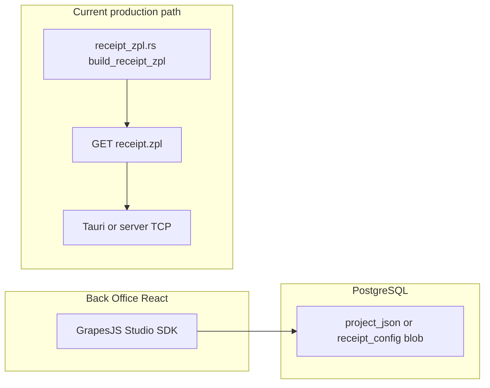

# GrapesJS as a receipt designer in Riverside OS

**Canonical shipped behavior:** [`docs/RECEIPT_BUILDER_AND_DELIVERY.md`](docs/RECEIPT_BUILDER_AND_DELIVERY.md) — merge rules, thermal modes, email/SMS, API routes.

## Answer: web-based vs desktop?

**Use the same place you already use Studio: the embedded React app (Back Office),** reachable in the browser (PWA) and inside the **Tauri** desktop shell. You would **not** put the receipt designer on the public **`/shop`** storefront—that surface is for customers.

- **Editing:** Staff open **Settings → Receipt Builder** as its **own section** (not nested under **General**). GrapesJS runs in the same React shell (PWA or Tauri webview).
- **Printing:** Register still supports **ZPL-first** thermal from [`GET /api/orders/:id/receipt.zpl`](server/src/api/orders.rs) via [`printZplReceipt`](client/src/lib/printerBridge.ts). When **`receipt_thermal_mode`** is **`studio_html`**, merged HTML from Receipt Builder can feed **ESC/POS raster** or related paths — see [`docs/RECEIPT_BUILDER_AND_DELIVERY.md`](docs/RECEIPT_BUILDER_AND_DELIVERY.md) for the full matrix (**ZPL** / **escpos_raster** / **studio_html**).

## What already exists (reuse)

| Piece | Location |
|--------|----------|
| Studio SDK embed pattern | [`StorePageStudioEditor.tsx`](client/src/components/settings/StorePageStudioEditor.tsx) — `StudioEditor`, `storage.type: "self"`, `studio:projectFiles` for HTML export |
| Project type today | `project.type: "web"` — receipt work would switch or parameterize to **`document`** per [Studio document project docs](https://app.grapesjs.com/docs-sdk/project-types/document) |
| Receipt content & ZPL | [`server/src/logic/receipt_zpl.rs`](server/src/logic/receipt_zpl.rs), wired from [`orders.rs`](server/src/api/orders.rs) |
| Receipt settings JSONB | [`ReceiptConfig`](server/src/api/settings.rs) in `store_settings.receipt_config` |
| Optional ESC/POS bridge | [`printEscPosReceipt`](client/src/lib/printerBridge.ts) — secondary path already present |
| Settings navigation pattern | [`SettingsWorkspace.tsx`](client/src/components/settings/SettingsWorkspace.tsx) internal `tabs` + `settingsActiveSection` sync; main app sidebar list in [`Sidebar.tsx`](client/src/components/layout/Sidebar.tsx) `SIDEBAR_SUB_SECTIONS.settings` |

## Settings UI placement (required)

Treat **Receipt Builder** like **Online store** or **Printing Hub**: a **first-class Settings subsection**, not a card inside **General**.

**Client changes when implementing:**

1. **Main sidebar** — Add an entry to `SIDEBAR_SUB_SECTIONS.settings` in [`Sidebar.tsx`](client/src/components/layout/Sidebar.tsx) (e.g. id `receipt-builder`, label `Receipt Builder`). Order it near **Printing Hub** / receipt-related workflows if desired (e.g. after **Printing Hub** in the outer nav is not possible today because printing is only on the inner rail—see below).

2. **System Control rail** — Add a matching tab to the `tabs` array in [`SettingsWorkspace.tsx`](client/src/components/settings/SettingsWorkspace.tsx) (same id string), with an icon (e.g. `FileText` or `ScrollText` from `lucide-react`).

3. **Deep link sync** — Extend the `useEffect` that maps `settingsActiveSection` → `activeTab` to handle `receipt-builder` (same pattern as `online-store`, `printing`, etc.), and ensure `onSettingsSectionNavigate` is called when that tab is selected so the **main** sidebar highlight stays in sync.

4. **Content panel** — Render a dedicated panel for the GrapesJS document editor (new component such as `ReceiptBuilderPanel.tsx`, lazy-loaded like [`OnlineStoreSettingsPanel`](client/src/components/settings/OnlineStoreSettingsPanel.tsx) if bundle size matters).

5. **RBAC** — Gate the new subsection with the same permission(s) as editing receipt/store branding today (likely `settings.admin` unless you introduce a narrower key). If gated, add a `subSectionVisible` rule in [`BackofficeAuthContext.tsx`](client/src/context/BackofficeAuthContext.tsx) for `settings:receipt-builder` mirroring [`settings:help-center`](client/src/context/BackofficeAuthContext.tsx).

**Note:** Today [`SIDEBAR_SUB_SECTIONS.settings`](client/src/components/layout/Sidebar.tsx) does not list **Printing Hub** or **Integrations** even though [`SettingsWorkspace`](client/src/components/settings/SettingsWorkspace.tsx) has those tabs—when adding **Receipt Builder**, align the **main** sidebar list with the inner rail so deep links from the left app sidebar work (consider backfilling `printing` / `integrations` in the sidebar map as a small related fix, or accept that receipt-builder is only reachable from System Control until sidebar parity is done).

## Implementation workflow (mapped to ROS)

1. **Initialize the editor** — Add a second Studio surface (or generalize [`StorePageStudioEditor.tsx`](client/src/components/settings/StorePageStudioEditor.tsx) with props: `projectType: "document"`, optional plugin list for print-oriented presets). Confirm **`presetPrintable` / canvasFullSize`** against the SDK version you pin (`@grapesjs/studio-sdk` in [`client/package.json`](client/package.json)) and license terms for production domains ([`VITE_GRAPESJS_STUDIO_LICENSE_KEY`](docs/ONLINE_STORE.md)).

2. **Custom components / blocks** — Register receipt-specific blocks (logo, line items, totals, barcode/QR) via GrapesJS extension APIs; keep blocks **data-driven** (placeholders or Data Source plugin) so the same template works for any order.

3. **Templates** — Ship 1–2 default **document** projects (JSON) checked into the repo or seeded server-side; staff pick a template in Settings.

4. **Save/load JSON** — Mirror the online store pattern: persist `editor.getProjectData()` (or your `onSave` payload) into **`store_settings.receipt_config`** (extend [`ReceiptConfig`](server/src/api/settings.rs)) **or** a small dedicated column/table if you want version history. Expose **GET/PATCH** next to existing receipt config routes.

5. **Preview with live data** — At print time (or in a “Preview receipt” modal), merge **order payload** (same shape as [`ReceiptOrderForZpl`](server/src/logic/receipt_zpl.rs) or a shared DTO) into the template client-side or via a new **POST `/api/orders/:id/receipt-preview-html`** that returns rendered HTML for a hidden iframe.

## Printing: the critical fork

GrapesJS produces **HTML/CSS**. Your production printer path is **ZPL text** today, not arbitrary HTML.

| Approach | Pros | Cons |
|----------|------|------|
| **A. Keep ZPL authoritative** | No hardware change; fastest print; matches existing Zebra-centric stack | Designer is mostly **branding/layout metadata**; full WYSIWYG does not map 1:1 to ZPL without a translator |
| **B. HTML → raster → ZPL** (`^GF` / bitmap) | True WYSIWYG | Complex (render, dither, width/DPİ); heavier payload; new failure modes |
| **C. HTML → ESC/POS** (or line layout DSL → ESC/POS) | Fits many cheap thermal drivers; [`printEscPosReceipt`](client/src/lib/printerBridge.ts) exists | Need consistent server or client renderer; may not match current Zebra ZPL deployments |
| **D. Hybrid** | Staff edit **document** for marketing blocks; **line items** still rendered by Rust for alignment | Two sources of truth to coordinate |

**Recommendation:** Treat **Phase 1** as **template storage + preview + export HTML** (operational value, low risk). Treat **Phase 2** as an explicit choice between **B/C** vs **narrowing the designer** so Rust still emits ZPL (**A/D**). Avoid assuming `grapesjs-plugin-export` alone solves thermal—you still need **ROS-specific** conversion or rasterization.

## Suggested next steps (when you implement)

- Add **Receipt Builder** Settings subsection (sidebar + System Control + panel shell) per **Settings UI placement** above, before wiring Studio into it.
- Generalize Studio wrapper: `projectType`, plugins, and storage callback (reuse patterns from [`StorePageStudioEditor.tsx`](client/src/components/settings/StorePageStudioEditor.tsx)).
- Extend settings API + `ReceiptConfig` for `receipt_studio_project_json` (name TBD).
- Add preview API or client-only preview with **sample** and **real order** payloads.
- Only after preview works: wire **Print** to the chosen byte format (ZPL raster, ESC/POS, or continued pure ZPL with a constrained template model).

## Shipped behavior (this repo)

Operational detail (APIs, thermal modes, Podium email/MMS, when `receipt_studio_layout_available`): **`docs/RECEIPT_BUILDER_AND_DELIVERY.md`**.
