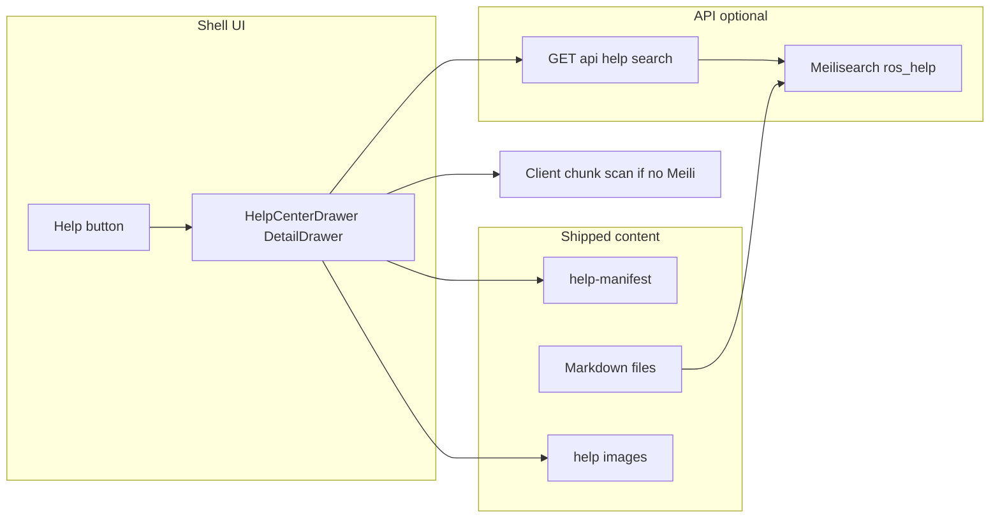

# Plan: In-app Help Center

**Overview:** Add a Help slideout (`DetailDrawer`) opened from a `?` control next to notifications in both Back Office and POS shells, backed by shipped Markdown manuals under `client/src/assets/docs/`. **Search** should use the same **Meilisearch** stack already used for catalog/customer/order search ([docs/SEARCH_AND_PAGINATION.md](docs/SEARCH_AND_PAGINATION.md), [server/src/logic/meilisearch_client.rs](server/src/logic/meilisearch_client.rs), `RIVERSIDE_MEILISEARCH_URL`) via a dedicated help index and a thin **`GET /api/help/search`** (or similar) endpoint, with a **client-side fallback** when Meilisearch is not configured. Include a repo doc (`docs/MANUAL_CREATION.md`) for the repeatable manual-creation workflow.

## Implementation todos

| ID | Task |
|----|------|
| deps-md | Add `react-markdown` (+ `remark-gfm` if needed); optional `@tailwindcss/typography` vs scoped CSS prose (no client search library when Meili is primary) |
| meilisearch-help | New Meilisearch index (e.g. `ros_help`), document shape + upsert/reindex from chunked markdown (shared path under `client/src/assets/docs/` or generated JSON at build); wire into existing reindex path ([server/src/api/settings.rs](server/src/api/settings.rs) `POST .../meilisearch/reindex` and/or [scripts/ros-meilisearch-reindex-local.sh](scripts/ros-meilisearch-reindex-local.sh)) |
| help-search-api | `GET /api/help/search?q=` (staff-authenticated): query Meilisearch, return `manual_id`, section anchor/slug, snippet fields; map errors to empty results + log ([server/src/logic/meilisearch_search.rs](server/src/logic/meilisearch_search.rs) pattern) |
| help-content-layer | Create help-manifest, raw MD imports, heading/TOC parser, image path rewrite for Vite assets or `public/` URLs; **fallback** in-drawer substring/chunk scan when Meili unavailable |
| help-drawer-ui | Implement `HelpCenterDrawer` (`DetailDrawer`, search, TOC, article, result navigation with heading ids) |
| shell-wiring | App-level `helpOpen` state; Help button in `Header.tsx` and `PosShell.tsx`; single drawer instance |
| manual-creation-doc | Author `docs/MANUAL_CREATION.md` (procedure, paths, Playwright, aidocs, prompt template); register pos-manual in manifest |
| verify-build | Run client build, quick manual QA of Help in BO and POS |
| help-e2e-smoke (optional) | Playwright: open Help from BO + POS, assert drawer + at least one search path (API or fallback) |

---

## Goals

- **UI:** Upper-right **Help** control (`CircleHelp` from `lucide-react`, `aria-label="Help"`) beside the notification bell in:
  - [client/src/components/layout/Header.tsx](client/src/components/layout/Header.tsx) (Back Office)
  - [client/src/components/layout/PosShell.tsx](client/src/components/layout/PosShell.tsx) (POS top bar; mirror placement with `NotificationCenterBell`)
- **Behavior:** Opens a **slideout only** using existing [client/src/components/layout/DetailDrawer.tsx](client/src/components/layout/DetailDrawer.tsx) (same pattern as [client/src/components/notifications/NotificationCenterDrawer.tsx](client/src/components/notifications/NotificationCenterDrawer.tsx)), not a new workspace tab.
- **Content:** Markdown manuals produced by your procedure (already started with [client/src/assets/docs/pos-manual.md](client/src/assets/docs/pos-manual.md) + images under `client/src/assets/images/help/pos/`).
- **Search:** **Meilisearch** (when `RIVERSIDE_MEILISEARCH_URL` is set) over a dedicated help index; staff-friendly ranked results and jump-to-section. **Fallback:** same chunk text scanned in the browser when Meili is off (parity with other features that degrade to SQL when Meili is absent).
- **Playbook:** Add [docs/MANUAL_CREATION.md](docs/MANUAL_CREATION.md) so you can later say: *“Review `docs/MANUAL_CREATION.md` and create a manual for X.”*

## Architecture (high level)

## Content contract

1. **Manifest** (single source of truth for the **client** UI): e.g. [client/src/lib/help/help-manifest.ts](client/src/lib/help/help-manifest.ts) (typed array) *or* `client/src/assets/help/help-manifest.json` imported as raw JSON. Each entry includes:
   - `id`, `title`, `summary?`
   - `markdown`: Vite static import `?raw` from [client/src/assets/docs/](client/src/assets/docs/)
   - optional `tags` for future filtering
   - **Indexing:** Server-side Meilisearch upsert must use the **same** `manual_id` + section slugs as the client manifest/TOC so search hits align with scroll targets (avoid drift: one chunking function in Rust, or generate chunks at build time and ship a small JSON the server reads on reindex).
2. **Images:** Keep paths stable. Existing manual uses `../images/help/pos/...`. At render time, rewrite markdown image URLs (e.g. a small `rewriteHelpImageSrc(path, importMetaGlobMap)` helper) so Vite resolves files under `client/src/assets/images/help/**` to hashed asset URLs, **or** move public-facing copies to `client/public/help/...` and reference `/help/pos/...` in Markdown (simpler mental model for authors; pick one approach and document it in `MANUAL_CREATION.md`).

## Help drawer UX

- **Width:** Use `DetailDrawer` `panelMaxClassName` toward `max-w-3xl` or full-width on small screens (consistent with [docs/CLIENT_UI_CONVENTIONS.md](docs/CLIENT_UI_CONVENTIONS.md) / existing drawers).
- **Layout** (user-friendly):
  - Sticky top: title **Help**, search field (`ui-input`), optional manual picker (select or list) when more than one manual exists.
  - Split body: **narrow TOC** (parsed `##` / `###` from active manual) + **scrollable article** with clear typography (headings, lists, code blocks minimal for staff docs).
  - Search mode: replace TOC/article with **ranked snippets** (manual title, section heading, excerpt); choosing a result sets active manual + scrolls to `id` on headings (inject `id` from slugified heading text in the markdown pipeline).
- **A11y:** Rely on `DetailDrawer` + `useDialogAccessibility`; ensure focus moves into drawer on open and restores on close (same expectations as other drawers).

## Markdown rendering

- Add **`react-markdown`** (+ **`remark-gfm`** for tables if needed). No server round-trip; manuals stay static in the bundle.
- Style via Tailwind utility classes on wrapper (`text-sm`, spacing, `prose`-like rules in a scoped class in [client/src/index.css](client/src/index.css) unless you prefer adding `@tailwindcss/typography` as a dev dependency.

## Full-text search (Meilisearch + fallback)

**Primary (aligned with existing ops):**

- Add a Meilisearch index UID (e.g. **`ros_help`**) next to `ros_variants`, `ros_customers`, etc. Document fields should support typo-tolerant search and stable deep links, for example:
  - `id`: stable key per chunk (e.g. `pos#ring-a-sale`)
  - `manual_id`, `manual_title`, `section_slug`, `section_heading`, `body` (searchable), optional `rank`
- **Populate** on `POST /api/settings/meilisearch/reindex` (extend [server/src/logic/meilisearch_sync.rs](server/src/logic/meilisearch_sync.rs)) and/or the local reindex script, reading the same markdown files the client bundles (path relative to repo root).
- **Query:** `GET /api/help/search?q=...` uses the existing Meilisearch client wrapper; on error or missing config, return **empty hits** and log (same resilience pattern as customer/inventory search in [docs/SEARCH_AND_PAGINATION.md](docs/SEARCH_AND_PAGINATION.md)).

**Fallback when Meilisearch is unset:**

- In the drawer, run a **lightweight scan** over in-memory chunks derived from the same manifest + parsed headings (substring / simple scoring). No extra npm dependency required for v1.

**Client:** Debounced search input; call API when Meili is expected (e.g. env flag `VITE_HELP_SEARCH_API=1` or infer from successful probe); else use fallback only. Show top N results with short excerpts.

## State wiring

- Lift minimal state in [client/src/App.tsx](client/src/App.tsx): `helpDrawerOpen`, `setHelpDrawerOpen`, pass `onOpenHelp` into `Header` and into `PosShell` (new optional prop), render **one** `HelpCenterDrawer` at app shell level so Back Office and POS share the same instance and content.

## Documentation: `docs/MANUAL_CREATION.md`

Include, in staff-/operator-oriented language:

- **Purpose:** ROS in-app Help vs other docs (e.g. `docs/staff/*` corpus if still maintained elsewhere).
- **Outputs:** Markdown path convention (`client/src/assets/docs/<area>-manual.md`), screenshots (`client/src/assets/images/help/<area>/`), naming screenshots to match embeds.
- **Automation:** **[aidocs-cli](https://github.com/BinarCode/aidocs-cli)** for screenshot capture and doc generation; `.claude/workflows/docs/*` + `docs/aidocs-config.yml` when using Claude Code. Merge output into `client/src/assets/docs/` and `client/src/assets/images/help/<id>/`.
- **Aidocs MCP (`aidocs mcp`):** Optional for AI-side doc search; not required for in-app Help.
- **Integration checklist:** Add/update **`client/src/assets/docs/*-manual.md`**, **`npm run generate:help`** when front matter or new files change, **reindex Meilisearch**, `npm run build` / visual check; images via **aidocs-cli** into `client/src/assets/images/help/<id>/`.
- **Prompt template:** One copy-paste block: *“Read `docs/MANUAL_CREATION.md` and add a manual for `<workspace>`…”*

Optional: one line in [README.md](README.md) under the documentation catalog pointing to `docs/MANUAL_CREATION.md` (only if you want discoverability from the root index).

Optional: after ship, one line in [AGENTS.md](AGENTS.md) / [README.md](README.md) pointing maintainers to [PLAN_HELP_CENTER.md](PLAN_HELP_CENTER.md) + `docs/MANUAL_CREATION.md`.

## Additional considerations (recommended)

- **Auth / exposure:** `GET /api/help/search` must be **staff-authenticated** only (same family as other Back Office reads). Do not expose help search on **public** `/api/store/*` routes. Meilisearch stays server-side; the API is the only client entry point.
- **Rate limiting:** If the app already rate-limits noisy read endpoints, treat help search the same to avoid accidental loops from debounced typing (or rely on debounce + low `limit` on the client).
- **PWA / offline:** Manual markdown and images are **bundled** with the client, so the drawer can still open offline. Expect **fallback chunk search only** when the API/Meili is unreachable; no extra requirement beyond clear UX (e.g. silent fallback).
- **Deep links (v1 or v1.1):** Optional query or hash (e.g. `?help=pos` or `#help/pos/section-slug`) so support can paste “open this section.” Coordinate with slug rules used for TOC/`id` attributes and Meilisearch `section_slug`.
- **Keyboard:** Optional global shortcut (e.g. `?` or `Shift+/`) to open Help **only if** it does not conflict with focused inputs; document in `MANUAL_CREATION.md` if implemented.
- **Content hygiene:** In `MANUAL_CREATION.md`, state that manuals must **not** include secrets, live API keys, customer PII, or one-off internal URLs in screenshots. Use neutral or redacted examples.
- **Screenshot / copy drift:** Optional “Last reviewed” or app version note at the top of each manual so staff know when content might be stale relative to the UI.
- **Index settings:** When creating `ros_help`, set Meilisearch **searchable** vs **filterable** attributes explicitly (e.g. filter by `manual_id` if you later add many manuals); keep `id` stable across reindexes.

## Out of scope (v1)

- Permissions-gated manuals (beyond “signed-in staff”), analytics, or **cashier-facing WYSIWYG** editors inside the Help drawer (v1 is **read** manuals + search).
- Replacing `docs/staff/*` or CORPUS workflows unless you explicitly want merge later.

**Not “future”:** **ROSIE** maintainer automation (AIDOCS + Playwright **nightly** jobs for **Help Center only**: **`client/src/assets/docs/*-manual.md`**, **`client/src/assets/images/help/**`**, **`generate:help`**, **`ros_help`**) is **current program scope** — see **`docs/PLAN_LOCAL_LLM_HELP.md`**. She **does not** autonomously edit **`docs/staff/*`**, product code, or the constitution/catalog Markdown files.

## ROSIE (RiversideOS Intelligence Engine) — concurrent with Help Center

**ROSIE** is documented in [`docs/PLAN_LOCAL_LLM_HELP.md`](docs/PLAN_LOCAL_LLM_HELP.md). She extends this drawer with **Ask ROSIE** (streaming + citations to manual anchors) alongside **Browse** and **Search**—without replacing **`GET /api/help/search`** or authored Markdown. Product naming: **ROSIE** = **RiversideOS Intelligence Engine**. Mission: **learn ROS** from the ground up, **help staff** use the product, **help admins** run it, **explain sales / inventory / financial** metrics via **read-only** tools and docs, and (for authorized roles) **triage Bug Center** issues with **human-reviewed** code suggestions — not by changing store data or merging code autonomously; see [ROSIE mission](docs/PLAN_LOCAL_LLM_HELP.md#rosie-mission-learn-riverside-os-end-to-end-elevate-staff-and-admin), [Bug Center and proposed code fixes](docs/PLAN_LOCAL_LLM_HELP.md#bug-center-and-proposed-code-fixes-engineering-assist), and [Absolute rule: learn only, never mutate business data](docs/PLAN_LOCAL_LLM_HELP.md#absolute-rule-learn-only-never-mutate-business-data).

**PWA / Tauri:** One **Ask ROSIE** client surface; **PWA** uses a staff-gated Axum proxy (**`POST /api/help/rosie/v1/chat/completions`**), **Tauri** may prefer **loopback** to the embedded `llama-server` with the same proxy as fallback — [Ship decision: parity and desktop sidecar](docs/PLAN_LOCAL_LLM_HELP.md#ship-decision-parity-and-desktop-sidecar); planned env vars are listed in **`DEVELOPER.md`** (Environment variables).

**Authoring & learning — now:** ROSIE runs **unattended nightly** (and on demand) to **watch for UI drift vs Help manuals**, drive **AIDOCS** and **Playwright** against **synthetic** fixtures, **regenerate** **Help Center** artifacts only, **reindex** `ros_help`, and **refresh** **help-scoped** retrieval/eval in **governed** ways — see [Authoring new Help manuals: AIDOCS, Playwright, and governed learning](docs/PLAN_LOCAL_LLM_HELP.md#authoring-new-help-manuals-aidocs-playwright-and-governed-learning). **Merge policy** may be **PR** or **auto-merge** when the diff is **only** under the Help manual tree and CI is green; production **PII** must never enter those pipelines.

## Implementation order

1. Define help chunk schema + `ros_help` index settings; implement server-side indexing from `client/src/assets/docs/*.md` and hook into existing Meilisearch reindex; add `GET /api/help/search`.
2. Add MD rendering stack; implement `help-manifest`, TOC/heading parser, image URL rewrite, and client fallback search.
3. Build `HelpCenterDrawer` + styles (API search + fallback).
4. Wire `App.tsx` state and props to `Header` + `PosShell`; add `?` button.
5. Register existing POS manual in manifest, reindex Meilisearch, verify images + search in both modes (Meili on/off).
6. Write `docs/MANUAL_CREATION.md` (include Meili reindex step) and (optionally) README link.
