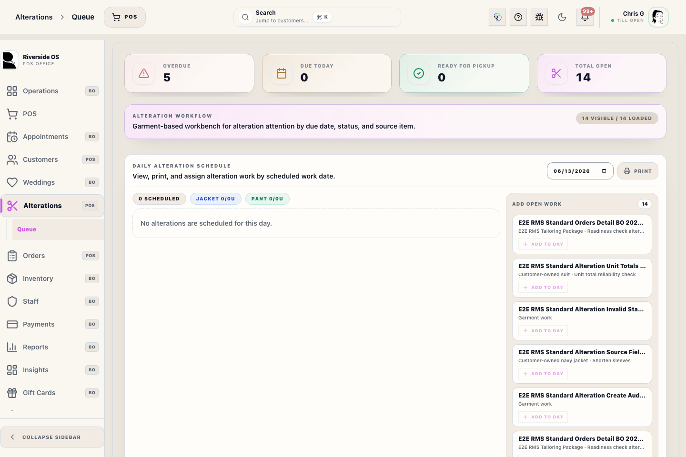

# Alterations Workspace

The Alterations workspace is a garment-based tailoring workbench. It tracks customers, garments, due dates, and work status for every job started at the Register.

## What this is

Use the **Alterations** workspace to manage the lifecycle of a garment after intake. It provides a high-density view of:
- **Overdue** jobs that missed their target date.
- **Due Today** work that needs priority attention.
- **Ready for Pickup** garments waiting for the customer.
- **Total Open** workload for the tailoring team.

## When to use it

Use this workspace when you need to:
1. Review the daily workload for the tailoring department.
2. Move a job from **Intake** to **In Work** when sewing begins.
3. Mark a job as **Ready** after final inspection.
4. Close a job as **Picked Up** when the customer retrieves their garment.

## Before you start

- **Permissions**: You need **alterations.manage** to change statuses or edit notes.
- **Intake Source**: Jobs must be started from the **Register** (Alteration Intake modal) before they appear in this queue.

## Steps

1. Open **Alterations** from the sidebar.
2. Review the **Summary Cards** at the top to gauge the day's priorities.
3. Use the **Search** bar or **Filters** (Vendor, Status, Source) to find a specific garment or customer.
4. Tap a garment card to see the full work description and charge notes.
5. **Change Status**: Drag-and-drop or use the status buttons to move the work through the pipeline (Intake → In Work → Ready → Picked Up).

## What to watch for

- **Notifications**: Marking a job **Ready** may trigger an automated SMS/Email to the customer (depending on store settings).
- **Charge Notes**: This queue displays the "Alteration Charge Note" from the intake, but it does not collect payment. All financial transactions must happen at the Register.
- **Due Dates**: Red dates indicate the job is overdue. Contact the customer if a delay is expected.

## What happens next

- Once marked **Picked Up**, the job moves to the history archive and is no longer shown in the active "Total Open" count.
- Related order balances are updated to reflect that fulfillment is complete.

## Related workflows

- [POS Alteration Intake](manual:pos-alteration-intake-modal)
- [Customers Workspace](manual:customers-workspace)
