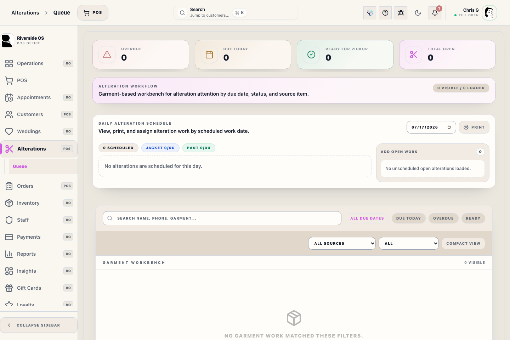
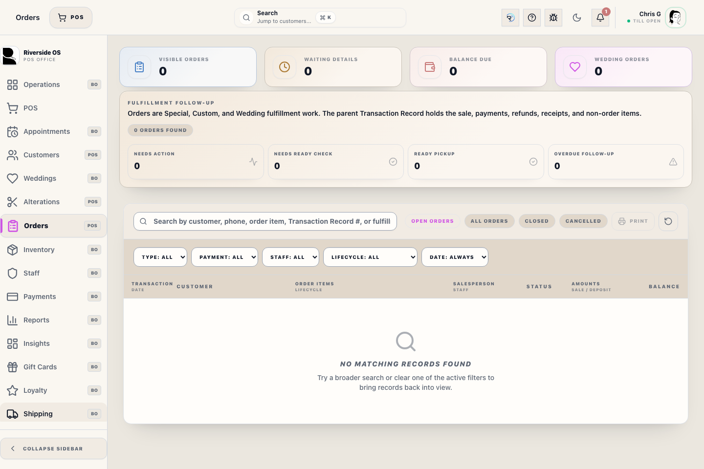
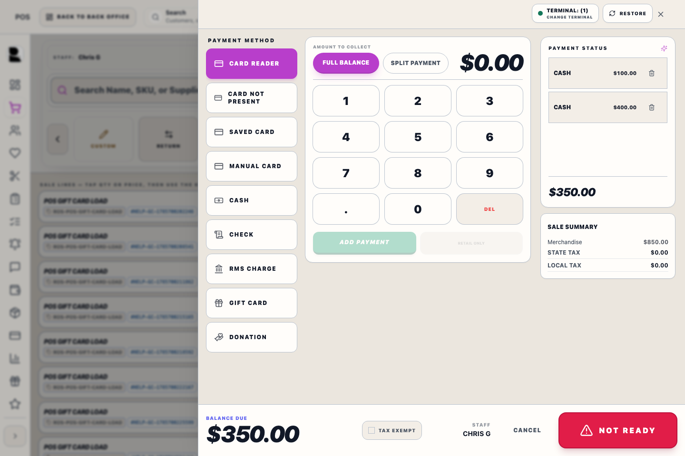

# Alterations Workspace

## Screenshots

The Alterations workspace is a garment-based tailoring workbench. It tracks customers, garments, due dates, and work status for every job started at the Register.

## What this is

Use the **Alterations** workspace to manage the lifecycle of a garment after intake. It provides a high-density view of:
- **Overdue** jobs that missed their target date.
- **Due Today** work that needs priority attention.
- **Ready for Pickup** garments waiting for the customer.
- **Total Open** workload for the tailoring team.

## When to use it

Use this workspace when you need to:
1. Review the daily workload for the tailoring department.
2. Move a job from **Intake** to **In Work** when sewing begins.
3. Mark a job as **Ready** after final inspection.
4. Close a job as **Picked Up** when the customer retrieves their garment.

## Before you start

- **Permissions**: You need **alterations.manage** to change statuses or edit notes.
- **Intake Source**: Jobs must be started from the **Register** (Alteration Intake modal) before they appear in this queue.

## Steps

1. Open **Alterations** from the sidebar.
2. Review the **Summary Cards** at the top to gauge the day's priorities.
3. Use the **Search** bar or **Filters** (Vendor, Status, Source) to find a specific garment or customer.
4. From **Search Across Riverside**, select an alteration result to open its **Plan / Reassign** workspace directly, even when it is not in the currently loaded queue page.
5. Tap a garment card to see the full work description and charge notes.
6. **Use the next action**: Each garment card presents one primary step, such as **Start tailoring**, **Mark tailoring complete**, or **Mark ready & queue notice**. Open **More** only for planning, reassigning, printing, or correcting status.
7. For a standalone alteration pickup, use **Pick Up & Print** on a **Ready** alteration card.
8. For an alteration linked to an order, mark the alteration **Ready**, then complete the customer order pickup from the Register. The Register includes ready linked alteration pickups with the order.

For a new job at the Register, choose **Alteration** for full intake. Search **ALTERATIONS** for two distinct, full-height actions: **Quick Add** starts a tracked garment record and needs a customer; **Fee Only** adds a non-taxable alteration charge without a garment record, due date, or tailor-queue work.

Alteration intake keeps item selection and work details together in one wide workspace. For full intake, choose a service to prefill the work request and planned tailor capacity. Use **Add tag / notes** only when those optional details are needed; the Save action stays pinned and available after a fee is entered.

The page behind the modal does not scroll while intake is open.

Alteration labor added through the alteration intake workflow is non-taxable. Changing its charge or applying a discount in the Register must not add state or local tax.

## What to watch for

- **Notifications**: **Mark ready & queue notice** explicitly queues the configured customer notification. Do not use Ready merely to clear the board.
- **Charge Notes**: This queue displays the "Alteration Charge Note" from the intake, but it does not collect payment. All financial transactions must happen at the Register.
- **Order-linked pickup**: Only alterations marked **Ready** are included when an order is loaded for Register pickup. In Work or Verify Completed alterations remain in the tailoring queue.
- **Due Dates**: Red dates indicate the job is overdue. Contact the customer if a delay is expected.
- Large queues load in bounded groups. Select **Load more alteration records** until Riverside reports that all matching records are loaded before treating the visible counts as the full filtered queue.

## What happens next

- Once marked **Picked Up**, the job moves to the history archive and is no longer shown in the active "Total Open" count.
- Related order balances are updated to reflect that fulfillment is complete.

## Related workflows

- [Register (POS)](manual:pos)
- [Customers Workspace](manual:customers-workspace)
