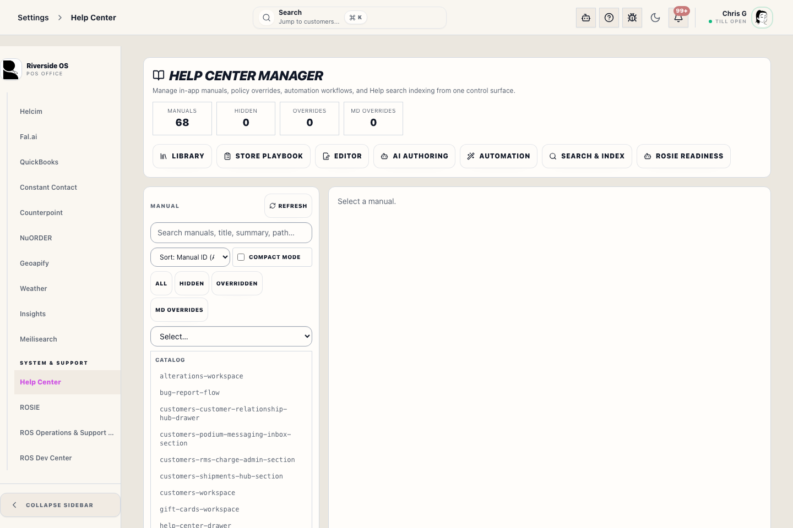
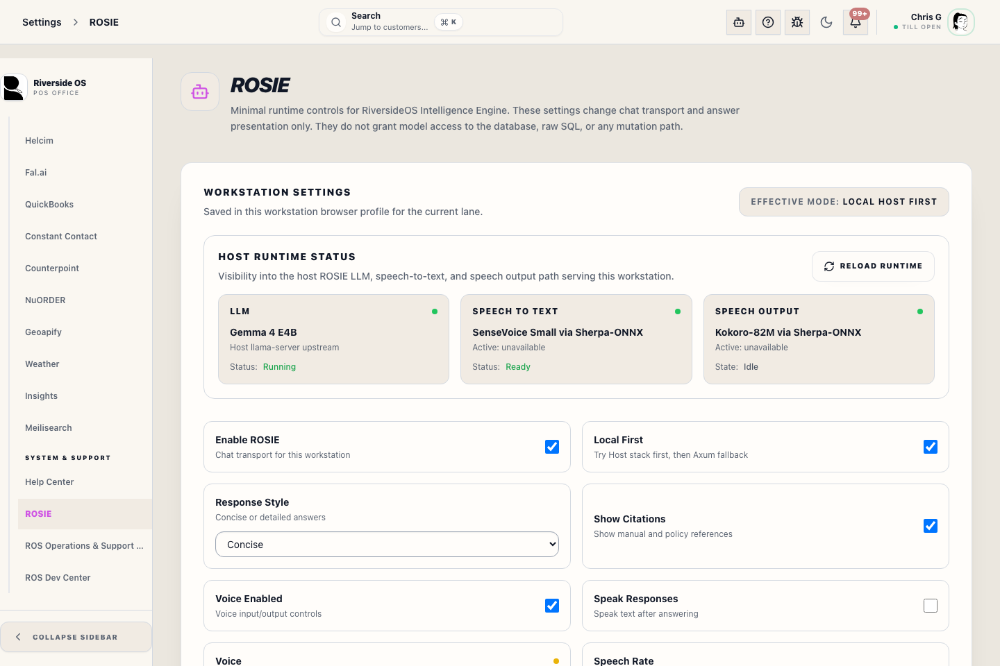

# Bug Report Flow

## Screenshots

## What this is

Use the bug report flow when something in Riverside OS blocks work, looks wrong, or needs a developer to review the workstation state.

The report is built for support. It keeps useful context such as the current route, browser details, screen size, recent non-sensitive console messages, correlation ID, and an optional screenshot. It redacts obvious sensitive values before the report is submitted or downloaded.

## How to use it

1. Open **Report a Bug** from Help or Support.
2. Describe what staff were trying to do and what happened instead.
3. Attach a screenshot only when the visible screen helps support.
4. Submit or download the redacted report.

## When to use it

Use **Report a Bug** when staff can still operate but need to capture evidence before the issue disappears.

Use it for:

- a button, drawer, checkout step, or report that does not behave as expected
- a degraded dashboard or failed load state that needs follow-up
- a receipt, printer, terminal, customer, order, or inventory screen that is hard to explain later
- a repeatable problem that support should investigate with the exact screen context

## Before you send

- Include what you were trying to do.
- Include the customer, transaction, product, or workstation context only when it is needed to investigate.
- Do not type Access PINs, passwords, card numbers, or private notes into the description.
- Add a screenshot when the visible screen helps explain the issue.

## Send a report

1. Open **Help** or **Support** and choose **Report a Bug**.
2. Describe the issue in plain language.
3. Confirm the screen and workflow shown in the report are the right ones.
4. Attach a screenshot if the visual state matters.
5. Submit the report.

## Download a report

Use the download option when support asks for a local copy or when the workstation cannot submit the report. The downloaded report uses the same redaction path as submitted reports.

## Privacy notes

Riverside OS removes obvious Authorization headers, bearer tokens, JWT-looking strings, cookies, session values, PIN-like fields, passwords, secrets, token fields, and API key fields from diagnostic payloads.

If a sensitive value was typed into a normal description field, remove it before submitting.

## What happens next

Support reviews the report with the captured route, workstation context, recent safe console lines, screenshot when included, and correlation ID. Staff should keep working normally unless the screen itself says the workflow is blocked.
