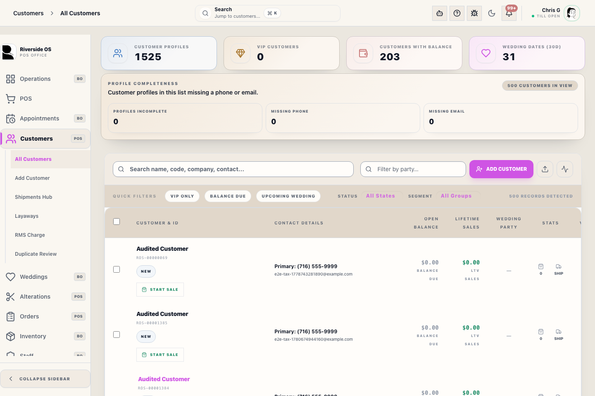
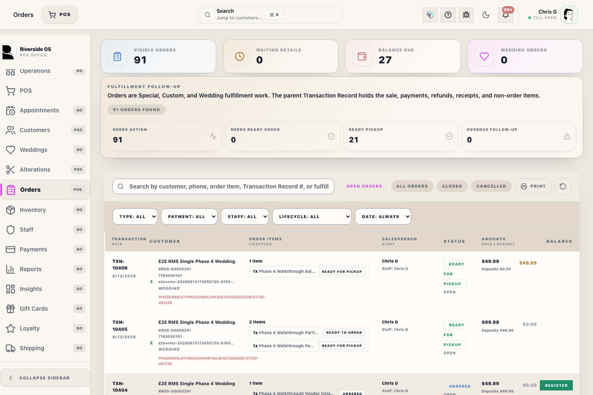
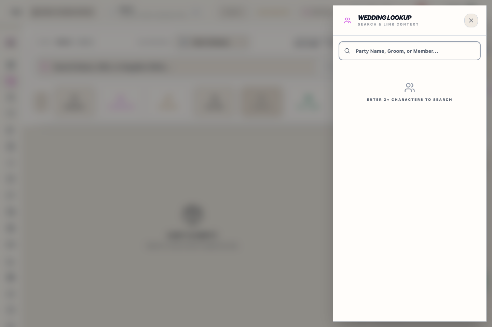

# Customer Relationship Hub

## Screenshots

## What this is

Customer Relationship Hub is the drawer for one customer. It brings profile facts, customer snapshot, transactions, alterations, loyalty, messages, measurements, and timeline context into one place.

Deterministic customer facts stay primary. Optional ROSIE customer snapshot insight appears after the visible profile and snapshot facts.

## How to use it

1. Confirm the customer name and contact details.
2. Review Customer Snapshot and profile facts.
3. Open the needed tab for orders, alterations, loyalty, messages, measurements, or timeline.
4. Treat degraded section messages as missing data until that section reloads.

## ✨ Things to know

Things to know summarizes current customer context, recent activity, important relationship details, and next steps. Use it to orient yourself before opening deeper tabs.

The optional ROSIE customer snapshot explains only the visible facts from the profile. It does not create tasks, send messages, change RMS status, or replace staff review.

## ✨ Message drafts

In Messages, use the draft chips for a quick check-in, pickup update, or wedding update. Drafts fill the SMS or email compose box only. Staff must review, edit if needed, and tap Send.

Draft chips do not bypass opt-in warnings, missing phone/email warnings, Podium delivery rules, or Manager Access requirements.

## Tabs and sub-sections

Each sub-section distinguishes:

- **Loading:** the customer data is still being fetched.
- **Failed sub-load:** that section could not load and shows a quiet degraded message.
- **Successful empty:** the section loaded and has no matching records.

This applies to Transaction Records, fulfillment-order work, alterations, loyalty activity, messages, measurements, and timeline.

## Linked profiles

Use **Link a Partner** to search for an existing Riverside customer first. If the partner does not already have a customer profile, use **Add new customer instead** to create and link the new record.

When two profiles are linked, use **Person view** to switch between each person. Profile details, measurements, Podium SMS, mailbox email, and contact preferences stay tied to the selected person. Transaction Records, purchase history, and loyalty are shared while the profiles remain linked.

Saving Profile details updates only the fields changed in the open profile form. Separate customer actions such as VIP status, measurements, timeline notes, messages, shipments, store credit, and linked-profile changes remain on their own save paths.

When linked profiles are split, the parent profile retains joined purchase history. The separated profile keeps its own contact details, measurements, messages, and a timeline note that points staff to the parent profile for pre-split purchase history.

## RMS Charge status

Use the **RMS Charge** card on the Profile tab to confirm whether the customer has an RMS Charge account on file, review account balance details from the latest weekly account import, compare imported payment/charge totals with Riverside RMS activity, and see whether RMS Charge and RMS Payment records have been reported.

Use the all-customer **RMS Charge** workspace from Customers when staff need account-list uploads, reconciliation, records, or detailed RMS Charge review.

## Working with degraded sections

If one section is degraded, use the sections that are still loaded. Do not assume there are no orders, messages, measurements, or loyalty events when the section says it could not load.

Retry or reopen the drawer if the missing section matters before helping the customer.

## ROSIE customer insight

ROSIE insight is optional and secondary. It should explain visible customer facts and should not replace staff review of the profile, tabs, and customer history.

If ROSIE is unavailable, the hub remains usable.

## What to watch for

- Confirm the customer name and contact details before taking action.
- Keep private notes and sensitive customer information out of screenshots or bug reports unless support specifically needs them.
- Use the visible transaction and alteration records as the source of truth.

## Related workflows

- [Customers Workspace](manual:customers-workspace)
- [Orders Workspace](manual:orders-workspace)
