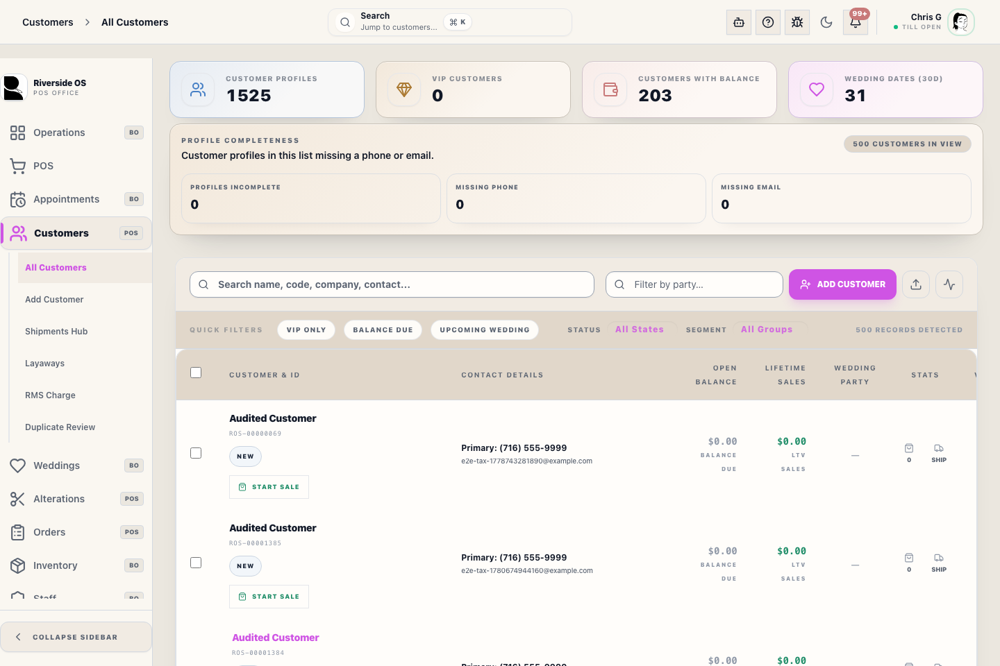
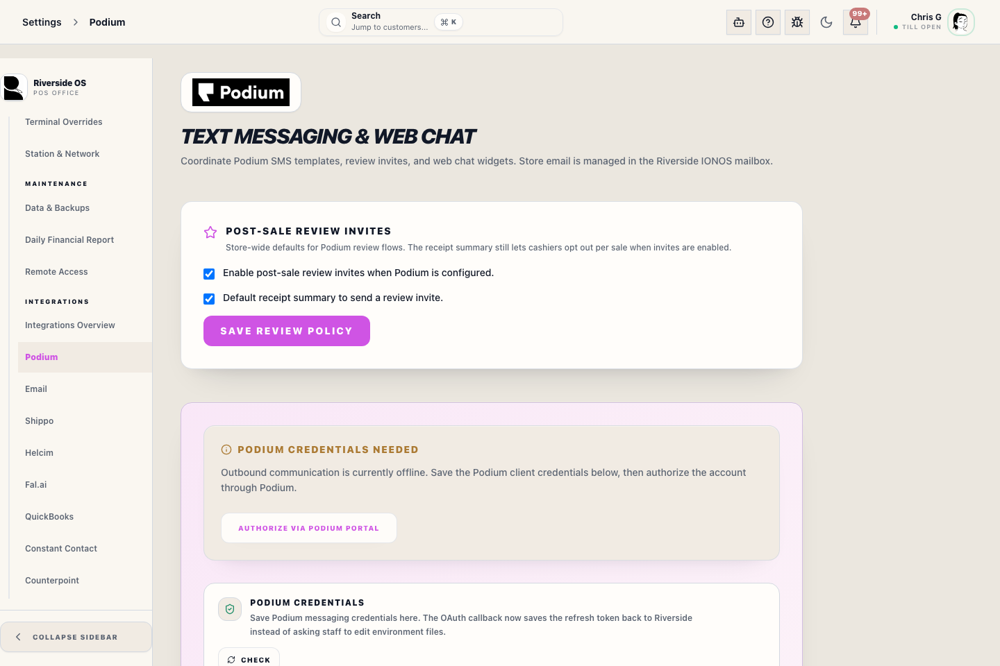
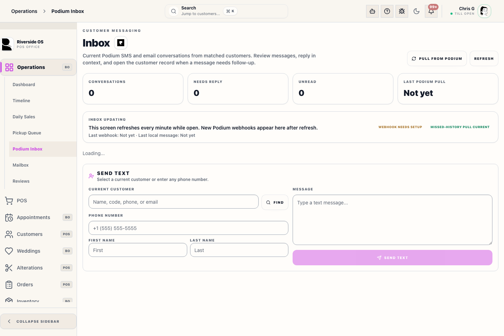

# Podium Inbox

## Screenshots

## What this is

Podium Inbox is the shared list of recent Podium SMS and email conversations, including Podium call and linked review activity when the provider webhook delivers it.

Sending a staff-authored text requires **Settings → Integrations → Podium → Staff-authored texts**. That switch does not enable automated pickup, alteration, appointment, receipt, new-sender, or review messages.

In Operations and POS, this surface is for communications follow-up only. It is not a general task inbox.

## How to use it

1. Open **Operations** → **Podium Inbox** or **POS** → **Podium Inbox**.
2. Use the conversation search and the **Open**, **Needs reply**, **Unread**, or **Closed** filter to find the conversation. Messages from phone numbers or email addresses that are not in Riverside appear in this same list as **Unknown sender**.
3. Open a row to read the chronological thread. Calls appear as call cards, and reviews attributed to that customer's Riverside review invitation appear as review cards. Review cards show the rating, comment, provider, response status, and Riverside's latest response when Podium supplies it. Opening the row marks that conversation read.
4. Use **Assigned to** in the conversation header to assign the thread to a staff member or choose **Unassigned**. The list includes only active Riverside staff profiles with a **Linked Podium Staff Member**. The assignment saves in Podium immediately and does not send a reply.
5. Check **Replying as** above the composer. Riverside remembers that staff member for this conversation, so ordinary replies need no additional PIN or confirmation.
6. To change the responder, choose another active staff member. The selected person enters their own **Access PIN** once; future replies keep that name until someone changes it again.
7. Write the reply directly, or start with **Check-in** or **Pickup update** and review the wording before sending. Common emoji can be inserted with one tap. For SMS, **Image** can attach one PNG up to 5 MB.
8. Use **Mark unread** when another staff member still needs to review the conversation. Use row checkboxes to mark several conversations read or unread together.
9. Use **Close** to move a conversation into Podium's closed/archive state. Find it under **Closed** and choose **Reopen** when follow-up resumes. Group Close/Reopen reports partial provider failures.
10. Choose **New message** only when starting a separate text; the customer/phone form stays hidden during normal inbox work.
11. Use **Open Customer** when the conversation changes an order, pickup, alteration, shipment, or wedding party plan.
12. For an unknown sender, reply in the existing conversation when immediate follow-up is appropriate. Riverside uses the destination stored on that exact conversation and keeps the reply in its history. Choose **Match Customer** or **Add Customer** only after staff can verify identity; linking is optional for replying.

## Operational detail

Use this inbox to decide who needs a response, not to replace the Customer Hub. Riverside stores and answers messages from unknown or ambiguous senders without silently creating or choosing a customer. Replying does not assert identity; match or add the customer only when staff can verify the person.

The screen refreshes the Riverside copy every minute while it is open. Podium webhooks are still the fastest path for new inbound messages, calls, reviews, and review responses; Riverside stores verified webhook events in a retryable queue before acknowledging them. Inbound calls mark the conversation unread. A missed call, voicemail, or linked review that Podium marks as needing a response also marks it **Needs reply**. **Refresh** reloads only the Riverside copy. Open **Status** for provider diagnostics and **Pull from Podium** when message history is missing. The pull uses Podium's cursor-paged conversation and message APIs; call and published-review cards come from signed webhooks, not that history pull. Riverside also refreshes provider message history in the background when the last pull is more than 30 minutes old. A routine background refresh is not an error. **History current** describes message history only. If the Inbox reports **History incomplete**, retry the pull once and escalate the displayed failure if it remains.

The sidebar badge counts the same open unread conversations shown here, rather than Notification Center rows. Read/unread actions refresh that badge immediately. A newly delivered inbound Podium message also enters Notification Center and produces an informational popup while Riverside is open; the first notification refresh after sign-in establishes a baseline and does not replay old popups.

## Tips

- Use this list to triage communication work quickly from either shell.
- **Assigned to** controls Podium ownership and can be changed without composing or sending a message. Only staff with a linked Podium user appear as choices.
- Call cards show the provider facts Riverside received. A voicemail card confirms that Podium reported a voicemail; listen to or manage the recording in Podium when the recording itself is not available in Riverside.
- A review is linked to the conversation only when Podium attributes it to a Riverside review invitation/customer. Unlinked reviews remain visible in **Operations → Reviews** and are never guessed onto a customer.
- **Replying as** is conversation-specific and can differ from the staff member currently using the workstation. Changing it requires the selected staff member's Access PIN; sending later replies does not.
- Replies and assignments created inside Podium use the manager-maintained Podium-to-staff link.
- A matched Podium alert names the customer; an unknown-sender alert still opens the exact conversation. Older stored alerts use the customer match to find the latest thread.
- If you need the full customer record, open the row instead of trying to work from the list alone.
- **ROS webhook ready** means Riverside has its local signing secret and inbound processing enabled. The provider subscription can still require an update; Settings → Integrations → Podium is authoritative for that status.
- **History current** means recent provider-backed conversation histories completed. **History incomplete** means at least one recent history is missing or failed; it does not merely mean the next routine refresh is due.
- When search returns more than one plausible customer, verify the phone or email owner; do not select a record solely because it is newest.

## What happens next

After a row opens, continue in the selected inbox conversation. Use **Open Customer** for notes or follow-up tasks when the conversation changes the customer's order, appointment, wedding party, alteration, or pickup plan. If the message belongs to a new number, collect first and last name before creating a new contact.

## Escalation

Escalate when a message includes payment disputes, return promises, customer-data corrections, angry language, or a request that affects a wedding party, pickup, alteration, or shipment timeline. Staff should not promise refunds, delivery dates, or account corrections from the inbox row alone.

If the customer identity is uncertain, ask for enough detail to match an existing customer before linking the thread.

## Related workflows

- [Customers Workspace](manual:customers-workspace)
- [Customer Relationship Hub](manual:customers-customer-relationship-hub-drawer)
