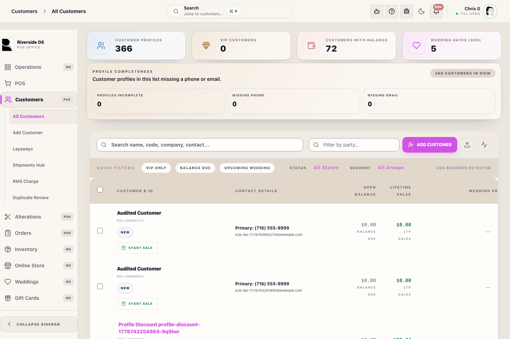

# Customers Workspace

<!-- help:component-source -->
_Linked component: `client/src/components/customers/CustomersWorkspace.tsx`._
<!-- /help:component-source -->

## What this is

Use this workspace to:

- search for a customer by name, phone, email, or customer code
- review customer-level status such as weddings, open balance, and recent activity
- open the `Customer Relationship Hub` drawer for profile, message, measurement, shipment, and order review
- move into a more specialized workflow like `RMS Charge` or `Duplicate Review` when needed

## What the main list tells you

Each customer row is a quick support summary. Staff can usually see:

- customer name and code
- lifecycle state such as `New`, `Pending`, `Pickup`, or `Issue`
- contact information
- lifetime sales
- open balance
- whether the customer is tied to an active wedding party

This list helps you decide which customer to open. It is not the full support record by itself.

The workspace now also shows a `Customer Completeness` summary above the list. That summary uses the same existing profile-complete expectation already used elsewhere in Riverside: a complete customer profile has both a phone number and an email address. Use it to spot records that may block future receipt, pickup, or follow-up work.

## What belongs here versus RMS Charge

Use the main Customers workspace and relationship hub when you need to review:

- customer profile details
- notes and timeline history
- measurements
- order history
- shipment history
- wedding linkage

Use `RMS Charge` when you need to:

- verify a linked RMS account
- review RMS-specific posting history
- work RMS exceptions
- review RMS reconciliation

The relationship hub supports customer review. The RMS workspace supports financing account operations.

## How to use it

1. Search for the correct customer first.
2. Use the lifecycle filter when you need to isolate new customers, active follow-up, ready pickups, completed history, or issues.
3. Open the customer row to review the relationship hub.
4. Use the relationship hub tabs for profile, orders, messages, measurements, weddings, and shipments.
5. Return to the main workspace if you need a different customer.
6. Move to `RMS Charge` only when the question is about RMS financing accounts or RMS support follow-up.

## Related sections

- `Duplicate Review`
  Use when two customer records may need merge review.
- `RMS Charge`
  Use when the issue is about a linked RMS financing account, RMS payment history, or RMS support operations.

## Tips

- Start with the active Riverside customer profile, not a name-only match.
- Use phone, customer code, and wedding context to confirm the right record before taking action.
- If the issue is financing-specific, do not try to solve it from the relationship hub alone. Open `RMS Charge`.
- A `Profile incomplete` chip on the browse row means the record is missing either phone or email, even if the rest of the account looks active.
