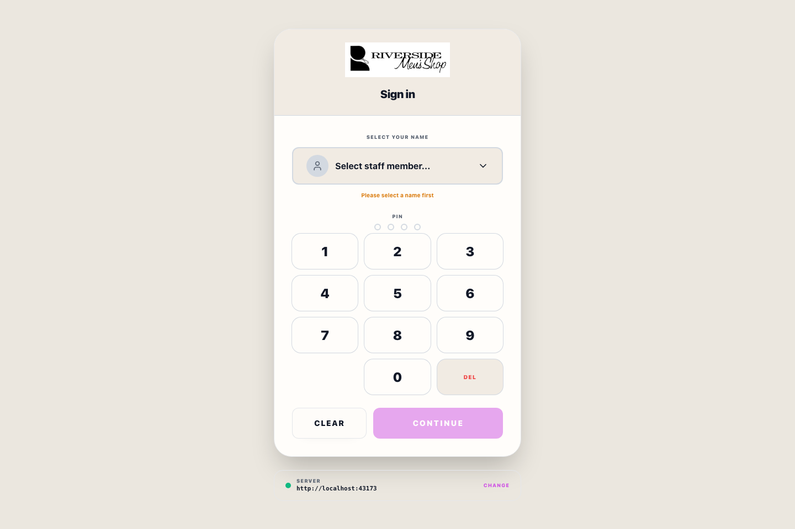
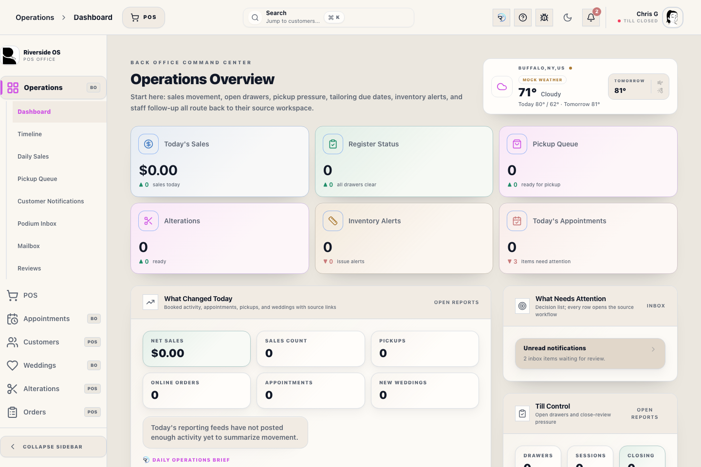
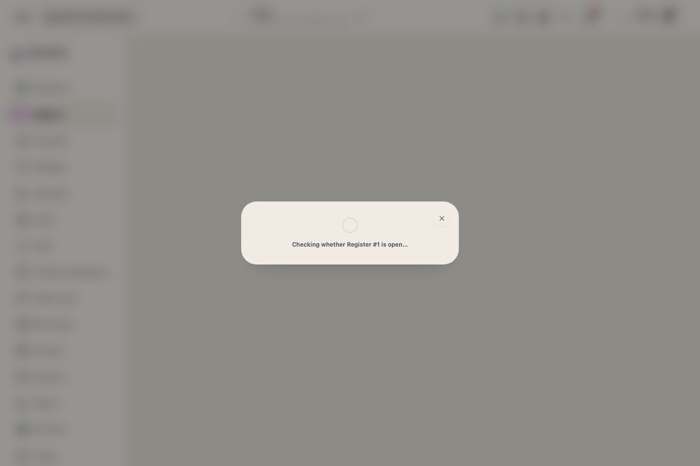

# Getting Started with Riverside OS

## Screenshots

## What this is

This is the starting guide for every Riverside OS staff member. It explains how to sign in, choose the right workspace, find official instructions, understand access messages, and recognize when work is truly complete.

Riverside OS has two main working styles:

- **Register / POS** is the fast floor workspace for selling, collecting payment, Customer lookup, wedding work, pickup, and daily Register tasks.
- **Back Office** is the review and management workspace for Customers, Orders, Inventory, Weddings, Payments, Staff, Reports, integrations, and Settings.

## Sign in

1. Select your own staff identity.
2. Enter your four-digit **Access PIN**.
3. Riverside submits the fourth digit automatically. Use **Continue** only when the screen offers a manual retry.
4. Confirm your name appears as the signed-in staff member.

Never use another person's identity or share an Access PIN. Riverside records important work against the authenticated staff member.

## Find the right workspace

1. Use the left navigation rail to choose the business area.
2. Use the section list for the specific task, such as **Receive Stock**, **Payments → Health**, or **Weddings → Parties**.
3. Use Register for customer-facing work and Back Office for review or management work.
4. Read the page title, Customer, party, Transaction Record, or item before acting.

If a section is missing, your role may not include its permission. Ask a manager to review your access; do not use someone else's PIN.

## Use Help and ROSIE

1. Select **Help** in the top bar from any workspace.
2. Start with the **Help Library** for the official step-by-step procedure.
3. Search in normal words, such as **close register**, **wedding deposit**, **refund failed**, or **printer issue**.
4. Use **Ask ROSIE** for a direct sourced answer.
5. Use **ROSIE Chat** for a short follow-up conversation.
6. Open a ROSIE source when you need to verify the exact manual section.

ROSIE can explain approved workflows and answer supported read-only questions. It cannot bypass access, collect or refund money, change inventory, post QBO entries, or silently complete work.

## Complete work safely

1. Read all warnings and blockers before selecting the final action.
2. Confirm the correct Customer, item, party member, Transaction Record, amount, and fulfillment choice.
3. Wait for the visible success state.
4. Verify the result in the destination screen, receipt, history, queue, or report.
5. If the result is uncertain, stop and use Help, ROSIE, a manager, or **Report a Bug** before repeating a payment or irreversible action.

The button click is not proof by itself. Completion means Riverside saved the correct record and the expected next state is visible.

## Common messages

| Message or symptom | What it usually means | What to do |
|---|---|---|
| Access denied or section missing | Your current role lacks permission | Ask a manager to review Staff Access |
| Main Hub unavailable | This station cannot reach the Riverside server | Keep payment/work state visible and follow the connection guidance |
| Manager Access required | The action is sensitive or outside normal limits | Ask an authorized manager to approve in the normal flow |
| ROSIE unavailable | The selected ROSIE provider or speech service is unhealthy | Continue with Help manuals and report the provider issue |
| Help fallback notice | Live Help search is unavailable | Continue using bundled search results; support should rebuild the live index |

## What to watch for

- Never enter full card numbers, CVV, passwords, Access PINs, or integration secrets in notes, search, Help, or ROSIE.
- Do not retry a card after an uncertain terminal result until Payments confirms the first attempt.
- Do not promise pickup when a balance, readiness, receiving, alteration, or authorization blocker remains.
- Do not change inventory or financial records simply to make a warning disappear.
- Use **Report a Bug** with the exact symptom, workflow, and safe screenshot when the screen and manual disagree.

## What happens next

After orientation, choose the manual for the workspace you are using. Riverside Help is organized by Register, Operations, Weddings, Customers, Orders, Inventory, Payments, Online Store, accounting/reporting, and Settings/support.

## Related workflows

- [Register (POS)](manual:pos)
- [Help Center Drawer](manual:help-center-drawer)
- [Wedding Manager](manual:wedding-manager)
- [Payments Operations](manual:payments-workspace)
- [Bug Report Flow](manual:bug-report-flow)
