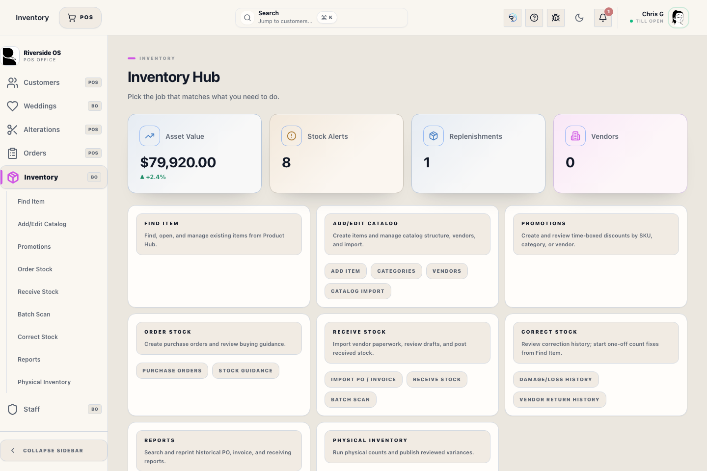
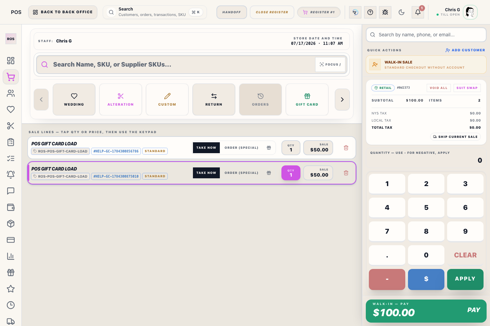
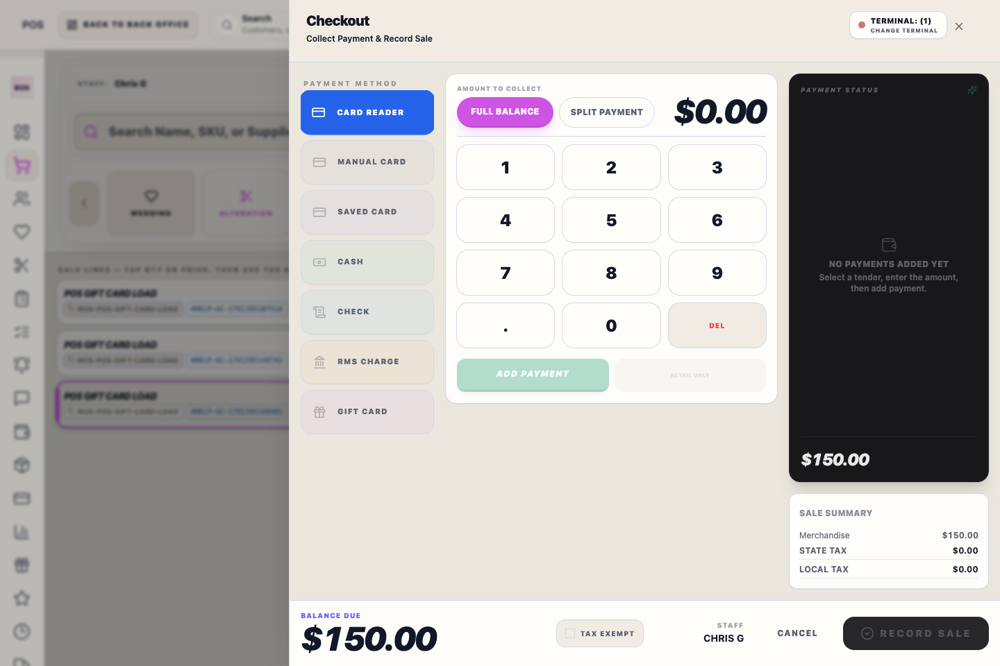

# Gift Cards Workspace

## Screenshots

## What this is

Gift Cards Workspace is the Back Office surface for looking up cards, reviewing balances, issuing new cards, and handling non-sale gift card workflows.

## How to use it

1. Look up the card or choose the approved issue workflow.
2. Confirm the card subtype before issuing or reviewing activity.
3. Review balance and history before taking action.
4. Use checkout for redemption.
5. Scan card codes where possible; Riverside normalizes scanned codes to uppercase.

## Gift card types

Riverside OS tracks gift card subtype because accounting treatment differs.

- **Purchased gift cards** represent customer-paid liability.
- **Loyalty gift cards** are issued from loyalty or reward workflows.
- **Donated gift cards** are issued for approved donation use.
- **Promo gift cards** are promotional and should remain distinguishable from purchased cards.

## Issue a card

Use the correct issue workflow for the card type. Do not use a purchased card path for a donation, loyalty reward, or promotion.

Promo and donated cards should only be issued when the store has approved the reason.

Depleted loyalty, donated, and promo cards can be reused with the matching issue workflow. The card keeps its full event history. If a non-liability card expired with remaining balance, Riverside closes the expired value before assigning the new value.

## Redeem a card

Gift card redemption happens in checkout. The sale should apply the card as gift card tender and leave auditable evidence for the remaining balance.

## QBO evidence

QBO proposals should keep gift card subtype evidence clear. Purchased, loyalty, donated, and promo gift cards should follow their intended accounting path.

## Operational detail

Keep purchased, loyalty, donated, and promo cards separate when reviewing balances. Purchased cards represent customer-paid liability; loyalty, donated, and promo cards have different accounting and redemption intent. If a refund or balance correction involves a gift card, confirm the original tender and card subtype before making changes or escalating to a manager.

Expired purchased cards with remaining balance are handled by QBO breakage review before reuse. Loyalty, donated, and promo expirations do not create purchased-card breakage because they are not customer-paid liabilities.

## What to watch for

- Confirm the card number and balance before taking action.
- Do not void a card unless the customer and reason are clear.
- Do not treat promo or donated cards as purchased gift card liability.

## Related workflows

- [Register Checkout](manual:pos-nexo-checkout-drawer)
- [QBO Workspace](manual:qbo-workspace)
