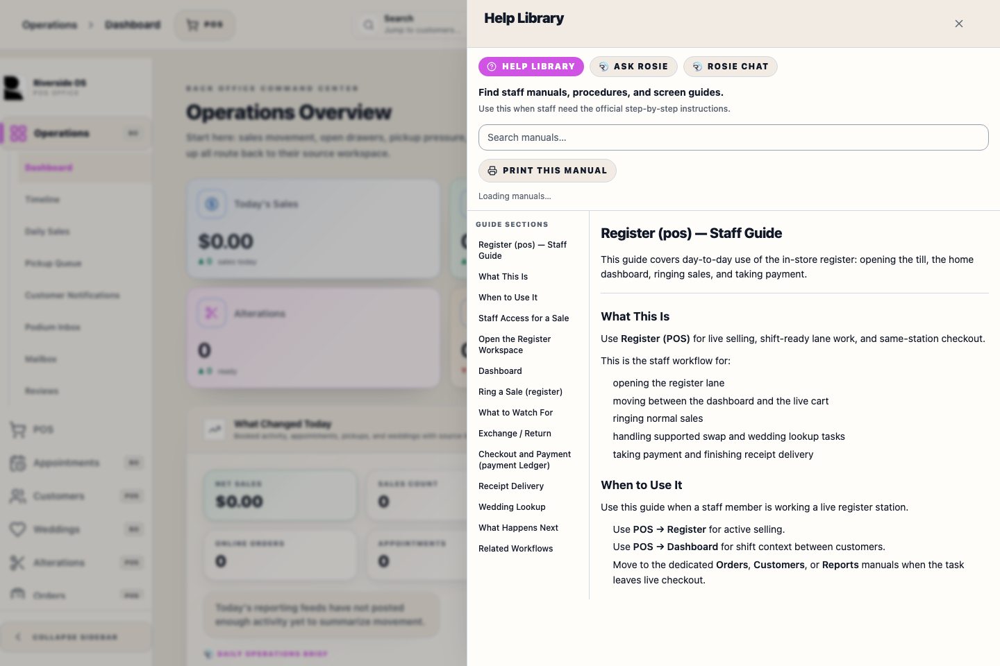

# Help Center Drawer (help)

<!-- help:component-source -->
_Linked component: `client/src/components/help/HelpCenterDrawer.tsx`._
<!-- /help:component-source -->

## What this is

Briefly describe what staff use this screen for.

## How to use it

1. 
2. 

## Tips

- 

## Screenshots

Add PNGs under `../images/help/help-center-drawer/` and embed them, for example:

