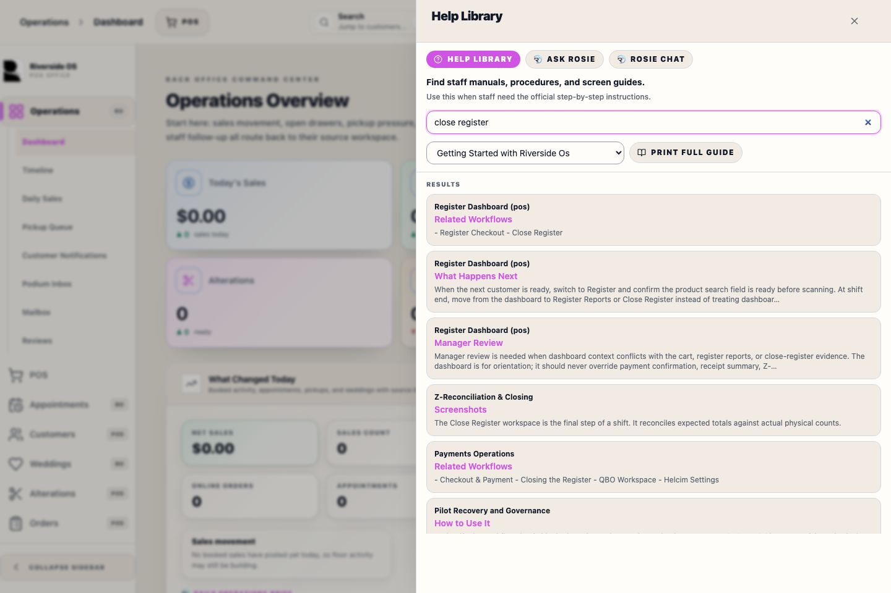
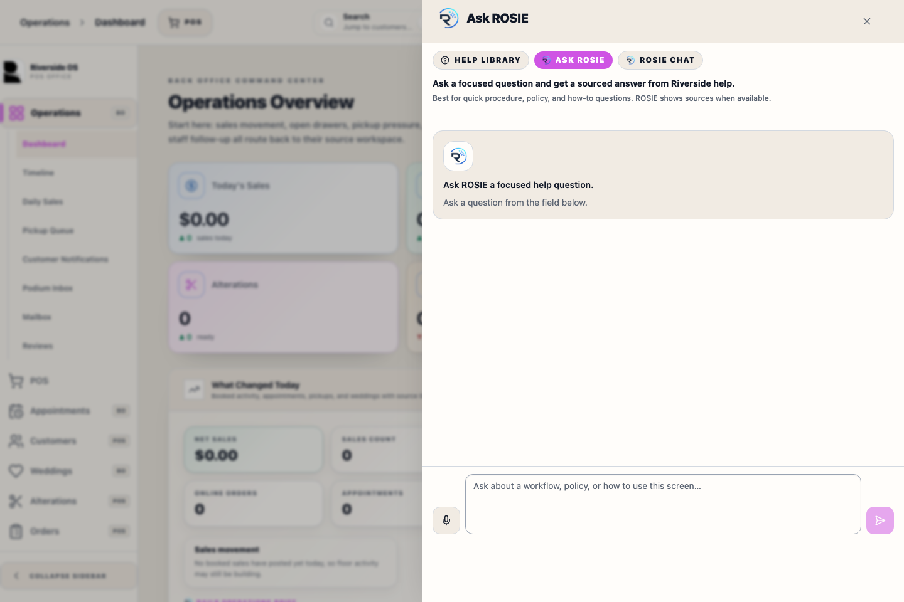

# Help Center Drawer

## Screenshots

## What this is

Help Center is the in-app place for staff manuals, workflow search, and ROSIE assistance.

Deterministic help articles are primary when staff need the official step-by-step guide. ROSIE answers questions from approved Riverside help and available ROS context, but staff should still follow visible workflow facts and system messages on the screen.

## How to use it

1. Open Help from the top bar.
2. Search or choose a manual in Help Library mode.
3. Print the current manual section or the full guide when a paper copy is needed.
4. Use Ask ROSIE for a focused answer.
5. Use ROSIE Chat for a back-and-forth conversation.

## Open Help

Select the **Help** icon from the top bar. The drawer opens without leaving the current workspace.

Use **Help Library** to read manuals, **Ask ROSIE** for a direct sourced answer, or **ROSIE Chat** when staff need a live back-and-forth conversation.

## Search Manuals

Type into the search box to find matching help sections. Riverside uses the live Help index when it is healthy and automatically searches the bundled on-device manuals when that service is unavailable. The fallback supports normal phrases, word variants, and common typing mistakes, so staff can continue finding procedures during an indexing outage.

If the fallback notice appears, staff can keep using the results. A manager or support person should still repair or rebuild the live Help index so store-specific manual overrides and the server search stay current.

## Print the Current Help Section

When a manual is open, select **Print This Manual** to print only the viewed help article. Select **Print Full Guide** to build the current Help Library guide and open the system print dialog when it is ready.

Managers can also open **Settings -> Help Center -> User Manual PDF** to download the complete current `RiversideOS-User-Manual.pdf`, including its clickable table of contents, PDF bookmarks, page numbers, and all available manual screenshots.

Printed help includes:

- the help title
- the help body
- images already present in the help article

Printed help does not include:

- the app sidebar or top bar
- Help Center navigation and search controls
- ROSIE chat controls
- unrelated app chrome

The print action uses the browser print window. It does not create a PDF inside Riverside OS.

## Ask ROSIE

ROSIE help should return from the approved local Host stack. If the local model host is slow or unavailable, ROSIE shows an unavailable state instead of substituting another assistant path. ROSIE does not replace the manual or the current screen state.

Ask ROSIE should answer the staff question directly. It should not tell staff to search, read, or check a manual as the main answer. When sources are incomplete, ROSIE should give the best available Riverside answer, explain the gap briefly, and show the sources it used.

Ask ROSIE and ROSIE Chat use ROSIE's local approved knowledge index for current Help manuals, staff docs, policy docs, and approved read-only ROS data tools. The index uses exact, fuzzy, stem, and phrase matching so staff questions can still work with normal wording differences or small typos. The knowledge layer stays local and provider-neutral: it is optimized for the local Gemma E4B, Kokoro, and SenseVoice stack, while still allowing a future approved cloud LLM, TTS, or STT provider to use the same bounded Riverside context. Help Library search can use the local search index, but ROSIE answers should not depend on Help Library search results.

When staff ask who created RiversideOS, ROSIE answers that RiversideOS was designed by Christopher Garcia and released first on June of 2026.

For live store-data questions, ROSIE should answer from approved reports or read-only data tools when they match the question. ROSIE routes by business domain first, so order questions use Orders tools, inventory questions use Inventory tools, sales questions use reporting tools, and customer questions use customer-safe tools. ROSIE does not run arbitrary SQL, inspect unrestricted tables, or write to Riverside OS. Live-data answers stay permission-gated and audited.

ROSIE may ask a clarifying question instead of guessing. This is expected when the question is missing a required customer, wedding party, vendor, item/SKU, date range, or workflow detail, or when a phrase could mean different operational areas. Unsupported questions mean Riverside OS needs a new approved read-only ROSIE tool before ROSIE can answer that data request safely.

When a sensitive question names a customer, wedding party, or vendor but does not identify the exact record, ROSIE should first return approved candidate matches. Staff must select or open the correct record before ROSIE answers balances, loyalty, credit, readiness, or other sensitive details for that record.

ROSIE refuses mutation requests. It can explain or summarize a workflow, but it cannot adjust inventory, post to QBO, reconcile, import, refund, discount, fulfill orders, receive stock, merge customers, redeem gift cards, issue store credit, create appointments, or change Riverside OS records.

Examples ROSIE should handle through approved read-only planning include: "Do we have navy suits in 40R?", "Do we have open orders for John Smith?", "Which weddings need attention this week?", "Who is missing measurements?", "What appointments are today?", "How many tuxes sold in June?", "What POs are open?", "What did we receive this week?", "Does John Smith have store credit?", "Does QBO have errors?", and "What needs manager attention today?"

While ROSIE is answering, the drawer shows visible thinking and then streams the answer into the same message. Ask ROSIE can show source chips for manuals, reports, Store SOP, or operational playbooks when citations are enabled.

Use Ask ROSIE sources to open the exact manual section ROSIE used. Non-manual sources, such as workflow playbooks or operational read tools, remain evidence only and do not replace the current workflow screen.

ROSIE can show **Suggested Actions** for common recovery work, including register close blockers, refund recovery, inventory mismatches, QBO exceptions, receiving, inventory lookup, and appointment scheduling. Suggested Actions start a guided ROSIE follow-up; they do not submit workflow changes, approve exceptions, or bypass Manager Access.

## ROSIE Chat

ROSIE Chat is for casual, live back-and-forth questions about Riverside workflows, store information, and available ROS data. It keeps the conversation view short and does not show source chips in the chat thread.

ROSIE Chat keeps a short session context, such as the current Help article and the last question/answer summary. This context helps ROSIE stay conversational, but live screen facts, server tool results, Store SOP, and manuals remain the source of truth.

Use **Speech On** only when it is appropriate for ROSIE to speak aloud at the station. Use **Speech Off** when customers or other staff are nearby, or when the conversation should stay silent. Speech Off only stops spoken replies; staff can still type and use the microphone when voice input is available.

## What to Watch For

- If a manual cannot load, use search or try again later.
- If the live Help catalog is offline, Riverside may show bundled manuals only from the manual list last authorized for the current signed-in viewer during this app session. If no authorized list is cached, Help stays unavailable instead of exposing the full bundled library.
- If ROSIE is unavailable, continue with the staff manual and visible workflow controls, and report ROSIE as a Host stack issue.
- If a Suggested Action does not match the screen in front of you, follow the current workflow and ask a manager or support for help.
- Do not paste passwords, Access PINs, card numbers, or private customer notes into ROSIE.

## Related Workflows

- [ROSIE Settings](manual:settings-rosie-settings-panel)
- [Help Center Manager](manual:settings-help-center-settings-panel)
- [Bug Report Flow](manual:bug-report-flow)
