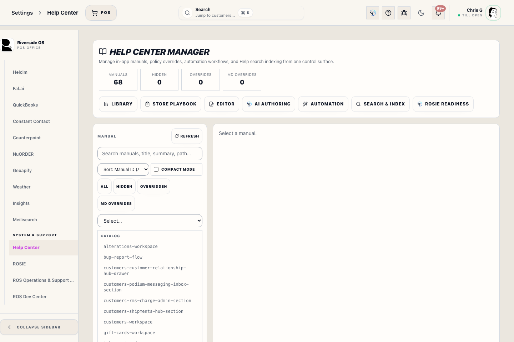
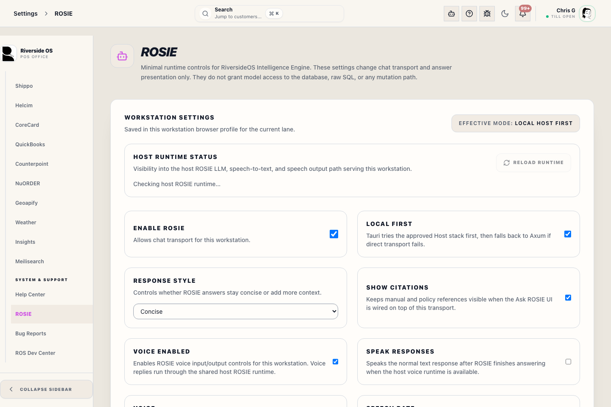

# Help Center Drawer

## Screenshots

## What this is

Help Center is the in-app place for staff manuals, workflow search, and ROSIE assistance.

Deterministic help articles are primary when staff need the official step-by-step guide. ROSIE answers questions from approved Riverside help and available ROS context, but staff should still follow visible workflow facts and system messages on the screen.

## How to use it

1. Open Help from the top bar.
2. Search or choose a manual in Help Library mode.
3. Print the current manual section or the full guide when a paper copy is needed.
4. Use Ask ROSIE for a focused answer.
5. Use ROSIE Chat for a back-and-forth conversation.

## Open Help

Select the **Help** icon from the top bar. The drawer opens without leaving the current workspace.

Use **Help Library** to read manuals, **Ask ROSIE** for a direct sourced answer, or **ROSIE Chat** when staff need a live back-and-forth conversation.

## Search Manuals

Type into the search box to find matching help sections. If live search is unavailable, treat it as a Help Center Host stack issue and report it.

## Print the Current Help Section

When a manual is open, select **Print** to print only the viewed help article.

Printed help includes:

- the help title
- the help body
- images already present in the help article

Printed help does not include:

- the app sidebar or top bar
- Help Center navigation and search controls
- ROSIE chat controls
- unrelated app chrome

The print action uses the browser print window. It does not create a PDF inside Riverside OS.

## Ask ROSIE

ROSIE help should return from the approved local Host stack. If the local model host is slow or unavailable, ROSIE shows an unavailable state instead of substituting another assistant path. ROSIE does not replace the manual or the current screen state.

Ask ROSIE should answer the staff question directly. It should not tell staff to search, read, or check a manual as the main answer. When sources are incomplete, ROSIE should give the best available Riverside answer, explain the gap briefly, and show the sources it used.

While ROSIE is answering, the drawer shows visible thinking and then streams the answer into the same message. Sources can appear before the answer is finished so staff can see which manuals, reports, Store SOP, or operational playbooks are being used.

Use sources to open the exact manual section ROSIE used. Non-manual sources, such as workflow playbooks or operational read tools, are shown as evidence chips but do not replace the current workflow screen.

ROSIE can show **Suggested Actions** for common recovery work, including register close blockers, refund recovery, inventory mismatches, QBO exceptions, receiving, inventory lookup, and appointment scheduling. Suggested Actions start a guided ROSIE follow-up; they do not submit workflow changes, approve exceptions, or bypass Manager Access.

## ROSIE Chat

ROSIE Chat is for casual, live back-and-forth questions about Riverside workflows, store information, and available ROS data. It is best for follow-up questions, broader context, and voice conversations.

ROSIE Chat keeps a short session context, such as the current Help article and the last question/answer summary. This context helps ROSIE stay conversational, but live screen facts, server tool results, Store SOP, and manuals remain the source of truth.

Use **Speech On** only when it is appropriate for ROSIE to speak aloud at the station. Use **Speech Off** when customers or other staff are nearby, or when the conversation should stay silent. Speech Off only stops spoken replies; staff can still type and use the microphone when voice input is available.

## What to Watch For

- If a manual cannot load, use search or try again later.
- If ROSIE is unavailable, continue with the staff manual and visible workflow controls, and report ROSIE as a Host stack issue.
- If a Suggested Action does not match the screen in front of you, follow the current workflow and ask a manager or support for help.
- Do not paste passwords, Access PINs, card numbers, or private customer notes into ROSIE.

## Related Workflows

- [ROSIE Settings](manual:settings-rosie-settings-panel)
- [Bug Report Flow](manual:bug-report-flow)
