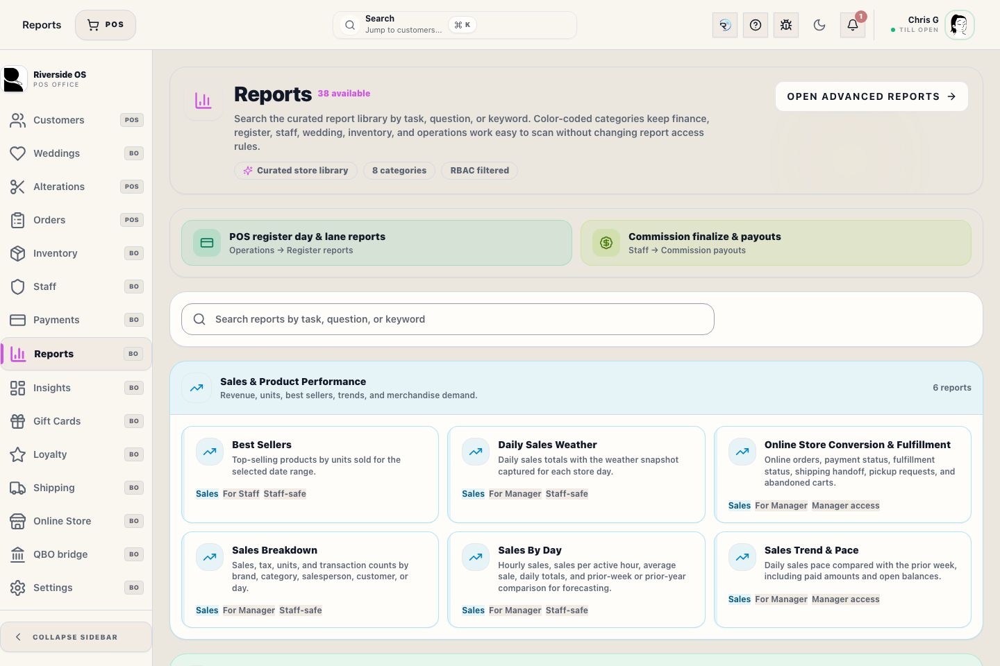
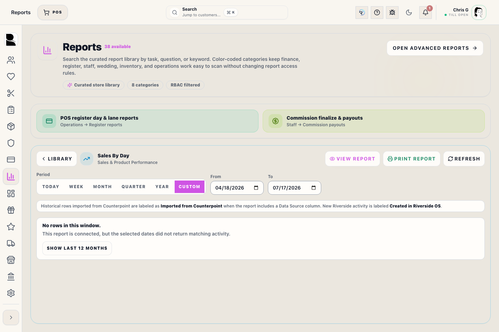

# Insights — conversational reporting

## Screenshots

## What this is

**Back Office → Insights** is Riverside's visual reporting workspace. It stays inside the standard Back Office layout, so the left navigation remains available while you work. The workspace is organized around three steps: **Ask**, **Explore**, and **Deliver**. Describe the report you need in plain language, shape the result with presentation and period controls, then favorite, export, print, or save it as a PDF. Each request uses approved Riverside reporting data and follows the signed-in staff member's permissions.

There is no separate reporting login. Riverside staff access and permissions apply throughout the workspace. Cost and margin measures remain Admin-only.

## Ask for a report

1. Open **Insights** in the left rail.
2. Describe the result you need, including the business basis and period when they matter. For example: **“Show recognized revenue by category for the last 90 days as a bar chart.”**
3. Select **Build report**. A generation window confirms that ROSIE started the request.
4. Keep working in Insights or leave for another Riverside workspace. **Generation activity** continues to show the request, and a toast appears when it is ready or if it fails.
5. Return to Insights and open the completed job if it is not already displayed.
6. Review the title, business-basis explanation, date range, chart, and table before using the result.

Insights can run up to two report jobs at the same time. If both slots are active, wait for one to finish before starting another. Leaving Insights does not cancel a job, but closing or reloading the app is not a background-server guarantee; successful runs remain available from History.

Use **booked** for activity measured when a Transaction was created. Use **recognized** for revenue measured when qualifying fulfillment or pickup occurred. If that distinction is unclear, state which business event you mean.

## Refine or correct the current report

Keep the current result open and type the change you want, such as:

- **Change this to recognized revenue.**
- **Group it by salesperson instead.**
- **Use the prior quarter and show a line chart.**
- **Remove canceled Fulfillment Orders.**

Insights uses the current report as context when applying the change. Each successful version is recorded in report history.

Select **New report** or **Start a separate report** whenever you want a clean request instead of changing the report on screen. An update that is still generating does not lock you into that report; the second available generation slot can build the new one.

## Change the period

Use the **From** and **To** controls above a result, then select **Run period**. This reruns the same report definition for the new dates without rebuilding it. The rerun is also saved to report history.

## Export and print

Every successful result includes:

- **Export CSV** — downloads the complete returned table using the displayed business labels.
- **Print / PDF** — opens report options before the system preview. A visible chart is captured exactly as shown and included by default with the title, period, generated time, basis explanation, columns, and every returned row. Visual reports use a landscape page, repeat table headings across pages, and keep rows together when possible. Turn off **Include visual chart** for a portrait, data-only report, then choose a physical printer or **Save as PDF**.

## Customize the presentation

Use **Presentation** to switch a compatible result among **Bar**, **Line**, **Area**, **Pie**, and **Table** views without rerunning the report. Use **Visual on/off** and **Data on/off** to focus the workspace on the chart, the detail table, or both. These display changes do not alter the governed result data.

## Favorites

Select **Save favorite**, give the report a useful name, and save it. Favorites store the governed report definition, not a copied spreadsheet. Open a favorite to rerun it against current Riverside data, then use the period controls for another day, week, month, quarter, or custom range.

Deleting a favorite does not delete its prior history entries.

## Recent reports and archive

Every successfully generated or rerun report is saved automatically under **Recent**. History stores the question, validated definition, generated time, row count, and last-used time. It does not preserve a stale copy of financial rows; reopening an entry reruns its definition against authoritative current data.

Reports that have not been used within the configured retention period are moved to **Archive** automatically. The default is **180 days**. Open **Archive** to restore or rerun an older report. An Admin can change the retention period in **Settings → Integrations → Insights**.

## Permissions and safety

- **insights.view** is required to open Insights and run reports.
- Cost and margin measures require Riverside Admin access.
- Riverside validates the requested data, filters, dates, row limits, visualization, and staff permissions before running a report.
- Report results are read-only. Any business correction still uses the normal Riverside workflow and confirmation rules.

## Troubleshooting

| Symptom | What to try |
|---|---|
| Reporting setup needs attention or reporting is unavailable | Hover over the reporting status for details. Ask IT to run Main Hub Update or Repair if reporting remains unavailable. |
| The report cannot be built | Add a clear period, measure, grouping, and booked or recognized basis. The requested data may not yet be available in Insights. |
| A report returns no rows | Check the period and filters, then verify whether the requested activity occurred on the selected basis. |
| Cost or margin is rejected | Sign in with Riverside Admin access or choose a revenue-only measure. |
| Insights is missing | Ask an Admin to verify **insights.view** for your role. |

## Related workflows

- [Reports (curated)](manual:reports)
- [Staff Commissions](manual:staff-commission-manager-workspace)

For booked and recognized reporting definitions, see **`docs/REPORTING_BOOKED_AND_FULFILLED.md`**.
