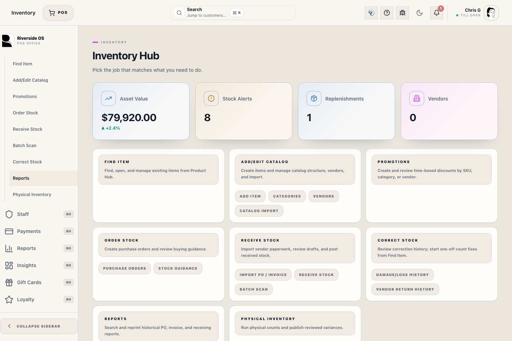
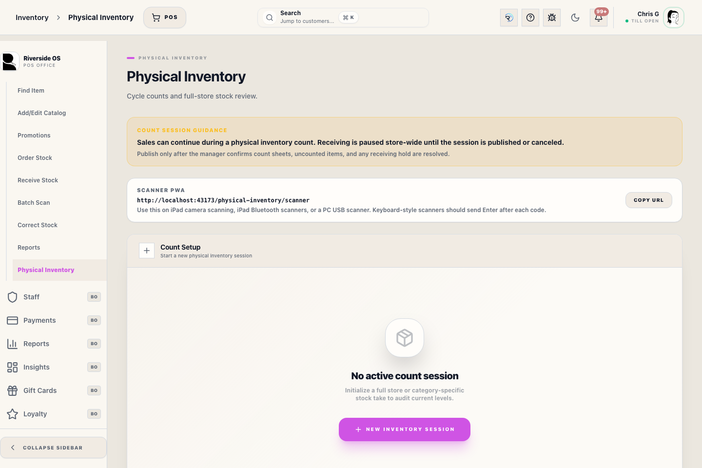

# Physical Inventory Workspace (inventory)

## Screenshots

## What this is

Use **Physical count** to run a full-store or category-limited count, review variances, resolve unknown scans, and publish reconciled stock with an audit trail.

## How to use it

1. Start a new session, choose **Full store** or selected categories, and select the inventory reason: normal count, first inventory cleanup, or baseline correction.
2. Use the **Physical Inventory Scanner** URL shown in the workspace or Settings when a PC, iPad, or mobile scanner station needs a direct scan entry point.
3. Scan or search SKUs while the session is open. PC USB scanners and iPad/Bluetooth scanners work as keyboard-style scanners when they send Enter after the barcode; the camera scanner uses the existing web barcode scanner library.
4. Review **Discovered Scans** before publish. Unknown barcodes are captured in the count workspace and must be resolved to a catalog item or ignored.
5. Move the session into **Review** when counting is complete for the chosen scope.
6. Review all variance rows, including anything in scope that was **not counted**.
7. Publish only after the missing rows, discovered scans, and zero-cost movement blockers are cleared. Publishing requires Manager Access.
8. Use **Physical Inventory Reports** in this workspace for variance, raw scan stream, discovered scans, accounting impact, and Manager Access signoff. These rows can feed Metabase without moving the reports into the global Reports workspace.

## Large counts

Physical Inventory is designed for large catalogs. Scanner entry keeps a recent worklist in the browser instead of loading every counted SKU, and Review shows a bounded high-impact/search result set while publish evaluates the full session on the server. For broad analysis across very large sessions, use the Physical Inventory workspace report data as the Metabase source instead of trying to inspect every row in the browser.

If a scanner station loses connection during counting, scans are saved on that device and replayed with duplicate protection when the connection returns. Do not move to Review until the offline scan queue is empty.

## Review and publish behavior

- Review is built from the full in-scope snapshot, not only from scanned SKUs.
- If an in-scope SKU was missed during counting, it still appears in review as a variance row.
- Full-count review now surfaces **missing variants** before publish instead of silently leaving them untouched.
- Sales that happen during the count are shown in review. Publish adjusts live stock from the reviewed count without posting a second inventory loss for sales that the register already recorded.
- Publish applies the reviewed reconciliation to live stock and records the inventory transaction history atomically, including the effective unit cost used for QBO/accounting review.
- Scan increments are attributed to the signed-in staff member and retained in the raw scan stream for audit review.
- Unknown scans are retained in the session until staff resolve or ignore them.
- Publish is blocked when discovered scans are still pending or when non-zero stock movement rows have zero unit cost.
- Publish is also blocked when non-sale inventory movements, such as adjustments, returns, damage/loss, RTV, or receipts, touched in-scope variants during the count. Restart or reconcile the count before publishing.
- Manager Access signoff is recorded with the session reports when reviewed stock is published.

## Recovery and escalation

If counting is interrupted, return to the same session instead of starting over. During review, missed in-scope SKUs are important signals: they may mean the wrong scope was selected, the item is misplaced, or the floor count is incomplete. Publish only when a manager is comfortable that variances reflect reality rather than an interrupted count.

When an unknown barcode appears, do not start a separate count to handle it. Keep the session open, fix the product barcode or SKU if needed, then mark the discovered scan as resolved or ignored in the same Physical Inventory workspace.

## Tips

- Treat a large block of **not counted** rows as a scope problem first, not as automatic shrink.
- Use review notes for damaged, misplaced, or pending floor-check explanations before publishing.
- Keep first-inventory cleanup and baseline-correction sessions clearly labeled so accounting can distinguish import cleanup from normal shrink or overage.

## Manager review

Manager review is required when variances are large, the wrong scope was selected, staff counted from memory instead of scanning, or the count would create unexpected negative stock. Keep notes specific enough that the next reviewer understands whether the variance was shrink, found stock, damaged goods, or a counting mistake.

Do not use Physical Inventory as a shortcut for receiving vendor goods. Vendor arrivals should go through Receive Stock so purchase order, reserved demand, and audit history stay connected. Physical Inventory is for count reconciliation after staff verify what is actually on hand.
