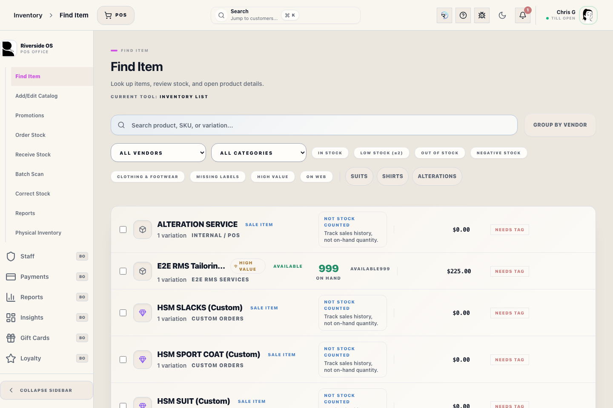
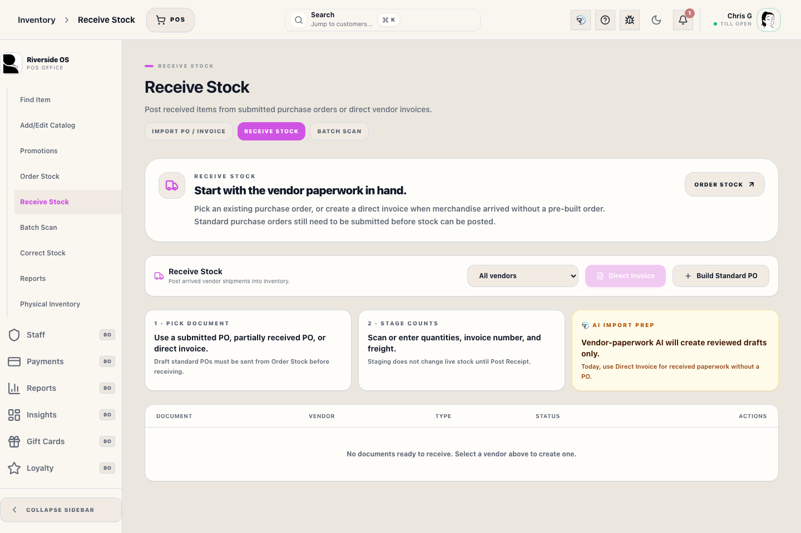
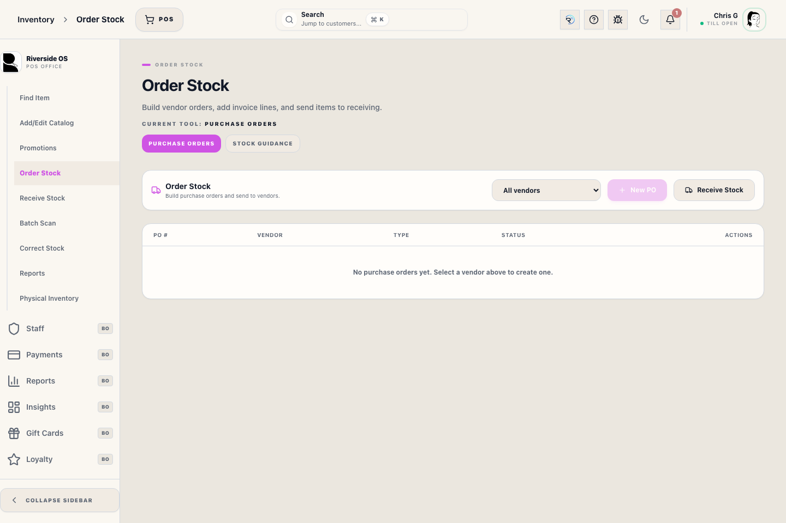

# Product Hub Drawer

## Screenshots

The Product Hub is the single source of truth for a specific SKU. Use it to verify inventory levels, review variations, and print retail price tags.

## What this is

Use the **Product Hub** when you need to drill down into the details of a single product. It aggregates live inventory counts, recent movement logs, and purchase order context into one side panel.

## When to use it

Use Product Hub when you need to:

1. Confirm the live inventory truth for one product before promising or printing.
2. Review all variations in one place.
3. Print retail price tags from the product detail view instead of the Inventory List.
4. Check recent inventory events or incoming PO context before taking action.
5. Review or update primary and secondary vendor assignments before ordering.
6. Confirm the product-level `Catalog # / vendor style #` and Counterpoint item number are not being confused.
7. Review and print stock-and-sales velocity for the parent item and every variation.
8. Compare average cost with last cost without confusing the two business meanings.

## Before you start

- Open the correct product from **Inventory List** or another inventory surface.
- Confirm whether you want tags for all variations or only selected variations.
- If the quantity should match a shipment you just received, use **Receive Stock** first so the received quantity is staged correctly there.

## What the inventory truth panel means

- `On hand`
  Physical units Riverside currently counts in stock.
- `Reserved in store`
  Units already committed to open order, wedding, or other pickup work.
- `Available now`
  The live sellable quantity after Riverside subtracts reserved units from on-hand stock.
- `On order`
  Incoming purchase-order units only. These are not available to sell until the receipt posts.

The Product Hub panel is a visibility surface. It uses current server-computed values instead of asking staff to calculate availability themselves.

## What the cost fields mean

- `Average cost` is Riverside's authoritative current merchandise cost. Inventory value, COGS, margin, below-cost controls, and employee cost-plus pricing all use this amount.
- `Last cost` is the most recent Counterpoint source cost or posted vendor-invoice unit cost. Buyers may use it as a purchasing reference, but Riverside never substitutes it for average cost in margin or employee pricing.
- A SKU cost override is still an average-cost override for that exact variation. When no SKU override exists, the variation inherits the parent average cost.
- Posting a vendor receipt updates last cost to that invoice unit and recalculates average/WAC cost separately. Supplier freight is not included in either merchandise cost field.

## Vendor assignments

- `Primary vendor`
  The vendor Riverside uses for Min/Max reorder suggestions and stock-out ordering context.
- `Secondary vendors`
  Approved alternate vendors that can be used for PO line entry and receiving without changing the primary Min/Max suggestion vendor. Use the search box to add an alternate vendor, then remove selected vendors from their chips when needed.
- `Catalog # / vendor style #`
  The vendor or supplier identifier used for NuORDER, purchase orders, catalog import, and receiving paperwork.
- `Counterpoint item #`
  A Counterpoint-assigned internal item number such as `I-103067`. Do not treat this as the vendor style/catalog number.
- `Main item / style #`
  The parent identifier shown with Name, Brand, and Category. Riverside shows the vendor/catalog style when one exists; otherwise it shows the Counterpoint parent item number.

Internal POS and Custom SKUs are sale items, not shelf-counted inventory. Product Hub shows sales and open-order context for those items instead of on-hand and available quantities.

## How to use it

1. Open the product from Inventory.
2. Review `On hand`, `Reserved in store`, and `Available now` before promising stock.
3. Check `On order` only as incoming pipeline, not as current sellable stock.
4. Search vendors in `Primary vendor` or `Secondary vendors` instead of scanning a long vendor list.
5. Use `Print retail price tags` from the General section when you want to print from the product detail view.
6. In the Variations tab, use `Print all tags` or select specific variations first and then use `Print selected tags`.
7. Record variation-level `Product UPC` for manufacturer barcodes and `Catalog # / vendor style #` for supplier buying/receiving identifiers.
8. To rename the parent item, edit **Name** and select **Save name**. Riverside refreshes current catalog/search surfaces and records the exact before/after name and staff member in **Timeline**.
9. To change the inherited retail price, enter the amount in **Base retail** and select **Save price**. Riverside shows how many variations inherit the parent and how many use SKU overrides. Leave **Apply to all variations** unchecked to preserve those exceptions; check it and confirm only when every variation should inherit the new parent price.
10. To set an exact promotional price, enter it in **Base sale** and select **Save sale**. The sale price stays dormant until an eligible active discount event is applied; leave it blank to keep using the event's percentage discount.
11. In **SKUs & Stock**, every variation has a **Use parent retail price** checkbox. Keep it checked to inherit the parent price. Uncheck it, enter the exact amount, and save to create a SKU override; check it again to clear that override.
12. To rename a variation, edit its displayed option fields such as Color and Size, then select **Save name**. Riverside updates the underlying variation values and derived display label together so the matrix, search, POS selection, and future tags stay aligned. The SKU does not change.
13. Review the shared retail price-tag dialog, adjust quantities, and confirm the final print batch.
14. Open **Timeline** after a name or price edit to review the parent or SKU, exact before/after value, and the staff member or automated source that changed it. Price history is append-only and cannot be rewritten.
15. Use recent inventory events when you need to confirm why an inventory number changed.
16. Open **Stock Report** to review every variation's current quantity, last sold date, average monthly unit sales, and average yearly unit sales, then select **Print Report**.
17. Select **Analyze product** only when you want the optional read-only ROSIE catalog review. Product Hub does not run that analysis automatically when the drawer opens.
18. In **Item Setup** and **SKUs & Stock**, read `Average cost` as the financial basis and `Last cost` as purchasing reference only.
19. On a variation card, leave **Tag copies** at `1` and select **Print 1 tag** for one tag. Enter a larger copy count and select the same button, or press Enter in the copy field, to print that many identical tags. Repeated button presses remain separate print jobs.
20. Card view keeps every SKU editor available while loading only the visible card rows. Scroll normally to reach later SKUs; unfinished card input is retained while you remain in Product Hub, even when that card scrolls out of view.

## Parent stock and sales report

The **Stock Report** tab stays scoped to the parent item currently open in Product Hub. It lists every variation, including zero-stock variations, and finishes with a parent total row.

Variations stay grouped by their leading attributes, such as color or style, and then follow merchandise size order from smallest to largest. Common aliases and range labels follow the same ladder, including `SMALL`, `MED`, `LG`, `XL`, `2XL`, and labels such as `SMALL (36-38)`. Numeric sizes appear in numeric order such as `30`, `32`, `36`, and ordinary text remains alphabetical. Identifier suffixes separated by `/` or `-` sort as the same pattern, so `/2` and `-2` stay together before `/10`; this ordering does not merge distinct SKU records. The on-screen Product Hub tables, tag reviews, and printed Stock Report use the same order.

- `Sales ranking` ranks the parent against active sellable parent items by positive, non-internal units sold during the trailing 12 months.
- `Last 30 days` is the parent's qualifying unit sales across every variation during the trailing 30 days.
- The parent `Average per month` divides all qualifying units by the elapsed calendar months from the first recorded sale through today. `Average per year` annualizes that monthly pace.
- `QTY` is current stock on hand.
- `Last sold` is the most recent recorded date for a positive, non-internal line on a non-cancelled Transaction.
- `Avg units / month` divides all qualifying units by the elapsed calendar months from that variation's first recorded sale through today.
- `Avg units / year` annualizes that variation's monthly pace.
- `Never` and `0.00` mean Riverside has no qualifying recorded sale for that variation.

**Print Report** sends the parent and variation table through the configured Reports printer path. It does not use the tag printer and does not change inventory.

## What the retail price-tag review does

- Riverside brings in the real product name, variation label, SKU, brand, and effective retail price.
- The print review dialog lets you change tag quantity per variation before anything prints.
- A quantity of `0` skips that variation.
- After a confirmed direct Zebra print, Riverside marks the printed variations as shelf-labeled. If direct tag dispatch fails, Riverside shows the printer error and does not clear the shelf-label-needed state.

## What to watch for

- Reserved units are already promised and should not be treated as walk-in availability.
- Sale-only Internal POS and Custom SKUs do not use on-hand counts. Review sales history and open orders for those items.
- Available quantity follows the current server rule, not a manual floor estimate.
- Incoming PO units only count after receiving posts the inventory movement.
- `Print all tags` includes every variation shown in the workspace. Use selection first if you only need a smaller subset.
- **Base retail** changes only variations that inherit the parent price unless you explicitly check and confirm **Apply to all variations**. That apply-all action atomically clears SKU retail overrides and records the parent/SKU changes before the new effective prices are used.
- Variation name edits do not change SKU identity, inventory quantities, cost, recorded Transaction prices, tax, or payment history. They update current catalog presentation and are retained in Product Timeline.
- **Base sale** must not exceed retail. A SKU sale override inherits from the parent when cleared and is used only with an eligible active promotion.
- Every parent and SKU Retail/Sale change is saved to immutable history. If a sync or import changes a price, Timeline identifies it as an automated source instead of assigning it to a staff member.
- Sales averages describe recorded Riverside history. If older sales were never imported, the report cannot infer them.

## What happens next

- Direct print sends the approved retail price-tag batch to the configured **Zebra LP 2844** tag station using **EPL2**.
- If direct print fails in the desktop app, Riverside shows the printer error and leaves shelf-label status unchanged. Browser/PWA sessions can open print preview as a fallback.
- Product Hub stays open so you can keep reviewing the product, switch tabs, or correct the next variation batch.

## Related workflows

- Use **Inventory Control Board** when you want the fastest browse-to-print path.
- Use **Variations Workspace** for matrix selection and selected-variation printing.
- Use **Receive Stock** when a PO or direct invoice should drive the tag quantity.

## Rule reminders

- Reserved units are already promised and should not be treated as walk-in availability.
- Available quantity follows the current server rule, not a manual floor estimate.
- Incoming PO units only count after receiving posts the inventory movement.
