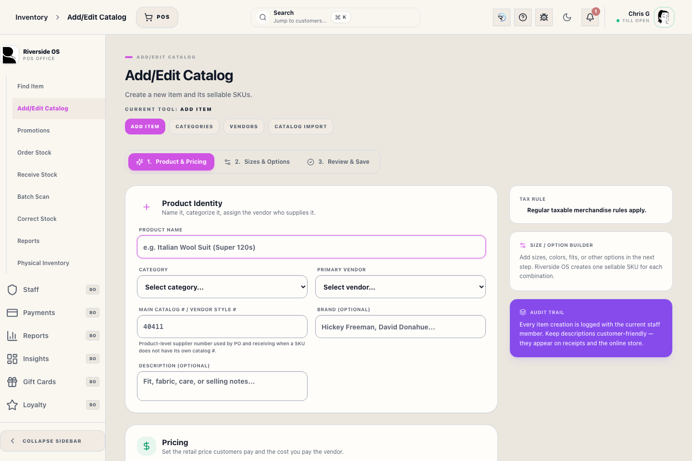

# Add Item (inventory)

## Screenshots

## What this is

Use **New Item** to create a new item and generate its starting sellable SKUs.

Brand is optional. Vendor decisions happen through **Vendors**, **Purchase Orders**, and product details.

## How to use it

1. Enter the product **name** and choose a valid **category**.
2. Add a brand only if that label matters for reports, tags, or the online store.
3. Enter **non-negative** default retail and cost values.
4. Build the size / option list and confirm the new SKUs.
5. Enter the main product `Catalog # / vendor style #` on Product Identity when the vendor uses one style number for the whole product.
6. In the review table, enter variation-level `Product UPC` when the manufacturer barcode is known.
7. Enter a variation-level `Catalog # / vendor style #` only when that SKU needs a more specific supplier code, such as a color/style suffix.
8. Review the final list before saving. The review table shows each SKU's variation label, option values, identifiers, starting stock, retail price, and vendor cost.

## Validation rules

- Product **name** is required.
- A valid **category** is required before continuing.
- Base retail, base cost, per-variation retail, per-variation cost, and generated starting stock must all be **non-negative**.
- New SKUs must be present and must not collide with an existing SKU already in ROS.
- Product UPC values are optional, but each entered UPC can belong to only one SKU.
- Main Catalog # / vendor style # is optional and saved on the product for buying, purchase orders, catalog import, and receiving lookup.
- Variation Catalog # / vendor style # values are optional SKU-level overrides. PO and receiving lines use the variation value first, then the main product value.
- Size, color, fit, or other option values must stay aligned with the generated SKU list.
- Riverside checks the next available ROS SKU block immediately before generating the review list.

## Operational detail

Create the product record only when the category, name, vendor context, and starting SKU pattern are clear. The form should establish catalog identity, not fix live stock after the fact. If the item already exists under a different SKU or vendor spelling, stop and use Inventory search or Product Hub before creating a duplicate.

`Product UPC` is the manufacturer barcode staff can scan at POS or in Receive Stock. `Catalog # / vendor style #` is the vendor-facing item/style identifier. A product can use one main catalog number for all variations, or each SKU can carry a more specific catalog value. Counterpoint item numbers such as `I-103067` are internal identifiers and should not be entered as supplier catalog numbers.

## Tips

- If you need to change on-hand quantity after creation, use **Receive Stock** or **Physical Inventory** instead of the item form.
- If a save fails with an existing SKU message, search that SKU in **Inventory List** before trying again.

## What happens next

After saving, review the product in Product Hub before staff sell it. Confirm the generated SKUs, category, variation-level pricing, vendor context, starting stock, and tag behavior. If the product needs stock beyond the starting quantities entered at setup, use receiving or physical inventory so the inventory movement is traceable.

## Related workflows

- [Inventory Control Board](manual:inventory-control-board)
- [Product Hub Drawer](manual:inventory-product-hub-drawer)
