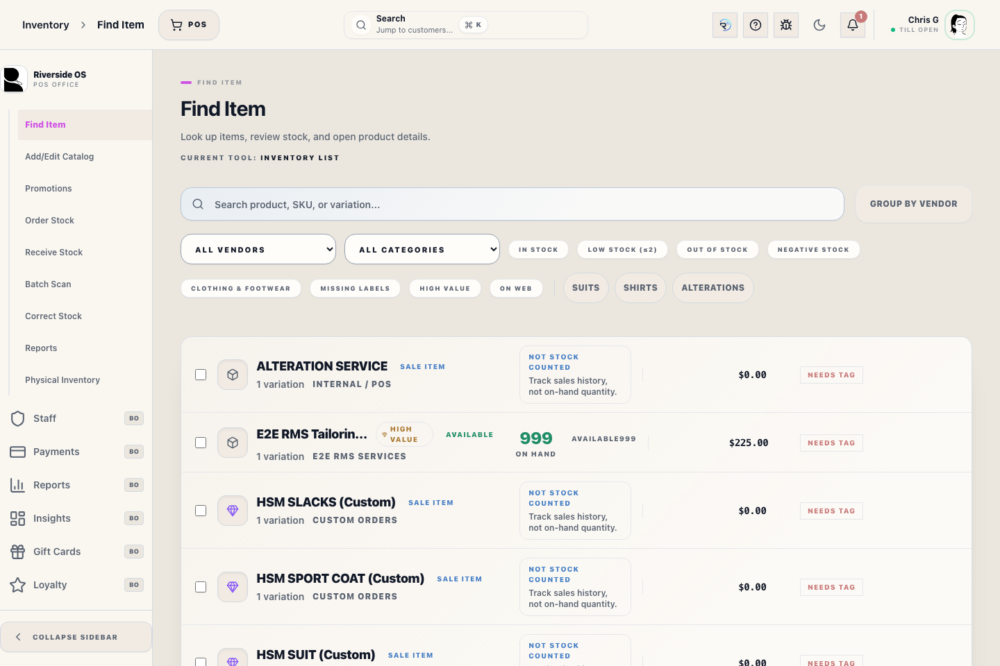

# Receive Stock

## Screenshots

## What this is

Receive Stock is the guided workflow for counting inbound quantities and posting received stock from vendor paperwork.

Receiving does not post stock until the final post action succeeds.

## How to use it

1. Open Receive Stock from the correct vendor paperwork.
2. Confirm the vendor, stage, warnings, and line items.
3. Search or scan any extra vendor invoice items that arrived with the shipment, then confirm quantity, unit cost, and retail before adding the line.
4. If the scanned item is not in the catalog, use **Quick Add Item** to create the vendor-linked SKU and return it to the invoice line entry.
5. Enter received quantities, invoice number, and freight.
6. Post receiving once the count is correct.

## Start receiving

Open Receive Stock from a purchase order or ready vendor paperwork. Confirm the vendor, paperwork, and line items before entering received quantities.

If paperwork cannot load, the drawer shows a recovery state with a retry action. The message confirms that receiving has not posted, so staff can retry or close safely.

The item-entry strip appears above the receiving table for open receiving documents. Search by product name, SKU, product UPC, catalog/vendor style number, or scanner input, confirm the current cost and retail, then add the line. Use it when a vendor shipment includes extra non-PO items on the invoice. Added invoice lines stage their received quantity but still do not change live inventory until **Post Receipt** succeeds.

A scanner entry selects an invoice item only when Riverside can prove one unique exact SKU, Product UPC/barcode, approved barcode alias, catalog number, or enabled vendor UPC match across all of those identifier types. A similar-looking or ambiguous result is never selected automatically. If the code is not exact and unique, use the item picker and choose the intended variation yourself before adding the line.

For existing receiving lines, scanner matching checks Product UPC/barcode, the enabled vendor UPC, catalog number, and SKU together. Riverside auto-selects only when the code resolves to one purchase-order line across all of those identifier types; a barcode on one line that is also another line's SKU is treated as ambiguous and changes nothing. A product-level catalog number shared by several sizes or colors can select the one variation already on this paperwork, but requires the item picker when the paperwork contains more than one of those variations or when a new line is not uniquely identifiable. Receiving displays the variation `Catalog # / vendor style #` when present, otherwise it falls back to the main product catalog number. Vendor/supplier style numbers belong in `Catalog # / vendor style #`; Counterpoint item numbers such as `I-103067` are internal identifiers and should not be used as vendor catalog numbers.

Each variation can appear only once on a purchase order. If it is already listed, update that existing line instead of adding a duplicate; this keeps scanned quantities and invoice cost tied to one auditable line.

Use **Quick Add Item** when paperwork contains a SKU that does not exist yet. Enter the Product UPC and Catalog # / vendor style # if they are on the paperwork or tag. Riverside OS creates the catalog item for the current vendor with zero starting stock, selects it for the invoice, and leaves stock unchanged until the receipt posts.

When a reviewed vendor import is converted to a direct invoice, Riverside OS opens this same Receive Stock screen for the created invoice so staff can finish invoice number, freight, staged quantities, and final posting from one place.

## Current stage and warnings

Use the stepper, current-stage guidance, and receiving warnings first. These deterministic facts explain what is ready, what is missing, and what action comes next.

Optional ROSIE receiving insight appears below those facts and should only explain the visible receiving state.

## Receiving quantities

Enter received quantities carefully. Review warnings before posting, especially when quantities do not match the vendor paperwork.

Before posting, unreceived lines can be corrected for ordered quantity and invoice unit cost. Once **Post Receipt** succeeds, those inventory and accounting records are history; use stock correction or vendor return workflows instead of editing the posted receipt.

Unit cost and freight fields accept typed decimal amounts from the invoice paperwork. Enter the exact invoice cost before posting.

Posted receiving reports show invoice unit cost, merchandise extended total, and freight allocation as separate values. Freight is not added into item cost; QBO distribution and sync review post inbound freight separately from merchandise receiving.

## Stale paperwork

If the latest vendor paperwork cannot refresh but previously loaded rows remain visible, Riverside OS warns that the paperwork may not be current and that it is showing the last successfully loaded results.

The rows remain usable, but staff should retry refresh before posting whenever the warning appears.

## What to watch for

- Do not post receiving from stale paperwork unless a manager confirms it is acceptable.
- If QBO or account glance information is unavailable, receiving should continue with a quiet degraded state.
- If the final post fails, do not re-enter quantities blindly. Confirm whether stock changed before retrying.
- Freight is entered separately from item cost and posts through the receiving workflow for QBO freight handling.

## Related workflows

- [Purchase Orders and Vendor Paperwork](manual:inventory-purchase-order-panel)
- [Inventory Control Board](manual:inventory-control-board)
