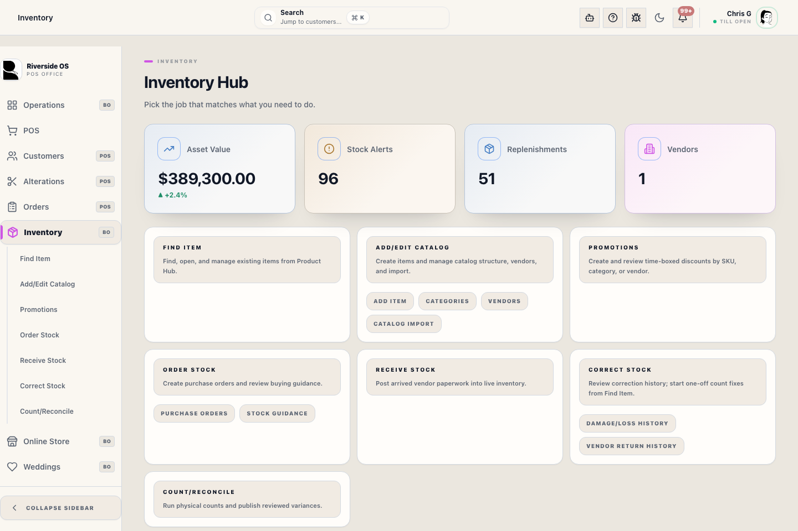

# Vendor Hub (inventory)

## Screenshots

## What this is

Use **Vendors** to create and maintain vendor records, review vendor codes and buying history, manage optional brand links, and merge duplicate records into one source of truth.

## How to use it

1. Use **New Vendor** when a supplier does not exist yet.
2. Search and select the vendor you want to review or edit.
3. Use **Edit** to update the name, vendor code, contact fields, account number, or payment terms.
4. Add or remove optional brand links only when they help staff understand a vendor relationship.
5. Use **Merge** only when two vendor records truly represent the same supplier.

## Validation rules

- Vendor names and vendor codes must be unique across ROS.
- Merge requires different source and target vendors.
- Merge moves products, purchase orders, optional brand links, and mapped vendor items onto the vendor you keep before retiring the duplicate.

## Operational detail

Vendor cleanup affects purchasing, receiving, product history, and reporting. Before merging vendors, compare vendor code, account number, recent purchase orders, and product links. If two suppliers are related but not the same legal/vendor account, keep them separate and document the relationship in the vendor notes instead of merging.

## Tips

- Treat **vendor code** as the integration key for Counterpoint-linked vendors.
- Merge duplicates before building new POs so receiving and reporting stay attached to one supplier record.

## What happens next

After edits or merges, review open purchase orders and recent receiving history for that vendor. If staff are using the vendor for new buying work, confirm the name and code are clear enough to find later from Purchase Orders and receiving.

## Related workflows

- [Purchase Orders and Vendor Paperwork](manual:inventory-purchase-order-panel)
- [Inventory Control Board](manual:inventory-control-board)
