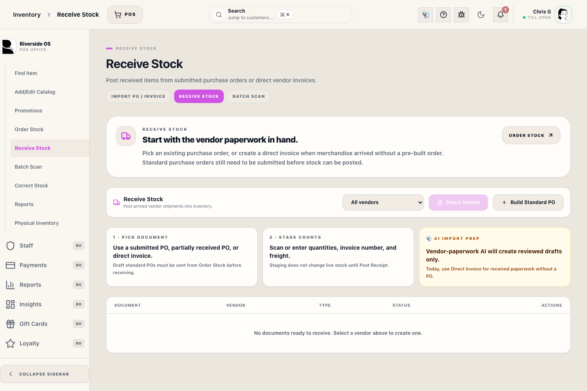
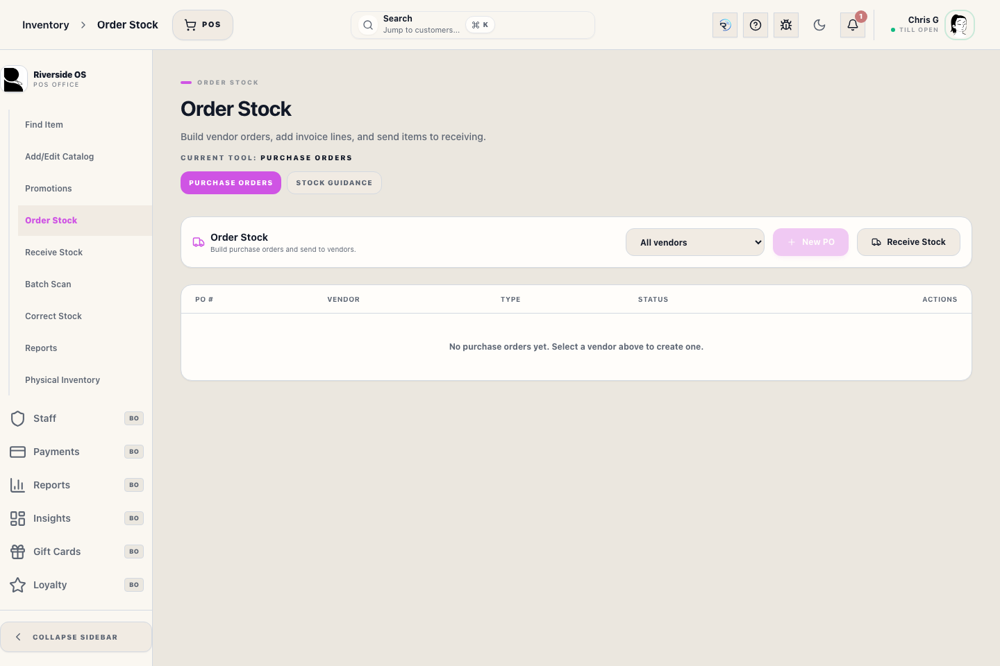

# Inventory Workspace (inventory)

## Screenshots

## What this is

Use **Back Office → Inventory** as the main operational hub for item lookup, purchase orders, receiving, vendor maintenance, import, and physical count.

Each subsection is job-based:

- **Inventory List** for SKU lookup, stock review, and product hub access
- **New Item** for creating a product and its sellable SKUs
- **Purchase Orders** for standard POs, direct invoices, customer order needs, and Min/Max reorder suggestions
- **Receive Stock** for the same purchase-order-backed receiving workflow
- **Promotions** for creating, ending, and reviewing POS discount events
- **Reports** for historical PO, invoice, receiving reports, and store-wide reconciliation checks
- **Import** for catalog-only CSV mapping
- **Vendors** for supplier review and merge cleanup
- **Physical count** for full-store or category reconciliation

## How to use it

1. Enter the subsection that matches the current task instead of trying to do every inventory job from the same panel.
2. Use **Purchase Orders** or **Receive Stock** for receiving entry points, including direct invoices.
3. Use **Inventory List** or **Product hub** for catalog corrections, not the receiving worksheet.
4. Use **Import** only for catalog structure. Live stock changes belong in **Receiving** or **Physical count**.
5. Use **Reports** when you need store-wide inventory reconciliation checks or historical receiving paperwork by vendor, invoice, PO, item, SKU, or date.
6. Use **Promotions** to review each promotion as its own record before drilling into item performance.

## Workflow notes

- **Receive Stock** opens the purchase-order-backed workflow directly. It is not a separate manual stock-adjustment path.
- Standard POs must be **drafted**, lined, and **submitted** before receiving can begin.
- Direct invoices skip the separate submit step but still land in the same **Receive Stock** final posting path.
- Available stock means **on hand minus reserved minus layaway**. Layaway-held items are not available for another customer or the online store.
- Count corrections require a reason. Stock decreases, damage/loss, and return-to-vendor adjustments require Manager Access.
- **Promotions** track sales, units, and line count by promotion. Promotions can apply to selected SKUs, the full inventory, a whole category, or a primary vendor. Use the promotion row's **Performance** button to open the printable transaction detail popup, scan SKUs into a selected-SKU promotion, or end/cancel an active promotion.
- Inventory guidance in this workspace now assumes **Counterpoint sync** is the authoritative pre-launch inventory source.

## Operational detail

Use Inventory List for search, review, and triage. Use Product Hub for item-level cleanup, Receive Stock for inbound quantity changes, and Physical Inventory for count reconciliation. If search returns no rows during a known outage or stale-index warning, treat it as a lookup problem, not proof that the SKU does not exist.

Inventory Reports includes a read-only reconciliation section for cross-catalog findings that Product Hub shows only one item at a time, such as negative available stock, inactive products with inventory commitments, manual movements missing notes, and Counterpoint-linked stock without movement-ledger proof.

## Tips

- If you are unsure where to adjust quantity, ask whether the change is an **inbound receipt**, a **reconciliation**, or a **catalog correction**.
- If a workflow needs supplier context, start with a clean vendor record before building the PO.

## Related workflows

- [Inventory Control Board](manual:inventory-control-board)
- [Receive Stock](manual:inventory-receiving-bay)
