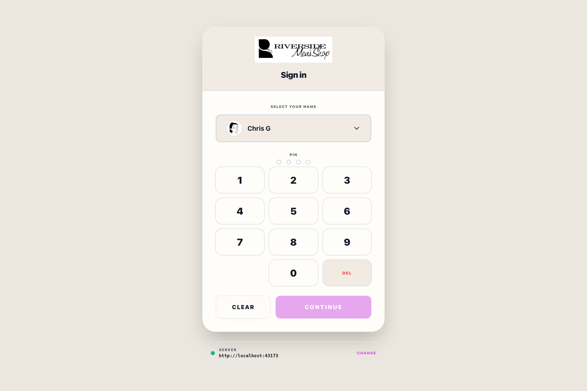

# Backoffice Sign-In Gate

## Screenshots

The sign-in gate protects Riverside before any shell or navigation appears.

## What this is

Use this gate to select the current staff identity and enter the correct **Access PIN** before opening Back Office or POS work.

## How to sign in

1. Select your name.
2. Enter your 4-digit **Access PIN**.
3. Tap **Continue**.

## API Host Settings

Use **API Host Settings** only when this device needs to point at a different Riverside host URL. The menu shows known host choices first, and the text field still allows a manually typed IP or DNS name.

- **Backoffice / Server direct** on the server PC
- the dedicated host machine on your local network
- the store's Tailscale remote-access URL when this device is off-site

Example values:

- `http://127.0.0.1:3000` on the Backoffice / Server PC
- `http://ros-host.local:3000`
- `http://10.64.70.196:3000`
- `https://ros-host.tailnet.ts.net`

## Notes

- The last selected staff member is remembered on that device.
- On the Backoffice / Server PC, if the app is pointed at `localhost` or `127.0.0.1` and the staff roster cannot load, Riverside tries to start the installed **Riverside OS Server** Windows scheduled task and then retries the roster check.
- If your name does not appear, the device may be pointed at the wrong host URL for its current role or location.
- If a red **Server connection lost** banner appears after sign-in, Riverside cannot reach the Main Hub/server. Do not start new Back Office work until the banner clears; confirm the server is running or the host URL is correct, then use **Recheck**.
- For lockout recovery, use the in-app **Lockout Recovery Manual** from Help.

## Recovery and escalation

If sign-in fails, confirm the selected staff member before re-entering the Access PIN. Repeated failures should be treated as an access issue, not a reason to share another person's PIN. If the station cannot reach the API, follow the offline or server-start recovery path before attempting normal Back Office work.

## What to watch for

- Confirm the correct staff member is selected before entering the PIN.
- Use **API Host Settings** only when the device truly needs a different Riverside host.
- If the server auto-start message says the scheduled task is missing, ask support to run Backoffice / Server **Repair** from the deployment package.
- Escalate lockout or missing-roster problems instead of guessing at host values on a live station.
