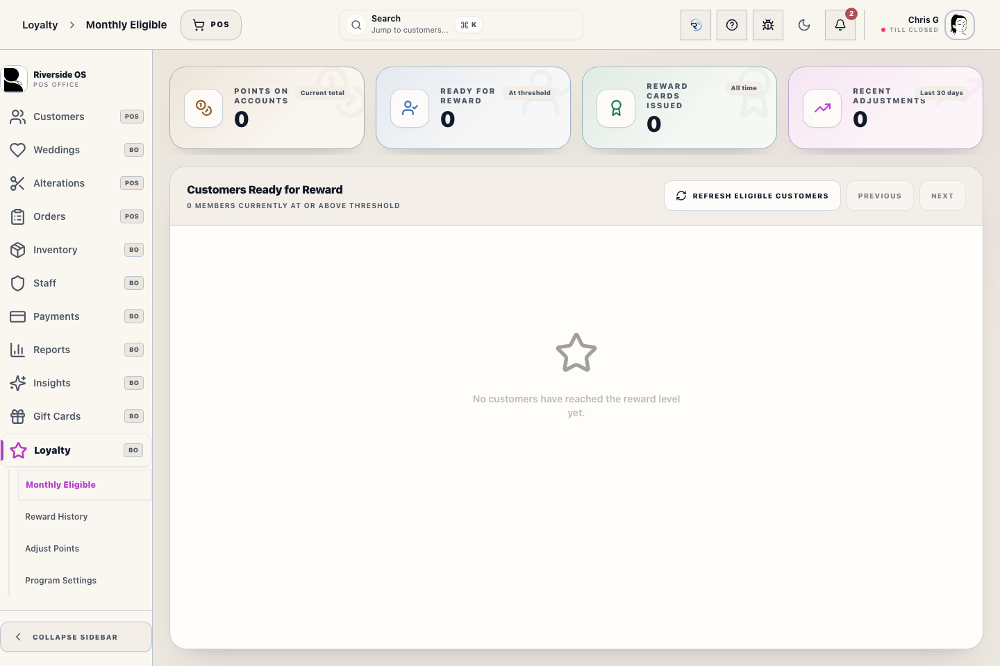
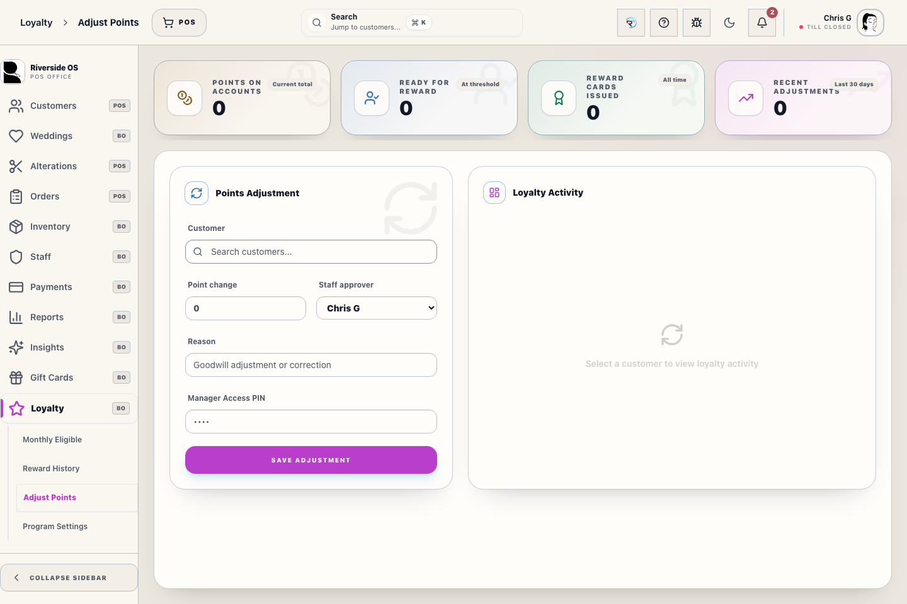
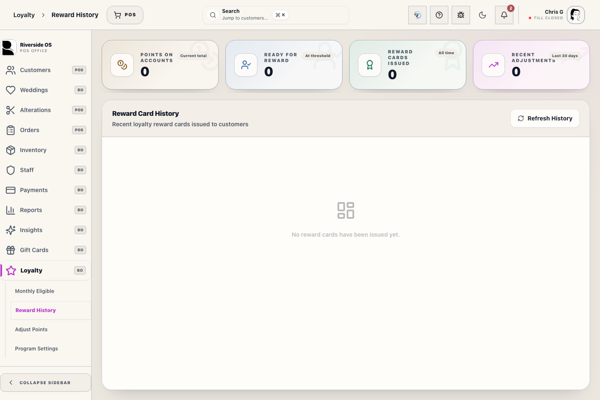

# Loyalty Management Hub

## Screenshots

The Loyalty Management Hub is where store staff manage the Elite Rewards program. Use it to identify reward-eligible customers, issue reward cards, and track loyalty history.

## What this is

Use this workspace to manage Riverside loyalty rewards, review reward readiness, and complete fulfillment follow-up after redemption.

## How to use it

1. Start in **Customers Ready For Reward** to see who is eligible.
2. Confirm the visible reward count, dollar value, and points-per-reward threshold, then use **Redeem Reward** when you are ready to issue the loyalty reward to a gift card.
3. Review **Loyalty Activity** or **History** when a customer needs explanation or fulfillment follow-up.
4. Use **Program Settings** only when an authorized admin needs to change loyalty rules or letter content.

## Top Summary

At the top of the workspace, the summary cards show:
- **Points On Accounts**: Total loyalty points currently sitting on customer accounts.
- **Ready For Reward**: Customers who are at or above the reward threshold. Riverside enforces a 5,000-point minimum before a customer appears here.
- **Reward Cards Issued**: Total number of loyalty reward cards issued.
- **Recent Adjustments**: Manual loyalty adjustments in the last 30 days.

## Customers Ready For Reward

This is the primary operational list. It shows customers who have reached the reward threshold. Customers must have at least 5,000 points before they are eligible for a reward gift card, even if an older install stored a lower threshold.

### Fulfillment Workflow
1. **Refresh Eligible Customers**: Use the refresh button to pull the latest balances.
2. Use **Previous** and **Next** when the eligible pool spans more than one page.
3. **Redeem Reward**: Each row shows the number and dollar value of rewards ready plus the current points threshold. Click **Redeem Reward** to open the redemption dialog.
4. **Choose each card's value**: Select how many configured reward blocks go on the scanned card. With the standard $50 reward, 2 blocks loads $100 and 7 blocks loads $350.
5. **Confirm the scan**: Riverside requires the complete eight-digit numeric card code. An incomplete scan cannot deduct points or create a reward card.
6. **Split or save the rest**: Issue another card for the remaining blocks, or use **Skip customer** / close the dialog to leave them available on the loyalty account.
7. **Group fulfillment**: Select multiple customers, then use **Start Batch**. Choose the amount for each scanned card as you move through the selected customers. Closing a partially completed batch refreshes balances and eligibility.
8. **Letters and labels**: Use **Print letter** for one customer. At batch completion, **Print all letters** creates one print job with one letter per customer, and **Print mailing labels** creates one label per customer. **Select Page** and **Print Page Labels** apply to the current page.

## Loyalty Activity

In the **Adjust** section, select a customer to review recent loyalty activity. The activity list explains whether points were:
- **earned**
- **removed after a return**
- **removed after a full refund**
- **manually adjusted**
- **deducted when a reward card was issued**

For couple-linked customers, Riverside resolves loyalty to the linked primary account. Staff may open either partner, but the loyalty balance and activity still come from the shared primary loyalty record.

## Issuance History (Fulfillment Tracking)

Switch to the **History** tab to see a record of all recent reward issuances. 
- History shows the server-saved card expiration and issuing staff member when available.
- Use the **Print Letter** icon to generate an 8.5x11 "Thank You" letter for one recipient.
- Use the **Print Label** icon to reprint an address label for that specific issuance.
- Select multiple history rows to print a group of letters or labels. Multiple selected cards for the same customer are combined into one letter and one label.

## Program Settings & Letter Templates

In the **Program Settings** tab, administrators can customize the reward rules and the physical fulfillment output.

### Personalizing Reward Letters
You can edit the "Thank You" letter text directly in the **Program Settings** tab. The editor supports real-time tag injection for personalization. Use the following dynamic tags to personalize the output:
- `{{first_name}}`: Recipient's first name.
- `{{last_name}}`: Recipient's last name.
- `{{reward_amount}}`: The dollar value of the reward (e.g., $50.00).
- `{{total_reward_amount}}`: The combined dollar value of the cards on the letter.
- `{{card_code}}`: The unique Gift Card code generated during redemption.
- `{{card_codes}}`, `{{card_count}}`, and `{{cards_table}}`: Bulk fulfillment details for all cards on that customer's letter.
- `{{issue_date}}` and `{{expiration_date}}`: Dates saved by the server for the issued reward card.

#### Fulfillment Workflow
1. **Redeem**: Points are deducted only for the reward blocks selected for that loyalty gift card.
2. **History**: Navigate to the History tab to find the issuance.
3. **Print**: Click the **Print Letter** icon. Riverside OS merges the template with the member data for a ready-to-mail fulfillment packet.

## Tips

- **Check the History**: Always check the History tab after a redemption to print the final fulfillment packet.
- **Dynamic Thresholds**: Reward thresholds and amounts are global; changing them in settings will immediately update the Elite Pool registry.

> [!IMPORTANT]
> Browser printing requires pop-ups to be allowed for Riverside. The desktop app opens the operating-system print preview. If the preview cannot open, Riverside reports the error without repeating the card issuance.

## What happens next

After a redemption, the customer leaves the eligible pool and the issuance moves into **History** for letter and label follow-up.
