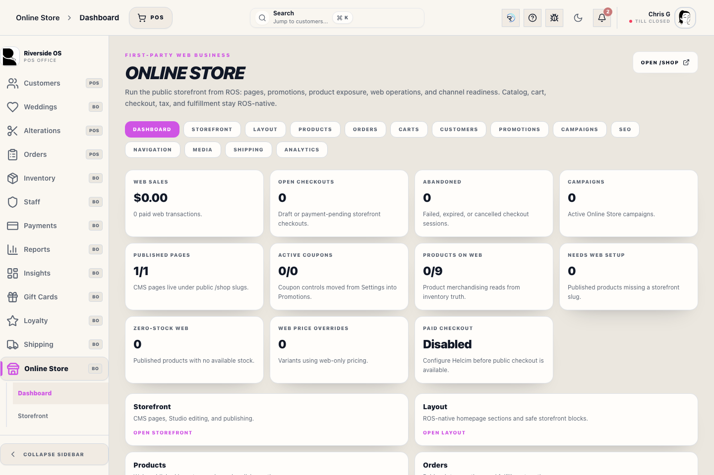
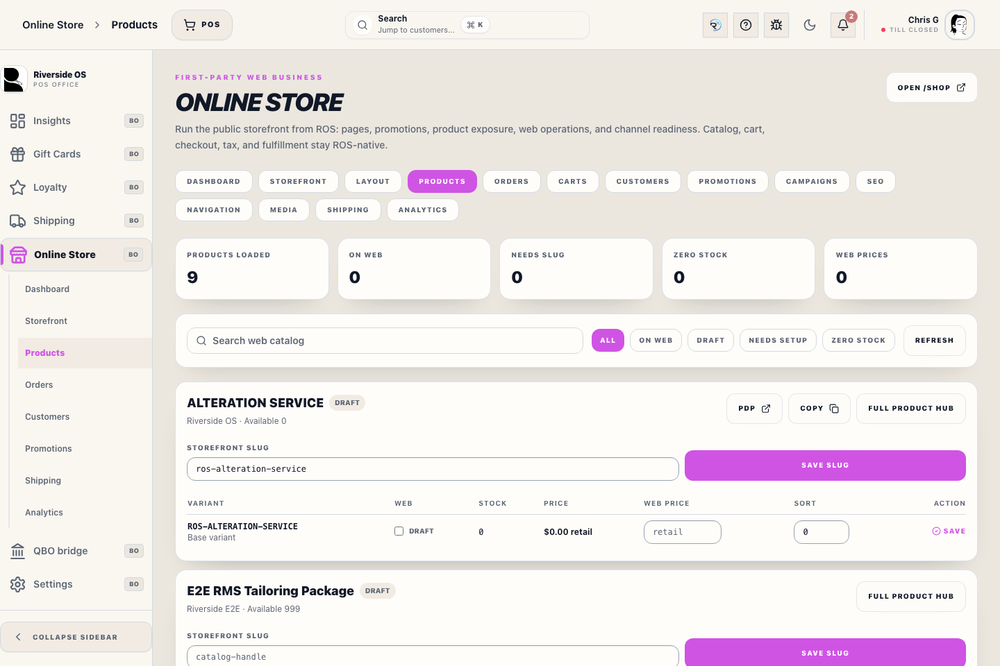
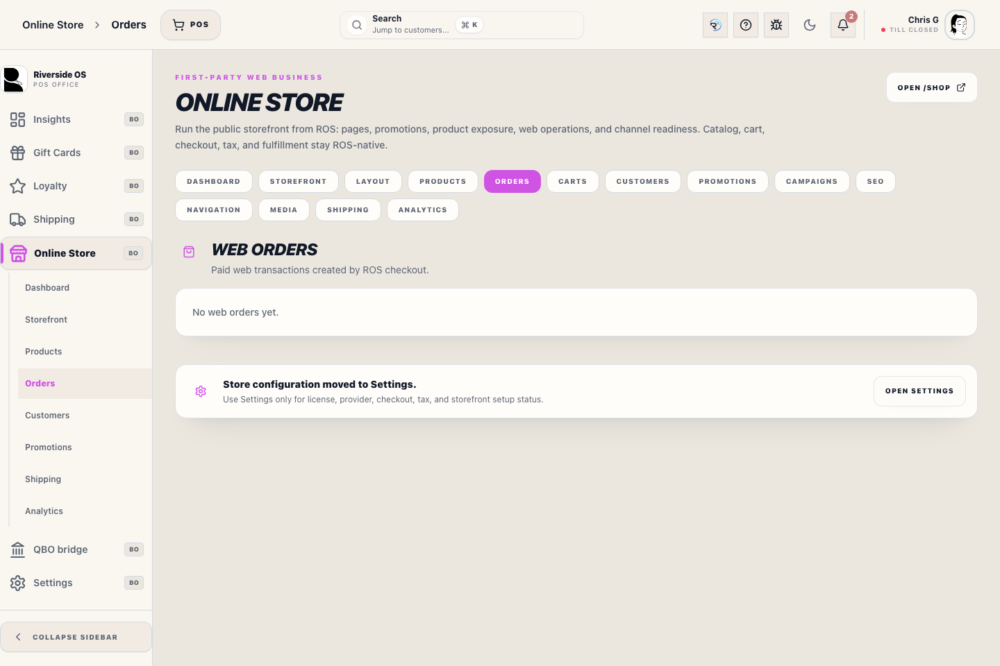

# Online Store Workspace

## Screenshots

## What this is

Online Store is the Back Office workspace for Riverside's first-party `/shop` storefront. It combines operating status, storefront pages and layout, web merchandising, web Transaction Records, customers, promotions, shipping, media, publishing history, and analytics.

Inventory, prices, tax, payments, customers, and Transaction Records remain server-validated Riverside data. Publishing controls decide what guests can see; they do not create a separate inventory or financial system.

## Before you start

- You need **Online Store management** access.
- Verify the product, page, promotion, or Transaction Record before changing its web state.
- Use redacted test content for previews and screenshots.
- Never paste card data, API secrets, customer passwords, or private tokens into page HTML or Studio content.

## Review the dashboard

1. Open **Online Store → Dashboard**.
2. Review storefront health, web orders, checkout activity, products, campaigns, and publishing signals.
3. Open the affected workspace instead of treating a dashboard count as the final record.
4. Resolve configuration issues in **Settings → Online Store** and operational issues in this workspace.

## Publish products

1. Open **Products**.
2. Find the Inventory product or variation.
3. Confirm sellable availability, storefront name/slug, price, images, and web status.
4. Correct product truth in Inventory when needed.
5. Publish only after the public preview matches the intended product.

Web-only presentation and price overrides do not replace the underlying Inventory record. Blocked or unavailable products should not be forced live to bypass catalog problems.

## Manage pages and layout

1. Open **Storefront** and choose the page, layout, navigation, or media area.
2. Edit the draft using the supported raw or visual editor.
3. Add meaningful alt text to public images.
4. Preview desktop and mobile output.
5. Save the draft, then publish intentionally.
6. Reopen the public `/shop` page and verify sanitized output.

Publishing captures history so approved content can be restored. Public HTML is sanitized; do not depend on unsafe scripts or hidden credentials.

## Review web orders

1. Open **Orders**.
2. Select the web Transaction Record.
3. Confirm payment, customer, fulfillment choice, shipping/tracking, and current status.
4. Mark ready, shipped, or review-needed only from the supported action.
5. Use the normal return/refund workflow for financial corrections.

Flagging a web order for cancellation or refund review does not bypass payment, tax, inventory, or audit rules.

## Promotions, shipping, and analytics

1. Use **Promotions** to review coupon dates, limits, status, and campaign linkage.
2. Use **Shipping** to confirm Shippo readiness and fulfillment settings.
3. Use **Analytics** for web funnel and attributed revenue summaries.
4. Follow linked Transaction Records or reports before making financial conclusions.

## What to watch for

- A product can exist in Inventory without being safe or approved for the storefront.
- Public page previews must never contain customer data or internal-only notes.
- Store pickup and shipped orders can follow different tax and fulfillment rules; rely on the server result.
- Do not treat abandoned carts as completed sales.
- Studio or page publishing does not manage typed catalog, cart, checkout, or payment logic.

## What happens next

Approved content becomes available through the public storefront, while web purchases continue through Riverside's validated customer, payment, Transaction Record, inventory, fulfillment, reporting, and reconciliation workflows.

## Related workflows

- [Inventory Workspace](manual:inventory-workspace)
- [Orders Workspace](manual:orders-workspace)
- [Shipping & Fulfillment](manual:pos-shipping-manual)
- [Payments Operations](manual:payments-workspace)
