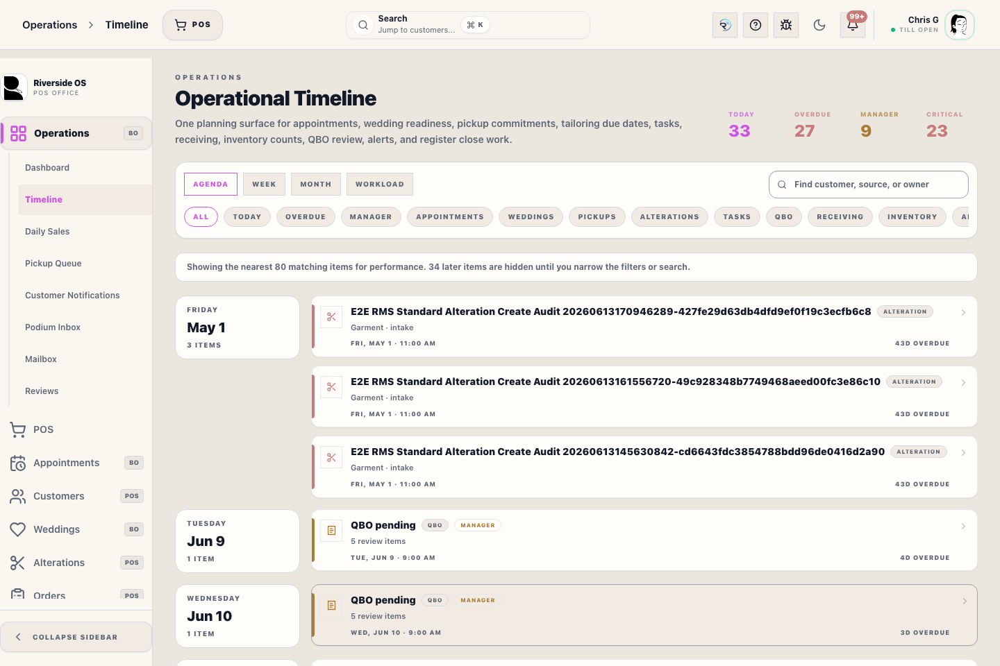

# Pickup Queue

## Screenshots

## What this is

Pickup Queue is the Operations priority view for order follow-up.

It highlights:

- **Ready for Pickup**
- **Rush Orders**
- **Due Soon**
- **Stagnant / Blocked**

This is narrower than the full **Orders** workspace. Use it to decide what needs attention first.

## How to use it

1. Open **Operations** → **Pickup Queue**.
2. Tap a metric card to filter the list.
3. Open an order row to continue the fulfillment work and review the linked Transaction Record context.
4. Use **Print Queue** if the floor needs a paper priority list.

## Operational detail

Use Pickup Queue as a priority list, then complete the work from the source order work or linked Transaction Record. Ready, rush, due-soon, and blocked labels are prompts for staff follow-up; they do not replace balance checks, fulfillment status, or customer communication notes. If the queue seems stale, refresh before calling customers.

## Tips

- **Ready for Pickup** is about customer release and follow-up.
- **Rush** and **Due Soon** help staff prioritize same-day and near-term work.
- **Blocked** is the cleanup list for orders that have stalled and need staff action.

## What happens next

After opening the source record, complete the actual pickup, customer contact, due-date update, or block-resolution step there. Return to Pickup Queue afterward to confirm the row left the priority list or moved to the correct next status.

## Escalation

Escalate when a row is blocked by payment, missing merchandise, unclear alterations, customer conflict, or a wedding-date risk. Do not clear a blocked row just to remove it from the queue; open the source record and leave a note that explains the real next action.

When contacting a customer from this queue, leave enough context for the next staff member: who called or texted, what was promised, and whether the order is waiting on payment, alteration, vendor arrival, or customer pickup.

## Related workflows

- [Orders Workspace](manual:orders-workspace)
- [Operations Home](manual:operations-operational-home)
