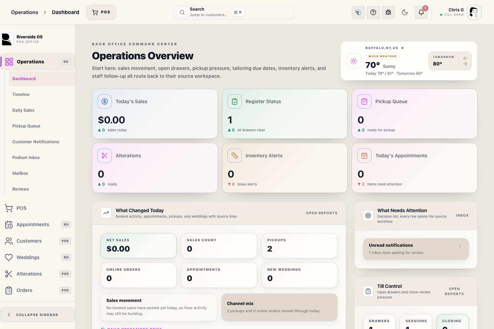
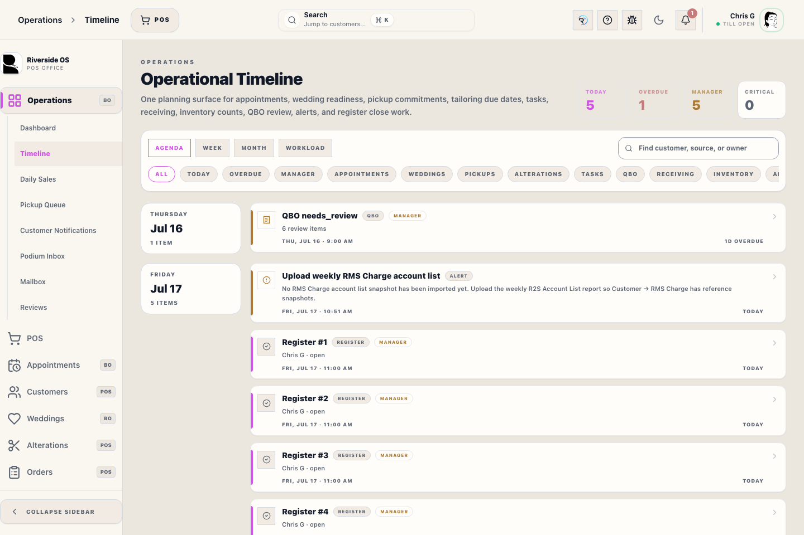

# Pickup Queue

## Screenshots

## What this is

Pickup Queue is the Operations priority view for order follow-up.

It highlights:

- **Ready for Pickup**
- **Rush Orders**
- **Due Soon**
- **Blocked**

This is narrower than the full **Orders** workspace. Use it to decide what needs attention first.

## How to use it

1. Open **Operations** → **Pickup Queue**.
2. Tap a metric card to filter the list.
3. Open an order row to continue the fulfillment work and review the linked Transaction Record context.
4. Use **Print Queue** if the floor needs a paper priority list.

## Operational detail

Pickup Queue contains release work only: ordered items that are **Received** or **Ready for Pickup**. Earlier procurement and measurement work stays in **Orders**. Each row uses the same item readiness and recorded-payment evidence as the pickup workflow. A remaining Transaction balance is shown for context, but it blocks the next pickup only when recorded payment does not cover even one ready item after merchandise already released.

Use the row's **Next** instruction. **Verify readiness** means at least one received garment still needs its Ready for Pickup check. **Payment needed** means staff must collect enough payment for a ready item or use the audited Manager Access override. **Partial** means only the displayed ready garments may be released.

## Tips

- **Ready for Pickup** is about customer release and follow-up.
- **Rush** and **Due Soon** help staff prioritize same-day and near-term work.
- **Blocked** identifies a current release blocker, such as readiness verification or insufficient recorded payment coverage. It is not an age-only cleanup label.

## What happens next

After opening the source record, complete the actual pickup, customer contact, due-date update, or block-resolution step there. Return to Pickup Queue afterward to confirm the row left the priority list or moved to the correct next status.

## Escalation

Escalate when a row is blocked by payment, missing merchandise, unclear alterations, customer conflict, or a wedding-date risk. Do not clear a blocked row just to remove it from the queue; open the source record and leave a note that explains the real next action.

When contacting a customer from this queue, leave enough context for the next staff member: who called or texted, what was promised, and whether the order is waiting on payment, alteration, vendor arrival, or customer pickup.

## Related workflows

- [Orders Workspace](manual:orders-workspace)
- [Operations Home](manual:operations-operational-home)
