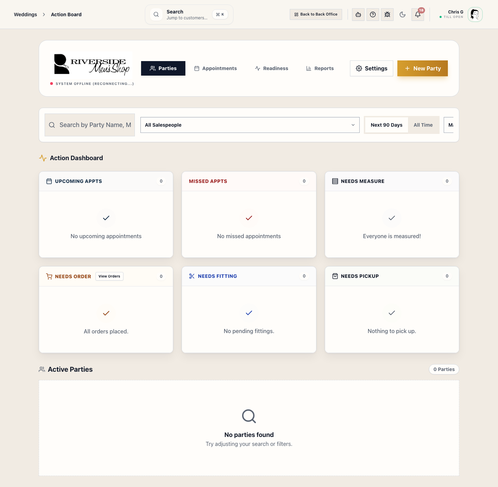

# Operations Home (Action Board)

Operations is the central triage area for Riverside OS. Use it to quickly identify what changed today and what needs your immediate attention.

## What this is

The **Action Board** is designed for store managers and leads to oversee the live state of the store. It aggregates data from Weddings, Alterations, Sales, and the Pickup Queue into a single, high-level summary.

## When to use it

- At the start of a shift to review the day's goals.
- To check the "health" of active wedding parties.
- To see which garments are overdue in Alterations.
- To triage customer messages in the Podium Inbox.

## Key Sections

### 1. What Changed Today
This section provides a plain-language summary of store activity, including:
- **Booked Sales**: Total value of new transactions rung today.
- **Pickups**: Number of garments/orders fulfilled.
- **Wedding Activity**: New parties booked or registered.
- **Appointments**: Count of scheduled fittings and consultations.

### 2. Wedding Health Heatmap
A visual representation of all active wedding parties. Red or Amber indicators signal that a party has missing measurements, overdue payments, or unfulfilled garments close to the event date.

### 3. What Needs Attention
A prioritized list of "Blocked" or "Stalled" workflows. This includes orders missing vendor confirmations, failed payment syncs, or overdue tasks.

### 4. Alterations Snapshot
A high-level view of the tailoring queue. Tap the card to jump into the full **Alterations Hub** for detailed management.

## How to use it

1. Open **Operations** from the sidebar.
2. Review the **Action Board** for any red alerts or overdue items.
3. Use the **Sub-sections** for deeper triage:
   - **Daily Sales**: Review register totals and individual transaction logs.
   - **Pickup Queue**: Follow up on orders that are ready for the customer.
   - **Podium Inbox**: Respond to customer SMS and email threads.

## What to watch for

- **Data Basis**: Operations data is typically shown on a **Booked** basis (when the action occurred), which may differ from the **Recognition** basis used in final financial reports.
- **Action Required**: If a wedding party is "Red" on the heatmap, click the party name to open the **Wedding Relationship Hub** and resolve the issue.

## Related workflows

- [Alterations Workspace](manual:alterations-workspace)
- [Wedding Relationship Hub](manual:customers-customer-relationship-hub-drawer)
- [Pickup Queue](manual:operations-fulfillment-command-center)
