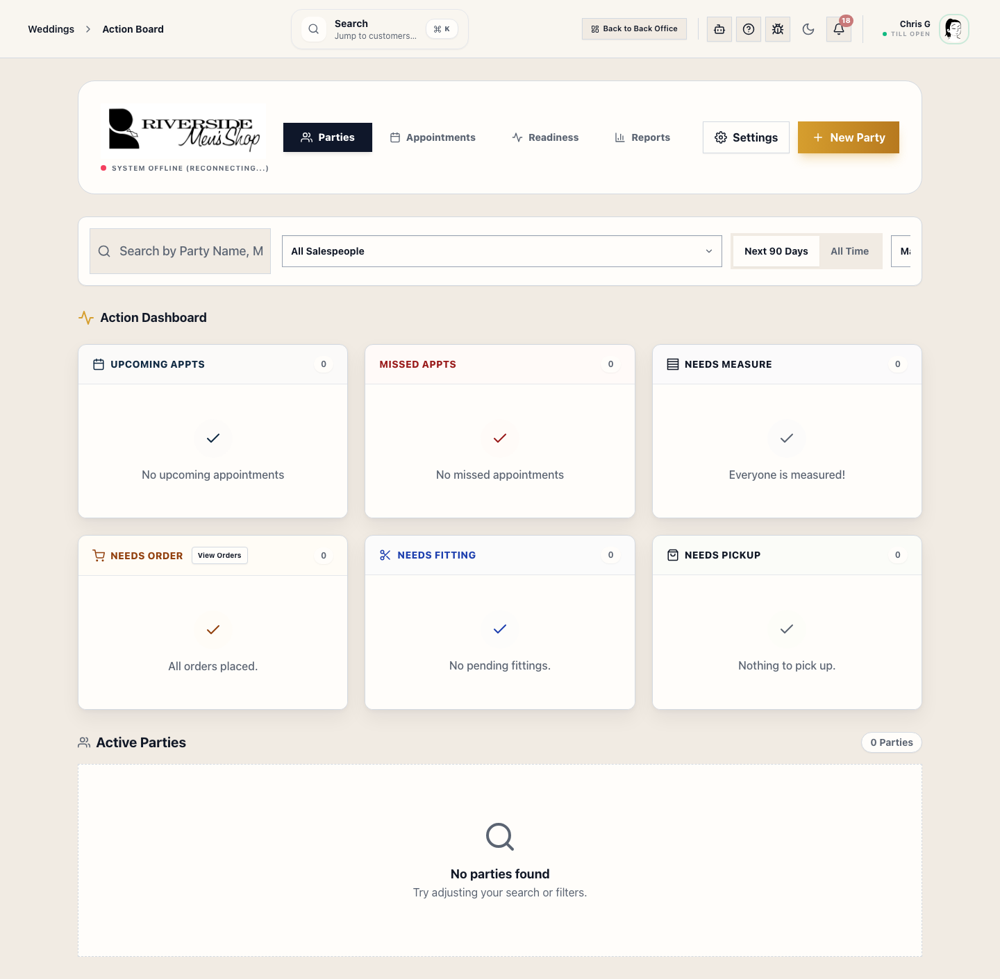
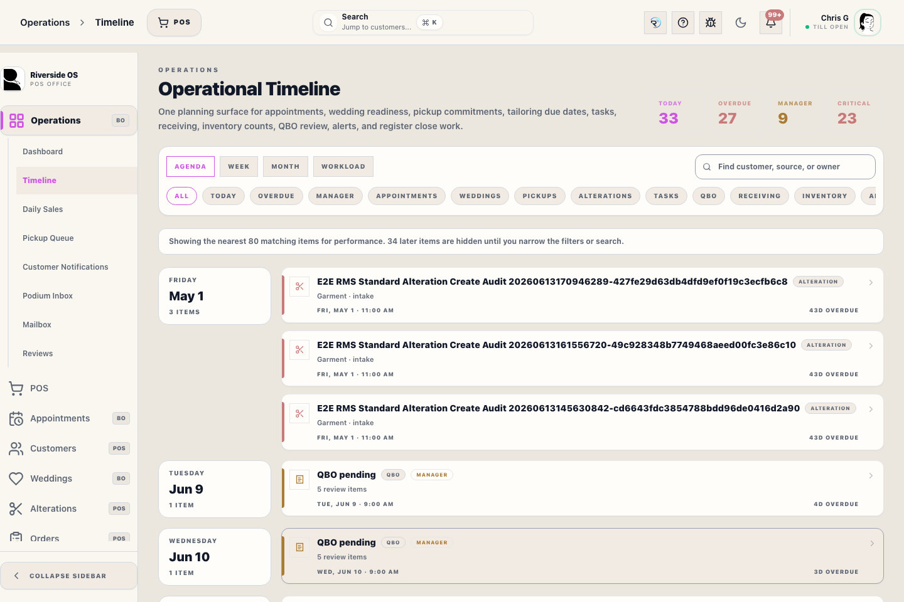
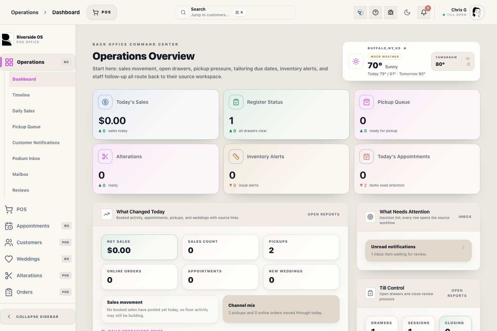

# Operations Home

## Screenshots

## What this is

Operations Home is the staff command center for the day. It keeps deterministic operational facts first: what changed, what needs attention, whether registers are open, till control state, and where staff should go next.

## How to use it

1. Review the top KPI strip for sales, register status, pickup, alterations, inventory, and attention pressure.
2. Review **What Changed Today** for movement since the last shift.
3. Review **What Needs Attention** for blockers and warnings.
4. Follow the card or row into the owning workflow before taking action.
5. Use Daily Operational Briefing only after the deterministic cards are understood.

The full operational view opens by default for Back Office staff. Use **Hide operational detail** only when you intentionally want a shorter Action Board view; this is a display preference, not a replacement for the management dashboard.

## Operational Timeline

Open **Operations → Timeline** when the manager needs the planning view instead of the summary dashboard. Timeline combines existing source workflows into one visual surface: appointments, wedding readiness, pickup commitments, alteration due dates, tasks, receiving commitments, physical inventory sessions, QBO review, register close work, and open alerts.

Use **Agenda** for what is next, **Week** for staffing and workload planning, **Month** for deadline pressure, and **Workload** for where pressure is coming from. Filters isolate Today, Overdue, Manager, Appointments, Weddings, Pickups, Alterations, Tasks, QBO, Receiving, Inventory, and Alerts.

Timeline rows are not editable. Open the row and make changes in the source workflow so the scheduler, Wedding Manager, Pickup Queue, Alterations, Tasks, QBO, Inventory, and Notifications remain the source of truth.

## Customer Notifications

Open **Operations → Customer Notifications** to review automated customer messages. This includes ready-for-pickup, alteration-ready, appointment confirmation, appointment reminder, receipt, unknown-sender welcome, and review-invite messages.

Use this center for automated-message delivery and staff review only. It does not show regular staff-written Podium texts or regular staff-written emails, and it does not mark an order picked up, mark an alteration picked up, collect payment, or change customer communication preferences.

Use the search field to find a customer, message type, status, or delivery error. Use the status chips and **Reviewed archive** filter below search to separate active rows from reviewed history.

## Operations Mailbox

Open **Operations → Mailbox** or **POS → Mailbox** for store email at `info@riversidemens.com`. Use the folder list for **Inbox**, **Important**, **Follow-up**, **Sent**, **Archived**, **Trash**, and **All mail**; search or **Unmatched only** narrows the conversation list.

Opening inbound mail marks its conversation read. Use **Mark unread** when follow-up still belongs to another staff member. Select multiple conversation checkboxes for group **Read**, **Unread**, **Archive**, or **Delete**. Archive keeps handled mail under Archived. Delete moves email to recoverable Trash; **Restore** returns Archived or Trash conversations to Inbox.

The selected conversation keeps **Reply**, **Forward**, **Important**, **Follow-up**, **Archive**, folder movement, and matched-customer access together. **New email** opens the composer only when needed. Choose **Sync** to pull recent IONOS mail.

Formatted email appears inside a contained viewer. Use **View plain text** when needed. Riverside blocks email scripts, forms, embedded frames, and unsafe URLs; links open separately.

The Mailbox sidebar badge is the current unread inbound-email count and refreshes immediately after read/unread actions. The Main Hub checks IONOS for new mail every five minutes by default. New synced mail enters Notification Center and produces an informational popup while Riverside is open; old mail does not replay as a popup when staff first signs in.

## Review Request Outbox

Open **Operations → Reviews → Outbox** to see review requests waiting for their scheduled send time. Staff with **reviews.manage** can choose **Cancel Invite** before delivery and must enter a specific reason of at least 12 characters. Riverside records the staff member and reason on the Transaction Record.

Cancellation is available only while the status is **Waiting to send**. Once the worker changes it to **Sending**, the request may already be reaching Podium and cannot be cancelled from Riverside. Refresh the Outbox if the status changed, and use **Failed → Retry** only after correcting the displayed delivery problem.

Managers with **reviews.manage** can use **Send Test** to send one immediate real SMS to an authorized test number. Riverside uses the saved Customer Reviews wording and the configured Podium delivery path, records the acting staff member and masked destination, and does not create a fake customer or Transaction.

## What to check first

Start with the KPI strip, then **What Changed Today** and **What Needs Attention**. These cards show current operational signals such as movement, register status, till control, blockers, warnings, weddings, alterations, pickups, and inventory work.

Successful **no issues** states are different from failed feeds. If a feed cannot load, Operations Home shows a quiet degraded indicator instead of looking calm or empty.

## Daily Operational Briefing

Daily Operational Briefing is optional. It appears below deterministic operational content and should explain the facts already on the screen.

The **✨ Daily operations brief** summarizes the visible store facts for the day: appointments, weddings, fulfillment pressure, register close state, alterations, tasks, and active notifications. It is an explanation layer only; staff still opens the source workflow before making customer promises, inventory decisions, accounting decisions, or register-close decisions.

If ROSIE is slow or unavailable, the briefing request shows an unavailable state. Staff should keep using the deterministic cards and workflow links, and support should treat ROSIE as a Host stack issue.

## Degraded feeds

A degraded indicator means that one part of the dashboard could not refresh. Use the visible cards that did load, then retry or report the degraded feed if it affects the shift.

Do not assume the store has no blockers just because a degraded feed is quiet.

## Operational detail

Operations Home is the Back Office daily command surface. Its store-wide management context is distinct from the POS dashboard used by register staff, even when both views use the same authoritative store facts. Use it to decide what needs attention first, then open the underlying workspace for the actual action. Treat cards and queues as summaries: if a count or row looks surprising, drill into the source record before making a customer promise, register close, inventory, or manager decision.

## What to watch for

- Use blockers before warnings.
- Follow the card action links instead of searching manually when a next action is shown.
- In Mailbox, **Delete** means a recoverable move to Trash, not permanent removal.
- If Mailbox reports a sync or refresh failure, do not treat the visible list as current.
- In Review Requests, cancel only a request still in **Outbox**; **Sending**, **Sent**, and **Delivered** cannot be recalled.
- In **Reviews**, published Podium reviews appear above request activity. Open the provider link for the full review; prioritize rows marked **Needs response**. A review without a Riverside match remains visible instead of being guessed onto a customer.
- Treat ROSIE as an explanation layer, not the source of sign-off.

## Related workflows

- [Inventory Control Board](manual:inventory-control-board)
- [Customer Relationship Hub](manual:customers-customer-relationship-hub-drawer)
