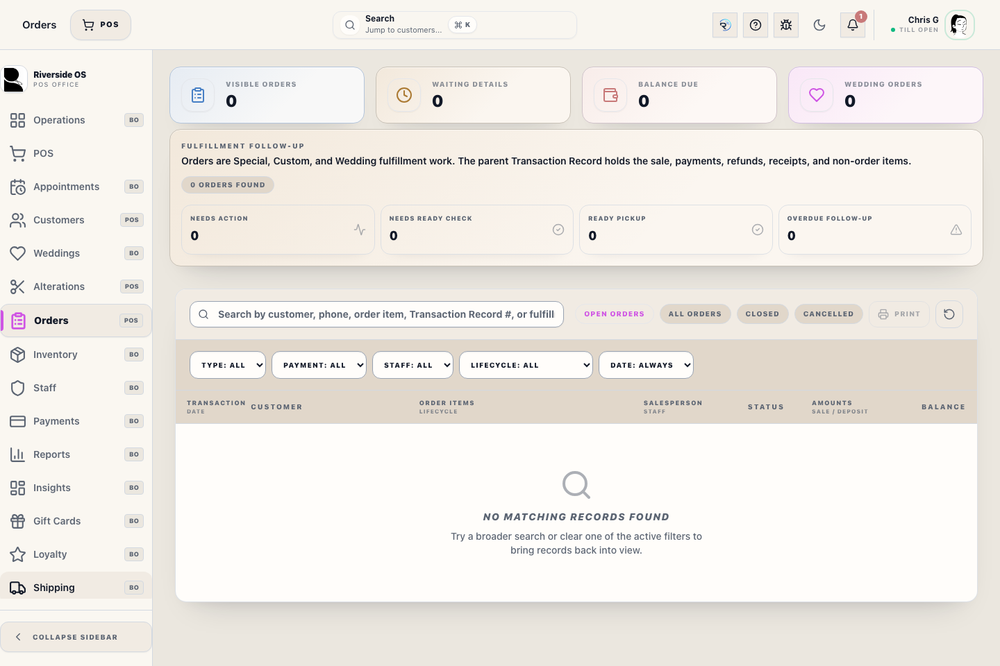
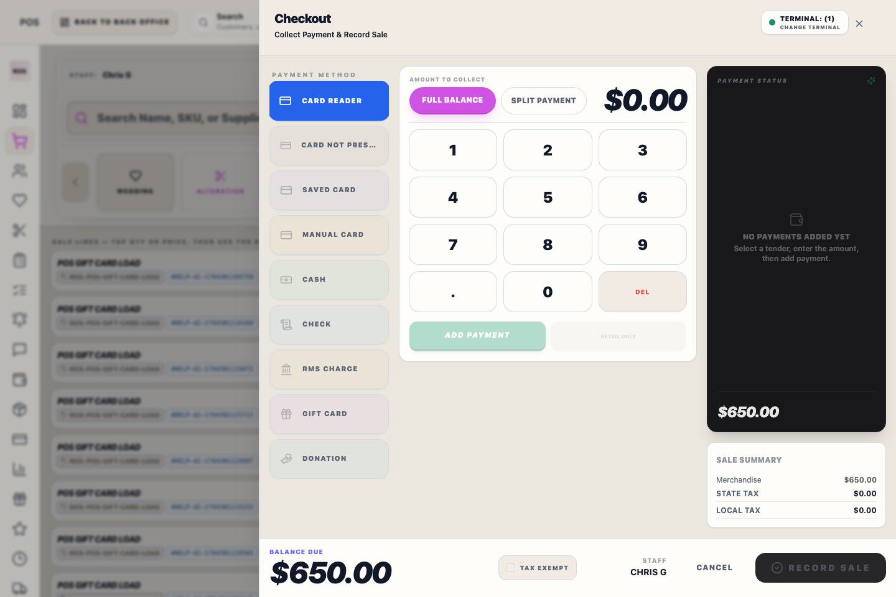

# Orders Workspace

## Screenshots

The Orders workspace is the main place to review Special, Custom, and Wedding order work. Back Office **Orders** opens to **All Orders**, so fulfilled and closed order records remain searchable after pickup. Use **Open Orders** for current fulfillment work and **Transaction Records** for the complete sale history, including takeaways, gift cards, alterations, payments, refunds, and receipts.

## What staff can do here

- Review **Open Orders** or switch to **Transaction Records** for complete sale history.
- Filter order work by **Special Order**, **Custom**, or **Wedding**.
- Open order work to see items, balances, and available actions.
- Open an order to see order progress, pickup readiness, balances, and release-blocking cues at a glance.
- Edit an open order item directly in the drawer when staff need to adjust quantity, price, or pickup type, or perform a Suit Component Swap when changing parts of a suit to a different product variation/SKU (recording inventory updates and QBO ledger cost/retail deltas automatically).
- Remove a saved order item only while the Transaction Record is open, unpaid, unfulfilled, and has no vendor, purchase-order, or receiving activity. Riverside also permits removal when a stale lifecycle label says Ready for Pickup but the line has no actual fulfillment activity. Use return, refund, exchange, cancellation, or void workflows after payment, pickup, vendor processing, or completed-sale activity starts.
- Use **Edit Custom Order** on custom items to review or update the saved HSM or Individualized Shirts form details from the same field set used during POS custom-order booking.
- Use **Return / Exchange** on a Transaction Record item to send that exact line to Register, where the return/exchange wizard opens with the customer and item already selected.
- Use **Mark Ready + Notify** in Order Detail only to mark an item operationally ready. Customer pickup completion must be finished from Register with **Open in Register** so recognition, inventory, and register audit stay together.
- After Register checkout activity, reopen the parent Transaction Record or return to Orders to see the latest authoritative data instead of a stale snapshot.
- For a card refund already completed in a prior processor or another external card system, choose **External card refund already completed (record only)**. Enter the external refund reference, card last four, and reason, then complete Manager Access. Riverside records the server-issued approval reference with the negative external-card tender and never stores the Access PIN in the refund ledger.
- Use the `Order Integrity` summary at the top of the workspace to quickly see which shown orders are still waiting on booking details, still carrying balance due, or already showing action-needed / overdue follow-up counts from the existing pipeline stats feed.
- Use the search bar and filter chips above the list to narrow the table before opening a row. The desktop table separates the secondary header labels, such as date, lifecycle, cashier, and deposit, so staff can scan the main work first.
- Results load in numbered pages. Use **Previous** and **Next** to review every match; the range below the list shows exactly which matching orders are currently loaded.

## Order Progress

1. **Booking**: Special, Custom, and Wedding order items are typically booked at the Register and appear here immediately.
2. **Tracking**: Use the order kind filter to separate standard Special Orders from Custom and Wedding work.
3. **Payment and Pickup**: Staff can review deposit activity, amount paid, and balance due from the linked Transaction Record. A POS handoff is for review or rebuilding items in a new sale, not for silently changing the original Transaction Record.
4. **Completion**: The lifecycle ends when the order is fulfilled or otherwise closed.

## Tips

- **Special Order** means an out-of-stock catalog item ordered for the customer.
- **Custom** means a made-to-measure garment order.
- **Wedding** means the order is tied to a wedding member or party workflow.
- For Custom orders, sale price is entered at booking and actual vendor cost is entered when the garment is received.
- Order detail shows the main Custom booking references, such as fabric, style, model, size anchors, sleeve or cuff measurements, and vendor reference notes. Use **Edit Custom Order** when those saved details need correction.
- Wedding order detail should show the linked party, member role, and event date so staff know to keep balances and pickup work in the wedding workflow.
- A paid wedding balance does not automatically mean the order is ready. Confirm the linked member is actually ready for pickup before release.
- The **Order Progress** panel in Order Detail is the quickest way to tell whether items still need details, are ready to order, have been ordered, were received, are ready for pickup, or were picked up.
- In the list view, read each column from left to right: Transaction, Customer, Order Items, Salesperson, Status, Amounts, and Balance. Use **Register** from the row when the work needs register review.

Check the order type before making changes so the right team follows up on it.

## Related workflows

- [Register Checkout](manual:pos-nexo-checkout-drawer)
- [Customer Relationship Hub](manual:customers-customer-relationship-hub-drawer)
