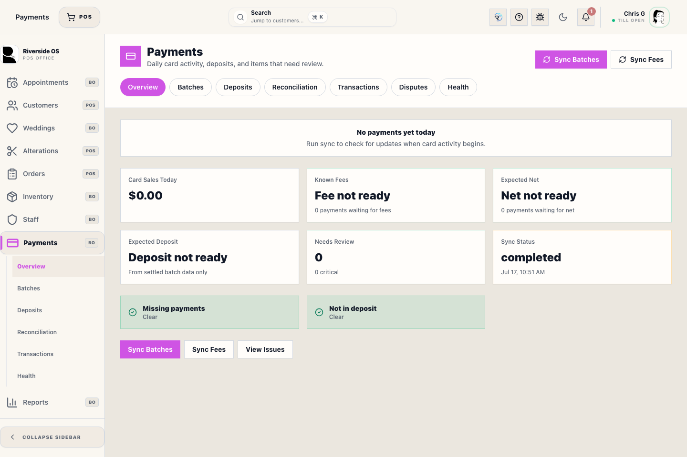
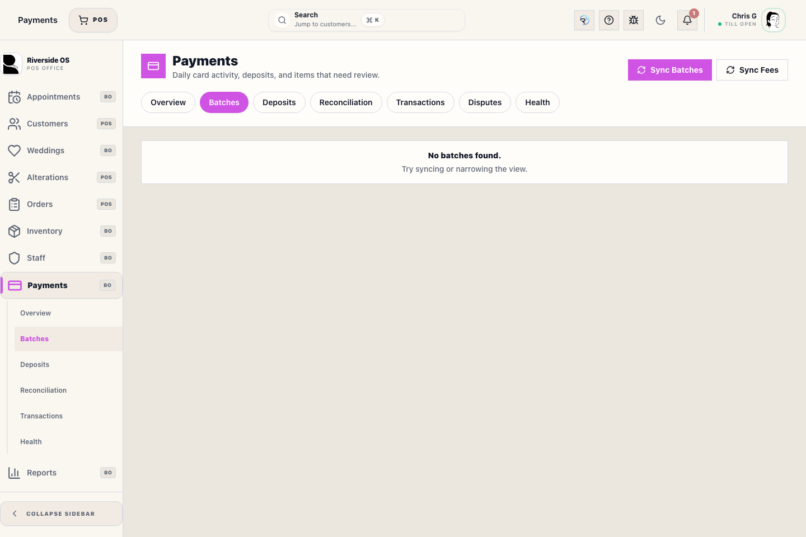
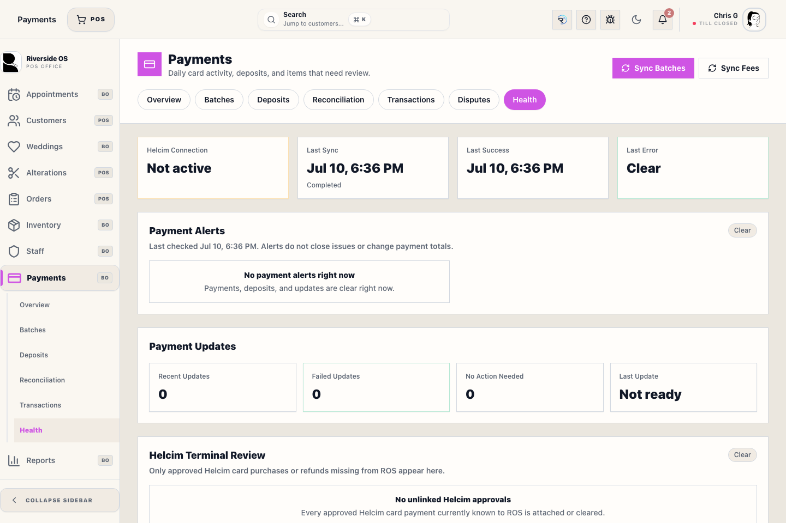

# Payments Operations

## Screenshots

## What this is

Payments Operations is the Back Office workspace for reviewing Riverside card activity against Helcim processor facts. It covers today's activity, processor batches, actual deposits, reconciliation exceptions, transaction lookup, webhook/provider attachment, and integration health.

When a POS customer is selected, Riverside now creates or reuses that customer's Helcim profile before starting a terminal purchase and sends the Helcim customer code with the payment. This is what allows Helcim's Contact Name/Cardholder Name columns to be populated consistently; older guest payments cannot be renamed retroactively by Riverside.

Use the Register checkout drawer to collect payment. Use Payments Operations to review what happened and resolve evidence safely.

## Before you start

- Viewing requires payment access; syncing, linking, resolving, or accepting differences requires the matching elevated permission.
- Never enter a full card number, CVV, provider token, or private credential in Riverside notes.
- Missing fee or net information means **not ready**, not `$0.00`.
- If the terminal and Riverside disagree, do not run the card again until the first attempt is checked.

## Review today's status

1. Open **Payments → Overview**.
2. Review card sales, known fees, expected net, expected deposits, open review items, and last sync status.
3. Treat warning and critical issues as evidence to investigate, not automatic permission to edit a Transaction Record.
4. Open the related tab for details.
5. Record a review note when the issue requires follow-up across shifts.

## Review batches and deposits

1. Open **Batches**, set **From** and **To** for any day, multi-day period, month, or longer range, and search by processor batch number or status. Select **Apply**.
2. Confirm the processor batch number, status, close time, transaction count, and available totals. Use the approved sync action when current processor data is needed.
3. Open **Deposits**, set the needed period, and search by source, QBO deposit, or bank reference before comparing expected batches with actual deposits.
4. Use **Clear** to return a list to all dates with no search.
5. Link only records that clearly represent the same processor settlement.
6. Escalate unexplained amount, fee, net, or timing differences.

Creating a manual deposit or accepting a variance is an audited manager/bookkeeper action. It does not rewrite the original card payment.

## Resolve reconciliation issues

1. Open **Reconciliation**.
2. Read the issue type, Riverside payment, Helcim reference, amount, status, and history.
3. Use **Reviewed** when investigation is ongoing.
4. Use **Link Payment** only after provider, amount, and ownership match.
5. Use **Resolved** or **Mark Expected** only with the required explanation and evidence.
6. Reopen an issue if later evidence shows the resolution was incorrect.

## Check a transaction or health problem

1. Open **Transactions**, set the needed date range, and search by customer, `TXN-` number, provider transaction, batch, or payment method. Select **Apply** to search the complete period.
2. Follow the Transaction number to the financial record when one is linked.
3. An approved **Card Not Present** payment that lost its checkout attachment appears as **Unlinked** / **Missing ROS TXN**. Do not charge the card again; finish the retained checkout or use the audited recovery workflow in **Health → Helcim Terminal Review**.
4. Open **Health** for terminal, webhook, sync, provider-reference, and failed-update evidence.
5. Replay only the stored failed update after its configuration or data problem is corrected.
6. Confirm the replay attached existing provider evidence rather than creating a second charge.

## Recover an approved card sale from a retained cart

Use this only when **Health → Helcim Terminal Review** shows an approved charge and an **Exact retained cart found** card.

1. Confirm the customer, parked-sale label, amount, Register number, provider transaction, and approval time all describe the same sale.
2. Select **Recover Paid Sale**. This action requires payment-resolution access and Manager Access.
3. Enter a specific recovery note explaining why Helcim approved the card but the ROS checkout did not finish.
4. Type **RECOVER PAID SALE** in the second confirmation.
5. Wait for the recovered Transaction number. Do not run the card again.
6. Open the recovered Transaction and confirm its lines, customer, payment, balance, order status, and Helcim reference.

ROS refuses recovery when the retained cart is missing or ambiguous, the cart total differs from the approval, the register sessions differ, the provider transaction is already linked, or the cart needs a specialized Wedding or Alterations workflow. A successful recovery creates the sale through normal checkout logic and records the manager, original operator, original approval time, parked cart, payment allocation, and Helcim match in one audited database transaction.

## Card Not Present checkout handoff

1. Select **Helcim Card Not Present** in the open Register checkout. This opens Helcim's secure hosted card-entry page; it does not use the physical terminal.
2. Keep the checkout open while the card is entered. The hosted page returns the approval and provider transaction to the same checkout using its signed response.
3. Review the approval details in the Riverside handoff screen and select **Add Payment to Sale**. This posts the approved amount to the checkout ledger and enables **Record Sale**.
4. If the handoff is interrupted, use **Recover Payment** or **Check Status** from the same checkout. These actions reuse the existing Helcim approval and are safe to repeat; they do not create a second charge.
5. If the payment was approved but cannot be attached, stop retrying the card and use **Health → Helcim Terminal Review** to recover it to the exact retained checkout or target Transaction Record.

The Card Not Present flow must never be routed to a physical terminal. A successful approval is not complete in Riverside until the payment appears in the checkout ledger and the resulting Transaction Record shows the Helcim provider reference.

## Recover an approved card payment onto an existing order

Use this only when the customer has an open Transaction Record, Helcim approved the payment, and no retained-cart match exists.

1. Compare the terminal receipt, customer, amount, approval time, and provider transaction in **Health → Helcim Terminal Review**.
2. Select **Recover Order Payment** on the exact approved terminal attempt.
3. Enter the open target Transaction Record, such as `TXN-624363`.
4. Enter a specific recovery note explaining why the approved payment was not recorded.
5. Type **RECOVER ORDER PAYMENT** to authorize the financial recovery.
6. Reopen the customer and target Transaction Record. Confirm the payment, remaining balance, customer history, and Helcim match.

ROS refuses recovery when the target is missing, closed, belongs to no customer, has no order lines, has no balance, cannot accept the full approved amount, or the Helcim processor transaction is missing, mismatched, or already linked. The action uses the existing approval and never charges the card again.

## What to watch for

- Webhook received, checkout attached, and provider reference saved are different states.
- A normal decline or cancellation is not an approved payment.
- Never retry blindly after a terminal approval that Riverside has not attached.
- Approved provider payments cannot be removed, parked, or cleared from the active sale. Record the sale or use the audited recovery/refund workflow.
- Never use paid-sale recovery to force a near match. The exact retained-cart banner must be present.
- Standalone processor refunds verify the Helcim batch before sending, retain the original provider transaction on the audit attempt, and cap later ROS attempts to the remaining tracked amount. They do not automatically create a sales return or rewrite merchandise history.
- Do not resolve a reconciliation warning merely to make the dashboard green.

## What happens next

Completed review leaves an auditable history for register close, bookkeeping, QBO clearing, deposit reconciliation, and support follow-up while preserving processor and financial source records.

## Related workflows

- [Checkout & Payment](manual:pos-nexo-checkout-drawer)
- [Closing the Register](manual:pos-close-register-modal)
- [QBO Workspace](manual:qbo-workspace)
- [Helcim Settings](manual:settings-helcim-settings-panel)
