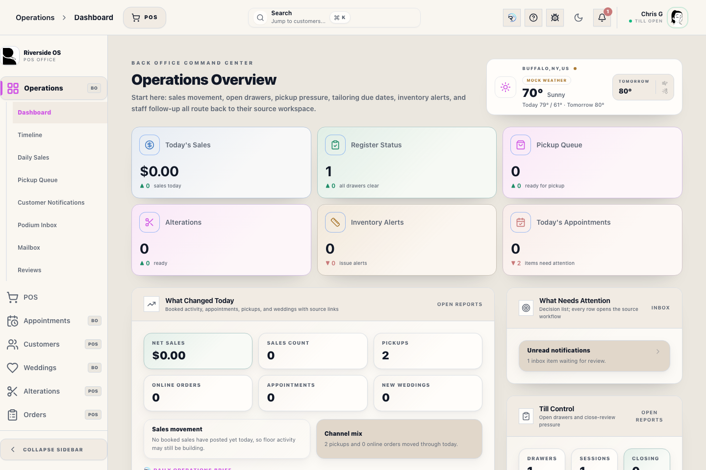
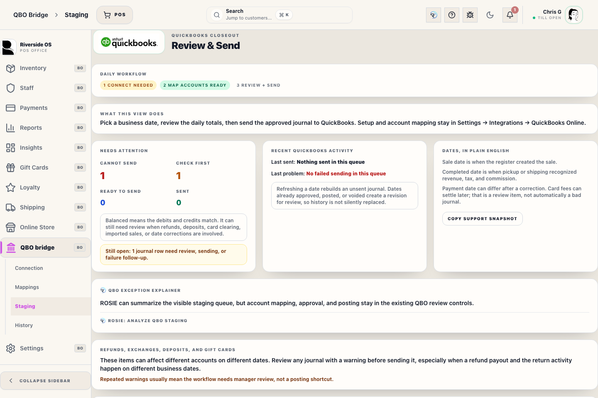
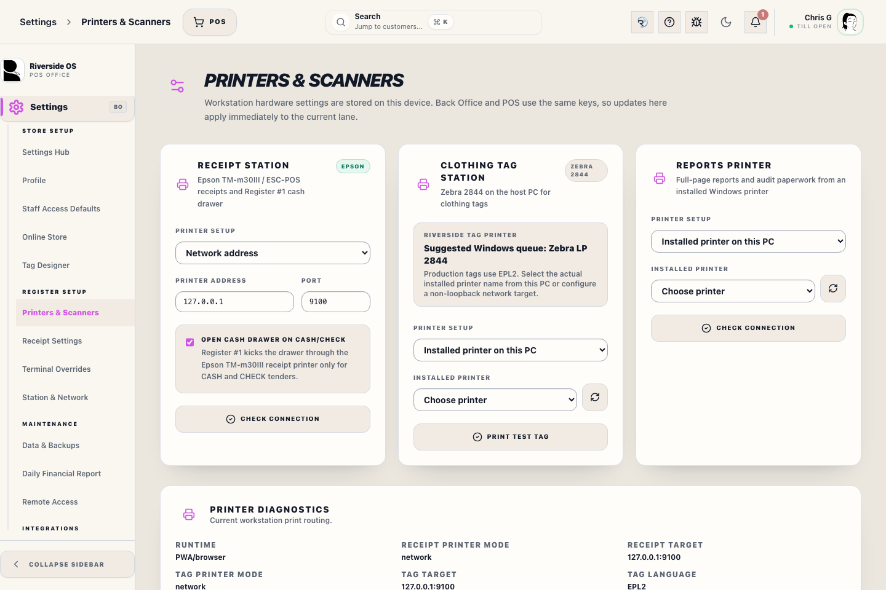

# Pilot Recovery and Governance

## Screenshots

## What this is

Use this guide when a pilot workflow is blocked, interrupted, or needs manager review. It is a searchable bridge to the current release procedures for Register, QBO, RMS Charge, inventory, receiving, Help Center, and ROSIE.

The rule is simple: keep the current screen facts visible, do not retry financial or inventory actions blindly, and escalate before creating duplicate records.

## How to use it

1. Identify the workflow that is blocked: Register, close register, checkout recovery, QBO, RMS Charge, receiving, physical inventory, customer merge, printer, or offline recovery.
2. Read the matching row below before retrying.
3. Capture the exact toast, screen state, and transaction or customer identifier when escalation is needed.
4. Ask a manager to decide whether to retry, pause, use a recovery path, or log a pilot issue.
5. After recovery, confirm the visible record, report, or reconciliation view shows the expected current state.

## Common recovery paths

| Staff query | Start here | What to do next |
|-------------|------------|-----------------|
| **blocked checkout**, **checkout recovery**, or **split tender** | [Register Checkout](manual:pos-nexo-checkout-drawer) | Verify balance due, tender state, transaction evidence, and any manager prompt before retrying Complete Sale. Do not blindly re-enter a sale after an unknown server result. |
| **refund**, **exchange**, or **gift card refund** | [POS Register](manual:pos) | Use the guided return/exchange flow. Do not hand-enter a balancing adjustment unless a manager directs it. |
| **close register**, **Z-Report**, or drawer mismatch | [Closing the Register](manual:pos-close-register-modal) | Count cash again, compare terminal and gift card evidence, then escalate discrepancies before final close. |
| **QBO failed** or journal mismatch | [QBO Workspace](manual:qbo-workspace) | Do not sync unbalanced proposals. Review drilldown evidence and ask accounting/manager review before retrying. |
| **RMS payment**, **RMS charge**, or stale R2S account | [RMS Charge Customer Linkage](manual:customers-rms-charge-admin-section) | Confirm whether the activity is a charge, payment collection, exception, or account-link problem before retrying. |
| **receiving interrupted** | [Receive Stock](manual:inventory-receiving-bay) | Confirm whether stock posted before re-entering quantities. Retry only after the receiving state is clear. |
| **inventory adjustment** or physical count variance | [Physical Inventory](manual:inventory-physical-inventory-workspace) | Treat large not-counted groups as a scope issue first. Publish only after variance review is complete. |
| **wedding pickup**, **paid pickup incomplete**, or fulfillment question | [Orders Workspace](manual:orders-workspace) | Confirm transaction, balance, line readiness, and fulfillment status before marking pickup complete. If payment posted first, finish pickup from the source order before closing. |
| **alteration ready** | [Alterations Workspace](manual:alterations-workspace) | Confirm the garment, customer, promise date, and ready/picked-up status before changing queue state. |
| **printer issue** or **reprint receipt** | [Receipt Summary](manual:pos-receipt-summary-modal) | Reprint only after checking the selected receipt/report printer and the transaction result. |
| **customer merge** | [Customers Workspace](manual:customers-workspace) | Check duplicate review and customer hub facts before combining records. |
| **offline recovery** | [Lockout and recovery](manual:lockout) | Follow store outage procedure and manager escalation before switching workflows. |

## Pilot governance

During the RC/pilot release, staff should favor traceable recovery over speed when a workflow affects money, inventory, customer identity, QBO, RMS Charge, or register close.

Use these governance rules:

- Record what happened before trying a second time.
- Keep the transaction, customer, SKU, register, or proposal identifier with the issue.
- Use manager approval for refunds, exchanges, old returns, register discrepancies, QBO mismatches, RMS exceptions, and uncertain inventory corrections.
- Log pilot issues with the exact screen, action, expected result, actual result, and screenshot when possible.
- Do not use ROSIE as approval authority. ROSIE can explain manuals and visible facts; managers own operational decisions.

## What to watch for

- A true no-result search is different from a lookup outage or stale index warning.
- A failed final post, payment, pickup, refund, or QBO sync may already have partial evidence. Check the source record before retrying.
- Back Office reports, QBO, and register close may use different date semantics. Use the manual for the workflow you are reconciling.
- If a screenshot, manual, or ROSIE answer conflicts with the visible current workflow, follow the current workflow and log the documentation gap.

## What happens next

The manager or pilot lead should decide one of four outcomes:

1. Retry the same action after confirming no duplicate effect occurred.
2. Pause the workflow and finish it later from the source record.
3. Use the documented recovery or reconciliation path.
4. Log a pilot issue and escalate to support/accounting before proceeding.

## Related workflows

- [Help Center Drawer](manual:help-center-drawer)
- [ROSIE Settings](manual:settings-rosie-settings-panel)
- [Register Dashboard](manual:pos-register-dashboard)
- [QBO Workspace](manual:qbo-workspace)
- [Receive Stock](manual:inventory-receiving-bay)
