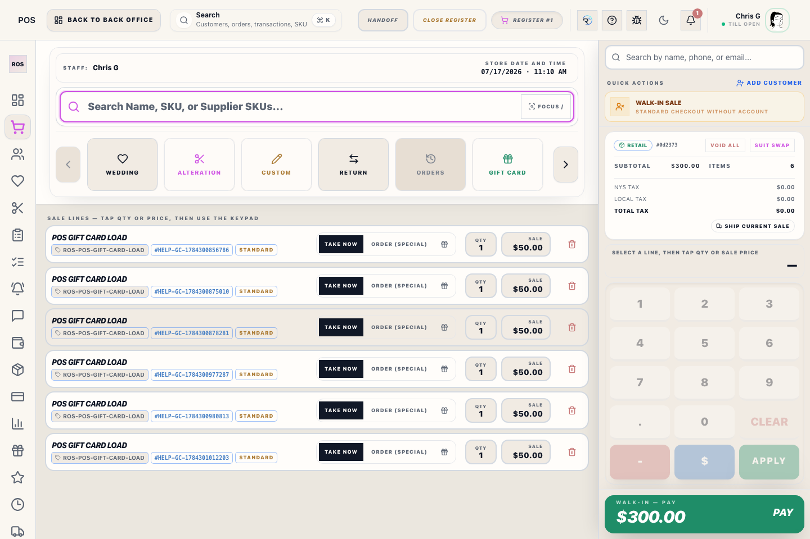
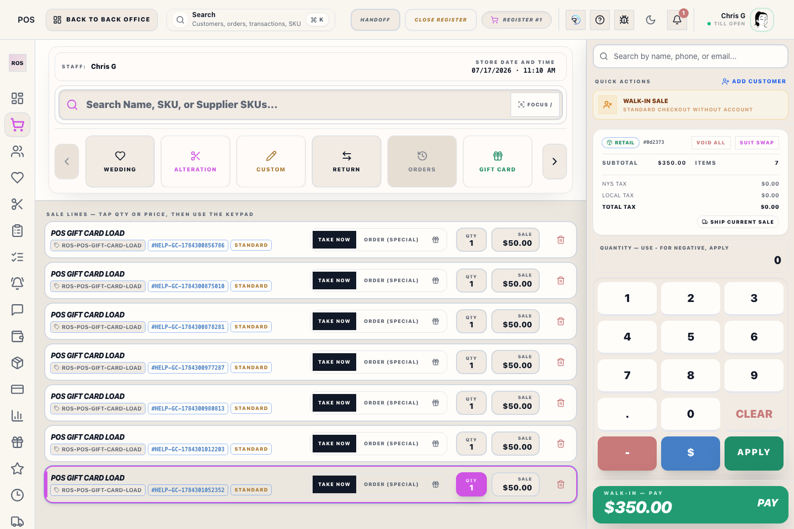
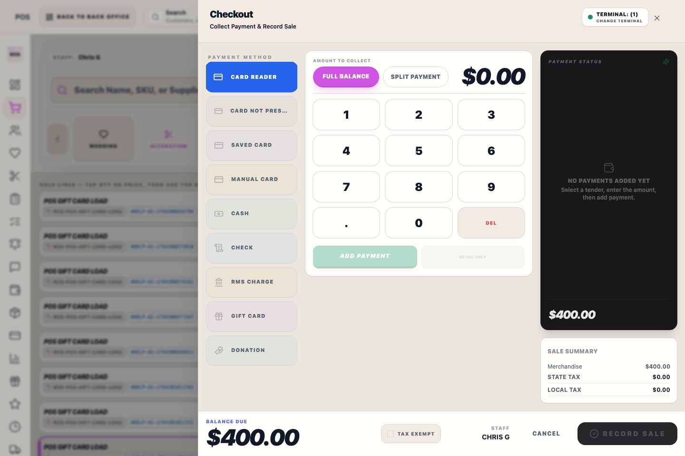

# Z-Reconciliation & Closing

## Screenshots

The **Close Register** workspace is the final step of a shift. It reconciles expected totals against actual physical counts.

## What this is

Use this workflow to close the live till group, reconcile tender totals, and produce the final Z-audit output for the shift.

## Till Group Closing
Riverside OS uses a **lane-aggregated model**. Opening **Register #1 (Main)** automatically opens satellite lanes (iPad and Back Office). 
- To close the entire group, you **MUST** use the **Close Register** action on **Register #1**.
- Closing Register #1 reconciles all satellite lanes for one store-local business date. If activity exists on more than one unclosed date, ROS closes the oldest date first and requires each later date to be closed separately. The final date closes the till group.

## The Reconciliation Flow
1. **Cash**: Count bills and coins by denomination, or enter one drawer total.
2. **Checks**: Confirm every check number and amount.
3. **Z-Report**: Review totals, confirm the Daily Cash Deposit date and amount, add required notes, then tap **Close & Print Z-Report**.

The Z-Report page shows the exact **business date** being closed. Closing on the following morning does not rename the report. When multiple dates are waiting, repeat the flow in the order shown; ROS never combines two days. If no separate drawer count was captured for a missed historical day, the report says so instead of inventing an over/short amount.

Cash refunds processed before close are recorded as negative cash activity and reduce **Cash Sales (Gross)**, **Expected Cash**, and the amount available for deposit. If the physical count differs after a refund, the Z-Report must show the resulting over/short instead of remaining balanced.

If a card terminal outcome blocks close, use **Review** in the closing workflow or **POS → Payments** to record the outcome before continuing.

If **Checkout recovery** appears, do not close the register yet. This means Riverside OS has a checkout that needs manager review, such as an offline sale waiting to sync, an online checkout where the server result was not confirmed, or a payment that posted before pickup could be completed. Confirm the transaction, pickup, or recovery item before retrying or closing.

## ✨ Register close explainer

The Z-Report step includes a ROSIE explainer for visible close facts: expected cash, actual counted cash, Daily Cash Deposit, cash over/short, card review blockers, check review, and checkout recovery blockers.

ROSIE does not close the register, change tender totals, change counted cash, approve payment outcomes, or remove required notes. Treat the explainer as a plain-English review aid before the normal close controls.

## Professional Z-Report
Upon closing, a professional, full-page **Z-Audit Report** is generated. 
- **Audit Grade**: Produces high-fidelity Letter/A4 documents for accounting review.
- **Reporting Station**: The header confirms the assigned printer name for accountability.
- **Per-Transaction Subtotal Before Tax**: The audit list separates merchandise subtotal before tax from payment totals. Shipping and alteration-service charges are shown separately from merchandise subtotal, while gift-card loads are shown as separate liability activity and are not included in merchandise sales.
- **Line Discounts**: Each transaction line shows the final line price plus the regular price and discount percent applied.
- **Daily Cash Deposit**: Captures the bank deposit date and cash deposit amount for deposit verification and accounting review.
- **QBO Preview**: Shows the journal-entry breakdown staged for QuickBooks review.
- **Inventory Activity**: Lists non-sale inventory moves for the day, including Receiving, RTV, Damaged, Physical Count, and Adjustments.
- **Routing**: In the desktop app, the Z-Report prints through the configured Reports printer instead of the receipt printer or an external browser tab. ROS waits for that print dispatch before leaving close and shows a message if the Reports printer path fails. The report header shows the saved Reports printer name for accountability.

## Recovery and escalation

The final pending business-day close is final for the till group. If cash, card, gift card, pickup completion, checkout recovery, or RMS/R2S totals do not match expected evidence, stop before closing and review the daily sales and terminal reports. A manager should decide whether the variance is explained, needs a note, or should block close until support/accounting reviews it.

## Tips
- **No mid-shift "X"**: Mid-shift counts should use the live Dashboard. The Z-close is a permanent shift-ending action.
- **Hardware Decoupling**: Ensure your **Report Printer** is correctly assigned in **Settings -> Printers & Scanners** to avoid routing Z-reports to the thermal receipt printer.

## Related workflows

- [POS Register Dashboard](manual:pos-register-dashboard)
- [Register Reports](manual:pos-register-reports)
