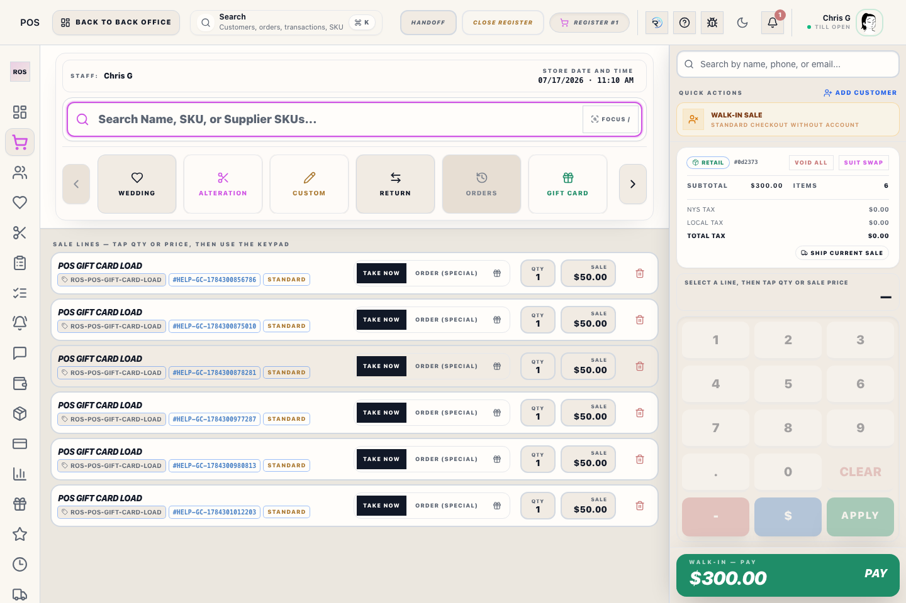
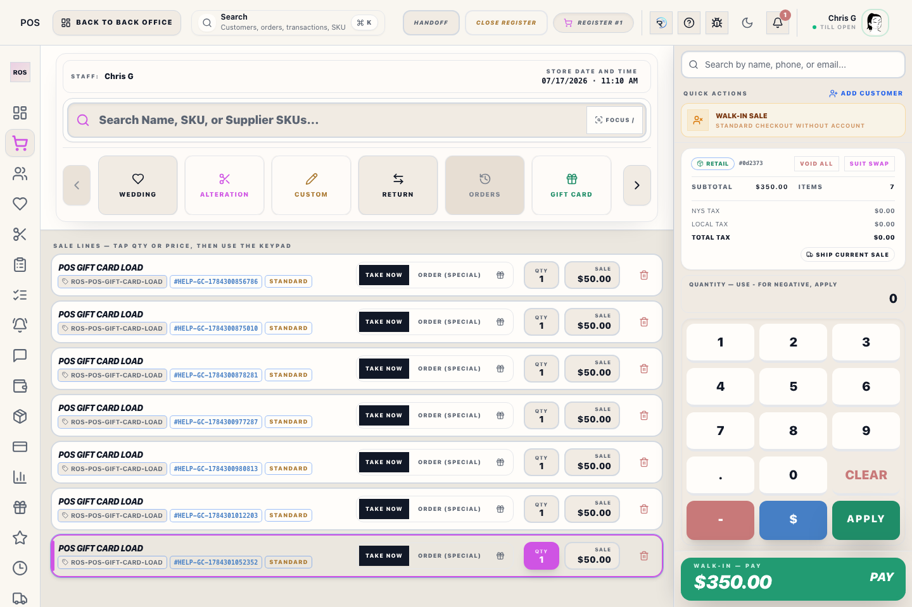
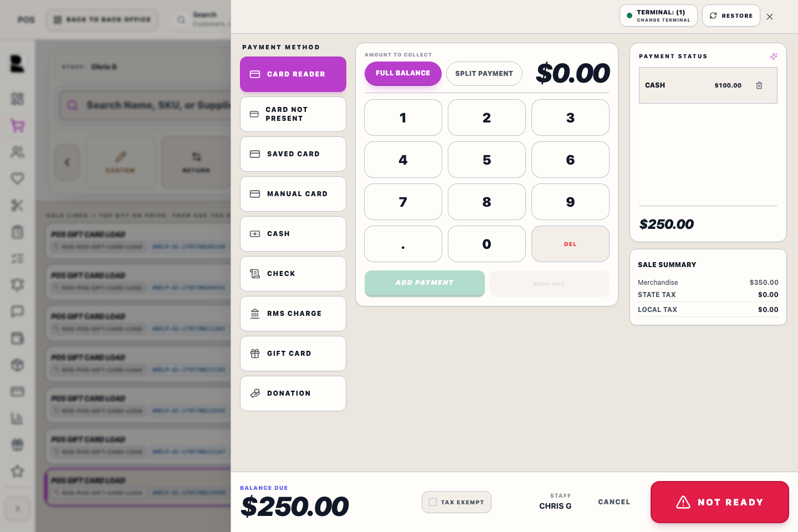

# Z-Reconciliation & Closing

## Screenshots

The **Close Register** workspace is the final step of a shift. It reconciles expected totals against actual physical counts.

## What this is

Use this workflow to close the live till group, reconcile tender totals, and produce the final Z-audit output for the shift.

## Till Group Closing

Riverside OS uses a **lane-aggregated model**. Opening **Register #1 (Main)** automatically opens satellite lanes (iPad and Back Office).

- To close the entire group, you **MUST** use the **Close Register** action on **Register #1**.
- Opening Register #1 fixes the store-local **business date** for that entire open period. Closing Register #1 reconciles all satellite lanes and produces one Z-Report for that open period.
- If yesterday's Register was left open, close it the following morning before opening a new period. Its Z-Report remains dated yesterday. Afterward, opening Register #1 creates today's period, and today's Z-Report contains today's register activity.

## The Reconciliation Flow

1. **Cash**: Count bills and coins by denomination, or enter one drawer total.
2. **Checks**: Confirm every check number and amount.
3. **Z-Report**: Review totals, confirm the Daily Cash Deposit date and amount, add required notes, then tap **Close & Print Z-Report**.

Cash count, check review, the Daily Cash Deposit date, and a note for a cash discrepancy over $5 remain required close inputs. The final Z-Report review is one large, non-scrolling summary of business date, readiness, drawer math, tender totals, deposit inputs, notes, and audit counts. It does not list recovery keys or blocked-record diagnostics. When unresolved operational work remains, **Close & Print Z-Report** opens the dedicated **Close Register With Unresolved Issues** Manager Access approval before closing.

The Z-Report page shows the exact **business date** assigned when Register #1 opened. Closing on the following morning does not rename the report. The report separately records when the open period started, when it closed, and when the report was printed, so a late close remains auditable without changing its business date.

Cash refunds processed before close are recorded as negative cash activity and reduce **Cash Sales (Gross)**, **Expected Cash**, and the amount available for deposit. If the physical count differs after a refund, the Z-Report must show the resulting over/short instead of remaining balanced.

If a card terminal outcome needs review, use **POS → Payments** or the operational recovery workspace to record the outcome when possible. An unresolved card issue remains visible there and is retained with the close audit record; it does not appear in the final Z review, block the authorized close action, or print on the financial Z-Report.

Checkout recovery is durable operational work: an offline sale waiting to sync, an online checkout whose server result was not confirmed, a paid pickup follow-up, an exchange replacement waiting for its return settlement, or a receipt retry. Register #1 still asks every linked workstation to acknowledge its local checkout queue after reconciliation begins, and the Main Hub preserves local, server, and linked-workstation evidence separately. The final Z review omits those diagnostic records without treating a missing acknowledgement as an empty queue.

Use **Attempt Exact Replay** for saved offline or unconfirmed checkout payloads only when the saved payment target is still open. The manager enters an identity, Access PIN, and a reason of at least 12 characters. Riverside replays the original Register session, checkout identity, full sale snapshot, and payment fingerprint. An altered payload, a checkout identity from another session, or an order-payment target that is no longer open is rejected instead of creating a second Transaction Record.

If the paid Transaction Record already exists but its **Unconfirmed checkout** recovery remains open, use **Match Existing Paid Transaction** on that exact item instead of replaying the sale. Enter the completed `TXN-######`, Helcim provider transaction, and a specific Manager reason, then complete Manager Access. Riverside verifies the original checkout, customer, amount, currency, Register session, final provider status, immutable fingerprints, and the complete payment-allocation set—including any existing Transaction payments saved in that checkout—before closing only the recovery record. It creates no sale, charge, refund, payment, or payment movement; any mismatch leaves the item visible for investigation.

For a paid order follow-up, complete every named shipping, pickup, or alteration step in **Orders** or **Alterations** first. Then select **Verify completed follow-up** and complete Manager Access. Riverside checks the recorded Transaction Record, line, shipment, pickup, and alteration evidence before resolving the recovery record. The approval does not perform missing work or treat it as complete.

Use **Complete Exchange Settlement** for a saved exchange replacement whose original return settlement did not finish. This requires Manager Access, a reason of at least 12 characters, and the currently authenticated Register session. Riverside locks the exact Main Hub recovery record, derives all amounts and return details from its saved server snapshot, verifies the replacement checkout identity and the original exchange-credit tender against the origin Register session, then records any new relief or refund movement in the current Register session. It refreshes the reconciliation totals after completion. If a linked provider card refund was intentionally deferred, the operational recovery record keeps its exact remaining amount visible and directs staff to finish it from the original Transaction Record; it does not claim that provider refund completed. A legacy or altered record without complete server provenance remains visible and is rejected instead of moving money.

If recovery work remains after staff review, use **Close & Print Z-Report**, then approve **Close Register With Unresolved Issues** with Manager Access. This approval only authorizes the close: it never replays a checkout, creates a sale, attaches a payment, or dismisses an issue. Riverside retains the exact issues visible immediately before close in the close audit record and operational recovery workspaces without printing them on the financial Z-Report. The immediate and archived Z-Reports use the same Main Hub-frozen tender reconciliation.

Every completed Z-Report includes the **Quick Look** totals. Before committing the close, the Main Hub builds and verifies the complete booked-day summary inside one read-only database snapshot and includes those totals in the immutable close response. If the complete totals cannot be finalized, Riverside leaves the Register open and shows an error instead of printing or archiving a partial Z-Report. A recovered sale posted later remains tied to the original Register session and is recorded as post-close recovery when applicable.

Prior or other till-group recovery remains outside the final Z summary and never affects current close availability. Staff Access with **Register Reports** permission is still required to review it. Saved checkouts remain tied to their original Register session, exchange settlement uses the Manager workflow above, paid follow-up uses evidence verification, and receipt-print records remain in Print Recovery. If the Main Hub, Staff Access, or permission check fails, Riverside never reports an authoritative empty list.

## Professional Z-Report

Upon closing, a professional, full-page **Z-Audit Report** is generated.

- **Audit Grade**: Produces high-fidelity Letter/A4 documents for accounting review.
- **Reporting Station**: The header confirms the assigned printer name for accountability.
- **Open-period audit dates**: The header separates the business date from the open timestamp, close timestamp, and current print date/time.
- **Per-Transaction Subtotal Before Tax**: The audit list separates sales subtotal before tax from payment totals. Alteration charges count in sales and are also shown in their separate daily total. Shipping is shown separately and does not increase sales or commissions. Gift-card loads are separate liability activity and are not included in sales.
- **Line Discounts**: Each transaction line shows the final line price plus the regular price and discount percent applied.
- **Deposit totals**: Captures the bank deposit date, Cash Deposit, Checks for Deposit, and their combined Total Deposit for accounting review.
- **Operational follow-up**: Card, recovery, and linked-workstation warnings remain in Payments Health, operational recovery, diagnostics, and the audited close record. They are not repeated in the final Z review or printed on the financial Z-Report.
- **QBO Preview**: Shows the journal-entry breakdown staged for QuickBooks review.
- **Inventory Activity**: Lists non-sale inventory moves for the day, including Receiving, RTV, Damaged, Physical Count, and Adjustments.
- **Routing**: In the desktop app, the Z-Report prints through the configured Reports printer instead of the receipt printer or an external browser tab. ROS waits for that print dispatch before leaving close and shows a message if the Reports printer path fails. The report header shows the saved Reports printer name for accountability.

## Recovery and escalation

The final pending business-day close is final for the till group. Review operational recovery and Payments Health before entering the final Z review. Repair issues when practical; otherwise assign an owner and use the dedicated Manager Access close approval. Every unresolved issue that existed immediately before close remains available in the operational recovery workspace, diagnostics, and retained close audit record, but is not shown in the final Z summary or printed on the financial Z-Report. Required cash, check, deposit-date, and over-$5 discrepancy-note inputs still must be completed.

## Tips

- **No mid-shift "X"**: Mid-shift counts should use the live Dashboard. The Z-close is a permanent shift-ending action.
- **Hardware Decoupling**: Ensure your **Report Printer** is correctly assigned in **Settings -> Printers & Scanners** to avoid routing Z-reports to the thermal receipt printer.

## Related workflows

- [POS Register Dashboard](manual:pos-register-dashboard)
- [Register Reports](manual:pos-register-reports)
