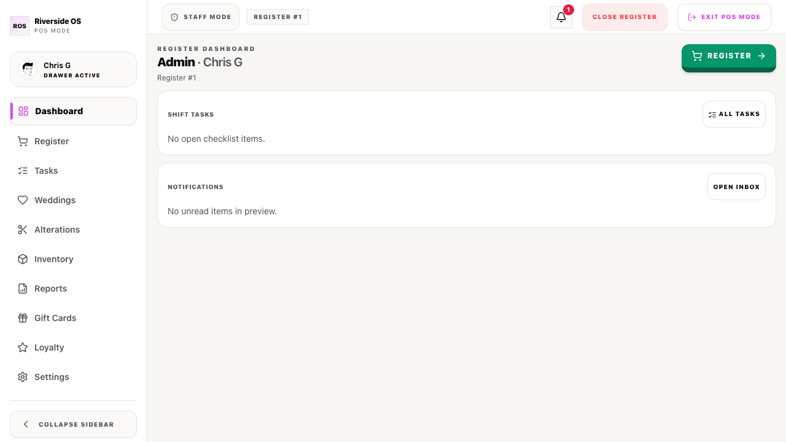
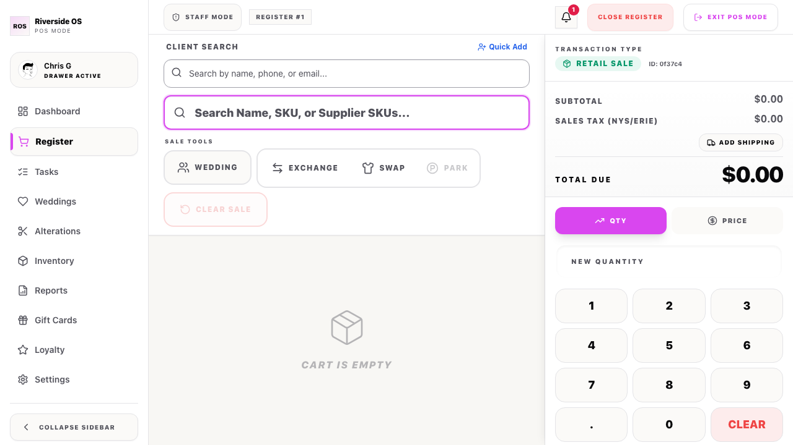
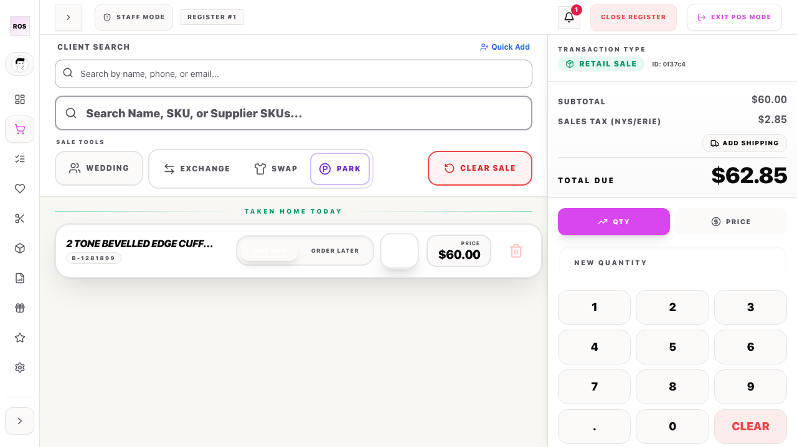
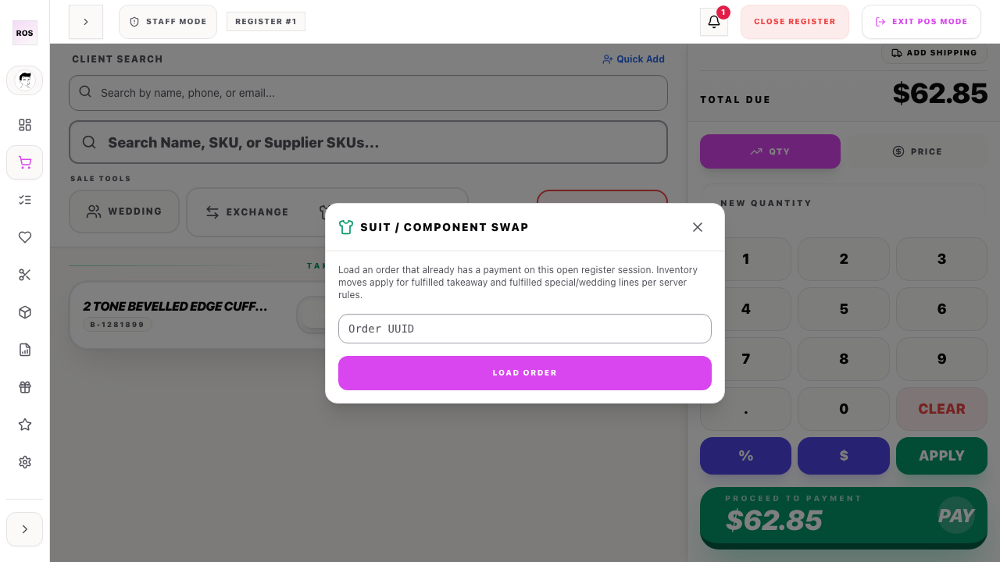
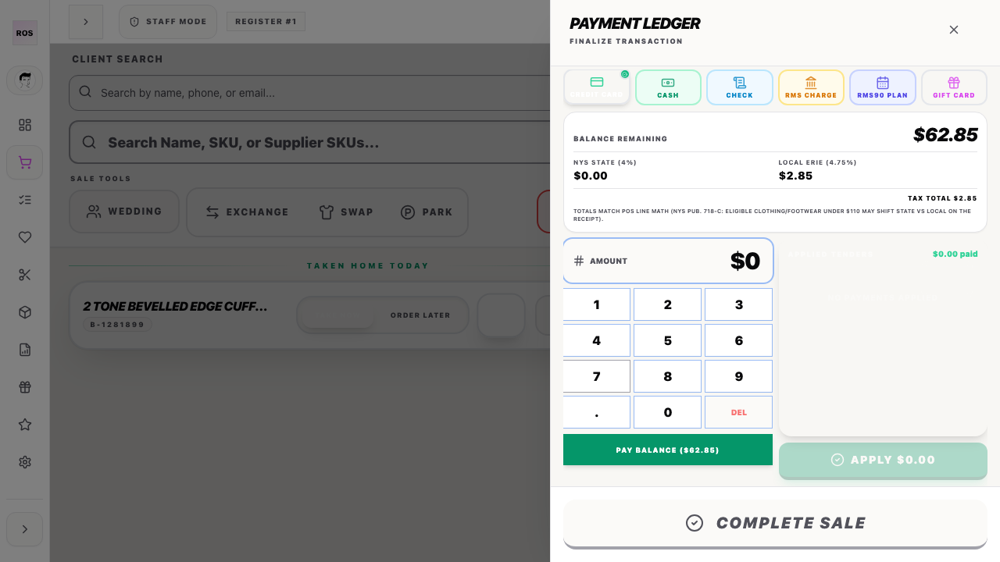
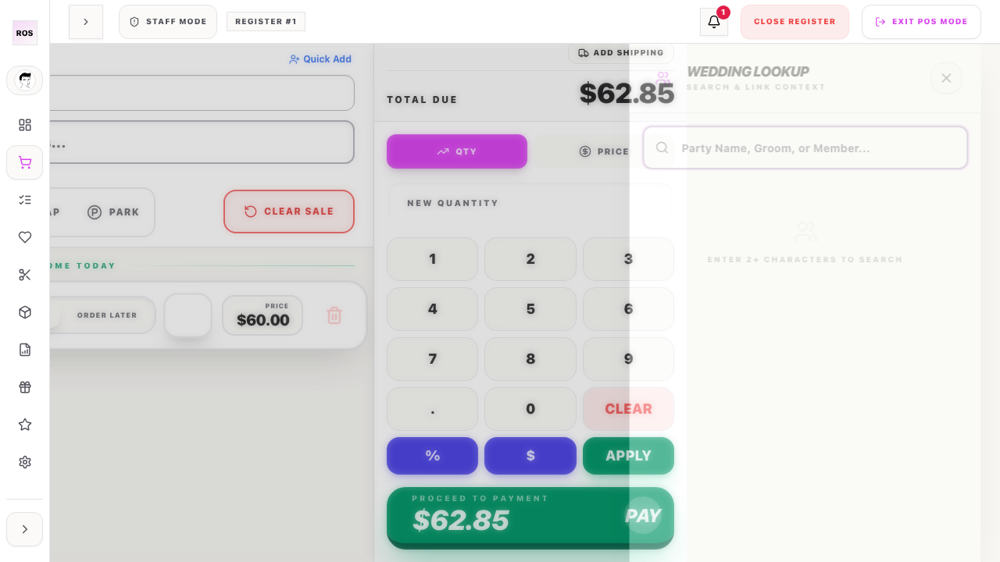

# Register (POS) — staff guide

This guide covers day-to-day use of the in-store register: opening the till, the home dashboard, ringing sales, swapping a suit on an existing order, and taking payment.

---

## Open the register workspace

**Option A — from the main menu:** Sign in, then select **Register POS** in the left rail. The screen switches to the register layout (narrow POS sidebar and register tools).

**Option B — direct address:** After you are signed in, you can open the same workspace with the `/pos` address on your store server (for example, if someone shares a link for training).

You must **open the register drawer** when prompted (lane, opening float, and **Open register**) before you can ring sales. If the till is already open for your shift, you go straight to the dashboard or register screen.

---

## Dashboard

When the drawer is active, you often land on **Dashboard**. Here you can see shift-friendly summaries and shortcuts. To ring items, switch to **Register** in the POS sidebar (shopping cart icon).

---

## Ring a sale (Register)

1. Select **Register** in the left POS sidebar.
2. Click in the **product search** field at the top of the sale.
3. **Scan a barcode** or **type a SKU**, then press **Enter**.
4. If the system asks you to choose a size or variation, pick the correct line and confirm.
5. Repeat for each item. The cart lists each line with quantity and price.

**Tips**

- Attach a customer or wedding party when your store requires it for the sale.
- Use on-screen actions for discounts or notes only when your manager has shown you how.

---

## Suit or component swap

Use this when a customer already paid on **this open register session** and you need to change which SKU is on the order (for example, swap jacket size after a fitting).

1. On the **Register** screen, select **Swap** (suit swap).
2. In the **Suit swap wizard**, paste or type the **order ID** (UUID) for the sale.
3. Select **Load order**. The order must have payment tied to this register session.
4. Select the **line** you are changing.
5. Enter or scan the **replacement SKU**.
6. Add an optional **note** for the file.
7. Select **Confirm swap**. When finished, close the wizard.

Inventory and bookkeeping follow server rules for takeaway vs special order vs wedding lines; ask a lead if you are unsure.

---

## Checkout and payment (payment ledger)

1. When the cart is correct, select **Proceed to Payment**.
2. If you are not using a saved customer, confirm **walk-in** when asked.
3. The **Payment ledger** side panel opens. Enter amounts on the keypad, then **Apply payment** for each tender (card, cash, gift card, etc.) the way you were trained.
4. On **special-order / wedding** sales, the ledger may show **Deposit release** — use **Apply deposit** below **Apply payment** when your store records a deposit on the keypad. **Split deposit (wedding party)** opens wedding lookup in group-pay mode to allocate amounts across members. **Takeaway** items (walk out today) must be covered with regular tenders first; deposit and **open deposit** apply to order balances, not unpaid takeaway. If the linked customer has a **party deposit** waiting, you may be asked to apply it to this sale.
5. When the sale is balanced (or deposit-only when the UI allows, including mixed takeaway + order lines once takeaway is paid), finish using **Complete Sale**.
6. Close the panel with **Close drawer** when you are done.

---

## Wedding lookup

From **Register**, select **Wedding** to open the wedding lookup panel. Search or pick the party you need, then use the on-screen actions your manager defined. Press **Escape** to close when finished.

---

## Refreshing the pictures in this guide

Screenshots should be re-captured with **[aidocs-cli](https://github.com/BinarCode/aidocs-cli)** (Playwright-backed `/docs:generate`, `/docs:flow`, etc.) so they match the live UI. Configure output or copy exported images into **`client/src/assets/images/help/pos/`** using the same filenames this guide references (see **`docs/MANUAL_CREATION.md`**).
