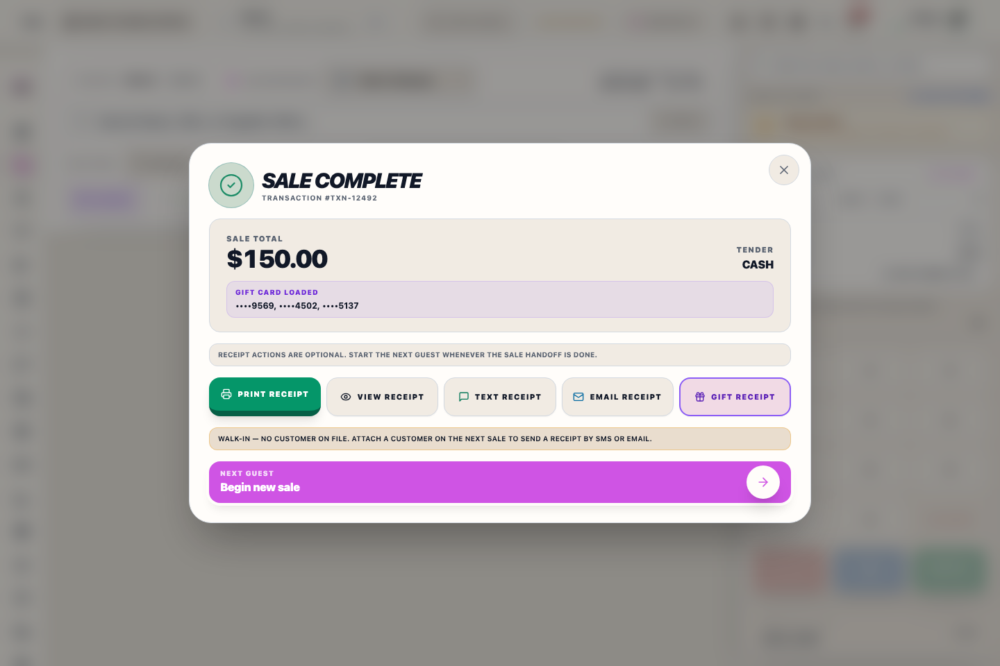

# Register (POS) — staff guide

This guide covers day-to-day use of the in-store register: opening the till, the home dashboard, ringing sales, and taking payment.

---

## What this is

Use **Register (POS)** for live selling, shift-ready lane work, and same-station checkout.

This is the staff workflow for:

- opening the register lane
- moving between the dashboard and the live cart
- ringing normal sales
- handling supported swap and wedding lookup tasks
- taking payment and finishing receipt delivery

## When to use it

Use this guide when a staff member is working a live register station.

- Use **POS → Register** for active selling.
- Use **POS → Dashboard** for shift context between customers.
- Move to the dedicated **Orders**, **Customers**, or **Reports** manuals when the task leaves live checkout.

## Staff Access For A Sale

To ensure each sale is attributed to the correct staff member, Riverside OS uses the same Staff Access pattern at the register.

1. **Select Your Name**: When starting a sale or changing sessions, tap your avatar/name from the scrollable grid.
2. **Enter Access PIN**: Type your 4-digit code.
3. **Automatic unlock**: Riverside proceeds as soon as the fourth correct digit is entered. Shift handoff also verifies that the Access PIN belongs to the selected staff member. Use **Continue** only if you need to retry manually.

PIN keypads accept touch, mouse, physical number-pad, and keyboard entry. If keyboard entry does not start, tap or click the PIN display/keypad area once, then type the digits.

If you are already logged in but a different staff member needs to ring a sale, they can tap the **Lock** or **User** icon to bring up the sign-in overlay without closing the current register session.

Staff Access records who operated the register. It is separate from **Salesperson** attribution for commissions. Only active staff with the **Salesperson** role appear in Salesperson attribution lists. Before completing payment, every merchandise, alteration, special-order, custom-order, and wedding-order sale line must have a default Salesperson or a line-level Salesperson. Choose **Staff Admin** only when the sale should not commission to an individual salesperson; it is a protected no-commission system account. Gift-card-load-only and RMS Charge payment-only flows do not use salesperson attribution.

Correcting Salesperson attribution after the sale always requires a fresh Access PIN, even when the signed-in Admin already has permission. Riverside does not reuse or retain the sign-in PIN for this audit-sensitive correction.

---

## Open the register workspace

**Option A — from the main menu:** Sign in, then select **Register POS** in the left rail. The screen switches to the register layout (narrow POS sidebar and register tools).

**Option B — direct address:** After you are signed in, you can open the same workspace with the `/pos` address on your store server (for example, if someone shares a link for training).

You must **open the register drawer** when prompted (lane, opening float, and **Open register**) before you can ring sales. The Windows register now shows a **Station Readiness** panel first so you can confirm API reachability and receipt-printer connectivity before customer checkout begins. If the till is already open for your shift, you go straight to the dashboard or register screen.

---

## Dashboard

When the drawer is active, you often land on **Dashboard**. Here you can see shift-friendly summaries and shortcuts. To ring items, switch to **Register** in the POS sidebar (shopping cart icon).

---

## Ring a sale (Register)

1. Select **Register** in the left POS sidebar.
2. Click in the **product search** field at the top of the sale. The field should auto-focus when the register opens.
3. **Scan a barcode** or **type a SKU**, then press **Enter**. SKU-style entries such as `B-1626170`, `I-103881`, `CP-100001`, or `ROS-1001` must match exactly; if the SKU is missing, the Register shows **SKU NOT FOUND** instead of offering similar SKUs.
4. For parent-style searches, combine the style number and product type when it helps narrow the list, such as `40901/1 suit`, `40901/1 slacks`, or `40901/1 blazer`.
5. If the system asks you to choose a size or variation, pick the correct line and confirm.
6. Repeat for each item. The cart lists each line with quantity and price.

For a standalone service fee, type **ALTERATIONS** or **SHIPPING** and select the fee shortcut:

- **ALTERATIONS** adds a non-tracked, non-taxable Alterations Fee after staff enter the amount. Use the full Alterations workflow when a work order, garment, due date, or fitting must be tracked.
- **SHIPPING** adds a non-taxable shipping fee without creating a shipment. Use **Ship current sale** when an address, carrier/service, shipment record, or tracking workflow is required.

Each ordinary sale line has a tax badge. Tap it to cycle that one line through **Standard**, **Clothing**, and **No Tax**:

- **Standard** applies the full standard state and local sales tax.
- **Clothing** applies Riverside's clothing/footwear threshold rules to that line.
- **No Tax** applies zero state and local tax to that line. Use it only when the charge is actually non-taxable.

The selected category recalculates immediately and remains attached to that line through checkout and the completed Transaction Record. Shipping and alteration-service lines are already locked to their required non-taxable treatment.

**Tips**

- Attach a customer or wedding party when your store requires it for the sale.
- If scanner input lands in the wrong field after switching tabs or returning to the register, use **Focus /** next to the product search field, or press **/** on a keyboard station, and scan again.
- If the Register says **Product search failed**, verify the Main Hub connection and retry. This message means Riverside could not complete the search; it is different from **SKU NOT FOUND**.
- Use on-screen actions for discounts or notes only when your manager has shown you how.

## What to watch for

- Confirm the correct staff identity before you start the sale.
- Open the correct register lane before serving customers.
- Do not guess between takeaway, order, and wedding handling if the drawer is asking for a fulfillment decision.
- Treat receipt printer failures as delivery issues only after the sale already succeeded. Receipt auto-print runs once for the newly completed sale; opening an older receipt from Reports, Orders, Customer history, or Staff Profile never auto-prints it.
- Pending checkout recovery and failed receipt-print jobs are copied to the Main Hub when a connection is available. Another linked register in the same open till shift can restore those unresolved jobs for review. Never dismiss one until the Transaction Record or replacement receipt has been confirmed.

---

## Exchange / return

Use this when a customer is exchanging or returning items tied to a completed transaction. The wizard keeps the return, replacement sale, manager approval, and register-session checks together.

1. On the **Register** screen, select **Exchange / Return**.
2. If a customer is loaded, choose from that customer's transaction list. Otherwise scan the receipt barcode or search by transaction number.
3. Choose the line being returned or exchanged. If you started from a Transaction Record item, Riverside preselects that line.
4. Follow the wizard instructions for the refund path or replacement sale.
5. Complete any replacement checkout before handing the customer their final receipt.

Selecting a returned line only stages the return. The original Transaction Record is not changed until Riverside successfully records the refund or exchange settlement. If a tax/refund problem stops the flow, close it with the on-screen close button and the original item should remain visible as active.

Return and exchange credits use the original selected item price and the tax paid on that item. If the Transaction Record was only partially paid, Riverside caps the credit to the paid amount available on that Transaction Record.

If the original Transaction Record still has a balance due, the returned item may reduce that balance without creating cash back for the customer. Continue the exchange, add the replacement item, and finish checkout so Riverside records the return and links the replacement sale.

For Special, Custom, Wedding, and shipped order lines, confirm the original Transaction Record, returned quantities, tender/refund path, and inventory handling before settlement.

Return and exchange receipts keep the audit trail visible. Active merchandise prints in the normal receipt sections, while returned or exchanged quantities print in separate **RETURNED / REFUNDED** or **EXCHANGED** sections with the credit amount shown clearly.

Inventory and bookkeeping follow server rules for takeaway, order, and wedding lines; ask a lead if you are unsure.

---

## Checkout and payment (payment ledger)

1. When the cart is correct, select **Proceed to Payment**.
2. If you are not using a saved customer, confirm **walk-in** when asked.
3. The **Payment ledger** side panel opens. Enter amounts on the keypad, then **Apply payment** for each tender (card, cash, gift card, etc.) the way you were trained.
   - If the terminal is canceled but ROS remains on **Waiting for Card**, cancel the payment on the physical terminal, then select **I canceled on terminal — clear ROS**. This clears the stale attempt so you can retry the card or choose another payment method.
   - **Card Not Present** opens secure HelcimPay.js card entry for keyed payments. Riverside OS validates the Helcim response and does not store card numbers or CVV. After approval, review the approval screen and select **Add Payment to Sale**; complete the sale only after the approved payment appears in the ledger. If ROS cannot attach the response immediately, keep the secure page open and select **Retry Approval**; this retries the attachment without charging the card again. If the customer cancels or the card is declined, use the ledger retry controls before starting another card attempt. Helcim may ask for billing ZIP and street address for card verification.
   - **Manual Card** records a card approval without a live Helcim connection. Enter only the approval/reference, last four digits, and reason. Never enter full card numbers or CVV in ROS.
   - **Cash** accepts the amount handed to you and shows the change due before checkout. When change is given, the customer receipt prints both **Cash Tendered** and **Change**.
   - **Physical Checks**: When a customer pays by check, select the **CHECK** tab and enter the **Check #** in the input field before pressing **Apply Payment**.
   - **Gift Card**: Scan or enter the card and wait for the verified type, expiration, and **Balance before this transaction**. The Apply button stays unavailable until Riverside confirms the card, and the payment cannot exceed the displayed balance.
   - **Staff Account** charges an employee purchase to the linked staff receivable account. The sale still calculates tax from the item tax category. Use **Staff Pay** from the Register action ribbon only when the employee is paying down an existing Staff Account balance.
4. On **Order / Layaway / Wedding** sales, any money paid before pickup is treated as a deposit even if you only use **Apply payment**. Use **Apply deposit** when you want the ledger to set a specific deposit target first. **Split deposit (wedding party)** opens wedding lookup in group-pay mode so you can select members and enter the deposit amount for each one, even when a member has no open balance yet. When you later select a member who has money held this way, a **Wedding deposit available** popup shows the balance and most recent payer. Open **Pay** and select **Apply $X** on the wedding-deposit card to add it to this member's sale. **Takeaway** items (walk out today) must be covered with regular tenders first. Clear new party disbursements or existing-order payment rows before applying the member's held deposit.
   - After Split deposit completion, Daily Sales shows the amount applied to the payer's own Transaction separately from **Wedding Deposits Placed** and **Total Tender Collected**. The payer's Customer History also records how much was placed for the party members.
   - If the new Transaction Record is voided or cancelled without forfeiture, Riverside returns the applied amount to the member's held wedding-deposit balance instead of placing it in a cash-refund queue.
5. When the sale is balanced (or deposit-only when the UI allows, including mixed takeaway + order lines once takeaway is paid), finish using **Complete Sale**. If Riverside asks for a Salesperson, return to the cart and select one before finalizing.
6. After the sale completes, the **Receipt Summary** screen opens. If printing fails, Riverside now shows that the **sale still succeeded** and gives you **Retry** and **Check station printer** actions.
7. Close the panel with **Close drawer** when you are done.
8. If you need to hold the transaction for another cashier, use **Park Sale** and enter the label in the Riverside prompt instead of a browser dialog.

## Receipt delivery

The **Sale Complete** screen is the receipt handoff point after checkout. Use it to print the customer receipt, view the formatted receipt, send by text or email when a customer is attached, or print a gift receipt when needed.

Select **View Receipt** to inspect the same formatted receipt layout used for customer delivery and the report-printer view.

Gift card load receipts list the sold gift card number under the gift-card line so staff and customers can confirm which card was activated.

When staff open the loaded customer's profile from Register and save updated contact details, the selected customer shown in Register refreshes immediately.

When Register search opens a parent product with variations, Riverside shows the full variation matrix for that parent. Barcode scans still add the exact scanned variation directly.

---

## Wedding lookup

From **Register**, select **Wedding** to open the wedding lookup panel. Search or pick the party you need, then use the on-screen actions your manager defined. Press **Escape** to close when finished.

When customer search results include wedding members, Riverside shows the wedding party name next to the customer so staff can choose the correct profile without opening the background register action by mistake.

---

## What happens next

After checkout, staff should either:

- finish receipt delivery from the receipt summary screen
- return to **Dashboard** or **Register** for the next customer
- move into the related order, wedding, or customer workflow when follow-up work is needed

---

## Related workflows

- [Reports (curated)](manual:reports)
- [Insights (Metabase)](manual:insights)
- [Register Reports](manual:pos-register-reports)
