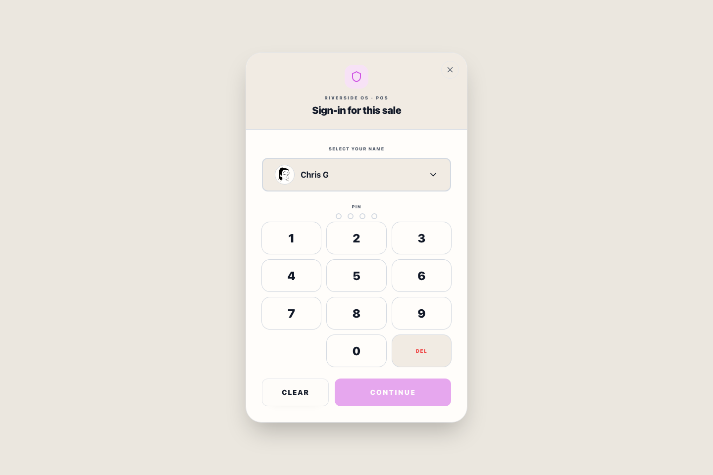
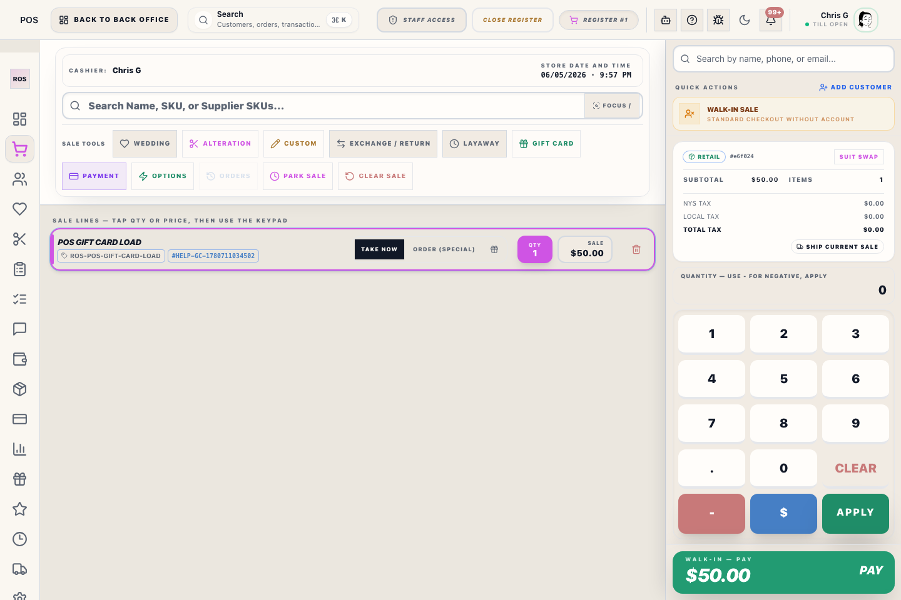
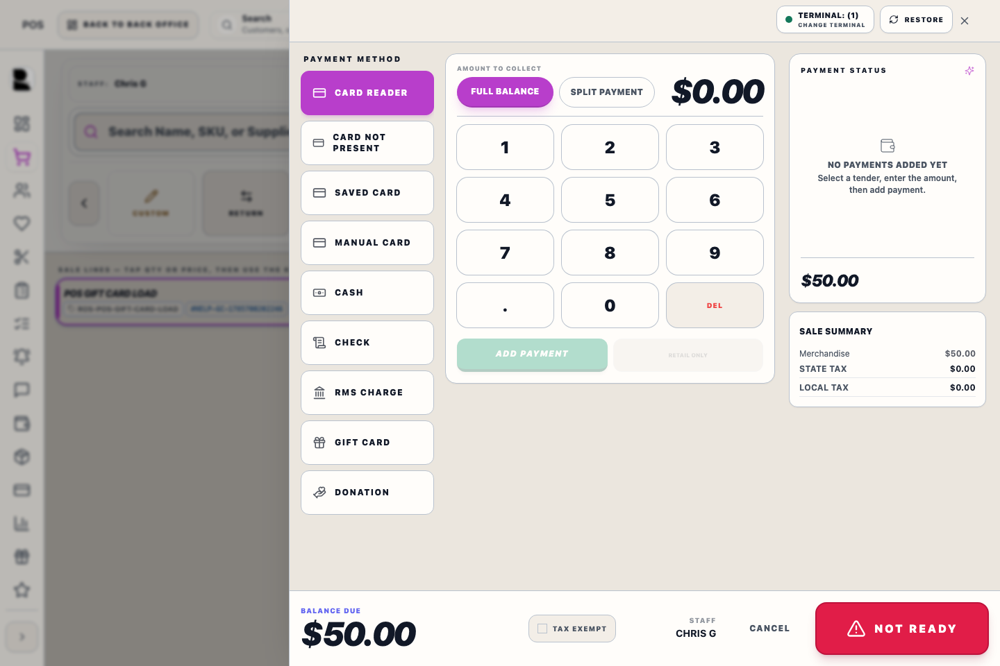
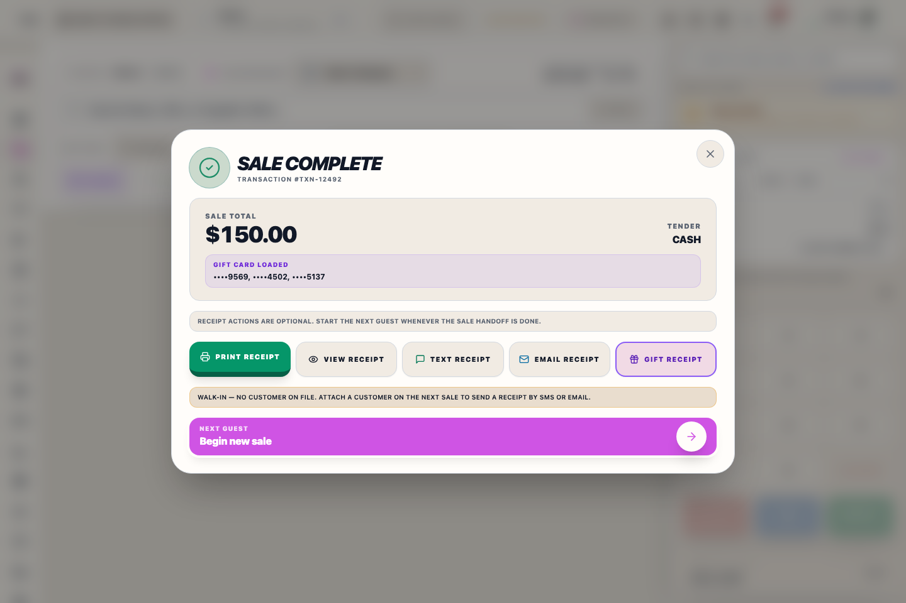

# Register (POS) — staff guide

This guide covers day-to-day use of the in-store register: opening the till, the home dashboard, ringing sales, and taking payment.

---

## What this is

Use **Register (POS)** for live selling, shift-ready lane work, and same-station checkout.

This is the staff workflow for:

- opening the register lane
- moving between the dashboard and the live cart
- ringing normal sales
- handling supported swap and wedding lookup tasks
- taking payment and finishing receipt delivery

## When to use it

Use this guide when a staff member is working a live register station.

- Use **POS → Register** for active selling.
- Use **POS → Dashboard** for shift context between customers.
- Move to the dedicated **Orders**, **Customers**, or **Reports** manuals when the task leaves live checkout.

## Staff Access For A Sale

To ensure each sale is attributed to the correct staff member, Riverside OS uses the same Staff Access pattern at the register.

1. **Select Your Name**: When starting a sale or changing sessions, tap your avatar/name from the scrollable grid.
2. **Enter Access PIN**: Type your 4-digit code.
3. **Automatic unlock**: Riverside proceeds as soon as the fourth correct digit is entered. Shift handoff also verifies that the Access PIN belongs to the selected staff member. Use **Continue** only if you need to retry manually.

PIN keypads accept touch, mouse, physical number-pad, and keyboard entry. If keyboard entry does not start, tap or click the PIN display/keypad area once, then type the digits.

If you are already logged in but a different staff member needs to ring a sale, they can tap the **Lock** or **User** icon to bring up the sign-in overlay without closing the current register session.

Staff Access records who operated the register. It is separate from **Salesperson** attribution for commissions. Only active staff with the **Salesperson** role appear in Salesperson attribution lists. Before Payment opens or any tender can be applied, every new merchandise, alteration, special-order, custom-order, and wedding-order sale line must have a default Salesperson or a line-level Salesperson. A Salesperson already attached to an older item being picked up does not cover a new fee or merchandise line added to the same Cart. Choose **Staff Admin** only when the sale should not commission to an individual salesperson; it is a protected no-commission system account. Shipping, gift-card-load-only, and RMS Charge payment-only flows do not earn commission.

Completing or clearing a sale keeps the Register session and workstation Staff Access active, but clears **Cashier for this sale**. Select and verify the operator again before the next checkout so one staff member's sale identity cannot silently carry into another person's transaction.

Correcting Salesperson attribution after the sale always requires a fresh Access PIN, even when the signed-in Admin already has permission. Riverside does not reuse or retain the sign-in PIN for this audit-sensitive correction.

---

## Open the register workspace

**Option A — from the main menu:** Sign in, then select **Register POS** in the left rail. The screen switches to the register layout (narrow POS sidebar and register tools).

**Option B — direct address:** After you are signed in, you can open the same workspace with the `/pos` address on your store server (for example, if someone shares a link for training).

You must **open the register drawer** when prompted (lane, opening float, and **Open register**) before you can ring sales. The Windows register now shows a **Station Readiness** panel first so you can confirm API reachability and receipt-printer connectivity before customer checkout begins. If the till is already open for your shift, you go straight to the dashboard or register screen.

---

## Dashboard

When the drawer is active, you often land on **Dashboard**. Here you can see shift-friendly summaries and shortcuts. To ring items, switch to **Register** in the POS sidebar (shopping cart icon).

---

## Ring a sale (Register)

1. Select **Register** in the left POS sidebar.
2. Click in the **product search** field at the top of the sale. The field should auto-focus when the register opens.
3. **Scan a barcode** or **type a SKU**, then press **Enter**. SKU-style entries such as `B-1626170`, `I-103881`, `CP-100001`, or `ROS-1001` must match exactly; if the SKU is missing, the Register shows **SKU NOT FOUND** instead of offering similar SKUs.
4. For parent-style searches, combine the style number and product type when it helps narrow the list, such as `40901/1 suit`, `40901/1 slacks`, or `40901/1 blazer`.
5. If the system asks you to choose a size or variation, pick the correct line and confirm.
6. Repeat for each item. The cart lists each line with quantity and price.

While a typed search is running, the Register shows **Searching products…** directly below the field. A completed search with no match shows **No products found** and repeats the search term; a Main Hub or network failure instead shows **Search unavailable** with connection guidance. These states are different from an exact scanned SKU showing **SKU NOT FOUND**.

The action row below search scrolls by complete action cards. Use its left and right arrow buttons, or the keyboard arrow keys while the row is focused, to reach RMS Pay, Staff Pay, Layaway, and the remaining sale actions without selecting a partially visible card.

The quantity/price keypad and the larger **Pay** action stay full size in a fixed checkout dock at the bottom of the right rail, even when wedding guidance or other sale context is loaded. On shorter screens, scroll the customer, wedding, and sale-summary area above the keypad; the keypad, total, and contextual **Pay** or **Complete Pickup** action remain in place. Before a cart line is selected, muted numerals and button borders mean **inactive**, not missing. Select a sale line and tap **Qty** or **Sale price** to activate the keypad. The colored **% / −**, **$**, and **Apply** controls use their action colors only while they are available.

For a Register service shortcut:

- **ALTERATIONS** requires a selected customer and opens a Quick Alteration Record. Attach a current-cart item, past purchase, catalog item, or customer-owned item with a description; set the due date and either a fee or free status. Tag # and work requested are optional; scan the physical tag into **Tag #** when available. The checkout/drop-off receipt prints the **Customer item** description, and the pickup receipt repeats it. It records and tracks the alteration for pickup, while scheduling and delegation remain in the Alterations workspace. It can be picked up at Register while marked **In Custody** or **Ready for pickup**; use **Ready** when the work is complete and customer-notification workflows should begin.
- Type **SHIP** or **SHIPPING** in product search, then select anywhere on the **Shipping fee** result to add a non-taxable shipping fee without creating a shipment. Use **Ship current sale** when an address, carrier/service, shipment record, or tracking workflow is required.

Use the Register **Alteration** toolbar action for the full intake workflow.

The full intake starts with the garment, fitting decision, work requested, and timing. Workload capacity, fee, Tag #, and notes remain available when needed without blocking the basic intake.

**Alteration Service** is an internal checkout line created only after an intake record is saved. It is not a sellable SKU and should never be added directly from product search. Charged alteration fees are services, not merchandise discounts, and do not require Below-Cost Approval. In the Alterations workspace, **Plan & Schedule → Schedule → Audit trail** shows the recorded intake, status, work-item, and pickup history for authorized staff.

Each ordinary sale line has a tax badge. Tap it to cycle that one line through **Standard**, **Clothing**, and **No Tax**:

- **Standard** applies the full standard state and local sales tax.
- **Clothing** applies Riverside's clothing/footwear threshold rules to that line.
- **No Tax** applies zero state and local tax to that line. Use it only when the charge is actually non-taxable.

The selected category recalculates immediately and remains attached to that line through checkout and the completed Transaction Record. The server recalculates the authoritative tax from the selected category, so a stale tax display cannot block an otherwise valid sale. Shipping and alteration-service lines are already locked to their required non-taxable treatment.

**Tips**

- Attach a customer or wedding party when your store requires it for the sale.
- If scanner input lands in the wrong field after switching tabs or returning to the register, use **Focus /** next to the product search field, or press **/** on a keyboard station, and scan again.
- Product search starts only after the entry contains a letter or number; punctuation by itself is ignored. Scan/SKU and parent-product lookups stop after about five seconds instead of holding the sale screen.
- If one search source times out but another returns verified matches, the Register keeps those matches visible and tells you to retry for complete results. If no verified match is available, verify the Main Hub connection and retry. A timeout or **Product search failed** message is different from **SKU NOT FOUND**.
- Use on-screen actions for discounts or notes only when your manager has shown you how.

### Backdate the current sale

Use this only when the sale must be recorded under an earlier store-local date/time. Select **Store date and time**, choose the date/time, and complete the Manager Access approval prompt. The approved date applies to this sale only and resets after checkout, cart clear, or customer change. ROS records the sale business date separately from payment timing: every tender remains on the actual processing day so the Z-Report, drawer, card batches, deposits, and QBO payment evidence reconcile. The receipt is marked **BACKDATED SALE** with the business date.

## What to watch for

- Confirm the correct staff identity before you start the sale.
- Open the correct register lane before serving customers.
- Do not guess between takeaway, order, and wedding handling if the drawer is asking for a fulfillment decision.
- Treat receipt printer failures as delivery issues only after the sale already succeeded. Receipt auto-print runs once for the newly completed sale; opening an older receipt from Reports, Orders, Customer history, or Staff Profile never auto-prints it.
- Pending checkout recovery and failed receipt-print jobs are copied to the Main Hub when a connection is available. Another linked register in the same open till shift can restore those unresolved jobs for review. Never dismiss one until the Transaction Record or replacement receipt has been confirmed.
- A checkout or follow-up failure appears once as an error toast and is automatically recorded in **Error Events** for support review. Failed recovery records do not remain as checkout-blocking warnings in the top bar or cart; the audited recovery evidence remains available during register close.
- Once Register #1 starts Z-close reconciliation, every linked workstation stops new checkout and reports its local pending/blocked counts. A missing workstation acknowledgement is shown as a warning, not assumed to be clear. If the team needs to resume selling before the close is final, open **Register Settings** and choose **Restore Register for Selling**, then retry the sale. Staff can recover exact saved checkouts when possible; otherwise the ordinary authorized close remains available and preserves the warning in the audited close record without printing it on the financial Z-Report.
- After closing with unresolved work, open **Close Register** on a later till group and review **Prior or other till-group recovery**. These prior records remain informational for the current close. Staff with **Register Reports** permission can recover an exact saved checkout with Manager Access; the resulting Transaction Record remains tied to its original Register session and is identified as post-close recovery when applicable. Closing never dismisses a recovery record, and later recovery never rewrites the archived at-close issue list. If the global check is unavailable or denied, Riverside says so instead of showing an empty result.
- For a paid pickup follow-up, first complete every named shipping, pickup, or alteration action in **Orders** or **Alterations**. Then use **Verify completed follow-up** with Manager Access. Riverside verifies recorded evidence before resolving the recovery record; approval never performs or assumes missing work.

---

## Exchange / return

Use this when a customer is exchanging or returning items tied to a completed transaction. The wizard keeps the return, replacement sale, manager approval, and register-session checks together.

1. On the **Register** screen, select **Exchange / Return**.
2. If a customer is loaded, choose from that customer's transaction list. Otherwise scan the receipt barcode or search by transaction number.
   Long transaction details wrap inside each row; review the transaction number, date, item count, and amount before selecting it.
3. Choose the line being returned or exchanged. If you started from a Transaction Record item, Riverside preselects that line.
4. Follow the wizard instructions for the refund path or replacement sale.
5. Complete any replacement checkout before handing the customer their final receipt.

Selecting a returned line only stages the return. For a refund-only linked-card return, choosing **Original Card** and then **Apply Refund** sends the refund immediately while Riverside verifies the original Helcim transaction and batch. **Record Sale** remains unavailable until Helcim returns approved/captured and ROS confirms both the provider refund ID and its committed refund-ledger event. Successful completion names **Helcim**, the exact approved amount, and the masked card. For an exchange remainder, the card refund stays staged until ROS first records the replacement Transaction and inventory linkage, then it uses the same verified refund processor. Do not tell the customer the card refund is complete until the provider confirmation appears.

Cancelling a paid order from **Customer Orders** immediately loads its original merchandise into the active Register as negative lines and opens **Pay** for the exact paid amount. Finish that refund before serving the next customer. Choose **Original Card** when the original payment was made through Helcim; Riverside retrieves the linked Helcim transaction ID, chooses the supported refund or reverse action, and sends that server-owned ID to Helcim. Staff must never type or substitute a Helcim transaction ID. After approval, a cancelled or fully refunded Transaction Record shows no customer balance due, and **Reprint Receipt** opens that refund event with the negative original merchandise, exact refund, and Helcim card confirmation instead of reprinting the historical sale. Partial returns and exchanges can still show the legitimate unsettled remainder. The server also retains one refund obligation for recovery and audit, but staff should not rely on a separate queue to continue the Register workflow. If a refresh or retry submits cancellation again, Riverside recognizes that the record is already cancelled and does not add the refund obligation a second time.

If **Staff Access for this sale** appears while opening a cancellation, return, or refund from a Transaction Record, sign in normally. Riverside holds the exact Transaction Record handoff until Staff Access succeeds, then loads its negative lines and opens **Pay**; it does not discard the refund request at the lock screen.

Return and exchange credits use only the charged price and tax stored on the original selected line. Riverside does not recalculate historical tax using today's tax rules and does not substitute the current catalog, retail, or regular price. The receipt for today's event shows only today's returned items as negative lines and today's new merchandise or alteration services as positive lines. It omits items the customer kept from the original sale and omits historical tenders. If the Transaction Record was only partially paid, Riverside caps the credit to the paid amount available on that Transaction Record.

In the Register cart, each staged return remains visible as the actual item with its SKU, variation, negative value, and **Return from TXN-…** source—not as an anonymous exchange-credit line. Add replacement items beside those negative return lines, then use **Pay** to collect the net amount due or issue the remaining refund. If the original item value must be corrected, select **Return value** and enter a lower value; Riverside retains the original transaction tax components, records the correction with the returned line, and uses that same corrected value for the exchange credit or refund. A return value can never exceed the original paid item value.

If Riverside says an imported Counterpoint transaction requires reviewed reconciliation, stop the return or exchange. Do not use another Transaction Record, change the price, or issue a manual refund to work around the hold. Support must first reconcile that exact record to Counterpoint; the hold prevents an incorrect or duplicate customer credit.

For a mixed exchange, Riverside combines today's negative return lines with today's positive merchandise or services and shows the exact net result: **Refund to customer** when the return credit is larger, or **Amount due** when the new purchase is larger. Once a refund tender is staged, record the exchange; Riverside does not require a positive amount to collect. For an original-card remainder, Riverside records the exchange and inventory return first, then sends the remaining refund to Helcim. If the provider is unavailable, the exchange stays saved and the remaining card refund stays visible in the refund queue for a safe retry.

Refunds use the same split-payment screen as sales. Divide the refund among any valid sources needed—for example **Original Card** plus **Store Credit**—until the payment status reaches **Ready**. Riverside records every source under one return event and will resume a retry without duplicating a source that already succeeded. During an exchange, you may also add a payment to an existing Transaction Record; the return credit is applied through the normal Transaction payment allocation and remains visible on that Transaction Record, the current receipt, Daily Sales, and the Z-Report.

The replacement checkout and its exchange-settlement recovery marker save together. If the return settlement is interrupted, Riverside restores the checkout identity, tender ledger, and staged return lines so staff can finish the original exchange. The recovery marker remains visible through Z-close until the original Transaction Record, replacement Transaction Record, returned quantities, inventory movement, and refund tender are linked and settled.

When you load a return or exchange, Riverside automatically selects the
salesperson from the original Transaction Record. Replacement items inherit
that salesperson so commission stays with the original sale; use the audited
Transaction attribution correction only when a manager confirms the original
assignment itself was wrong.

Check refunds require the refund check number. **Manual CC Refund** is available when the real card refund was already completed on a prior processor or another external card system; enter the external approval/reference, card last four, and reason, then complete Manager Access approval. This records the real negative card tender without pretending it was processed by Helcim. Staff Account refunds reduce the linked Staff Account receivable. RMS Charge refunds must be completed in RMS/R2S first, then recorded with the external reference, reason, and Manager Access approval. Open Deposit amounts are restored through cancellation or void and are not issued as a generic refund tender.

If the original Transaction Record still has a balance due, the returned item may reduce that balance without creating cash back for the customer. Continue the exchange, add the replacement item, and finish checkout so Riverside records the return and links the replacement sale.

For Special, Custom, Wedding, and shipped order lines, confirm the original Transaction Record, returned quantities, tender/refund path, and inventory handling before settlement.

Return and exchange receipts keep the current event clear: every item returned today prints separately as negative merchandise with its exact negative tax, and every new item or service prints as a positive line. The receipt shows the exact net refund or amount due and today's tender only. When the settlement produces a customer refund, **Daily Sales** shows it once as one **Return / Exchange** event; open that event to view or reprint the same event receipt. The refund completion screen, Daily Sales, Z-Report, Payments, and QBO use the same completed event and amount.

Inventory and bookkeeping follow server rules for takeaway, order, and wedding lines; ask a lead if you are unsure.

---

## Checkout and payment (payment ledger)

1. When the cart is correct, select **Proceed to Payment**.
2. If you are not using a saved customer, confirm **walk-in** when asked.
3. The **Payment ledger** side panel opens. The compact top strip shows the terminal status. The payment types, amount/keypad workspace, and payment ledger each scroll independently when needed, above the fixed **Complete Sale** controls. Enter amounts on the keypad, then **Apply payment** for each tender (card, cash, gift card, etc.) the way you were trained.
   - **Helcim accepted the request** means Helcim accepted ROS's API call; it does not prove the amount appeared on the reader or that the card was approved. Confirm the exact sale appears on the physical reader. If the reader is not listening, ROS sends no payment and tells you to wake/restart it before retrying.
   - If the terminal is canceled but ROS remains on **Waiting for Card**, cancel the payment on the physical terminal, then select **I canceled on terminal — clear ROS**. This releases the old ROS request and unlocks alternate tenders. Before retrying **Card Reader**, confirm the physical reader has returned to its ready screen.
   - While the customer is inserting or tapping a card and completing PIN prompts, the checkout remains **Waiting for Card** and the final action remains **Not Ready**. Riverside allows about two minutes before presenting card-outcome recovery guidance. It never enables **Ready to Save** until that checkout's Helcim request has a confirmed final result.
   - **Card reader** approvals are bound to the checkout that started them. They cannot be applied to a later customer or sale. If ROS reports that an approval belongs to a different sale, do not run the card again; use **POS → Payments → Health** for the audited recovery or refund path.
   - If an approved card attempt from a failed checkout is still visible while starting a new sale, **Clear Sale** may be used to reset the local cart and tender state. The approved provider attempt remains in Payments Health for manager recovery; it must never block a new cash, check, or card checkout.
   - After a provider approves a card, that tender remains tied to the current customer and checkout. For a simple take-now sale, if the Main Hub disconnects after Helcim approval but before ROS receives checkout confirmation, select the green **Ready to Save** box once. ROS saves the exact checkout and approval locally, prints a **PAYMENT APPROVED - PENDING SYNC** receipt, and submits that same checkout automatically when the Main Hub reconnects. Do not run the card again. Shipping, pickups, orders, exchanges, alterations, and other fulfillment workflows stay open for live recovery because they require additional Main Hub actions. Riverside never moves an approved card tender silently to another customer. When an audited recovery confirms the exact checkout and Transaction Record, the matching local sale clears automatically while the provider evidence remains available in Payments Health. If the first request was rejected only because its primary Salesperson was missing, a successful retry with that Salesperson attached may clear the old recovery only when the checkout identity, payment fingerprint, and every other request field still match exactly.
   - **Card Not Present** opens secure HelcimPay.js card entry for keyed payments. Riverside OS validates the Helcim response and does not store card numbers or CVV. After approval, ROS automatically attaches the validated approved amount to this sale; verify the **CARD NOT PRESENT** payment appears in the ledger before recording the sale. **Add Payment to Sale** remains available as an idempotent recovery action if the handoff was interrupted. If ROS cannot attach the response immediately, keep the secure page open and select **Retry Approval**; this retries the attachment without charging the card again. If the customer cancels or the card is declined, ROS records that final outcome against the same attempt before saying the ledger is ready to retry. If ROS cannot confirm the outcome, use **Recover payment** before starting another card attempt. After the sale posts, a new customer or checkout starts with a clean Card Not Present approval; an approval from the previous sale must never be reused. Helcim may ask for billing ZIP and street address for card verification.
   - **Manual Card** records a card approval without a live Helcim connection. Enter only the approval/reference, last four digits, and reason. Never enter full card numbers or CVV in ROS.
   - Verify the tender name before completing the sale: **Card Not Present** must carry a Helcim approval; **Manual Card** must carry the external approval/reference entered by staff. Sale Complete, receipts, Transaction History, Payments Health, reports, and refunds keep these as separate tender types.
   - **Cash** accepts the amount handed to you and shows the change due before checkout. When change is given, the customer receipt prints both **Cash Tendered** and **Change**.
   - **Physical Checks**: When a customer pays by check, select the **CHECK** tab and enter the **Check #** in the input field before pressing **Apply Payment**.
   - **Gift Card**: Scan or enter the card and wait for the verified type, expiration, and **Balance before this transaction**. The Apply button stays unavailable until Riverside confirms the card, and the payment cannot exceed the displayed balance.
   - **Staff Account** charges an employee purchase to the linked staff receivable account. The sale still calculates tax from the item tax category. Use **Staff Pay** from the Register action ribbon only when the employee is paying down an existing Staff Account balance.
4. On **Order / Custom / Layaway / Wedding** Transactions, any payment that leaves a balance is called and recorded as a **Deposit**, even if you only use **Apply payment**. A payment that closes the balance is **Payment in Full**. **Record Sale** stays neutral and unavailable until at least 25% of the current Transaction total is paid. When store policy permits less—including `$0.00` down—select **Override Deposit** at the top of Payment and obtain Manager Access. The approval is limited to that exact customer and checkout and creates no fake payment. Takeaway merchandise must still be paid in full. To collect deposits for other wedding members, select the paying customer and choose **Wedding Deposit** from the Cart action toolbar. Start by choosing **Deposit Only** or **Collect & Build Orders**. The guided workspace then makes you choose or start the party, verify the payer's party role, select each beneficiary and amount, choose **Hold for this member's future order** or one exact open Transaction Record, and review the full allocation before adding it to the Cart. For equal deposits, enter **Deposit amount per selected member** once and tap only the intended members; newly selected members receive that amount automatically, **Apply to Selected** updates the current selection, and individual amounts remain editable. Unselected members receive nothing. A selected `$0` member is clearly excluded and does not block valid funded members. You can start a party with only **Party Name** and **Wedding Date**, then link an existing customer or create a customer and assign a role without leaving the workflow. Each reviewed deposit remains a removable Cart row, and the Cart may contain only wedding deposits—merchandise is not required before continuing to **Payment**.
   - When a selected Register customer is linked to one active wedding, Riverside asks **Part of the Wedding Order?** If the member belongs to multiple active weddings, compact party rows show the party, role, date, and status; choose **Start Order** for the correct party instead of Riverside silently using the first membership. Each row also provides a full-size **Measure** action for the customer's measurement vault. Choose **Yes — Build Wedding Order** to activate the selected party/member, load only that wedding's parent-item checklist, and choose the exact variation for each required item through the same variation drawer used by Deposit & Build. Use **Wedding party for this sale** to switch parties only while the Cart is empty. The primary wedding banner is the one place to confirm the member and party. New searched or scanned merchandise defaults to **Order (Wedding)** while that member context is active; **Take now** remains an explicit choice. Choose **No — Regular Sale** to leave wedding fulfillment off. The question itself creates no Transaction, Fulfillment Order, deposit application, tax, inventory, commission, or receipt record.
   - The Wedding Order question states an available held deposit and its contributing payer when one exists. It does not apply funds automatically. At **Pay**, staff explicitly chooses the held-deposit amount; checkout then validates the exact source ledger, member Customer, Wedding member, totals, tax, and salesperson before posting. The normal completed Transaction and Wedding Fulfillment Order remain the audit and reporting records. If the question was dismissed, **Start Wedding Order** remains available beside the Customer so staff can reopen it.
   - Select the responsible **Salesperson** in Review before continuing to Payment. When the first tender is applied, Riverside checks the payer link, party membership, destinations, and current order balances. Resolve any message in **Wedding Deposit** before tendering. If a card is declined, no payer Transaction, member allocation, held deposit, booked sale, or receipt is created. The reviewed deposits remain staged so you can choose **Retry card** or another tender; the declined provider attempt remains audit evidence in Payments Health and is not customer money.
   - After successful completion, Daily Sales shows the payer's own Transaction separately from **Wedding Deposits Placed** and **Total Tender Collected**. The payer receipt truthfully lists each member, party, amount, and whether it was held or posted to an exact Transaction Record. It does not present member deposits as the payer's merchandise.
   - **Deposit Only** finishes after the payer receipt. In **Collect & Build Orders**, choose **Start Building Member Orders**. Riverside opens every funded member inside one Wedding Builder before asking for payer Payment. Party-level ROS catalog products appear according to the saved **All**, **Groom Only**, **Groomsmen Only**, **Any**, or role-specific **Other** rule: choose that member's exact variation, skip an optional row, or search a different parent product for an exception. On the final variation step, verify the regular unit price and enter any approved **Line discount %**; Riverside shows the final unit price immediately and carries both prices into the member draft, Transaction, receipt, and audit detail. Discounts above the signed-in staff member's limit require Manager Access. Optional alteration intakes can be added in the same draft. Choose one **Salesperson for all member Transactions** or override a member individually. **No Tax** is also individual and requires an explicit audited reason. Choose **Save Member Order & Next** to move through the Builder. Saving creates a nonfinancial draft only; it does not create a Transaction Record, Fulfillment Order, apply a deposit, record tax, or collect money.
   - Before opening **Wedding Deposit** with payer merchandise already in the Cart, confirm the salesperson responsible for that merchandise. The Wedding Deposit Review separately confirms the salesperson responsible for the deposit workflow. Riverside preserves both attributions even when they are different. **Park Sale** preserves every Collect & Build member draft, including its exact items, variants, fulfillment choices, and salesperson, along with the payer Cart and deposit allocations. Recalling the parked sale restores the entire workflow at the same member and step. Clearing the sale clears that context before the next customer. Employee-price payer merchandise may be included in the same Final Payment; it remains noncommissionable while the deposit salesperson stays attached to the deposit audit record.
   - After every funded member draft is saved, Riverside returns to the payer, restores any merchandise that was already in the payer's Cart, and shows **Collect & Build · Final Review** with that merchandise, the member drafts, and the deposit rows. Choose **Final Payment** once. The payer's receipt separates the payer's own merchandise from deposits placed for party members. A decline posts no payer Transaction, deposit, member Transaction, or booked sale and keeps the reviewed drafts available.
   - After the approved payer receipt, choose **Open Wedding Builder**, then **Create All Member Transactions** once. Riverside creates the separate member-owned Transactions and Wedding Fulfillment Orders through the normal atomic checkout service, applies each exact held source, and never asks for another payer payment. The completion screen shows every member's exact items/variations, salesperson, tax treatment, Transaction total, deposit applied, balance due, and individual **View / Print Receipt**. If one member fails, successful members remain posted once and retry resumes only the unfinished rows with their original checkout identities.
   - When the selected payer has previous Wedding Deposit activity, the toolbar opens with a prominent **Previous Deposits & Builds Found** action. Choose it (or **Review & Reprint**) to reopen the payer-scoped history and print the original payer or member receipts. For a Deposit Only workflow, choose **Build All Remaining Orders**, prepare all funded members in the same Builder, and create them together. After a member Transaction is already posted, **Build More Items** starts a fresh Wedding Order for that member through normal item selection and Payment; it does not reopen or rewrite the prior deposit, Transaction, or receipt. A parked Builder preserves its member drafts, exact variations, alterations, No Tax reason, salesperson choices, and stable checkout identities.
   - Removing or changing the selected Customer also clears the linked Wedding member banner and any unposted member-deposit rows that belonged to the former payer. Riverside never carries wedding context into another Customer's Cart.
   - There is no Wedding Deposit batch refund. Process a refund one member at a time from that member's Customer account and Transaction Record. For **Original Card**, Riverside follows the allocation/redemption to the exact originating Helcim payment automatically. If several payments funded the account, Riverside retains each contributing payment, amount, payer, and Helcim provider transaction ID so the correct refundable source and recipient are used. The member Transaction is the refund context, but money returns to the originating wedding deposit payer's card—not to the member. The confirmation and refund receipt name the payer as the recipient, and both Customer histories retain the audit trail.
   - Ordinary **Cancel** and same-day **Void** remain blocked for a funded Wedding Deposit. If a member Transaction used a held source and is cancelled before refunding, Riverside restores the credit to that exact held source; it does not send money to a card.
   - When you later select a member who has money held this way, a **Wedding deposit available** popup also shows the balance and most recent payer. Open **Pay** and select **Apply $X** on the wedding-deposit card to add it to this member's sale, including in-stock **Takeaway** items that the member takes today. A newly entered deposit target cannot fund takeaway merchandise. Clear new party deposits or existing-order payment rows before applying the member's held deposit.
   - If the new Transaction Record is voided or cancelled without forfeiture, Riverside returns the applied amount to the member's held wedding-deposit balance instead of placing it in a cash-refund queue.
5. When the sale is balanced—or an Order has met its 25% deposit minimum or received an exact **Override Deposit** approval—finish using **Record Sale**. If Riverside asks for a Salesperson, return to the cart and select one before finalizing.
6. After the sale completes, the **Receipt Summary** screen opens. If printing fails, Riverside now shows that the **sale still succeeded** and gives you **Retry** and **Check station printer** actions.
7. Close the panel with **Close drawer** when you are done.
8. If you need to hold the transaction for another cashier, use **Park Sale** and enter the label in the Riverside prompt instead of a browser dialog.

## Receipt delivery

The **Sale Complete** screen is the receipt handoff point after checkout. Use it to print the customer receipt, view the formatted receipt, send by text or email when a customer is attached, or print a gift receipt when needed.

When an open Transaction Record is picked up while collecting its balance and
adding a shipping fee, Sale Complete and every receipt use today's checkout
event. They list the picked-up merchandise, the order payment, the shipping
fee, and the complete amount collected today instead of reprinting the
historical order total and payment history.

From **Customer Orders**, select only the lines the customer is taking and tap
**Continue with Pickup**. Riverside closes Customer Orders and returns to the
Cart so staff can review those items, add a new purchase, or continue without a
new tender when the pickup is already paid. It does not open Payment or add the
historical balance automatically. Use **Add Payment** only when the customer is
intentionally paying some or all of that balance today, then use **Pay** or
**Complete Pickup** when the Cart is ready.

For a pickup that was paid before today, Sale Complete states **Collected at
this pickup: $0.00**, the amount **Previously paid**, and the **Balance
remaining**. The tender area says that no tender was collected at pickup;
historical card methods are not presented as though they were used again.
Tender names are customer-facing labels such as **Card**, **Cash**, and
**Check**, never internal database or Counterpoint mapping codes.

Select **View Receipt** to inspect the same formatted receipt layout used for customer delivery and the report-printer view.

Gift card load receipts list the sold gift card number under the gift-card line so staff and customers can confirm which card was activated.

When staff open the loaded customer's profile from Register and save updated contact details, the selected customer shown in Register refreshes immediately.

Choose the sale's primary salesperson from the Register header. The salesperson list closes as soon as a selection is made, and the chosen name remains visible on the header control.

Customer search accepts initials and partial first-and-last-name fragments. For example, `C Garcia`, `Ch Gar`, and `Gar C` can find Chris Garcia; enter enough of each name to distinguish people with similar names, then confirm the phone or email shown before selecting the profile.

Register customer search shows an **RMS Charge** pill when the customer has an active linked RMS Charge account or a match in the latest weekly RMS account list. Use it to choose the correct customer quickly; account balances and eligibility still require the RMS Charge workflow.

At checkout, choose **RMS Charge**, select the touch-sized **Standard** or **90 Day** plan, enter the RMS approval number, and select **Add Payment**. The compact account summary shows the masked account, available credit, current balance, and source. If the weekly account list shows **No Open to Buy**, Riverside keeps both plan choices available because RMS is the approval source, but **Manager Access** is required before the status changes to **Ready to Save**. Confirm the charge in RMS, record its approval number, and complete the on-screen Manager Access approval.

When Register search opens a parent product with variations, Riverside shows the full variation matrix for that parent in one grouped selection surface. **Item to Build** stays at the top with the product and every option already chosen. Choose the large option labels one step at a time. Use the clearly labeled **Back** button to return one step, or select any completed option under **Item to Build** to edit from that point. These controls remain available on the final confirmation/pricing screen before **Add to Sale** or **Update Item**. The final step shows **Regular unit price**, an editable **Line discount %**, and **Final unit price**; reset the adjustment to restore regular price. At the first step, **Back** closes the variation panel and returns to the Cart, Wedding Builder, or Customer Orders view without adding or changing an item. The same variation panel and back/edit behavior is used for ordinary Cart additions, Wedding Builder parent items, and Customer Orders item updates. Barcode scans still add the exact scanned variation directly.

For a product whose variations have different prices, the Register search result shows the lowest-to-highest price range. Riverside must finish loading every available variation before opening the size picker. If that lookup fails, no item is added; keep the search result open and use it to retry.

---

## Wedding lookup

From **Register**, select **Wedding** to open the wedding lookup panel. Search or pick the party you need, then use the on-screen actions your manager defined. Press **Escape** to close when finished.

When customer search results include wedding members, Riverside shows the wedding party name next to the customer so staff can choose the correct profile without opening the background register action by mistake.

---

## What happens next

After checkout, staff should either:

- finish receipt delivery from the receipt summary screen
- return to **Dashboard** or **Register** for the next customer
- move into the related order, wedding, or customer workflow when follow-up work is needed

---

## Related workflows

- [Reports (curated)](manual:reports)
- [Insights (Metabase)](manual:insights)
- [Register Reports](manual:pos-register-reports)
