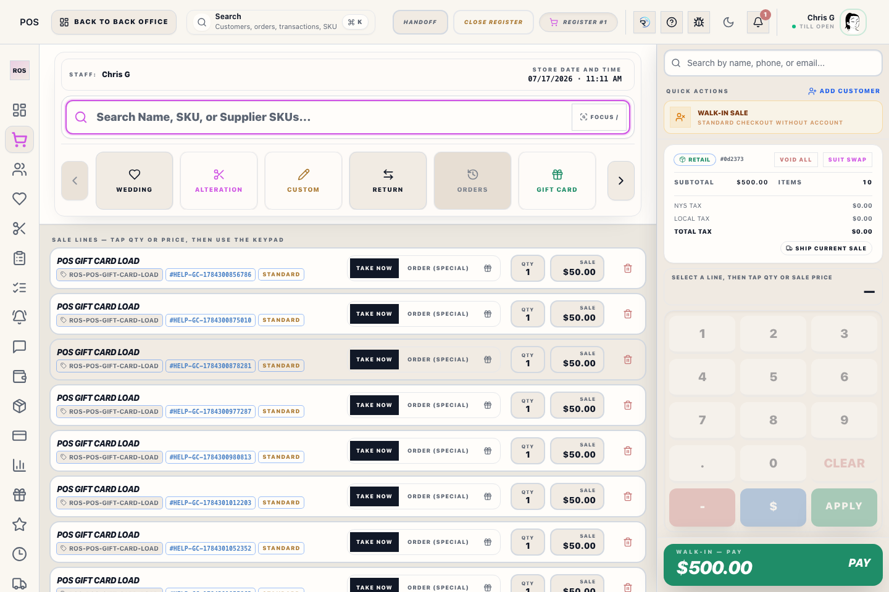
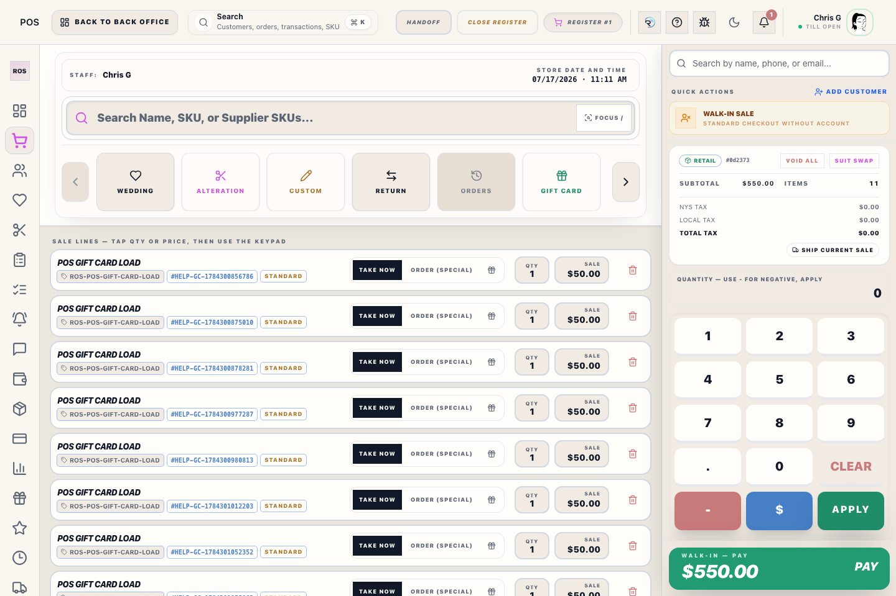
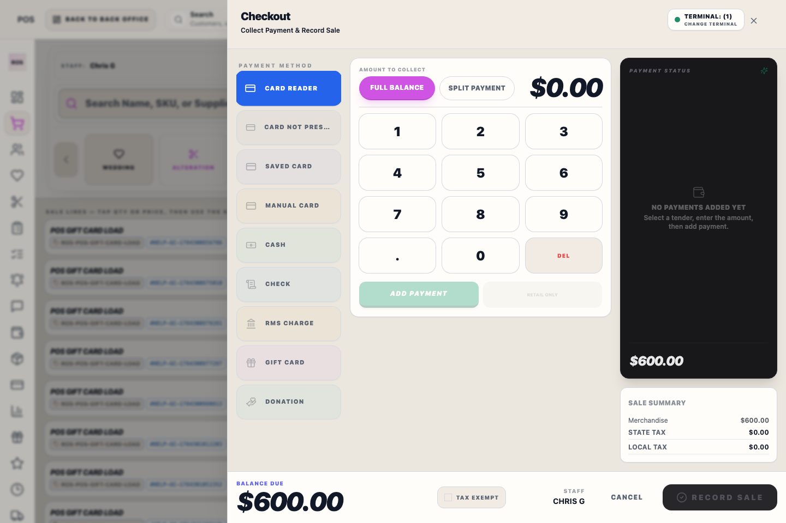

# Checkout & Payment

## Screenshots

## What this is

The checkout drawer collects payment, shows the remaining balance due, and completes the sale. It keeps terminal and hosted Card Not Present payment status visible while the cart stays in the background.

## How to use it

1. Select the payment method the customer is using.
2. Confirm the balance due and choose full balance or split payment.
3. Collect the tender and watch the payment status panel.
4. Select **Record Sale** only after the drawer shows the payment rules are satisfied.

## Payment methods

Choose the tender type on the left, then collect the amount in the center panel.

- **Card reader** sends the payment to the selected Helcim terminal. Each terminal request is bound to the sale that opened it. An approval from another sale never appears as tender for the current customer; stop and use **Payments Health** for audited recovery or refund instead of running the card again.
- **Card Not Present** is for phone orders. It opens the public HTTPS ROS handoff page; select **Open Helcim Card Entry** on that page to render the secure HelcimPay.js card form. After Helcim approves, ROS automatically attaches the validated approval amount as a **CARD NOT PRESENT** tender; verify it appears in the register ledger before recording the sale. The approval screen's **Add Payment to Sale** button remains available as an idempotent recovery action if the handoff was interrupted. If the customer stops, cancel inside Helcim and use **Recover payment** until ROS receives a definitive canceled result; do not clear the pending attempt locally.
- If Helcim shows **Successful** but ROS cannot attach the approval immediately, keep the handoff open and select **Retry Approval** or **Recover payment** in ROS. ROS preserves the original Helcim response for verification and retries the attach without charging the card again. ROS also retries a transient checkout-recording failure with the same idempotent checkout reference. Do not enter a manual payment or charge the card again while ROS is recovering the approved attempt.
- While the checkout drawer is open—or any card approval, staged tender, or recovery handoff still exists—Riverside preserves the checkout identity, tender ledger, and staged return lines across a Register refresh. An exact retry can return the already committed Transaction Record even after the original response was lost. Reusing that identity with a different session, sale, or payment snapshot is rejected and sent to recovery instead of being reported as a successful duplicate.
- After every card request is attached or has a server-confirmed final decline/cancel, the preservation ends at the sale boundary. Recording the sale or using an authorized **Clear Sale** then resets every sale-local drawer input and Card Not Present handoff. A live pending attempt cannot be released locally or moved to a new checkout/customer; its processor evidence remains in **Payments Health** until recovery resolves it.
- ROS will not record a sale when an approved Helcim attempt for that checkout is still unattached. Attach the approved card tender first, or use **Payments Health** to recover or refund the approval; this prevents an apparently completed sale from being saved with a zero ROS payment.
- Riverside does not ask staff to enter a Helcim invoice number for Card Not Present. ROS records the approved Helcim attempt returned by the secure handoff.
- Helcim may ask for billing ZIP and street address during Card Not Present entry. Those fields are controlled by Helcim's hosted verification form, not by ROS.
- **Card refund** appears only inside a guided return or exchange when ROS already has the original Helcim payment reference. Staff do not enter Helcim invoice, provider, or transaction IDs.
- ROS stages the card refund in the checkout ledger and processes it through the original Transaction Record during server settlement. Do not start a provider-only refund or a second Helcim refund; wait for the return or exchange confirmation before treating it as complete.
- **Manual Card** records a card sale or refund without a live Helcim connection. Enter only the approval/reference, last four digits, and reason. Never enter full card numbers or CVV.
- **Cash**, **check**, **gift card**, **store credit**, and other tenders remain separate so the sale ledger stays auditable. They stay locked only while a Helcim request for the exact current Register session and checkout is pending or its outcome is unverified; after an approved card tender attaches, normal split-tender entry resumes for any remaining balance.
- For **gift card**, scan or enter the card and wait for Riverside to show its verified **Regular**, **Loyalty**, **Donated**, or **Promo** type, expiration, and **Balance before this transaction**. Riverside blocks Apply until that check succeeds and blocks amounts above the available balance. Checkout verifies the balance again while recording the sale, and the completed receipt lists the card's **balance after this payment**.
- **Staff Account** appears only when the selected customer is linked to an active employee Staff Account. Use it for an employee purchase charged to their receivable balance. The merchandise still follows normal item tax rules.
- **Donation** records a non-sale donation tender. Enter the required note before adding payment so accounting can review why the donation was taken.
- When the selected customer has a wedding deposit held by another party member, the payment screen shows the available amount and most recent payer. Select **Apply $X** to add the eligible amount to this member's sale, including in-stock takeaway merchandise. The button does not allow the deposit to cover another party disbursement or an existing-order payment staged in the same checkout.
- Voiding or cancelling that Transaction Record without forfeiture restores the applied wedding deposit to the member's held balance; it is not treated as a new cash refund.
- Store credit and open deposit redemptions are not treated as cash or card tender revenue. An open deposit remains in deposit liability until the linked sale is fulfilled, when it releases to recognized revenue.
- **Cash rounding is currently off.** Cash payments and cash refunds require the exact-cent balance. When pennyless cash rounding is enabled later, it must be recorded as a transaction-level adjustment on the main Transaction Record, not as a separate Transaction Record, pickup, deposit, or orphaned payment activity.

## Terminal display

The terminal badge shows **Terminal: #** and a small **change terminal** hint. Use that control when the lane should send card payments to a different terminal.

Register #1 defaults to Terminal 1, Register #2 defaults to Terminal 2, and Registers #3/#4 choose an available configured terminal. A missing unused terminal slot should not block a register whose selected Helcim terminal is configured.

Only a Helcim attempt whose stored Register session and checkout reference both exactly match the open checkout can lock its tenders or **Record Sale**. A historical attempt reported by terminal routing remains recorded in **Payments Health**, but ROS does not import it into the current drawer or let it disable the current sale.

A normal current card request is shown as **Waiting for card** or **Checking** in Payment Status. Riverside shows the larger **Card outcome review** warning only when that request is taking longer than expected or its result cannot be verified. Before ROS reports the selected terminal as in use, the Main Hub refreshes the existing pending attempt and releases the terminal only after a verified final result.

Changing the selected customer clears pickup context loaded for the previous customer before the payment drawer opens. Reopen the intended customer's Transaction Record and select its pickup lines again; a pickup target never carries into another customer's sale.

When the Main Hub has already resolved a Checkout Recovery item from an earlier Register session, ROS verifies that exact recovery key, checkout identity, station, payment payload, and committed Transaction Record before removing the old local warning. The completed recovery record remains available for audit; it is not recreated, charged again, or copied into the new sale.

If a card attempt is canceled and retried, use the current checkout status before sending another request. A message that a Helcim attempt does not belong to the register session means the payment needs Payments Health review; do not clear it or send a fresh request until the Main Hub recovers a definitive provider result.

If the physical terminal was canceled but ROS still says **Waiting for Card**, select **Recover payment**. The Main Hub must receive or recover a definitive canceled result before another tender becomes available. A live pending request is never released from ROS merely because the local screen or terminal was closed.

To change tender, first recover a definitive decline/cancel. Other tenders and **Record Sale** remain locked while the outcome is pending or unknown. Local release controls appear only in the non-production simulator.

If the terminal approves but the drawer still shows the card attempt as pending or declined, use **Recover payment** before running the card again or changing tender. ROS sends a unique invoice reference with each terminal request and can recover the approved Helcim transaction by that reference and amount when the terminal response is delayed. A recovered approval is restored to the active checkout payment ledger; finish the sale to post the final Transaction Record. **Retry card** is available only after ROS has a definitive failed/canceled result; the absence of a match by itself is not proof that no charge exists.

## Keypad and amount controls

Use **Full balance** for the normal path. Use **Split payment** only when the customer is paying with more than one tender.

While cash rounding is off, **Full balance** loads the exact-cent amount for every tender, including cash. If future rounding is enabled, only the cash portion may round, and the receipt/history must show the adjustment on the same Transaction Record.

The amount keypad is sized for register use while keeping the payment status, sale summary, and balance due visible. Any instructions for the selected tender should remain visible below the keypad without needing to scroll.

## Completing the sale

The **Record Sale** button stays unavailable until the payment rules are satisfied and every Helcim request has a confirmed final outcome. After completion, Riverside OS opens the sale complete screen with print, view, text, email, and gift receipt actions. Receipts for returns and exchanges include the returned item as a returned/exchanged adjustment; exchange receipts also include the replacement item.

If the Main Hub connection drops before the sale completes, keep the checkout drawer open and wait for the connection banner to clear. Do not run the card again unless the drawer and Payments Health confirm that no current or unresolved card request is pending.

If payment saves but pickup or alteration pickup follow-up does not complete, Riverside OS creates checkout recovery for manager review. Resolve it when practical. If it remains open, the ordinary authorized register close stays available, the recovery remains fixable afterward, and the Z-Report records it under **Unresolved Issues at Close**.

For an exchange, Riverside commits the replacement Transaction Record and a durable exchange-settlement recovery record together. The recovery record remains a Z-close warning until the original return, inventory reversal, refund remainder, and exchange link all settle. If the screen is interrupted after the replacement saves, restore the sale and finish the existing exchange; do not ring a second replacement.

## What to watch for

- Do not collect another tender or close the drawer while a terminal request is waiting. Use **Recover payment** until ROS attaches the approval or confirms a definitive decline/cancel.
- If Riverside reports that charged item prices and tax do not match the stored Transaction total or balance, do not collect payment. Record the Transaction number and send it for financial repair; retail/display prices must never be used as the customer balance.
- If a terminal is offline or mismatched, fix the terminal selection before retrying.
- If a customer changes tender type, confirm the balance due before collecting the next payment.

## Related workflows

- [Receipt Summary](manual:pos-receipt-summary-modal)
- [Gift Cards Workspace](manual:gift-cards-workspace)
