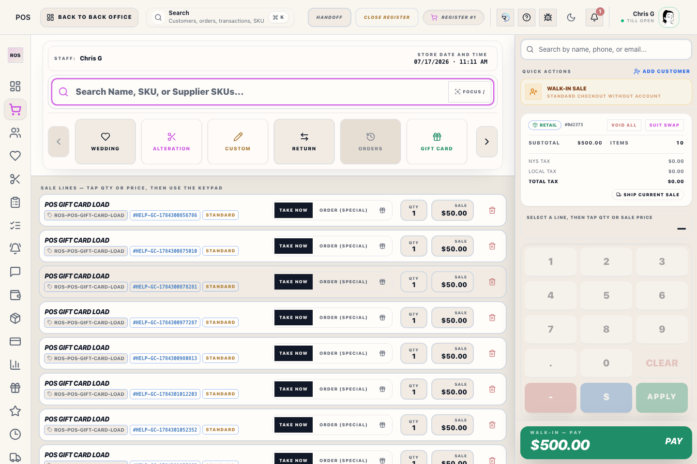
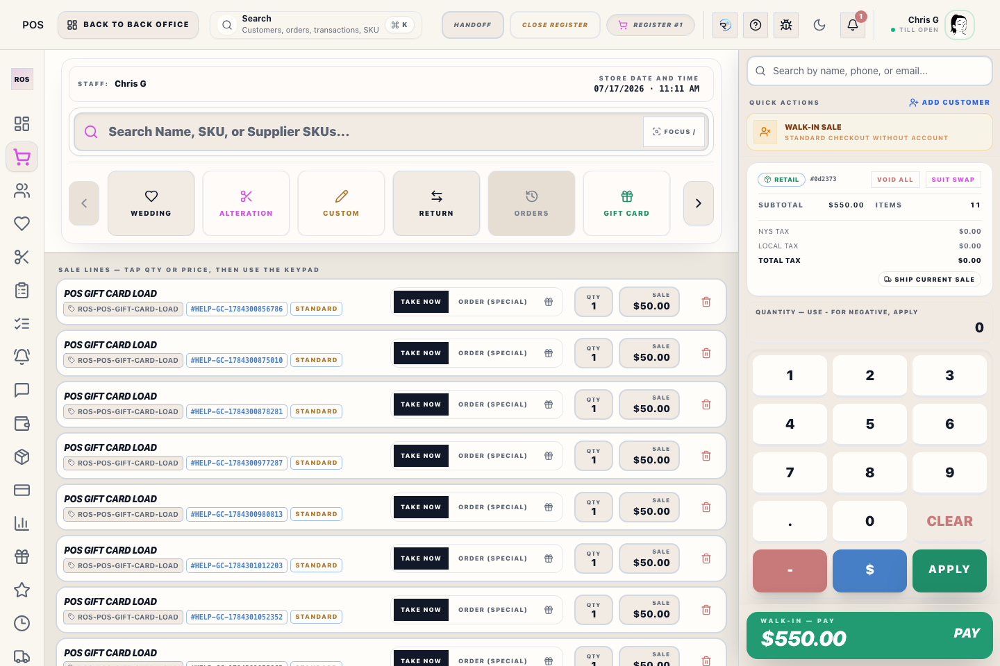
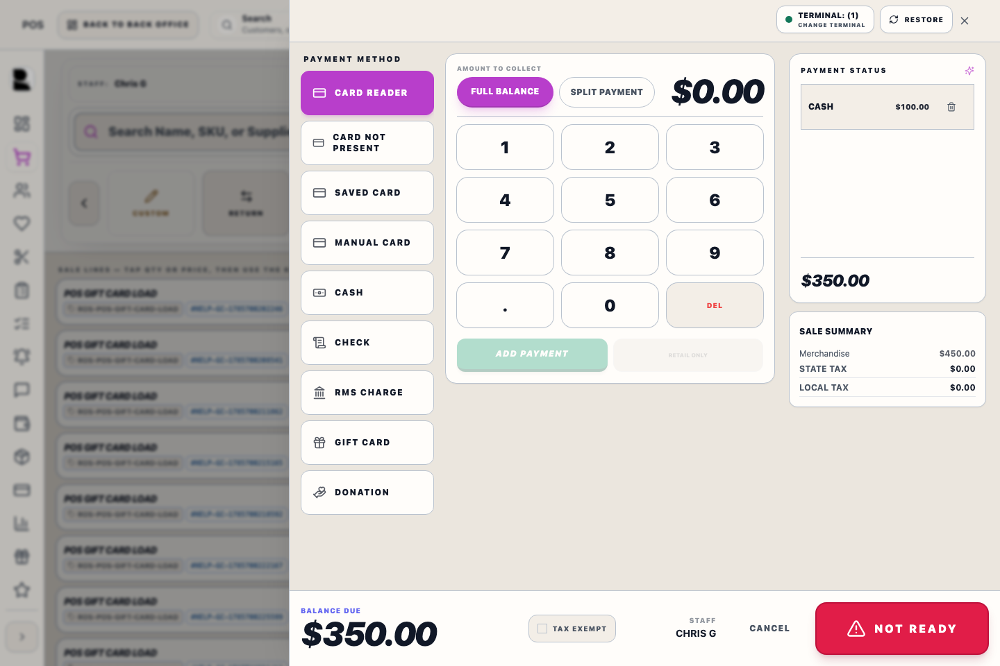
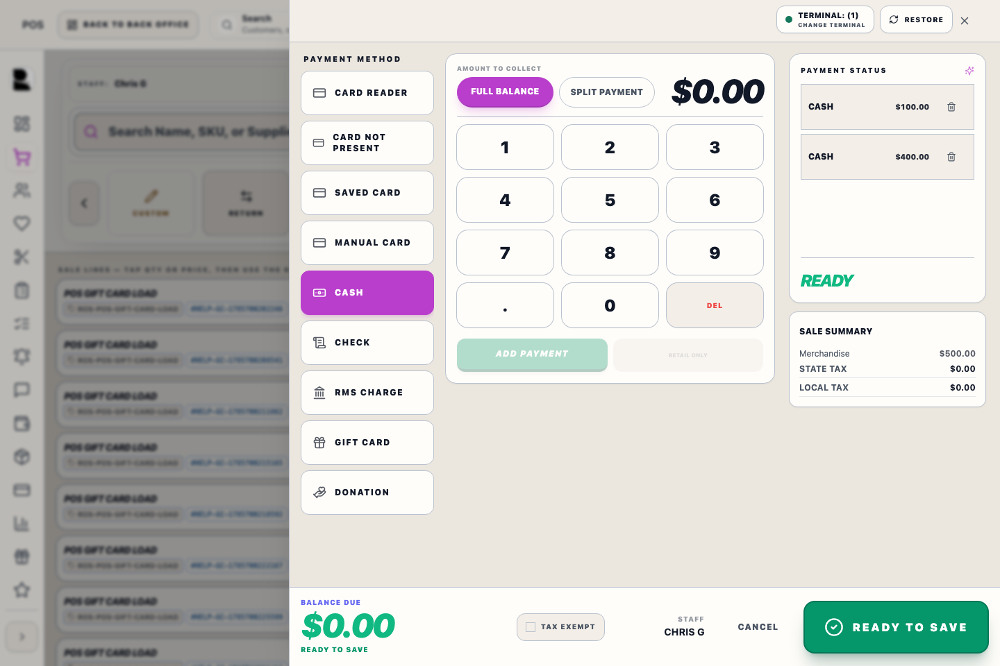

# Checkout & Payment

## Screenshots

## What this is

The checkout drawer collects payment, shows the remaining balance due, and completes the sale. It keeps terminal and hosted Card Not Present payment status visible while the cart stays in the background.

## How to use it

1. Select the payment method the customer is using.
2. Confirm the balance due and choose full balance or split payment.
3. Collect the tender and watch the payment status panel.
4. The large red **Not Ready** box means payment requirements are still incomplete. When it changes to the large green **Ready to Save** box, select it to record the sale.

## Payment methods

Choose the tender type on the left, then collect the amount in the center panel.
The active tender is shown with the Riverside accent color; all other tenders use the same high-contrast neutral surface so the selected payment method is easy to identify without relying on faint color tints.

- **Card reader** sends the payment directly to the selected Helcim terminal. Riverside does not run the Settings connection ping before a live payment because that diagnostic displays a message on the reader and can interrupt its ready state. Each terminal request is bound to the sale that opened it. When the reader declines a card but displays **Try Again**, ROS keeps that same request open and watches its exact invoice for the customer's next result. Do not select Card Reader again or enter Manual Card while the reader is offering Try Again. Repeating the request from that same sale returns the existing pending attempt instead of sending a second purchase. An approval from another sale never appears as tender for the current customer. Earlier pending, failed, timed-out, or unresolved attempts remain in Payments Health for audit but do not reserve the Register or terminal against a new payment.
- **Card Not Present** is for phone orders. It opens the public HTTPS ROS handoff page; select **Open Helcim Card Entry** on that page to render the secure HelcimPay.js card form. ROS gives that hosted attempt a unique provider invoice reference so the Main Hub can attach the exact signed Helcim webhook even if the browser confirmation is interrupted. After Helcim approves, ROS automatically attaches the validated approval amount as a **CARD NOT PRESENT** tender; verify it appears in the register ledger before recording the sale. The approval screen's **Add Payment to Sale** button remains available as an idempotent recovery action if the handoff was interrupted. If the customer stops, cancel inside Helcim and use **Recover payment** until ROS receives a definitive canceled result; do not clear the pending attempt locally.
- Before Card Reader, Card Not Present, or Saved Card sends anything to Helcim, Riverside compares the Register's exact build with the Main Hub. If they differ, no card request is sent. Update or restart the Register and retry from the open sale; do not move an approval or provider reference between builds or checkouts.
- If Card Not Present setup is interrupted before the secure Helcim card-entry page opens, retry after the setup error. ROS automatically closes the abandoned setup record once the provider initialization window has elapsed because no card entry or charge was possible. This automatic retry applies only before Helcim returns a checkout token; a payment that reached card entry remains protected until its final provider result is recovered.
- If Helcim shows **Successful** but ROS cannot attach the approval immediately, keep the handoff open and select **Retry Approval** or **Recover payment** in ROS. ROS preserves the original response and exact provider invoice for verification and retries the attach without charging the card again. A signed webhook can complete the same attachment even when the browser response is lost. ROS also retries a transient checkout-recording failure with the same idempotent checkout reference. Do not enter a manual payment or charge the card again while ROS is recovering the approved attempt.
- While the checkout drawer is open—or any card approval, staged tender, or recovery handoff still exists—Riverside preserves the checkout identity, tender ledger, and staged return lines across a Register refresh. An exact retry can return the already committed Transaction Record even after the original response was lost. Reusing that identity with a different session, sale, or payment snapshot is rejected and sent to recovery instead of being reported as a successful duplicate.
- After every card request is attached or has a server-confirmed final decline/cancel, the preservation ends at the sale boundary. Recording the sale or using an authorized **Clear Sale** then resets every sale-local drawer input and Card Not Present handoff. Unresolved processor evidence remains in **Payments Health** for reconciliation, but it is not an active routing lock on the Register or terminal.
- ROS will not record a sale when an approved Helcim attempt for that checkout is still unattached. Open **Restore** and select **Re-verify & Attach**; this prevents an apparently completed sale from being saved with a zero ROS payment.
- Riverside does not ask staff to enter a Helcim invoice number for Card Not Present. ROS creates and validates the provider reference for the exact hosted attempt.
- Helcim may ask for billing ZIP and street address during Card Not Present entry. Those fields are controlled by Helcim's hosted verification form, not by ROS.
- **Card refund** appears only inside a guided return or exchange when ROS already has the original Helcim payment reference. Staff do not enter Helcim invoice, provider, or transaction IDs.
- ROS stages the card refund in the checkout ledger and processes it through the original Transaction Record during server settlement. Do not start a provider-only refund or a second Helcim refund; wait for the return or exchange confirmation before treating it as complete.
- **Manual Card** records a card sale or refund without a live Helcim connection. Enter only the approval/reference, last four digits, and reason. Never enter full card numbers or CVV.
- **Cash**, **check**, **gift card**, **store credit**, and other tenders remain separate so the sale ledger stays auditable. A prior pending or unverified Helcim attempt does not disable them. A confirmed approval for the exact checkout is attached before ROS permits a duplicate card charge.
- For **Check** payments and refunds, enter the check number before selecting **Add Payment**. Riverside keeps that number on the applied tender, receipt evidence, and refund allocation. **Add Payment** remains unavailable until the number is present; never substitute Cash when a check is being issued.
- For **gift card**, scan or enter the card and wait for Riverside to show its verified **Regular**, **Loyalty**, **Donated**, or **Promo** type, expiration, and **Balance before this transaction**. Riverside blocks Apply until that check succeeds and blocks amounts above the available balance. Checkout verifies the balance again while recording the sale, and the completed receipt lists the card's **balance after this payment**.
- **Staff Account** appears only when the selected customer is linked to an active employee Staff Account. Use it for an employee purchase charged to their receivable balance. The merchandise still follows normal item tax rules.
- **Donation** records a non-sale donation tender. Enter the required note before adding payment so accounting can review why the donation was taken.
- When the selected customer has a wedding deposit held by another party member, the payment screen shows the available amount and most recent payer. Select **Apply $X** to add the eligible amount to this member's sale, including in-stock takeaway merchandise. The button does not allow the deposit to cover another party disbursement or an existing-order payment staged in the same checkout.
- Voiding or cancelling that Transaction Record without forfeiture restores the applied wedding deposit to the member's held balance; it is not treated as a new cash refund.
- Store credit and open deposit redemptions are not treated as cash or card tender revenue. An open deposit remains in deposit liability until the linked sale is fulfilled, when it releases to recognized revenue.
- **Cash rounding is currently off.** Cash payments and cash refunds require the exact-cent balance. When pennyless cash rounding is enabled later, it must be recorded as a transaction-level adjustment on the main Transaction Record, not as a separate Transaction Record, pickup, deposit, or orphaned payment activity.

## Terminal display

The terminal badge shows **Terminal: #** and a small **change terminal** hint. Use that control when the lane should send card payments to a different terminal.

Register #1 defaults to Terminal 1, Register #2 defaults to Terminal 2, and Registers #3/#4 choose an available configured terminal. A missing unused terminal slot should not block a register whose selected Helcim terminal is configured.

A historical attempt reported by terminal routing remains recorded in **Payments Health**, but ROS does not import it into the current drawer or let it disable tenders or the **Ready to Save** action.

If Terminal 1 has an earlier request whose checkout reference does not match the open drawer, ROS keeps it in Payments Health instead of importing that payment into the open sale. Starting a new terminal payment releases the earlier ROS routing reservation while retaining its provider evidence and checkout identity for reconciliation.

A pending Helcim row from an earlier checkout on the same Register never reserves the reader against a new checkout. When a new checkout starts, ROS removes the earlier row from terminal routing while retaining its amount, identifiers, and provider evidence in Payments Health for reconciliation. Only the current checkout is protected from duplicate card dispatch; a genuinely simultaneous payment on another Register can still reserve the shared physical reader.

A checkout-reference mismatch or stale local ROS row alone does not reserve a terminal. After the short in-flight window, ROS checks the exact Helcim invoice and automatically expires a pre-dispatch orphan only when Helcim returns no matching payment evidence and ROS has no provider payment ID, transaction ID, dispatch audit reference, or unknown-outcome error. Verified pending requests and approvals remain protected.

Staff can still select **Recover terminal** in the Payment screen to refresh the exact provider outcome. Recovery can attach a verified approval to its original sale; it does not control whether another sale may use the Register or terminal.

Customer-profile enrichment and background Helcim accounting synchronization do not take priority over an in-person card request. Automatic batch, settlement, and fee reconciliation runs once daily at 4:00 a.m. Eastern with payment/refund request capacity reserved; staff can still request an on-demand reconciliation from Payments. A temporary customer-profile lookup failure no longer prevents the terminal payment from being sent.

If an approved payment for the exact current checkout is not yet attached, select **Restore** in the Pay header and use **Re-verify & Attach**. Earlier pending, failed, timed-out, or unresolved attempts are review items, not Register locks, and do not disable another allowed payment.

**Re-verify & Attach** checks the exact Register session, checkout identity, amount, currency, and provider result before adding a sale approval to the payment ledger. For an approved refund or reversal, selecting **Ready to Save** again reuses the same durable provider attempt and idempotency key, attaches the approved Helcim movement, and only then commits the return or cancellation, balance, audit, and receipt. Restore never attaches a different sale's approval based only on a similar amount.

If Helcim completed a refund but cannot return stable automatic attachment evidence, verify the exact refund in Helcim and select **Enter Verified Refund** in Restore. Enter the real provider reference, card last four, and reason; Manager Access is required. This records the already-completed external refund and does not call Helcim again.

**Reader stopped / no approval** is available only for a physical terminal request, never for Card Not Present. Use it only when the reader is idle and the request definitively ended without approval. Riverside retains the attempt, Register, checkout reference, acting staff member, and restore action in audit history. An approved payment is never discarded or moved to another customer.

For a paid order cancellation, **Cancel Order** only stages the negative item lines and refund tender in Pay. The original Transaction Record, returned quantities, inventory, balance, payment allocations, and cancellation audit do not change while the refund is being prepared. They commit together only after **Ready to Save** succeeds; then the **Sale Complete** screen provides the event-scoped refund receipt. If staging fails, the order remains unchanged and the cancellation window shows **Retry Refund Load**.

A normal current card request is shown as **Waiting for card** or **Checking** in Payment Status. If Helcim declines one card but keeps the reader open, ROS shows **Try Card Again** and continues watching the same request. The decline remains in Helcim history, but one later exact approved result for that invoice becomes the ROS payment. Riverside allows about two minutes for the customer to insert or tap the card and complete PIN prompts before showing **Card outcome review**. While that exact checkout is waiting, the final action stays **Not Ready** and cannot record the sale. Riverside shows **Card outcome review** when the request takes longer or its result cannot be verified.

Changing the selected customer clears pickup context loaded for the previous customer before the payment drawer opens. Reopen the intended customer's Transaction Record and select its pickup lines again; a pickup target never carries into another customer's sale.

When the Main Hub has already resolved a Checkout Recovery item from an earlier Register session, ROS verifies that exact recovery key, checkout identity, station, payment payload, and committed Transaction Record before removing the old local warning. The completed recovery record remains available for audit; it is not recreated, charged again, or copied into the new sale.

If a card attempt is canceled and retried, use the current checkout status before sending another request. A message that a Helcim attempt does not belong to the register session means the payment needs Payments Health review; do not clear it or send a fresh request until the Main Hub recovers a definitive provider result.

If the physical terminal was canceled but ROS still says **Waiting for Card**, select **Recover payment** to update that attempt's audit status. You can continue with another allowed tender; the old request remains visible in Payments Health until its outcome is reconciled.

To change tender, select another allowed payment method. Use **Recover payment** to reconcile the earlier attempt and attach any verified approval to its original checkout. The current sale cannot become **Ready to Save** until its pending card request has a confirmed approval, decline, cancellation, or expiry; this prevents a late approval from arriving after the sale was recorded with another tender.

If the terminal approves but the drawer still shows the card attempt as pending or declined, use **Recover payment** before running the card again or changing tender. ROS sends a unique invoice reference with each terminal request and can recover the approved Helcim transaction by that reference and amount when the terminal response is delayed. A recovered approval is restored to the active checkout payment ledger; finish the sale to post the final Transaction Record. **Retry card** is available only after ROS has a definitive failed/canceled result; the absence of a match by itself is not proof that no charge exists.

## Keypad and amount controls

Use **Full balance** for the normal path. Use **Split payment** only when the customer is paying with more than one tender.

While cash rounding is off, **Full balance** loads the exact-cent amount for every tender, including cash. If future rounding is enabled, only the cash portion may round, and the receipt/history must show the adjustment on the same Transaction Record.

The amount keypad is sized for register use while keeping the payment status, sale summary, and balance due visible. Any instructions for the selected tender should remain visible below the keypad without needing to scroll.

Card Not Present approval does not use a physical terminal or keypad. After
Helcim approves the card, ROS automatically retries a temporary ledger
connection failure while the secure approval page remains open. **Do not run
the card again or close that page** while ROS shows **Waiting for CNP
Confirmation**. If confirmation still cannot complete, open **Restore** and use
**Re-verify & Attach** while the exact Register sale remains open.

## Completing the sale

The payment status action remains a large red **Not Ready** box until the payment rules are satisfied and every Helcim request has a confirmed final outcome. It changes to a large green **Ready to Save** box when the sale can be recorded. After completion, Riverside OS opens the sale complete screen with print, view, text, email, and gift receipt actions. Receipts for returns and exchanges include the returned item as a returned/exchanged adjustment; exchange receipts also include the replacement item.

While the device is offline, only a **simple take-now sale** paid with cash, a physical check, or a verified **Manual Card** approval completed outside ROS can queue. ROS prints **SALE SAVED - PENDING SYNC** with the recovery identity. This is not yet a Main Hub Transaction Record; give the receipt to the customer and do not ring the sale again. Shipping, Fulfillment Orders, order payments, weddings, pickups, alterations, returns/exchanges, gift cards, deposits, Store Credit/account tenders, tax-exempt sales, backdated sales, and below-cost approvals require a live Main Hub connection.

If Helcim has already approved a **simple take-now** sale and the Main Hub connection drops before ROS confirms the save, select **Ready to Save** once. ROS saves the exact checkout and approval on this Register, prints a **PAYMENT APPROVED - PENDING SYNC** receipt, and automatically submits that same checkout when the Main Hub reconnects. Do not run the card again. Shipping, pickups, orders, exchanges, alterations, and wedding disbursements remain open for live recovery because they need additional Main Hub actions.

If payment saves but pickup or alteration pickup follow-up does not complete, Riverside OS creates checkout recovery for manager review. Resolve it when practical. If it remains open, the ordinary authorized register close stays available and the recovery remains visible and fixable afterward in the operational recovery workspace; it is not printed on the financial Z-Report.

For an exchange, Riverside commits the replacement Transaction Record and a durable exchange-settlement recovery record together. The recovery record remains a Z-close warning until the original return, inventory reversal, refund remainder, and exchange link all settle. If the screen is interrupted after the replacement saves, restore the sale and finish the existing exchange; do not ring a second replacement.

When a same-day exchange returns only part of a multi-item Helcim card sale, do not reverse the full original card charge because the customer is keeping the other merchandise. Apply the returned item's value to the replacement and issue only the exact difference to **Cash**, **Original Card**, **Gift Card**, or **Store Credit**. Before ROS records a replacement sale with an Original Card refund, it checks the linked card's live Helcim batch and refundable capacity. If the partial refund cannot run while that batch is open, ROS leaves the entire exchange unrecorded; wait until the batch closes or choose Cash, Gift Card, or Store Credit. After a successful check, ROS still revalidates the refund during final settlement. Pay stays open and **Sale Complete** remains blocked until the exact refund is confirmed. A **Refund pending** state is not proof of a completed refund; never send a second refund outside ROS.

## What to watch for

- Do not run the same card twice when the reader may already have approved it. Use **Recover payment** to attach a verified approval; unresolved audit evidence does not otherwise lock the Register.
- If Riverside reports that charged item prices and tax do not match the stored Transaction total or balance, do not collect payment. Record the Transaction number and send it for financial repair; retail/display prices must never be used as the customer balance.
- If a terminal is offline or mismatched, fix the terminal selection before retrying.
- If a customer changes tender type, confirm the balance due before collecting the next payment.

## Related workflows

- [Receipt Summary](manual:pos-receipt-summary-modal)
- [Gift Cards Workspace](manual:gift-cards-workspace)
