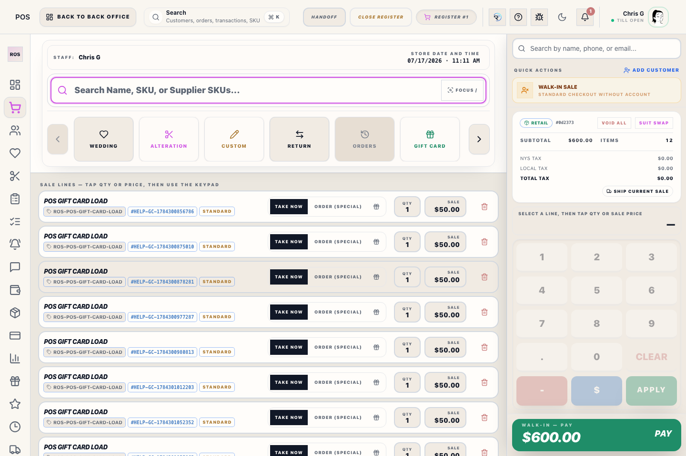
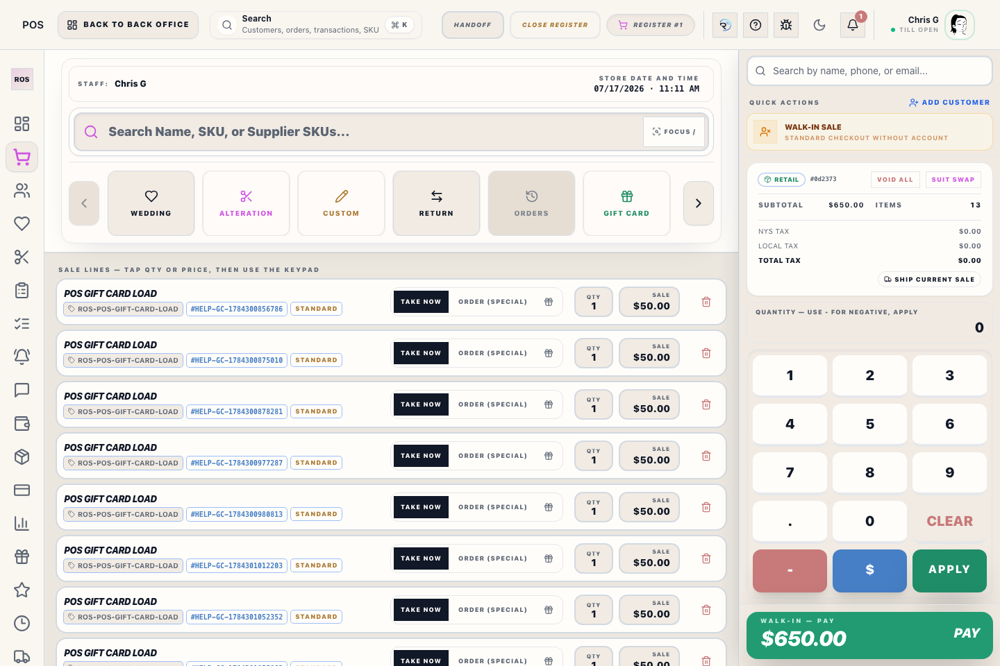
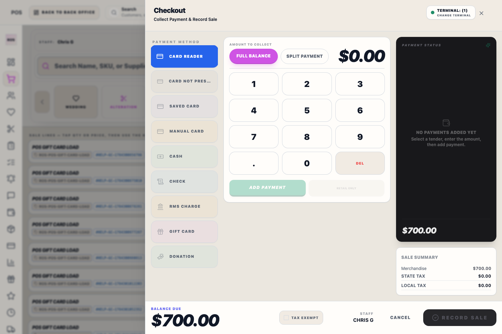

# Customer Orders

## Screenshots

Use this window when a customer already has Special, Custom, or Wedding work and staff need to review payment, editing, pickup, details, or receipt recovery. The POS order loader shows open and completed order records; completed lines remain unavailable for another pickup.

## What it shows

- The customer's open and completed order records
- Order date, amount paid, and balance due
- A plain lifecycle note such as **Deposit received**, **Balance paid**, or **Waiting on measurements**
- The order lines that are still unfulfilled
- Controls for adding a SKU to the original fulfillment work
- Quantity and price controls for unfulfilled lines that can still be corrected

## How to use it

1. Select the customer in POS.
2. Open the order loader.
3. Review the order you need.
4. Click an open item name to choose its available size or variation from the product’s option picker. The original order price is preserved when only the size or variation changes; **Save Line** remains available for quantity, price, lifecycle, or search-based corrections.
5. Use **Add to Order** when the customer is adding another item to the same original fulfillment work. When one open line already exists for the selected product, choosing another variant updates that line instead of creating a duplicate; use the quantity field when the customer needs more than one unit.
6. Use **Add Payment** when the customer is paying an existing balance.
7. For pickup, select the lines leaving with the customer and use **Pick Up Selected**. ROS adds those lines to a pickup basket; open another order and add its selected lines when the customer is taking items from multiple orders. Use **Start Pickup** when the basket contains every item leaving today.

## Important

- **Add to Order** and **Save Line** update the original fulfillment work and refresh the linked Transaction Record totals. Save Line changes an existing size, variation, quantity, or price in place; when a single open line exists for a product, selecting another variant from the add search also updates that line instead of creating a duplicate.
- Open, unfulfilled lines can be deleted even when the order has a deposit. The deposit and its payment allocation remain attached to the original Transaction Record, and any resulting credit or balance is recalculated there for the next payment/refund action.
- Every line edit is recorded in the Transaction Record audit history with the staff member, changed fields, and before/after values—even when the price and total do not change.
- Payment taken later remains a new payment movement, but it is attached to the original Transaction Record.
- Before accepting an existing-order payment, Riverside rechecks the Transaction total and balance against the customer-charged line prices and line taxes. If those values disagree, payment is blocked with **Do not collect payment**. Stop and report the Transaction number for financial repair; do not collect the displayed balance through another sale or manual tender.
- **Pick Up Selected** does not finish inside this window or add a payment. It adds only the selected pickup lines to the basket, keeps each line's original Transaction Record link, and lets staff combine one or more orders before selecting **Start Pickup**. The register finishes from **Complete Pickup** so the Sale Complete receipt screen opens.
- The pickup basket supports one item, several items, or all open ready items from each of several orders. Payment and pickup release remain tracked against each source Transaction Record.
- If recorded payments do not cover the selected pickup value plus merchandise already released, collect payment intentionally with **Add Payment** or use the audited **Manager Access** override at completion. Unselected lines and the remaining balance stay open.
- After pickup is completed, the source order is no longer open work and its lines should show **Picked Up** in history. If a just-completed order still appears in this window, close and reopen **Customer Orders** to refresh it; if it remains, report the Transaction Record number so the status can be reconciled without creating a new sale.
- New merchandise added after loading pickup lines becomes a new sale line in the same register flow.
- Use the balance and lifecycle note to confirm whether the order still needs payment, receiving follow-up, measurement follow-up, or pickup follow-up.
- When the order has linked alterations marked **Ready**, loading the order for pickup shows those alteration pickups in the Register. Completing the order pickup also marks those ready alterations **Picked Up**.

## Order types

- **Order**: standard Special Order
- **Custom**: custom garment order
- **Wedding**: order linked to a wedding workflow

Check the order type before continuing so the correct follow-up team handles it.

For **Wedding** orders:
- keep payment, deposit, and pickup work tied to the linked wedding member
- confirm the party context before continuing the order in POS
- a fully paid wedding order still needs member-readiness confirmation before pickup

For **Custom** orders, remember:
- sale price was entered when the order was booked
- actual vendor cost should be entered when the garment is received
- the main vendor-form references can be reviewed in the order detail before you continue pickup or payment work
- order detail may now include size anchors, sleeve or cuff measurements, and vendor order references copied from the HSM or Individualized form

For **Alterations linked to an order**:
- Mark the alteration **Ready** in the Alterations workspace after final inspection.
- Open the customer order from the Register and choose pickup.
- Confirm the Register shows the ready alteration pickup badge before completing pickup.
- Alterations that are still Intake, In Work, or Verify Completed do not automatically release with the order.

## Related workflows

- [Orders Workspace](manual:orders-workspace)
- [Register Checkout](manual:pos-nexo-checkout-drawer)
