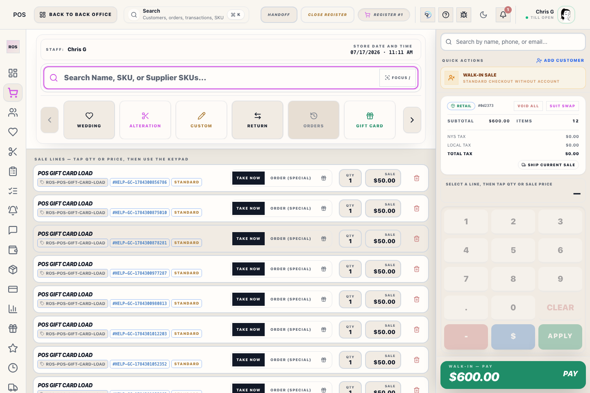
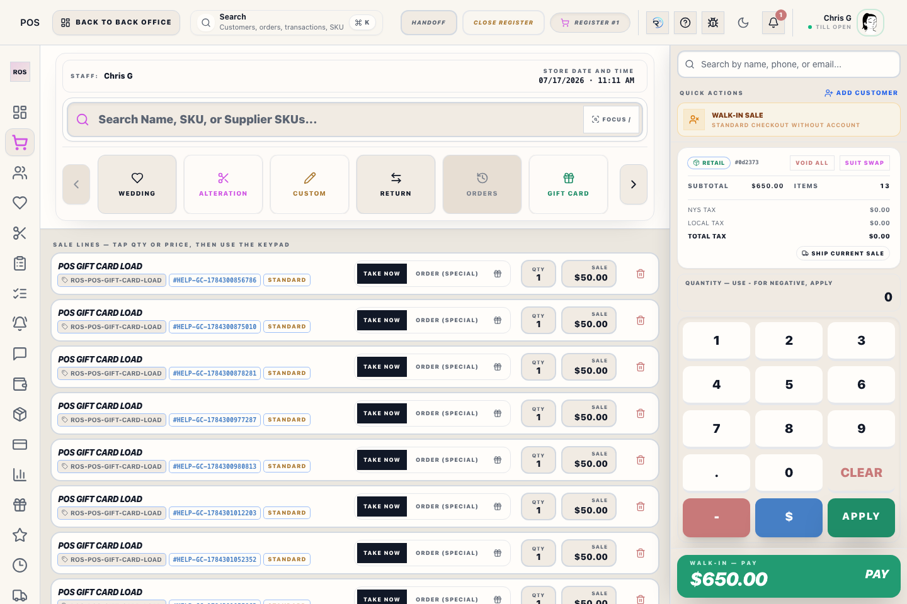
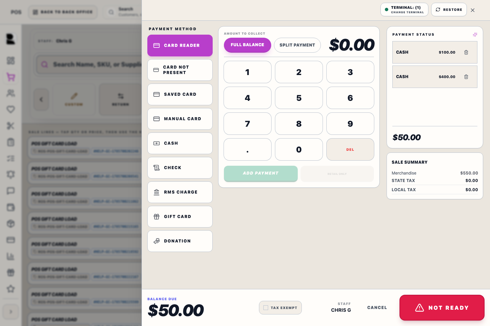

# Customer Orders

## Screenshots

Use this window when a customer already has open Special, Custom, or Wedding work and staff need to review payment, editing, pickup, or details. Completed orders remain available from the customer's history and Back Office Orders, not as active Register pickup work.

## What it shows

- The customer's open order records
- Order date, amount paid, and balance due
- A plain lifecycle note such as **Deposit received**, **Balance paid**, or **Waiting on measurements**
- The order lines that are still unfulfilled
- Controls for adding a SKU to the original fulfillment work
- Quantity and price controls for unfulfilled lines that can still be corrected

## How to use it

1. Select the customer in POS.
2. Open the order loader.
3. Review the order you need.
4. Find the open line and choose **Update Item**. The standard item option panel shows the current SKU and variation, keeps any shared model or style choices selected, and then guides you through the remaining size, style, or other available options. Confirm **Update Item** only after the complete replacement variation is shown. The original customer price is preserved when only the item variation changes.
5. Confirm the green **Item selection updated** message on the order line. It shows the previous and new SKU/variation and the retained customer price. Use **Save Line** separately for quantity, price, or lifecycle corrections.
6. Use **Add to Order** when the customer is adding another item to the same original fulfillment work. When one open line already exists for the selected product, choosing another variant updates that line instead of creating a duplicate; use the quantity field when the customer needs more than one unit.
7. Use **Add Payment** when the customer is paying an existing balance. The payment stays in **Order work in this cart**, and Customer Orders remains open so you can add a payment or pickup from another order.
8. For pickup, select the lines leaving with the customer and use **Pick Up Selected**. ROS adds those lines to **Order work in this cart**; open another order and add its selected lines when the customer is taking items from multiple orders. Choose **Continue with Pickup** when the cart contains every payment and pickup leaving today.

## Important

- **Update Item**, **Add to Order**, and **Save Line** update the original fulfillment work and refresh the linked Transaction Record totals. **Update Item** changes only the catalog variation and retains the customer’s saved unit price. **Save Line** changes quantity, price, or lifecycle; changing a price also recalculates that line's state and local tax from the actual saved price. When a single open line exists for a product, selecting another variant from the add search also updates that line instead of creating a duplicate.
- After **Save Line**, Riverside confirms the price returned by the Main Hub. A success message includes the retained price; if the Main Hub does not return that exact value, Riverside shows an error instead of claiming the change was saved.
- New merchandise is booked on the date it is added to the existing Transaction. A same-day remove/add switch is netted as one amendment: only a positive increase enters that day's Booked Sales, while zero or negative changes remain visible as audit adjustments.
- Open, unfulfilled lines can be removed even when the order has a payment. On a paid Transaction Record, ROS preserves the removed item as the itemized refund source instead of deleting its history. Add any replacement item to the same Transaction Record: a lower-priced replacement leaves only the difference to refund, an equal replacement consumes the credit, and a higher-priced replacement creates only the additional balance due. With no replacement, the full removed-item credit remains ready for refund.
- Every line edit is recorded in the Transaction Record audit history with the staff member, changed fields, and before/after values—even when the price and total do not change. Variation updates record the prior and replacement SKU/variation plus the retained customer price.
- Payment taken later remains a new payment movement, but it is attached to the original Transaction Record.
- One Register cart may apply payments to several open orders, pick up from several open orders, or combine those actions. Review the order chips under **Order work in this cart** before continuing. An explicitly entered partial payment is preserved when pickup work is added; Riverside does not silently replace it with the full balance.
- Customer Orders can only stage pickup lines. It cannot mark an item **Picked Up**, complete an order, move inventory, recognize revenue, or create commission. Those changes occur only when the Register cart finishes successfully and the **Sale Complete** screen opens.
- Before accepting an existing-order payment, Riverside rechecks the Transaction total and balance against the customer-charged line prices and line taxes. If those values disagree, payment is blocked with **Do not collect payment**. Stop and report the Transaction number for financial repair; do not collect the displayed balance through another sale or manual tender.
- **Pick Up Selected** does not finish inside this window or add a payment. It adds only the selected pickup lines to the cart, keeps each line's original Transaction Record link, and lets staff combine one or more orders before selecting **Continue with Pickup**. Even a fully paid order must finish from **Complete Pickup** and reach **Sale Complete** before Riverside marks anything picked up.
- The pickup basket supports one item, several items, or all open ready items from each of several orders. Payment and pickup release remain tracked against each source Transaction Record.
- If recorded payments do not cover the selected pickup value plus merchandise already released, collect payment intentionally with **Add Payment** or use the audited **Manager Access** override at completion. Unselected lines and the remaining balance stay open.
- After pickup is completed, the source order is no longer open work and disappears from this Register list. Its lines remain available as **Picked Up** in customer history and Back Office Orders. If a just-completed order still appears, close and reopen **Customer Orders** to refresh it; if it remains, report the Transaction Record number so the status can be reconciled without creating a new sale.
- New merchandise added after loading pickup lines becomes a new sale line in the same register flow.
- Use the balance and lifecycle note to confirm whether the order still needs payment, receiving follow-up, measurement follow-up, or pickup follow-up.
- When the order has linked alterations marked **Ready**, loading the order for pickup shows those alteration pickups in the Register. Completing the order pickup also marks those ready alterations **Picked Up**.

## Order types

- **Order**: standard Special Order
- **Custom**: custom garment order
- **Wedding**: order linked to a wedding workflow

Check the order type before continuing so the correct follow-up team handles it.

For **Wedding** orders:

- keep payment, deposit, and pickup work tied to the linked wedding member
- confirm the party context before continuing the order in POS
- a fully paid wedding order still needs member-readiness confirmation before pickup

For **Custom** orders, remember:

- sale price was entered when the order was booked
- actual vendor cost should be entered when the garment is received
- the main vendor-form references can be reviewed in the order detail before you continue pickup or payment work
- order detail may now include size anchors, sleeve or cuff measurements, and vendor order references copied from the HSM or Individualized form

For **Alterations linked to an order**:

- Mark the alteration **Ready** in the Alterations workspace after final inspection.
- Open the customer order from the Register and choose pickup.
- Confirm the Register shows the ready alteration pickup badge before completing pickup.
- Alterations that are still Intake, In Work, or Verify Completed do not automatically release with the order.

## Related workflows

- [Orders Workspace](manual:orders-workspace)
- [Register Checkout](manual:pos-nexo-checkout-drawer)
