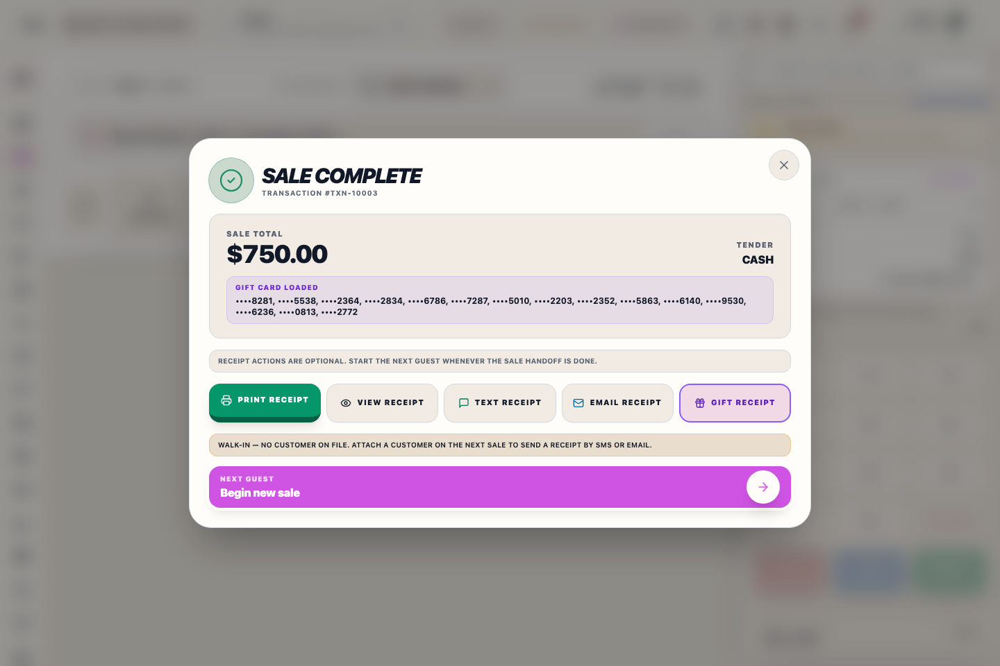
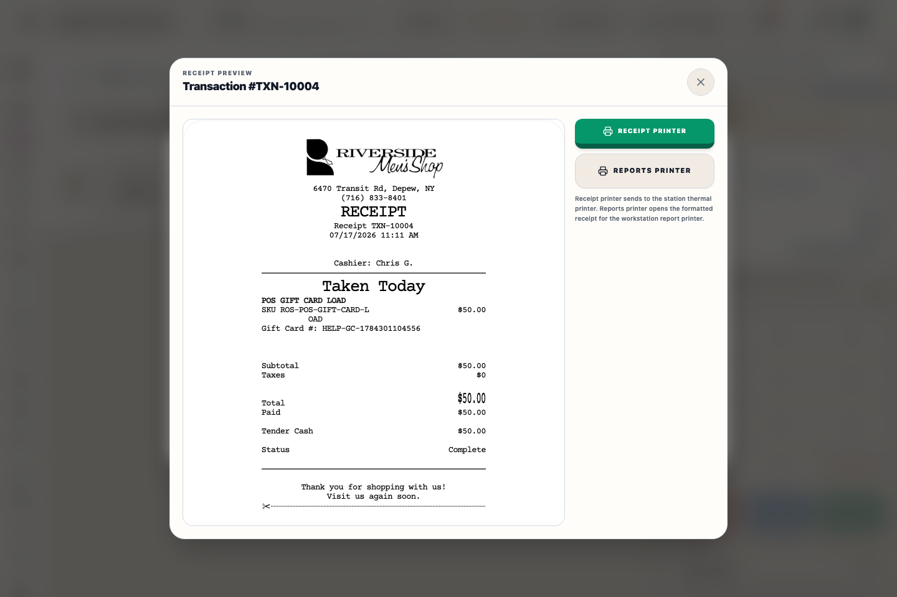
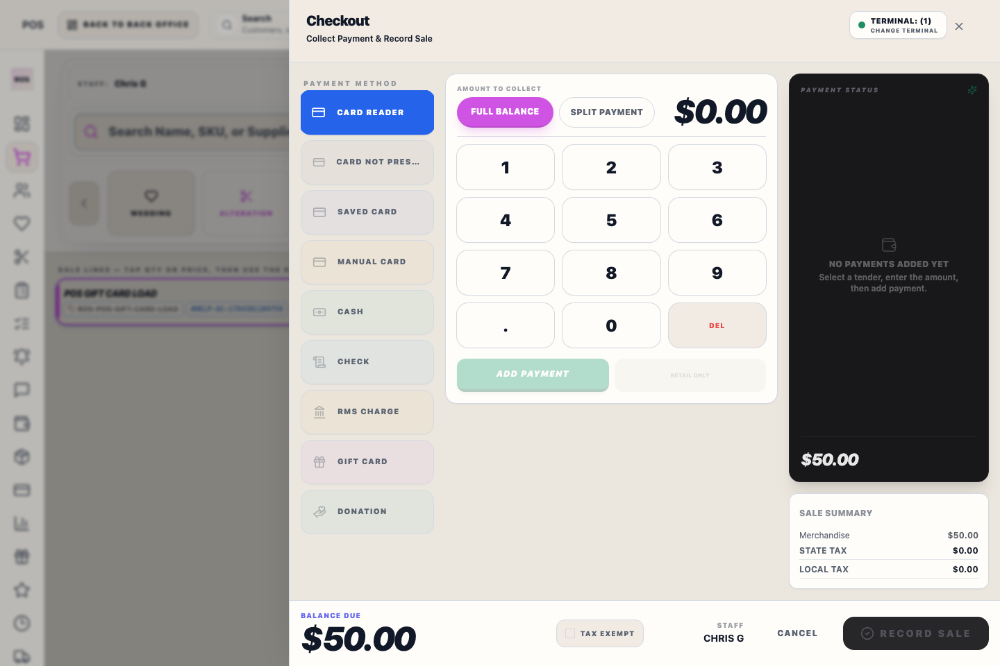

# Receipt Preview and Delivery

## Screenshots

## What this is

The sale complete receipt preview shows the customer receipt after checkout. It should match the Receipt Builder style closely enough that staff can trust what will print, email, or text.

## How to use it

1. Review the outcome label, transaction total or amount collected, tender, balance, customer, and Transaction number on the completion screen.
2. Choose print, view, text, email, gift receipt, or reports printer from the receipt action bar, which stays visible without scrolling.
3. Confirm the preview or printer path shows the formatted receipt before handing it off.
4. Choose **Begin new sale** when finished. The next-sale Access PIN screen appears only after the completion screen closes.

## Actions

- **Print receipt** sends the customer receipt through the station receipt-printer route. If it fails, the completed sale stays intact and Riverside offers retry, printer check, SMS, or email delivery.
- **View receipt** opens the preview.
- **Text receipt** and **Email receipt** send the customer copy when the sale has the needed customer contact information.
- **Gift receipt** prints a gift copy without exposing normal payment detail.
- **Reports printer** opens the formatted receipt copy for the workstation report-printer path; it does not replace the Epson receipt-station print route.
- **Review Request** lets the cashier send or skip the Podium review request for eligible completed or picked-up sales.

## Review requests

The review request option appears on eligible sale completion screens when Podium review requests are enabled. Riverside only sends after completed or picked-up sales, and only once per customer every 180 days. If the customer was asked recently, has no phone or email, or the cashier chooses **Do not send**, Riverside records that outcome instead of silently failing.

## Receipt preview

The preview is intentionally narrow and receipt-like. It uses the same receipt content that the customer should receive by print, text, or email.

Receipt line items keep the product name as the primary line, show quantity only when more than one unit is sold, and place SKU with the price on the item detail line. Pickup receipts still use the normal **RECEIPT** heading; picked-up merchandise appears in the body under **PICKED UP** with the original order date on those lines. Items still remaining on the transaction are not printed on the pickup receipt.

Receipt totals are sourced from the completed transaction ledger. Shipping and alteration charges remain visible as separate non-merchandise lines, **Paid** and **Balance** reflect the transaction’s actual stored values, and payments applied to existing Transaction Records are listed separately. A payment-only receipt uses the actual applied payment amount instead of the new transaction header amount.

The completion screen identifies the customer and Transaction number and labels the completed event as a sale, payment, pickup, refund, exchange, or combined sale/pickup/payment outcome. Pickup handoffs show the amount collected during that pickup event and preserve the Transaction Record's actual remaining balance. Payment applications and linked pickups are read back from the completed transaction so their target Transaction numbers, applied amounts, remaining balances, and picked-up item counts match the saved result.

When a customer picks up an order and buys new merchandise in the same checkout, the sale complete screen prints one checkout receipt. It includes the new sale lines plus the exact picked-up items and their source Transaction number. Daily Sales lists the checkout once, while **Pickups Today** preserves the fulfillment record. Pure pickup checkouts still print the pickup receipt for the original transaction.

Split tenders print as separate tender lines, such as **Cash**, **CC**, **RMS90**, **RMS**, **Check**, or **SC**, so the receipt matches the payment breakdown staff see in history and reporting.

Manager-approved backdated sales are marked **BACKDATED SALE** with the backdated business date. The printed receipt timestamp remains the server checkout time; payment movement still belongs to the actual processing day.

If the reports printer opens a blank page, retry from the receipt preview and report the transaction number to support. The report-printer window should contain the formatted receipt, not a white page.

## Walk-in sales

If no customer is attached, the sale complete screen explains that SMS or email delivery requires a customer on file. Staff can still print or view the receipt.

## What to watch for

- Confirm the receipt total, paid amount, tender, and status before handing the receipt to the customer.
- On Register #1, CASH and CHECK sales open the Epson-attached cash drawer automatically when the drawer setting is enabled.
- Receipt reprints and gift receipts do not intentionally open the cash drawer.
- Use gift receipt only when the customer asks for one.
- Do not use screenshots of receipts as customer delivery unless support asks for troubleshooting evidence.

## Related workflows

- [Register Checkout](manual:pos-nexo-checkout-drawer)
- [Receipt Settings](manual:settings-receipt-builder-panel)
- [Printers & Scanners](manual:settings-printers-and-scanners-panel)
