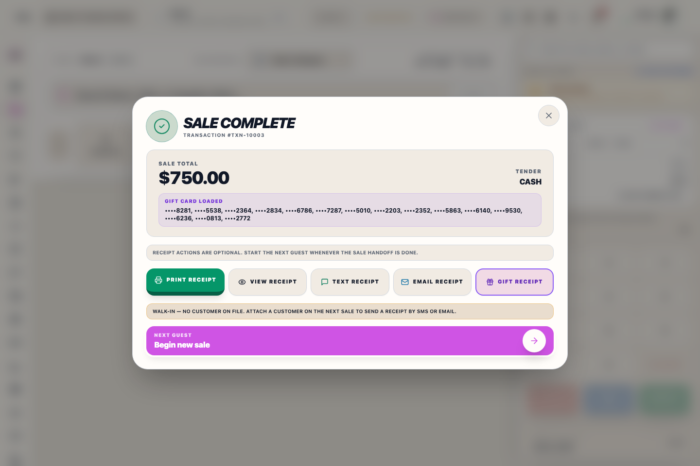
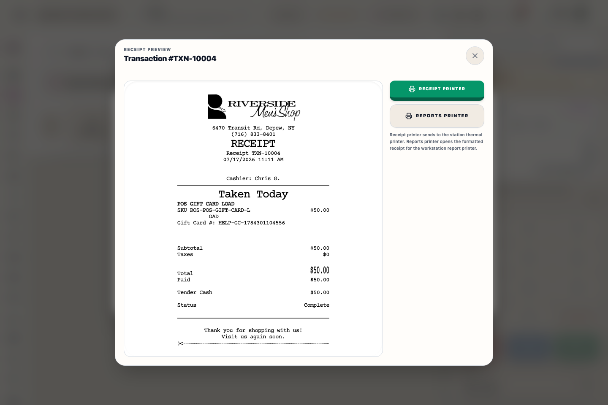
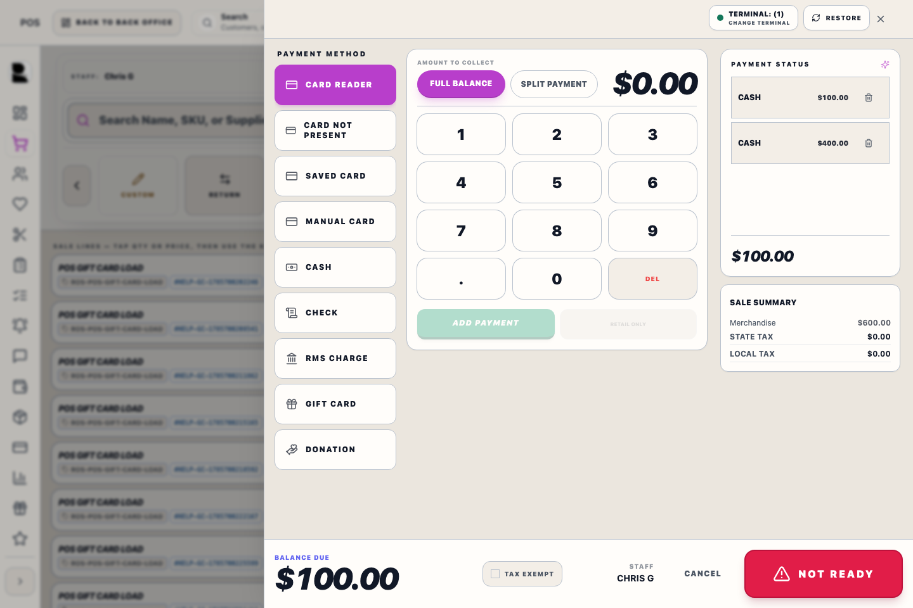

# Receipt Preview and Delivery

## Screenshots

## What this is

The receipt preview shows the customer receipt after checkout or when reopening a historical Transaction Receipt. It should match the Receipt Builder style closely enough that staff can trust what will print, email, or text.

Each merchandise line shows its saved tax as one smaller secondary line without recalculating from the displayed price: **4.75%: $0.00 4.00%: $0.00 Total Tax: $0.00**. Zero components remain visible, so clothing below the state threshold shows $0.00 for 4.00%, full-tax merchandise shows both component amounts, and non-taxable merchandise shows $0.00 for all three values. The financial summary still shows the authoritative total sales tax for the Transaction Record.

When a completed sale includes wedding deposits for other party members, Sale Complete and the payer receipt list every beneficiary, party, amount, and destination. The receipt says whether money was held for that member's future order or applied to an exact Transaction Record. These amounts stay separate from the payer's merchandise total while still explaining the full tender collected. A Deposit Only receipt remains printable even when the payer Transaction has no merchandise lines. When the held deposit later funds the member's order, that member receipt identifies the original payer and wedding party.

## How to use it

1. Review the outcome label, transaction total or amount collected, tender, balance, customer, and Transaction number in the enlarged completion workspace.
   - For a cash overpayment, the right side beneath **Receipt contact** shows a large, high-contrast **Change due** amount with **Return to customer** guidance. Give that amount back before beginning the next sale.
2. Choose print, view, text, email, gift receipt, or reports printer from the receipt action bar, which stays visible without scrolling.
3. Confirm the preview or printer path shows the formatted receipt before handing it off. A successful gift-receipt print closes the gift chooser automatically.
4. Choose the taller **Begin new sale** action when finished. For register security, Riverside also closes an unattended completion screen and returns to Access PIN entry after two minutes.

When a receipt is opened from Daily Sales, Transaction History, or Staff Profile history, Riverside labels it **Transaction Receipt** (or **Return / Exchange Receipt**) and ends with **Close receipt**. A Daily Sales payment record reprints the payment-event receipt from that day, not the target order's lifetime purchase receipt. Historical receipt review never presents **Sale complete** or **Begin new sale** because no new checkout was just completed.

## Actions

- **Print receipt** sends the customer receipt through the station receipt-printer route. If it fails, the completed sale stays intact and Riverside offers retry, printer check, SMS, or email delivery.
- **View receipt** opens the preview.
- **Text receipt** sends the customer copy through Podium SMS/MMS when **Settings → Integrations → Podium → Text receipts enabled** is on; this setting is independent from pickup, alteration, appointment, staff-authored, and review messages. **Email receipt** sends it through Store Email. When delivery fails, Riverside shows the provider/setup reason so staff can correct the integration without repeating the sale.
- **Gift receipt** prints a gift copy without exposing normal payment detail and closes its line chooser after a successful print.
- **Reports printer** opens the formatted receipt copy for the workstation report-printer path; it does not replace the Epson receipt-station print route.
- When **Collect and Build Orders** has funded deposits but the prepared member Transactions are not posted yet, the heading says **Deposit complete · orders pending** and the primary action says **Continue to Member Transactions**. Closing the completion screen or reaching its unattended timeout opens the required **Wedding Deposit → Orders & Receipts** final review instead of ending the workflow. **Create All Member Transactions** posts the prepared separate member Transactions against their exact funded sources; it does not collect another tender. **Open Wedding Builder** remains an optional review action after an individual funded member Transaction is already complete.
- **Wedding Deposit → Orders & Receipts** can reopen both the original payer receipt and each posted member receipt. These are historical reprints and do not reopen the cash drawer.
- **Review Request** confirms that an eligible completed or picked-up sale is automatically scheduled for an unbiased follow-up at 10:00 AM five days later.

## Review requests

The review status appears only on eligible just-completed sale screens when Podium review requests are enabled. Historical receipt reprints do not change the schedule. Riverside waits five days after fulfillment, then creates the official review link through Podium and sends it at 10:00 AM by Podium text when the customer has a usable phone or by Podium email when email is the only usable destination. Staff do not selectively send or skip individual eligible sales. Riverside asks at most once per customer every 180 days, honors the customer review opt-out, and keeps scheduled, suppressed, and failed outcomes explicit in Operations → Reviews.

## Receipt preview

The preview is intentionally narrow and receipt-like. It uses the same receipt content that the customer should receive by print, text, or email.

Receipt line items keep the product name as the primary line, show quantity only when more than one unit is sold, and place SKU with the price on the item detail line. Pickup receipts still use the normal **RECEIPT** heading; merchandise picked up from any existing Order always appears in the body under **PICKED UP**, including when the same checkout also adds a fee or new merchandise. Each picked-up item also names its source public Order number, so a combined pickup clearly distinguishes items from `ORD-XXXXXX` and `ORD-XXXXXXX`. **Taken Today** is reserved for merchandise first sold and taken home in the current checkout. Items still remaining on the transaction are not printed on the pickup receipt.

A completed takeaway sale remains a sale receipt with its purchased merchandise, totals, tax, savings, and tender. Riverside uses the compact **Order payment** summary only when the register completed an explicit pickup or payment-on-order workflow; a generic **Fulfilled** status does not turn an ordinary takeaway receipt into a payment receipt.

Receipt totals are sourced from the completed transaction ledger. Fee-only charges print as one concise **SHIPPING FEE** or **ALTERATION FEE** line with its price; they do not print merchandise variation, SKU, fulfillment, or service-section detail. Tracked alteration work can still show its customer-item context. **Paid** and **Balance** reflect the transaction’s actual stored values. When one checkout also pays an existing order, the merchandise subtotal and taxes remain visible, and one normal-sized **Order payment** section identifies the public Order number, previously paid amount when applicable, today's tender, remaining balance, and **Paid in full** or **Balance due** status. The receipt does not repeat that information under separate pickup-status, payment-in-full, and payment-history headings. **Total charged today** still equals the full tender collected across both purposes. A payment-only receipt contains no **Taken Today** merchandise section. Riverside uses the ROS Transaction number only when no public Order number exists.

The completion screen identifies the customer and Transaction number and labels the completed event as a sale, payment, pickup, refund, exchange, or combined sale/pickup/payment outcome. Pickup handoffs show the amount collected during that pickup event and preserve the Transaction Record's actual remaining balance. Payment applications and linked pickups are read back from the completed transaction so their target Transaction numbers, applied amounts, remaining balances, and picked-up item counts match the saved result.

Reprinting a settled exchange from Transaction History uses the exchange event, not the replacement sale by itself. The customer copy is headed **RETURN / EXCHANGE**, shows the returned merchandise as a negative exchanged line, shows the replacement merchandise as a positive line, and uses **Exchange Credit** anywhere that tender must be named.

When a customer picks up an order and buys new merchandise in the same checkout, the sale complete screen prints one checkout receipt. It includes the new sale lines plus the exact picked-up items and their source Transaction number. Daily Sales lists the checkout once, while **Pickups Today** preserves the fulfillment record. Pure pickup checkouts still print the pickup receipt for the original transaction.

Split tenders print as separate tender lines, such as **Cash**, **CC**, **Card Not Present**, **Manual Card**, **RMS90**, **RMS**, **Check**, or **SC**, so the receipt matches the payment breakdown staff see in history and reporting. **Card Not Present** means Helcim approved the secure online CNP entry; **Manual Card** means staff recorded an external approval without a live Helcim transaction.

Manager-approved backdated sales are marked **BACKDATED SALE** with the backdated business date. The printed receipt timestamp remains the server checkout time; payment movement still belongs to the actual processing day.

If the reports printer opens a blank page, retry from the receipt preview and report the transaction number to support. The report-printer window should contain the formatted receipt, not a white page.

## Walk-in sales

If no customer is attached, the sale complete screen explains that SMS or email delivery requires a customer on file. Staff can still print or view the receipt.

## What to watch for

- Confirm the receipt total, paid amount, tender, and status before handing the receipt to the customer.
- On Register #1, CASH and CHECK sales open the Epson-attached cash drawer automatically when the drawer setting is enabled.
- Receipt reprints and gift receipts do not intentionally open the cash drawer.
- Use gift receipt only when the customer asks for one.
- Do not use screenshots of receipts as customer delivery unless support asks for troubleshooting evidence.

## Related workflows

- [Register Checkout](manual:pos-nexo-checkout-drawer)
- [Receipt Settings](manual:settings-receipt-builder-panel)
- [Printers & Scanners](manual:settings-printers-and-scanners-panel)
