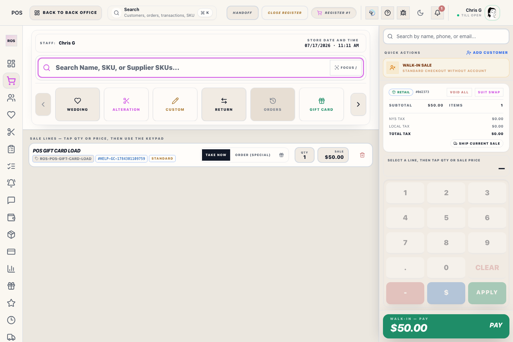
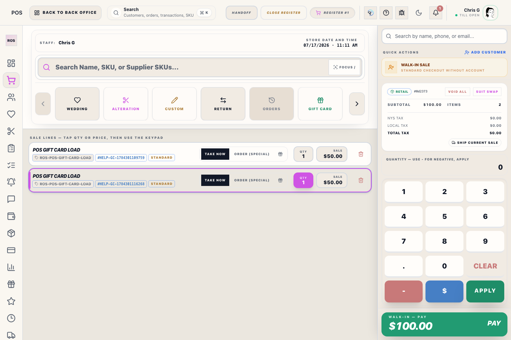
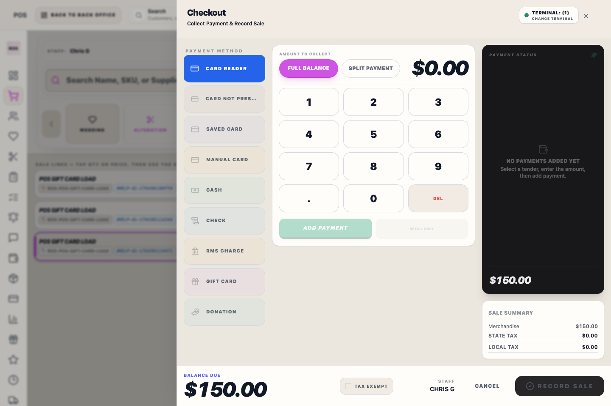

# Register Dashboard (pos)

## What this is

This is the default home screen many Windows register stations land on after the till opens. It gives staff a quick shift overview and a safe starting point before they jump into the live cart.

## How to use it

1. Open the register and finish the readiness check on the Register Access screen first.
2. Review the dashboard cards for shift context, then switch to **Register** when you are ready to sell.
3. Use the dashboard when you need to pause between customers without leaving the POS shell.

## Operational detail

Use the dashboard between customers, not during an in-progress checkout. If the next customer starts while a prior receipt, payment, or parked sale is unresolved, finish that recovery first. The dashboard is safe for orientation, but financial truth lives in the cart, receipt summary, register reports, and close workflow.

## Tips

- This screen is post-open only. API and receipt-printer readiness are checked earlier on the Register Access screen.
- If the previous sale had a receipt-printing problem, finish recovery in the Receipt Summary screen before returning fully to dashboard rhythm.
- If scanner input stops landing in product search after you return to the cart, use **Focus /** in the cart, or press **/** on a keyboard station, before scanning again.

## Screenshots

## What happens next

When the next customer is ready, switch to Register and confirm the product search field is ready before scanning. At shift end, move from the dashboard to Register Reports or Close Register instead of treating dashboard totals as the final Z-report.

## Manager review

Manager review is needed when dashboard context conflicts with the cart, register reports, or close-register evidence. The dashboard is for orientation; it should never override payment confirmation, receipt summary, Z-report totals, or transaction history.

## Related workflows

- [Register Checkout](manual:pos-nexo-checkout-drawer)
- [Close Register](manual:pos-close-register-modal)
