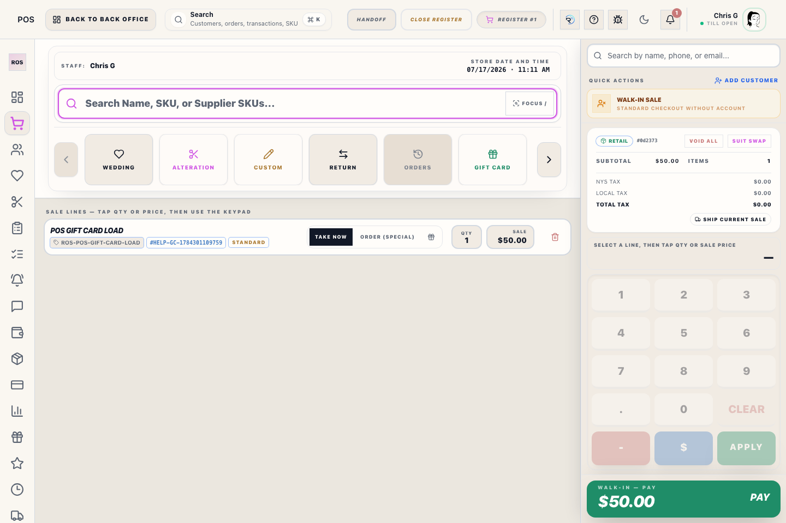
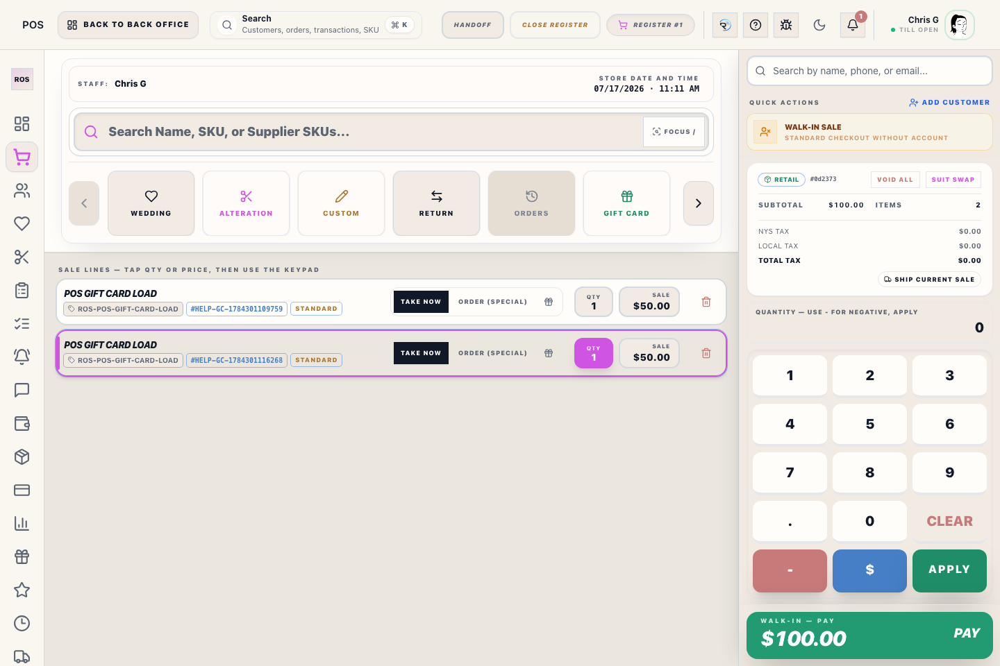
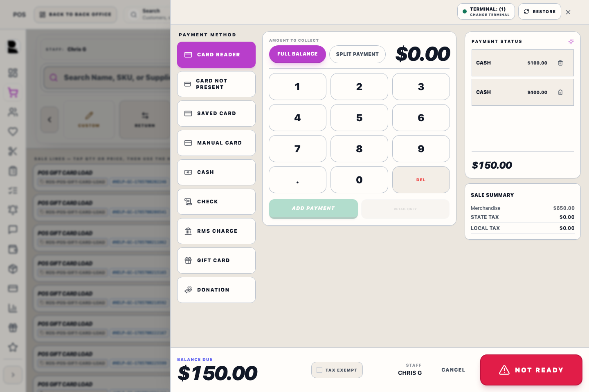

# Register Dashboard (pos)

## What this is

This is the default home screen many Windows register stations land on after the till opens. It gives staff a quick shift overview and a safe starting point before they jump into the live cart.

## How to use it

1. Open the register and finish the readiness check on the Register Access screen first.
2. Confirm the signed-in staff member, Register number, and session number in the command-center header.
3. Review Today's Sales, Notifications, Overdue Pickups, Alterations, Tasks, and Inventory Alerts before switching to **Register**.
4. Use **Priority Feed** and **Wedding Pulse** for immediate floor follow-up. Use Weather and Sales by Hour for store-day context.
5. Use the dashboard when you need to pause between customers without leaving the POS shell.

## Operational detail

Use the dashboard between customers, not during an in-progress checkout. If the next customer starts while a prior receipt, payment, or parked sale is unresolved, finish that recovery first. The dashboard is safe for orientation, but financial truth lives in the cart, receipt summary, register reports, and close workflow.

The POS dashboard is the register staff command center. It intentionally presents the store facts needed between customers even when a manager can also review related facts in Back Office; those are separate staff contexts, not redundant screens.

The **Today's Sales** card uses the same booked Daily Sales subtotal and sale count as Back Office and Register Reports. Shipping remains separate, while alteration charges follow the Daily Sales subtotal rules. Open Daily Sales for the itemized activity and tender reconciliation behind the card.

**Sales by Hour** uses original transaction times and includes alteration charges. Shipping is reported separately and does not increase sales totals, sales counts, averages, or commissions.

The notification preview uses the same shared Notification Center data as the top bar. Opening a preview routes to the inbox instead of creating a second notification feed or independent status.

When comparing another financial report, first confirm its displayed basis. **Booked Daily Sales**, **recognized revenue**, **payment-day tender**, **deposits**, and **drawer cash** are different ledgers. Figures with the same label and basis must match; figures from different ledgers must remain separately labeled.

## Tips

- This screen is post-open only. API and receipt-printer readiness are checked earlier on the Register Access screen.
- If the previous sale had a receipt-printing problem, finish recovery in the Receipt Summary screen before returning fully to dashboard rhythm.
- If scanner input stops landing in product search after you return to the cart, use **Focus /** in the cart, or press **/** on a keyboard station, before scanning again.

## Screenshots

## What happens next

When the next customer is ready, switch to Register and confirm the product search field is ready before scanning. At shift end, move from the dashboard to Register Reports or Close Register instead of treating dashboard totals as the final Z-report.

## Manager review

Manager review is needed when payment confirmation, receipt summary, Daily Sales, or close-register evidence conflicts. The POS and Back Office **Today's Sales** cards should match the booked Daily Sales subtotal for the same store day.

## Related workflows

- [Register Checkout](manual:pos-nexo-checkout-drawer)
- [Close Register](manual:pos-close-register-modal)
