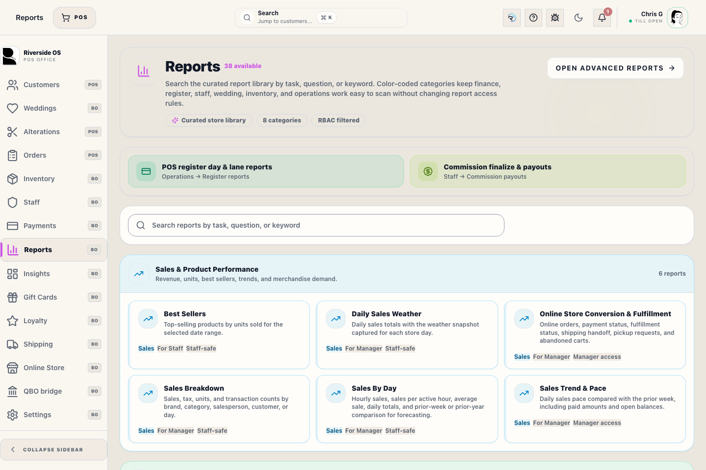
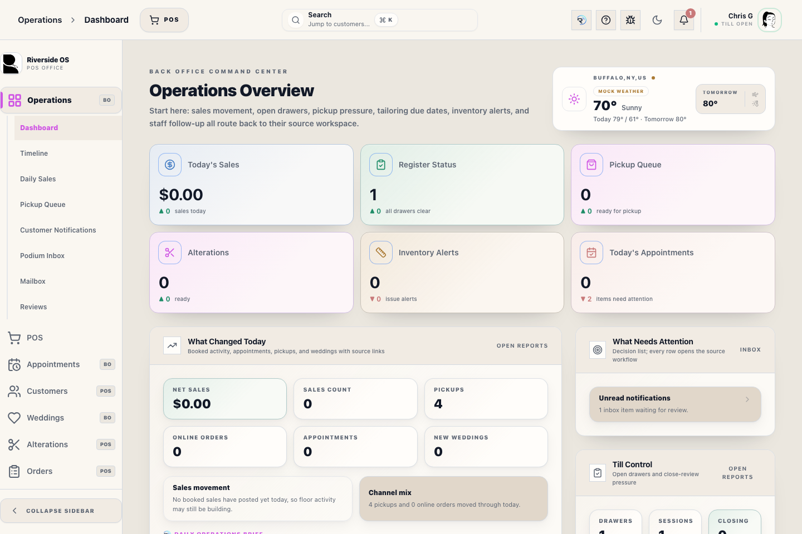

# Register Reports (Daily Sales)

## Screenshots

This screen provides a real-time audit of register activity, daily sales, and shared drawer coordination.

The Register cart keeps non-merchandise work visible: shipping charges and alteration-service charges appear as separate charge rows, and existing order-payment rows remain visible alongside merchandise when a customer is both making a payment and purchasing items. These charges remain separate from merchandise subtotal reporting.

## What this is

Use this screen to review the current register session, void a completed sale with Manager Access when store policy allows it, print the full-page daily report, and verify lane activity before final close.

## How to use it

1. Open **POS → Reports** while the register session is still active.
2. Review **Booked** for what was rung during the drawer/session and **Completed** for recognized revenue and pickup activity.
3. Open individual entries when you need receipt or tender detail. Click the customer name or Customer # to open CustomerHub for that customer.
4. Use **Void** on a completed sale only after a manager confirms the transaction, reason, tender reversal, and inventory impact.
5. Use **View** to review the full-page Daily Sales report inside ROS, or **Print** when the shift needs a professional audit printout.
6. Open **Z-Reports** to see which linked lanes are still open, which drawer is already reconciling, and whether Register #1 still needs to finish the shared close.

## Daily Sales Activity
The **Daily Sales** view shows a chronological timeline of every transaction. Each sale row shows its `TXN-` transaction number so the screen, printout, receipt, and payment records can be reconciled against the same reference. Counterpoint-imported rows keep the Counterpoint transaction time as the activity time and show **Imported at** only as secondary import context. Tap an entry to view the full receipt or reprint it. Merchandise **Subtotal** and **Net Sales** exclude shipping, alteration-service charges, and gift-card loads. Daily Sales reports show shipping and alterations as separate totals, and gift-card loads as separate count/amount activity. Gift-card loads are recorded as liability activity until redeemed; redemption is recorded as a tender and does not turn the original load into merchandise revenue. Use this for:
- Verifying the status of recent sales.
- Correcting tender types by reviewing the audit log.
- Monitoring mid-shift velocity without closing the drawer.
- Confirming whether the activity was **Takeaway**, **Pickup**, **Special Order**, **Custom Order**, **Wedding Order**, **Layaway**, or mixed fulfillment.
- Reviewing split tenders as separate payment lines with amount labels instead of a single collapsed method list.

## Void a completed sale

The **Void** action is for manager-approved completed-sale reversals. It does not delete the transaction. ROS keeps the original Transaction Record and writes a permanent void record with the approver, reason, tender summary, refund queue state, and inventory impact.

1. Find the sale in **Daily Sales Activity**.
2. Confirm customer, amount, tender, and timestamp.
3. Tap **Void**.
4. Enter a clear reason.
5. Manager approves with **Manager Access**.
6. Read the completion message:
   - **Refund workflow opened** means the refund still needs to be processed.
   - **No refund balance remains** means there is no remaining paid balance to reverse.

Use the refund workflow to finish cash, card, gift card, store credit, or split-tender reversal work. Do not tell the customer a reversal is complete until the refund state is resolved.

## Professional Audit Printing
You can now generate a professional, full-page **Daily Sales Report** that includes:
- **Tender Breakdown**: Totals for Cash, Card, Gift Card, and R2S charges.
- **Business Summary Boxes**: New Orders, Orders Picked Up, Credit Card Total, RMS Payments, and RMS Charge appear in the top summary so daily review focuses on register operations. Credit Card Total includes CC/Card Reader, Card Manual, Card Not Present, saved-card, and card refund/credit activity; it does not include Staff Account or exchange credit.
- **Card entry labels**: Hosted HelcimPay.js entries print as **Card Not Present**, while **Card Manual** is reserved for externally recorded/manual card activity.
- **Per-Transaction Subtotal Before Tax**: Each transaction card separates subtotal before tax, tax collected, and total before showing payments or balance.
- **Transaction Audit**: A complete list of all `TXN-` transaction numbers and amounts.
- **Activity Cards**: Printed activity mirrors the on-screen grouped list with customer context, fulfillment chips, line items, payment/pickup context, and amount details.
- **Reporting Station**: The report header identifies the assigned printer for accountability.

To review the report first, tap **View**. In the desktop app, the preview opens inside ROS instead of a browser tab. To print, tap **Print** from the report screen or from the in-app preview. Daily Sales prints through the configured Reports printer so the activity cards, customer context, pickup rows, line items, and totals stay on office paper instead of the receipt printer.

Z-Reports also use the same contract in the desktop app. Each row and printed report shows its store-local **business date**, which may differ from the morning it was closed. **Open Report** opens the Z-report inside ROS for review, with each sale row labeled by its `TXN-` transaction number. ROS never combines multiple business dates; missed days appear as separate reports and must be closed oldest first. The Z-report quick-look boxes include daily business counts and amounts such as New Vendor Invoices from Back Office receiving, New Orders, Orders Picked Up, Credit Card Total, RMS Payments, RMS Charge, appointments, alterations, new wedding parties, shipping, and discounts. **Close & Print Z-Report** and preview **Print** send the report to the configured Reports printer. If a report prints as raw text instead of the formatted layout, check that the workstation is using the current build and rerun the report print.

Cash refunds processed before close appear as negative cash activity. They reduce Cash Sales (Gross), Expected Cash, and the amount available for deposit; any difference between the resulting expected cash and the physical count remains an over/short variance to explain.

Exchange Credit is reported separately from true card tenders and must never be included in the Credit Card total. When reconciling ROS against another register system, compare card tenders and exchange credits as separate payment methods.

## Performance Metrics
The summary cards at the top of the screen provide instant visibility into:
- **Gross Sales**: Total volume before taxes and returns.
- **Tender Totals**: Net collections per payment method.
- **Transaction Count**: Total number of finalized tickets.

## Register Coordination
The **Z-Reports** view now acts as the shared drawer coordination surface.

- **Active Sessions** shows how many register lanes are still open.
- **Open Drawers** counts physical till groups, not individual lanes.
- **Pending Closes** shows drawer groups that are already in reconciliation.
- **Register #1 close anchor** identifies the lane that must finish the single Z-close for that shared drawer.

If a drawer group is already marked **Closing now**, avoid starting a second close from another linked register.

## Tips
- **Decoupled Printing**: Receipts print on receipt paper; Reports print on office paper. Ensure your **Report Printer** is set in **Settings -> Printers & Scanners**.
- **Shared till group**: Reporting on Register #1 includes data aggregated from all satellite lanes (iPad and Back Office).
- **One report per business date**: Satellite lanes stay visible for coordination. Register #1 closes each waiting date separately, and the final date closes the whole till group.
