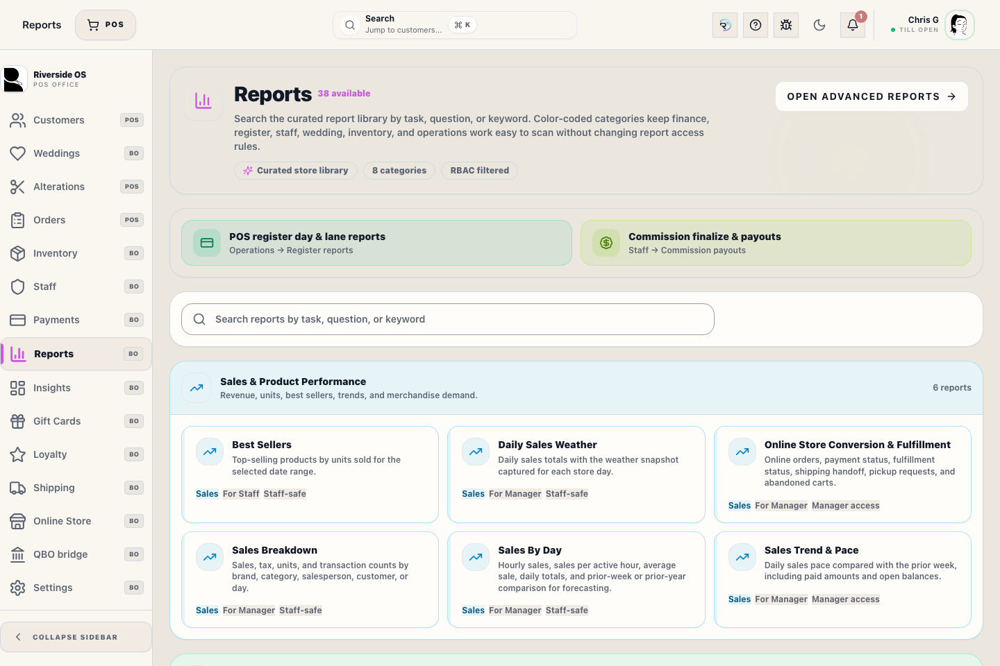
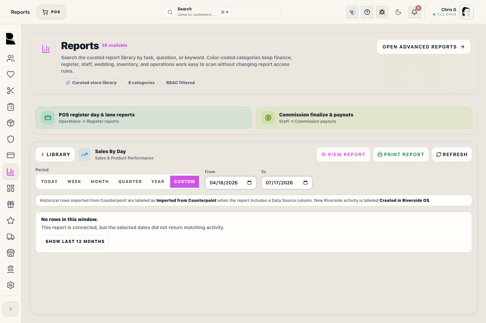
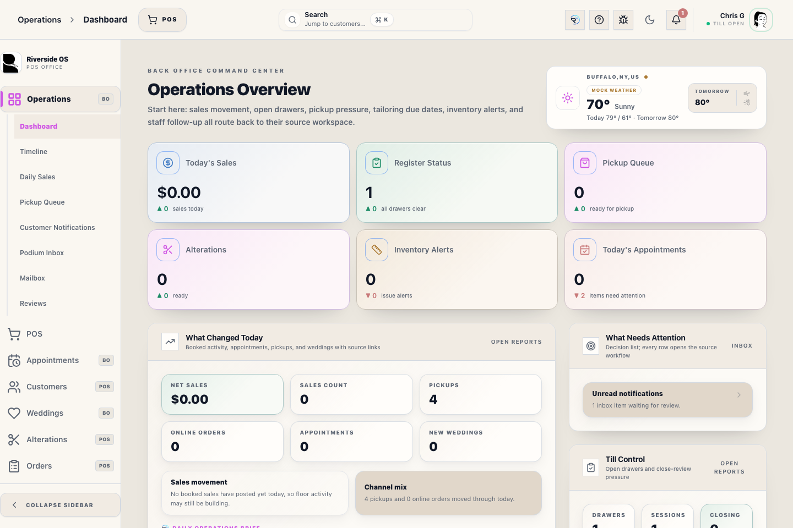

# Register Reports (Daily Sales)

## Screenshots

This screen provides a real-time audit of register activity, daily sales, and shared drawer coordination.

The Register cart keeps service work visible: shipping charges and alteration-service charges appear as separate charge rows, and existing order-payment rows remain visible alongside merchandise when a customer is both making a payment and purchasing items. Alteration charges count in the Daily Sales subtotal and Net Sales while remaining separately disclosed; shipping stays outside those sales subtotals.

## What this is

Use this screen to review the current register session, void a completed sale with Manager Access when store policy allows it, print the full-page daily report, and verify lane activity before final close.

Daily Sales payment totals use the same store-local effective business-date window as the Z-Report. A payment made on another date toward a sale booked today is shown on that payment's date only, so card, cash, and other tender totals reconcile to the register close. Z-Reports show net Cash, net CC, and net Checks as the primary reconciliation totals. Terminal, CNP, manual-card, and all-card-refund rows are CC detail; Deposit Applied, Exchange Credit, store credit, gift card, RMS, and similar rows are informational activity and are not additive to those primary totals.

## How to use it

1. Open **POS → Reports** while the register session is still active.
2. Review **Booked** for what was rung during the drawer/session and **Completed** for recognized revenue and pickup activity.
   Riverside loads the selected basis first so a slower comparison cannot keep the whole screen waiting. If the comparison misses the 15-second response deadline, the selected basis stays usable and the screen says that the other basis is unavailable; it shows an em dash for unavailable comparison metrics and never substitutes zero totals.
3. Open individual entries when you need receipt or tender detail. Click the customer name or Customer # to open CustomerHub for that customer.
4. Search by customer name, phone, email, Customer #, Transaction number, payment method, item name, or SKU. Search runs against the full selected date range, not only the rows currently visible. Use **Load more audited activity** when the result count is larger than the current page.
5. Use **Void** on a completed sale only after a manager confirms the transaction, reason, tender reversal, and inventory impact.

An active Register can request its own lane-scoped report only with that Register session's matching protected token. Supplying an open session number is not authorization. Store-wide and archived report access requires **register.reports** permission.

When a Manager with **register.reports** opens **POS → Reports**, the date presets remain store-wide even while a Register is open. Riverside does not pin **Yesterday**, **This week**, **This month**, **This year**, or **Custom** to the current Register session.

Archived Z-report output loads audited detail in timed, cancellable pages. Starting a different archived report cancels the earlier load, and a timeout opens nothing. Z-report history shows up to the newest 40 rows for the selected range; a loading failure is shown as an error with Retry and is never labeled as an empty range.

6. Use **View**, **Print**, or **Export** to prepare the complete matching activity set. Riverside asks the Main Hub for one read-only database snapshot and verifies its counts, row identities, and completion flags before producing output; it never labels an interactive page as a complete report. For stability, the screen stops at 2,000 loaded detail rows and generated output stops at 20,000 combined activity and pickup rows. Narrow the date range or search when ROS reports that limit.
7. Open **Z-Reports** to see which linked lanes are still open, which drawer is already reconciling, and whether Register #1 still needs to finish the shared close.

## Daily Sales Activity

The **Daily Sales** view shows a chronological timeline of every transaction. Each sale row shows its `TXN-` transaction number so the screen, printout, receipt, and payment records can be reconciled against the same reference. Counterpoint-imported rows keep the Counterpoint transaction time as the activity time and show **Imported at** only as secondary import context. Tap an entry to open its historical **Transaction Receipt** or reprint it. Historical receipt review keeps the shared print, preview, text, email, and gift-receipt tools, but it does not show checkout-only **Sale complete** or **Begin new sale** actions. **Subtotal** and **Net Sales** include alteration-service charges but exclude shipping and gift-card loads. Alterations increase sales totals, sales counts, averages, Sales by Hour, and applicable commission sales while also appearing as a separate disclosed total. Shipping is separately disclosed and never increases those sales or commission metrics. Gift-card loads are recorded as liability activity until redeemed; redemption is recorded as a tender and does not turn the original load into sales revenue.

Historical Counterpoint reconciliation and administrative repair work remain in the Transaction Record audit trail and do not create a new sale on the repair date or appear as customer-facing order amendments in Interaction Timeline. Merchandise added to an existing open Transaction is different: its line-booking event belongs to the date the item was added. **Booked** Daily Sales and Z-Reports show only the net positive increase from all additions, removals, and price/quantity changes on that Transaction for the selected day. A zero or negative net amendment does not become a new booked sale. Amendment line details label the signed **Added**, **Change**, and **Removed** amounts so a switch is not mistaken for the full current order.

The purple **Added**, **Change**, or **Removed** amount appears only for a later amendment to an existing Transaction. Lines from the Transaction's initial booking show their regular and sale prices without a duplicate **Added** amount.

A completed return or exchange that produces a customer refund appears once as one **Return / Exchange** event, not as separate refund and zero-detail payment entries. Its detail and reprint are scoped to that event: today's returned items appear as negative lines, today's new merchandise or services appear as positive lines, and retained original items and historical tenders are omitted. Mixed exchanges show the exact net **Refund to customer** or **Amount due** on the event receipt. When **Original Card** is used, the event remains pending until the provider responds; successful completion identifies Helcim, the approved amount, and the masked card.

ROS blocks a merchandise refund before tender if any selected returned-item detail is missing. Close Pay and reload the return from the original Transaction Record; never substitute a payment-only refund. If a previously completed refund appears with **0 units**, no itemized lines, or zero tax when tax was returned, stop and escalate it for the Manager-approved refund-line repair. The repair attaches the original item, subtotal, and tax to the existing refund event and does not send another refund to the card.

Use this for:

- Verifying the status of recent sales.
- Correcting tender types by reviewing the audit log.
- Monitoring mid-shift velocity without closing the drawer.
- Confirming whether the activity was **Takeaway**, **Pickup**, **Special Order**, **Custom Order**, **Wedding Order**, **Layaway**, or mixed fulfillment.
- Reviewing split tenders as separate payment lines with amount labels instead of a single collapsed method list.

The result line states how many matching activity records and pickups are loaded out of the exact server-reported count. An activity record may be a sale, payment, or another audited event, so it is not labeled as a transaction count. Detail-derived dashboard boxes show an em dash while more source rows remain; this means the value is not yet complete, not zero. Load the remaining activity or use the complete View, Print, or Export output.

An already-approved Helcim payment recovered into ROS stays on the card processor's original approval date. The later recovery action does not add that historical tender to today's Daily Sales or Z-Report.

## Void a completed sale

The **Void** action is for manager-approved completed-sale reversals. It does not delete the transaction. ROS keeps the original Transaction Record and writes a permanent void record with the approver, reason, tender summary, refund queue state, and inventory impact.

1. Find the sale in **Daily Sales Activity**.
2. Confirm customer, amount, tender, and timestamp.
3. Tap **Void**.
4. Enter a clear reason.
5. Manager approves with **Manager Access**.
6. Read the completion message:
   - **Refund workflow opened** means the refund still needs to be processed.
   - **No refund balance remains** means there is no remaining paid balance to reverse.

Use the refund workflow to finish cash, card, gift card, store credit, or split-tender reversal work. Do not tell the customer a reversal is complete until the refund state is resolved.

## Professional Audit Printing

You can now generate a professional, full-page **Daily Sales Report** that includes:

- **Tender Breakdown**: Totals for Cash, Card, Gift Card, and R2S charges.
- **Business Summary Boxes**: New Orders, Orders Picked Up, Credit Card Total, RMS Payments, and RMS Charge appear in the top summary so daily review focuses on register operations. Credit Card Total includes CC/Card Reader, Card Manual, Card Not Present, saved-card, and card refund/credit activity; it does not include Staff Account or exchange credit.
- Administrative Counterpoint price repairs are excluded from Booked Sales; they do not represent new customer transactions or tender collected.
- **Card entry labels**: Hosted HelcimPay.js entries print as **Card Not Present**, while **Card Manual** is reserved for externally recorded/manual card activity.
- **Per-Transaction Sales and Tax**: Each transaction card and Daily/Z-Report output shows **Subtotal**, **Tax**, and **Total With Tax** as separate figures before payments or balance. Subtotal, Sales, Net Sales, and average sale never include tax. Total With Tax adds the separately reported tax and any separately disclosed shipping; transaction/payment totals may also include tax because they represent the amount charged.
- **Service charges**: Shipping fees and alteration-service charges appear on their original Transaction card, in separate service totals, printed reports, and CSV exports. Alteration charges increase **Subtotal**, **Net Sales**, **Sales by Hour**, sales counts, averages, and applicable commission sales. Shipping increases none of those metrics and never earns commission. Payments and refunds remain in tender reconciliation.
- **Transaction Audit**: A complete list of all matching `TXN-` transaction numbers, payment-only activity, and amounts. Payment rows without merchandise lines remain present in CSV exports.
- **Truthful filter scope**: When search is active, the printed **Period Summary** is fetched separately and labeled as all activity in the selected period. The transaction and pickup sections state the exact filter, and detail-derived boxes are labeled **Filtered** so they cannot be mistaken for full-period totals.
- **Cents-safe CSV totals**: Export totals are summed as integer cents, including rows whose displayed amount contains a dollar sign or thousands separator.
- **Activity Cards**: Printed activity mirrors the on-screen grouped list with customer context, fulfillment chips, line items, payment/pickup context, and amount details. Return/exchange cards print once with their event-scoped lines and exact net result.
- **Reporting Station**: The report header identifies the assigned printer for accountability.

To review the report first, tap **View**. In the desktop app, the preview opens inside ROS instead of a browser tab. To print, tap **Print** from the report screen or from the in-app preview. Daily Sales prints through the configured Reports printer so the activity cards, customer context, pickup rows, line items, and totals stay on office paper instead of the receipt printer.

Z-Reports also use the same contract in the desktop app. Opening Register #1 fixes the store-local **business date** for that open period. If yesterday's Register is closed the following morning, its row and printed report remain dated yesterday; opening Register #1 afterward starts today's separate period. The report also records the open timestamp, close timestamp, and current print date/time. **Open Report** opens the Z-report inside ROS for review, with each sale row labeled by its `TXN-` transaction number. Shipping and alteration charges appear both in Quick Look and on the matching Transaction audit card; standalone service-only checkouts are not reduced to payment-only rows. The Z-report quick-look boxes include daily business counts and amounts such as New Vendor Invoices from Back Office receiving, New Orders, Orders Picked Up, Credit Card Total, RMS Payments, RMS Charge, appointments, alterations, new wedding parties, shipping, and discounts. **Close & Print Z-Report** and preview **Print** send the report to the configured Reports printer. If a report prints as raw text instead of the formatted layout, check that the workstation is using the current build and rerun the report print.

If card, checkout-recovery, or linked-workstation warnings remain, complete the required cash count, check review, Daily Cash Deposit date, and any over-$5 discrepancy note, then use the dedicated **Close Register With Unresolved Issues** Manager Access approval. That approval closes and prints only; it never replays a checkout, creates a sale, attaches a payment, or dismisses an issue. A pre-close preview labels the warnings as current preview evidence. The Main Hub freezes the close-time tender reconciliation and **Unresolved Issues at Close** evidence together; the immediate and archived report use that same server result, including detailed recovery status and identity evidence.

Before close is committed, Riverside freezes the complete audited activity and pickup set for that business date inside one read-only repeatable-read database snapshot. It never saves the first page as though it were the full EOD snapshot. The verified summary is included in the immutable close response, so every immediate and archived Z-Report prints the full **Quick Look** boxes. If every row and total cannot be verified, the Register remains open and no partial Z-Report is printed or archived.

Cash refunds processed before close appear as negative cash activity. They reduce Cash Sales (Gross), Expected Cash, and the amount available for deposit; any difference between the resulting expected cash and the physical count remains an over/short variance to explain.

Exchange Credit is reported separately from true card tenders and must never be included in the Credit Card total. When reconciling ROS against another register system, compare card tenders and exchange credits as separate payment methods.

## Performance Metrics

The summary cards at the top of the screen provide instant visibility into:

- **Gross Sales**: Total volume before taxes and returns.
- **Tender Totals**: Net collections per payment method.
- **Transaction Count**: Total number of finalized tickets.

## Register Coordination

The **Z-Reports** view now acts as the shared drawer coordination surface.

- **Active Sessions** shows how many register lanes are still open.
- **Open Drawers** counts physical till groups, not individual lanes.
- **Pending Closes** shows drawer groups that are already in reconciliation.
- **Register #1 close anchor** identifies the lane that must finish the single Z-close for that shared drawer.

If a drawer group is already marked **Closing now**, avoid starting a second close from another linked register.

## Tips

- **Decoupled Printing**: Receipts print on receipt paper; Reports print on office paper. Ensure your **Report Printer** is set in **Settings -> Printers & Scanners**.
- **Shared till group**: Reporting on Register #1 includes data aggregated from all satellite lanes (iPad and Back Office).
- **One report per business date**: Satellite lanes stay visible for coordination. Register #1 closes each waiting date separately, and the final date closes the whole till group.
