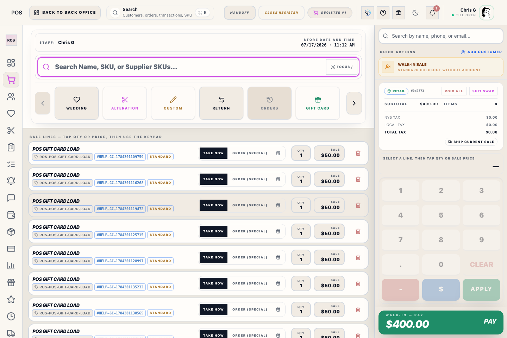
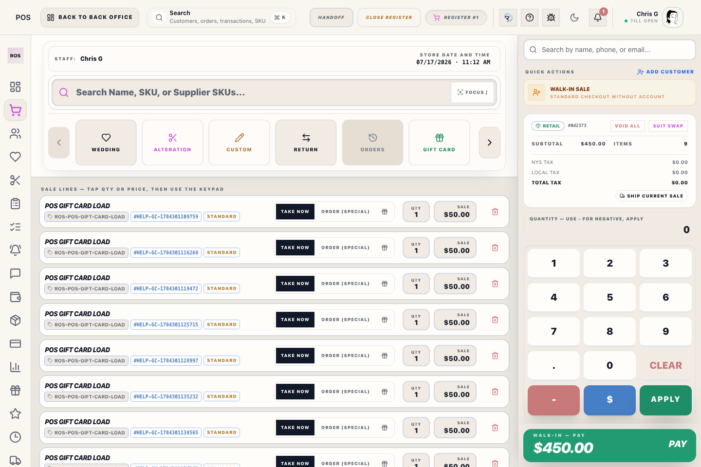

# Shipping Quote Modal

## Screenshots

The **Shipping Quote Modal** is triggered when you tap **Ship current sale** in the POS Cart. It captures the delivery address and carrier quote for a current Register sale.

## What this is

Use this modal to capture the destination address and apply a shipping quote to the current Register sale. This does not require creating a Special/Custom/Wedding order; it can ship ordinary in-stock merchandise from the current sale.

## When to use it

Open this modal when the customer wants delivery instead of leaving with the product today. Use Orders or the Shipments Hub when you are shipping an already-open order.

If staff only need to collect a shipping fee and no shipment will be created, type **SHIPPING** in Register search instead. That shortcut adds a non-taxable fee without asking for an address or creating shipment/tracking work.

## Features
- **Address Integration**: Pulls the primary address directly from the linked customer profile.
- **Current-sale shipping**: The sale is marked for shipping and a shipment record is created at checkout.
- **Live Carrier Rates**: Fetches real-time pricing from USPS, UPS, and FedEx (requires active internet connection).

## Workflow
1. Tap **Ship current sale** in the cart.
2. Select **Use customer address** or enter a manual destination.
3. If the charge is for existing open order work, optionally select the matching Transaction Record(s) in **Link existing orders**. A standalone shipping fee can be completed without linking an existing Transaction Record.
4. Either tap **Get shipping rates** and pick the preferred carrier/service, or enter a **Manual shipping charge** when the customer is only paying a known delivery fee.
5. Tap **Apply shipping** or **Add shipping charge** to add the fee to the transaction.

## Operational detail

Use shipping only when the customer expects shipment or when an order requires a shipping handoff. Confirm address, service, charge, and fulfillment timing before checkout is finalized. If rate quoting or label purchase fails, keep the transaction state clear and finish the shipping recovery from the Shipping or Orders workflow.

## What to watch for

- Shipping requires a usable address before a rate or manual charge can be attached.
- Applying shipping does not sell the item twice and does not require converting the line into a Special Order.
- Manual shipping charges post as customer-charged shipping, not merchandise.
- The Register **SHIPPING** fee shortcut is also customer-charged shipping, but it does not create a shipment. Do not use it when delivery details or tracking are required.
- Linked existing orders stay financially separate; the shipping transaction records the delivery fee and the original Transaction Records remain the merchandise source.
- Use the full shipping guide if the task moves beyond quoting into shipment follow-up.

_For more details on managing shipments after the sale, see the [Shipping & Fulfillment Guide](pos-shipping-manual.md)._
