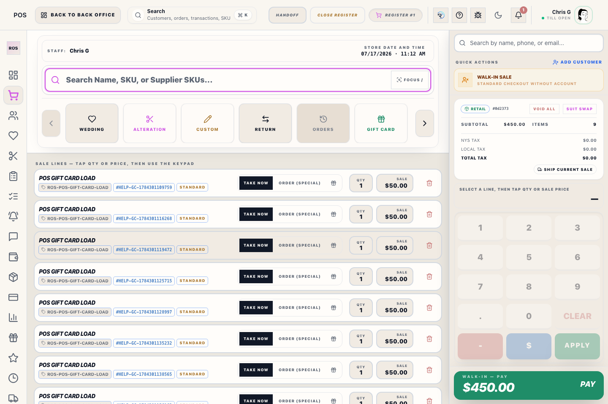
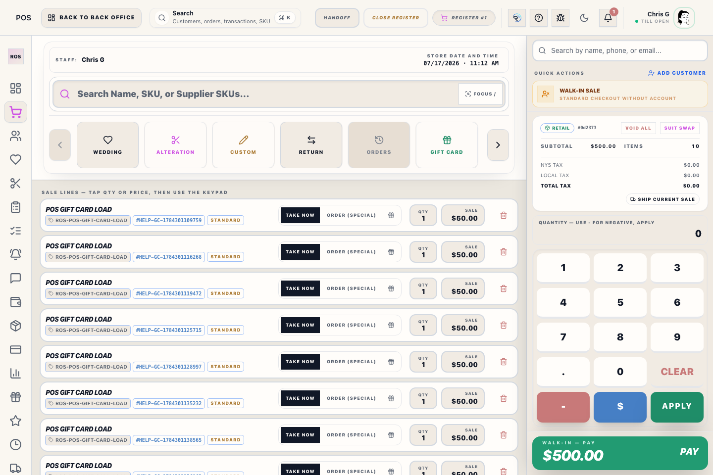
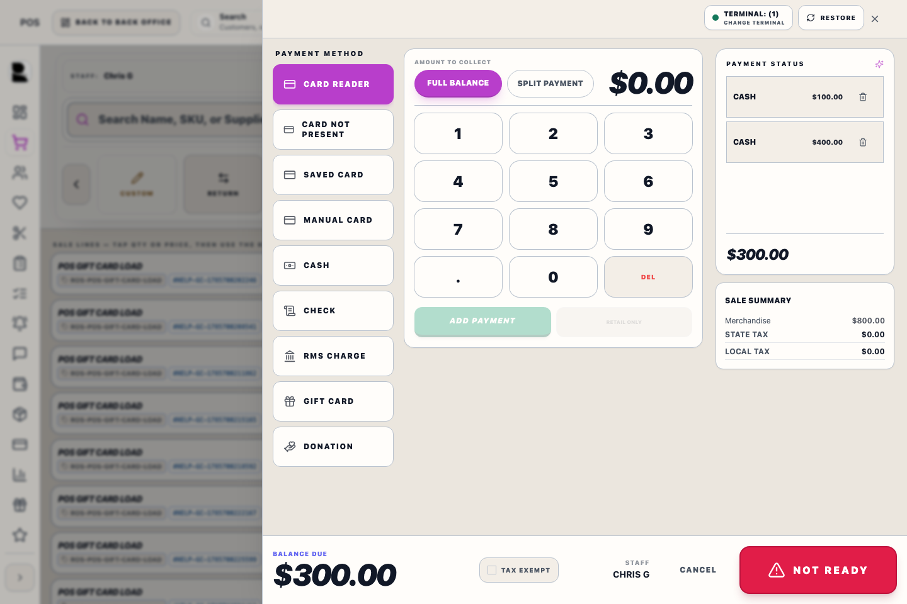

# POS Sidebar

## Screenshots

The POS sidebar is the left rail for register work. It keeps cashier workflows close to the cart without exposing the full Back Office settings tree.

## What this is

Use the five POS destinations to move between register-side tools without scrolling through one long menu:

- **Register** for live cart work, checkout, and sale completion.
- **Dashboard** for shift context, register status, and quick operational totals.
- **Customers** for customer lookup, customer creation, and duplicate review.
- **Work** for Weddings, Alterations, Orders, Tasks, Customer Notifications, and Podium Inbox.
- **More & Operations** for RMS Charge, Inventory, Payments, Reports, Gift Cards, Loyalty, Layaways, Shipping, and permitted POS Settings.

## How to use it

1. Open **Register** when you are ringing a customer.
2. Use **Customers** before or during checkout when the sale needs a customer record.
3. Open **Work** for customer follow-up such as Orders, Weddings, Alterations, Tasks, or messages.
4. Open **More & Operations** for Inventory, Shipping, Payments, Reports, Gift Cards, Loyalty, Layaways, RMS Charge, or permitted settings.
5. Return to **Register** when you are ready to complete the transaction.

## Operational detail

The POS rail is organized for register work first. Selecting **Work** or **More & Operations** reveals a compact two-column list, and the group containing the active screen stays open. Use Register for the live sale, Dashboard for between-customer priorities, and supporting hubs only when they are part of the current transaction. If a tool is missing, it is usually controlled by Staff Access or POS mode restrictions, not a broken sidebar.

## What to watch for

- Administrative receiving, vendor, purchasing, and product-maintenance tools remain in Back Office Inventory.
- The POS rail keeps only five top-level choices visible so register work does not depend on a hidden scrollbar.
- If a section is not visible, the signed-in staff member may not have permission for that workflow.

## Related workflows

- [Register (POS)](manual:pos)
- [Checkout](manual:pos-nexo-checkout-drawer)
- [Receipt Summary](manual:pos-receipt-summary-modal)
- [Customers Workspace](manual:customers-workspace)
