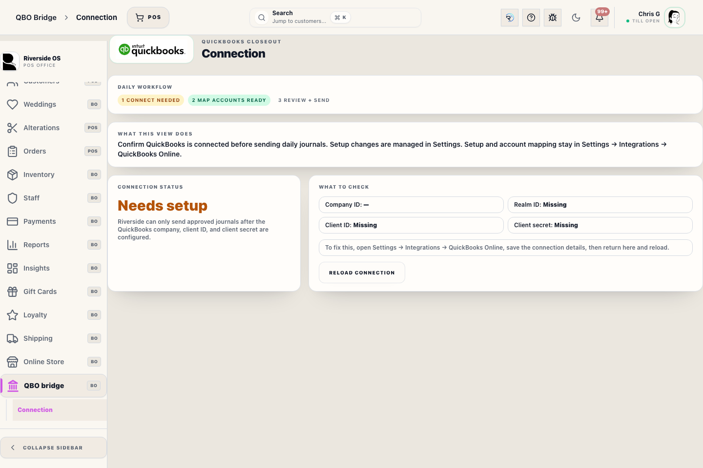
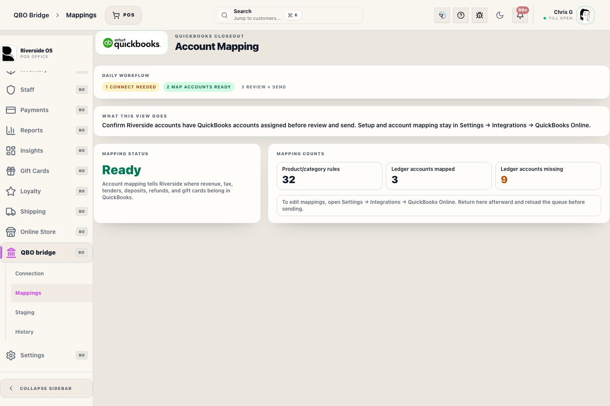
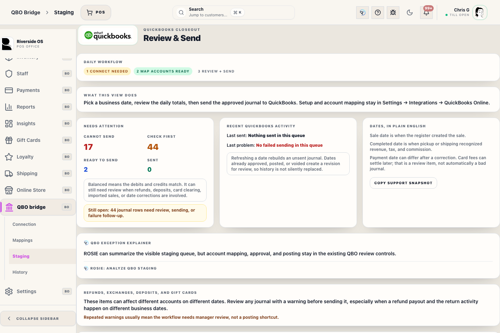

# QBO Workspace

## Screenshots

## What this is

QBO Workspace is the review and staging area for QuickBooks Online journal proposals. It is designed for auditability before anything is synced to the accounting system.

Before posting is enabled, an admin connects QuickBooks from Settings by saving the Intuit Client ID, Client Secret, and Webhook Verifier Token, choosing sandbox or production, clicking **Connect to QuickBooks**, approving the Riverside app in Intuit, refreshing QBO accounts, and mapping accounts. Intuit's webhook URL must point to the public Riverside `/api/auth/qbo/webhook` route; Riverside validates `intuit-signature` before storing an event and returns an error when durable storage fails so Intuit can retry delivery.

## How to use it

1. Open the proposal for the accounting date being reviewed.
2. Confirm the proposal is balanced.
3. Review drilldown evidence for sales, shipping income, refunds, gift cards, store credit, layaway deposits, and open deposits.
4. Sync only after the proposal and evidence match the expected activity.

## Review proposals

Review the proposal date, totals, journal lines, balance status, and drilldown evidence before syncing. Rows with no postable journal lines or blocking missing-mapping warnings stay in **needs review** status and cannot be approved until mappings are fixed and the journal is regenerated.

After a register is closed for the day, ROS stages the daily journal for that store-local business date. A background worker also auto-proposes the previous business date at 2 AM local time, so most days will already have a review row when accounting opens. If the day is already staged but still pending or marked needs review, staging refreshes the same row with the latest facts. If the day was already approved, synced, or voided and later sales, returns, deposits, or payment-date corrections change the day, ROS creates a revision proposal for the same business date.

## ✨ QBO exception explainer

The staging view includes a ROSIE explainer for visible QBO review facts: connection readiness, mapping readiness, open staged rows, blocking rows, warning rows, failed posting rows, and latest failure detail.

ROSIE does not create mappings, approve journals, post journals, retry journals, or invent accounting routes. Use it to understand the queue faster, then use the normal QBO controls for accounting actions.

### Connection health

Before syncing, confirm the QBO connection is healthy:
- **Company Info** validates the live connection against Intuit and shows the QBO company name.
- **Token Health** shows whether the access token is valid, refreshable, or expired, and how many minutes remain before expiry. The system auto-refreshes tokens in the background when within 10 minutes of expiry.
- **Webhook Verifier Token** must match the token from the same Intuit app environment. Unsigned or mismatched events are rejected.

Backdated corrections keep two dates clear:

- **Business date** controls booked-sales reporting and the QBO journal day.
- **Payment effective date** controls tender, deposit, and payment movement evidence.

Refund-day proposals should remain balanced and show refund or outflow tender evidence when a processed refund exists.

## Returns and refunds

Returned items should reduce effective quantity in QBO drilldown evidence. Revenue drilldown should reflect the quantity after returns, not the original sold quantity.

Processing a cash refund should leave negative payment or allocation evidence and close or update the refund queue.

## Store credit and open deposits

Store credit redemptions are liability-release activity. A wedding open deposit applied to an unfulfilled order remains in **Deposit liability**; fulfillment later releases that amount to recognized revenue. Neither path is cash or card tender revenue.

Manual store-credit adjustments are audit-sensitive and should only post to QBO when the configured accounting path intentionally includes them.

Donation tenders use their own **Donation clearing** mapping. Confirm the mapped QBO account before syncing days that include donation payments, and review the required donation note in reporting evidence.

Direct layaway cash/card deposits are deposit-liability inflows. They should appear in the QBO proposal and drilldown evidence on the payment date as `liability_deposit`, while the merchandise revenue and tax remain deferred until pickup/fulfillment.

## Shipping, alterations, and clearing accounts

Customer-charged shipping posts to the mapped Shipping income account on the same completed business date as the sale. Alteration service lines, refund queue clearing, forfeited deposit income, and RMS clearing each require their own mapped accounts before syncing days that contain that activity. Cash rounding is currently off; when enabled later, cash rounding requires its own mapped account and must post from the rounding adjustment on the main Transaction Record, not from a separate Transaction Record, pickup, deposit, or orphaned payment activity.

QBO posts use the staging row as the retry identity. Re-sending the same approved staging row uses the same request id so retry behavior stays recoverable.

### Approval audit trail

Every approved staging row records the **approver staff member** and the **approval timestamp** in the History detail. This creates an auditable chain: who reviewed the journal, when they approved it, and when it synced to QBO. Do not approve on behalf of another staff member.

## Gift card subtypes

Purchased, loyalty, donated, and promo gift cards have different accounting intent. Review the QBO evidence to confirm each subtype follows the expected liability, loyalty, donation, or promotional path.

Promo gift cards are operationally different from purchased gift cards and should remain visible in evidence.

## Counterpoint imports

Historical imported Counterpoint activity should remain auditable but should not contaminate current ROS QBO proposals.

## What to watch for

- Do not sync an unbalanced proposal.
- Confirm refund, shipping, clearing, and liability evidence before syncing days with returns, store credit, layaway deposits, open deposits, shipping charges, or gift card activity.
- If drilldown evidence does not match the visible transaction history, stop and ask for accounting review.

## Inline Mapping Resolution (v0.85.0+)

To accelerate troubleshooting, the QBO Workspace staging review panel displays **Inline Mapping Resolvers** directly underneath any missing mapping warnings:
- When a proposal fails validation because an account mapping is missing (e.g. `income_gift_card_breakage`, `liability_gift_card`, `COGS_FREIGHT`), a dropdown selector preloaded with the QBO Chart of Accounts appears directly on the warnings line.
- Select the appropriate QuickBooks account and click **Save Mapping** to commit the configuration immediately.
- Once saved, click **Stage journal** to regenerate the proposal using the newly established mapping.

## Related workflows

- [Reports](manual:reports)
- [Counterpoint Sync Settings](manual:settings-counterpoint-sync-settings-panel)
