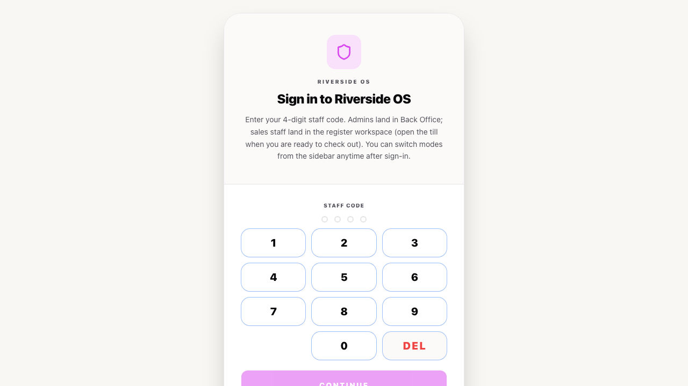

# Remote Access (Secure VPN)

Riverside OS includes a built-in Secure Remote Access system managed via **Tailscale**. This allows you to log in to your shop's system from home or on the road without exposing your data to the public internet.

## 1. Safety First
All remote connections are end-to-end encrypted. Riverside OS monitors active remote sessions to ensure you are aware of when the system is being accessed off-site.

*Figure 1: The Remote Access dashboard showing connection status and active node information.*

## 2. Setting Up Remote Access
To enable remote access for the first time:
1. Navigate to **Settings** -> **Remote Access**.
2. Click the **Start Setup Wizard** button.
3. Follow the on-screen instructions to authorize the machine on your Tailscale network.

*Figure 2: The Setup Wizard guides you through the secure authorization process.*

## 3. Monitoring Remote Sessions
If a user is connected remotely, a warning indicator will appear at the top of the screen for on-site staff. 
If you need to terminate all remote connections immediately for security reasons, use the **Emergency Disconnect** button in the Remote Access panel.

> [!IMPORTANT]
> Disconnecting the host from Tailscale will terminate all active PWA and Bridge connections instantly.

## 4. Troubleshooting
- **Status: Offline**: Ensure the host machine has an active internet connection.
- **Login Expired**: You may need to re-run the Setup Wizard once every 6 months to refresh the security keys.
- **Slow Connections**: Remote performance depends on your shop's upload speed. 
